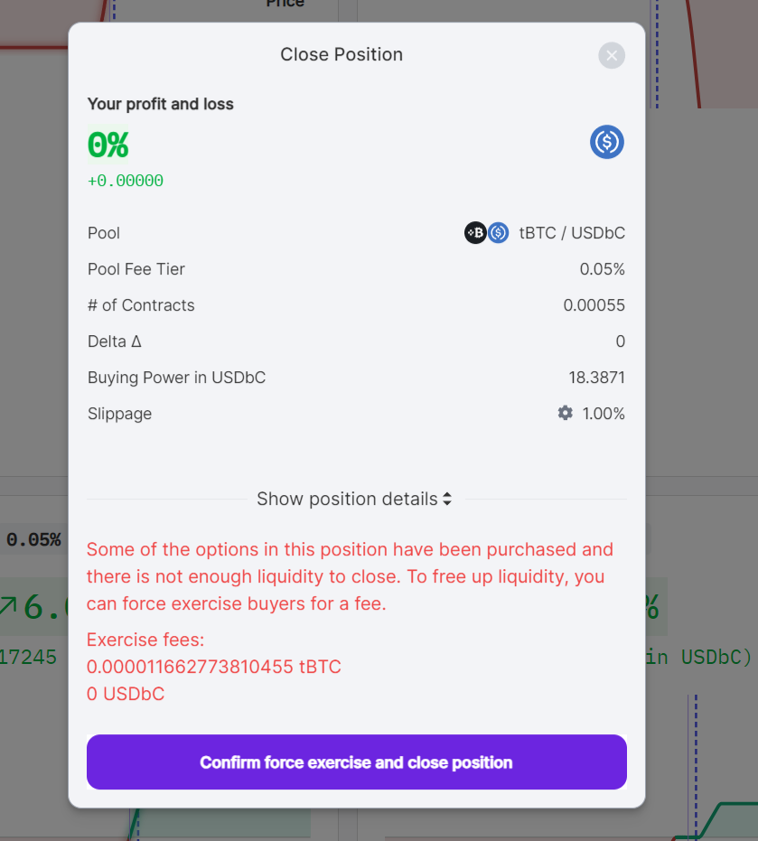

  

In Panoptic, users sell options for others to buy. But when an options contract has more buyers than sellers, it may prevent sellers from being able to [exit](/docs/product/closing-a-position) out of their position. Luckily, Panoptic's [force exercise](/docs/panoptic-protocol/forced-exercise) feature allows a seller to exit by forcefully closing the position of any buyers preventing the seller from exiting.

  

This feature is crucial since perpetual options don't expire, as it enables option sellers to be able to close their positions and free up capital. By incorporating force exercising, Panoptic ensures that option sellers have the flexibility and control to manage their positions in a way that aligns with their capital needs.

  

>### Questions We'll Answer:
>
>-   How can I close my position via force exercise?  
>-   What positions can I force exercise?   
>-   How much does it cost to force exercise?
    

## Closing a Position via Force Exercise

Purchased options may be force exercised, particularly when there is insufficient liquidity for options sellers to close their position.

  

>Example: Alice sells an ETH call option. Bob buys Alice’s call. If there is not enough liquidity from other sellers and Alice wishes to close her position, she must force Bob to exercise his position before closing her own. Hence, Alice force exercises Bob’s long position and then closes her own short position.

  



## Conditions for Force Exercising

Any position with a long [leg](/docs/product/option-legs) in Panoptic may be force exercised. Anyone, not just the seller, may initiate the force exercise for a fee. It may not be strategic to randomly force exercise options; instead, traders should force exercise positions that have bought up their previously sold position.

  

A position with at least one long leg may be force exercised for a fee. Positions where all legs are [out-of-range](/docs/product/streamia#in-range-options-accumulate-streamia) are cheaper to force exercise.


Sometimes closing a position may require a chain of multiple force exercises. For instance, Alice might need to force exercise Charlie's position, who has bought Bob's position, who in turn has bought Alice’s position. Essentially, you may need to force exercise any long positions that are preventing you from closing your position, along with any other positions that are preventing you from force exercising.

## Cost of Force Exercising

As mentioned, options sellers need to pay a fee to force exercise a position. If all long legs of a position are out of range, the cost to force exercise a position is significantly cheaper.

```
All long legs are out of range: 0.01%
Any long leg is in range: 1.024%
```

```
Price
  ^
  |                           [In Range - Higher Fee]
  |                        ┌───────────────────────┐
  |                        │    Liquidity Range    │
  |    ◄──── range ────►   │                       │
  |                        └───────────────────────┘
  |                              strike
  |
  |  [Out of Range - Lower Fee]
  +──────────────────────────────────────────────────► Tick
```

>Example: Bob buys one contract of a one-month (1M) 35.60 AVAX put option with a lower price of $33.52 and upper price of $37.80.
>-   The current price of AVAX is $37. Because the option is in range, it can be force exercised for a fee of 0.01024 AVAX (102.4 bps * 1 AVAX).
>-   The price of AVAX increases to $38. Because the option is now out of range, it can be force exercised for a fee of 0.0001 AVAX (1 bp * 1 AVAX).

By understanding the mechanics and costs associated with force exercising, traders can better manage their positions, ensure their capital is efficiently utilized, and mitigate risks of their positions being forcefully exercised by external parties.

*Join the growing community of Panoptimists and be the first to hear our latest updates by following us on our [social media platforms](https://links.panoptic.xyz/all). To learn more about Panoptic and all things DeFi options, check out our [docs](https://panoptic.xyz/docs/intro) and head to our [website](https://panoptic.xyz/).*
