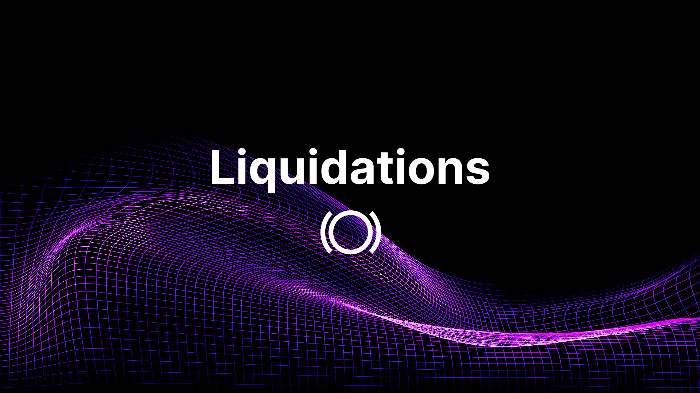
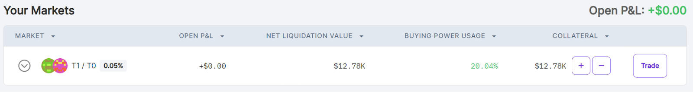
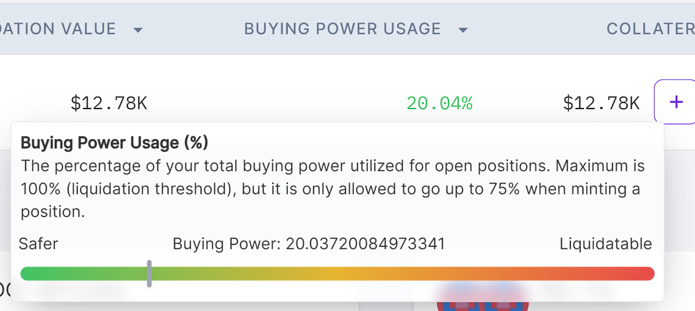
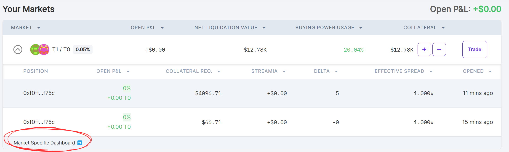
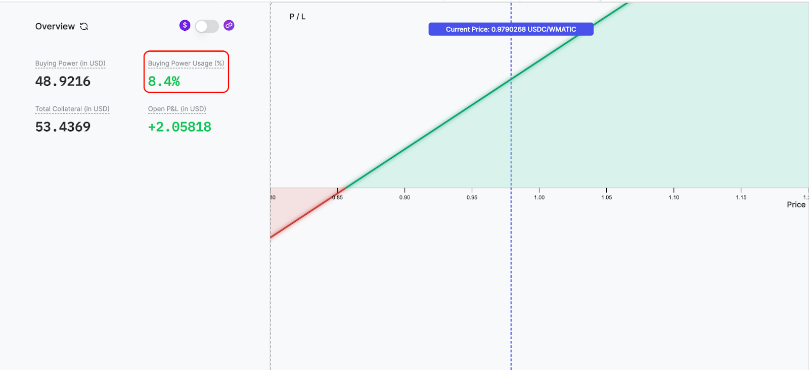
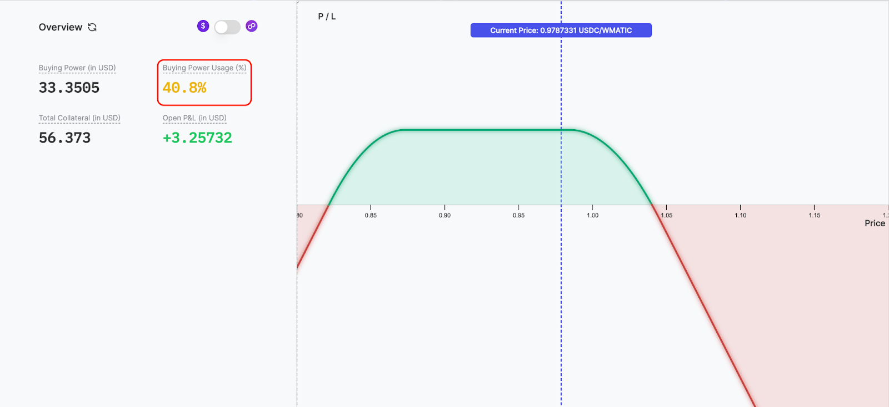
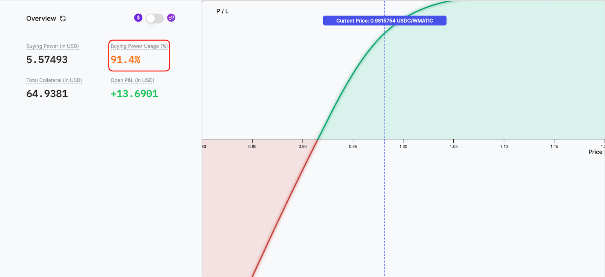

## Introduction

Liquidations occur when a borrower's collateral is sold off to repay a loan after its value drops below a specific threshold, often due to high market volatility. Liquidations serve as a protective mechanism for lenders and lending protocols, ensuring that loans remain properly collateralized. However, they can result in significant losses for borrowers, especially during sudden market swings.

Panoptic safeguards [passive liquidity providers](/docs/panoptic-protocol/protocol-roles#passive-liquidity-providers-plps) through a robust [liquidation system](/docs/panoptic-protocol/liquidations). These liquidity providers lend capital to options traders on margin and require protection against excessive losses. Liquidators can forcibly close insufficiently collateralized options accounts, ensuring that trader losses do not deplete the funds of passive liquidity providers.

### Questions We’ll Answer

-   What happens if I’m liquidated?
-   How do I become liquidatable?
-   How can I protect myself against liquidation?
-   How do I liquidate other accounts?
    

## Liquidations Are Per-Market, Not Per-Position

When an options account is liquidated, the account owner can lose most or all of the collateral they deposited in that particular market.

Importantly, liquidations occur on a [per-market](/docs/product/markets) basis, not per-position. This means that all positions within a market (e.g. the ETH/USDC 0.05% pool) will be closed during a liquidation event, and the user will lose most of their deposits in that market. However, collateral in other markets (e.g., the WBTC/USDC 0.05% pool) will remain unaffected.

## Liquidations And Buying Power Usage

A trader becomes liquidatable if their [buying power usage](/docs/product/collateral-and-buying-power) exceeds 100%. Panoptic’s market dashboard allows you to quickly monitor your total buying power usage for all your markets.

  

_Panoptic’s Dashboard_

Hover over any value in the buying power usage table column to reveal the buying power meter, which is color-coded for easy tracking:

_Panoptic’s Buying Power Meter_

  

The buying power meter visually indicates your buying power usage and account health:

  

-   Green Zone (0-33%): Safer – your account is far from being at risk of liquidation.
    
-   Yellow Zone (34-67%): Moderate risk – your account is not yet liquidatable.
    
-   Red Zone (76-100%): High risk – your account is nearing liquidation.
    
-   Exceeds 100%: Liquidatable – your account can be liquidated.
    
You can view more details about your positions in a specific market by clicking market specific dashboard in the table dropdown.

Here are examples of traders at different buying power usage levels:

_Buying Power Usage – Green zone_

_Buying Power Usage – Yellow Zone_

_Buying Power Usage – Red Zone_

  

When buying power exceeds 100%, the trader’s account becomes liquidatable because their outstanding collateral requirement surpasses the value of their collateral.

## Avoiding Liquidations

### Keep Buying Power Usage Low

The lower your buying power usage, the safer your account. Keeping it closer to 0% reduces the risk of liquidation, while moving closer to 100% increases the risk. You can lower buying power usage by [closing positions](/docs/product/closing-a-position) or depositing additional [collateral](/docs/product/collateral-and-buying-power).

### Exercise Caution in Illiquid and Volatile Markets

Illiquid Uniswap pools and volatile token pairs can quickly cause buying power usage to spike. Exercise caution when trading in these markets.

### Active Monitoring

Actively monitor your positions. Close positions at risk of further losses, and consider using [defined-risk strategies](/docs/trading/multi-leg-strategies#defined-risk-options-trading-strategy), such as [spreads](/research/essential-options-strategies-to-know#call-spread-), to limit losses. Avoid opening overly large positions. Always size your positions according to your risk tolerance and strategy.

## Liquidating Other Accounts

Anyone can operate a [Panoptic liquidation bot](/docs/panoptic-protocol/liquidations#the-liquidation-bot) to automatically detect and liquidate accounts that have breached their collateral requirements. Liquidators are rewarded with a bonus, calculated based on two key factors:

-   Account Insolvency: Accounts with greater insolvency offer bigger bonuses, but the bonus is capped at half of the collateral balance.
-   Collateral Balance: Higher collateral balances increase the maximum potential bonus.

The liquidation bot continuously monitors all accounts within a market, regularly checking the collateral status of each account. When an account’s collateral falls below the required minimum, the bot identifies it for liquidation.

  

_Join the growing community of Panoptimists and be the first to hear our latest updates by following us on our [social media platforms](https://links.panoptic.xyz/all). To learn more about Panoptic and all things DeFi options, check out our [docs](https://panoptic.xyz/docs/intro) and head to our [website](https://panoptic.xyz/)._

