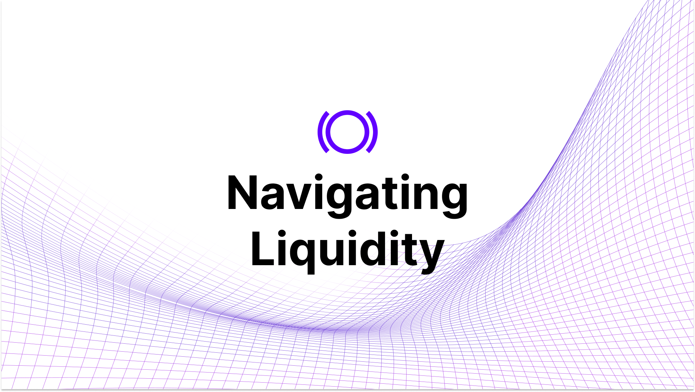

Liquidity reflects the overall ease with which an asset can be traded without significantly impacting its price. This article will delve into how liquidity functions on Panoptic and provide practical guidance for traders.

>### Questions We'll Answer

>-   How does liquidity work on Panoptic?
>-   How do you view liquidity on Panoptic?
>-   How do I troubleshoot issues involving low liquidity?
    

## Liquidity Types in Panoptic

There are two main sources of liquidity in Panoptic: passive liquidity and active liquidity.

### Passive Liquidity

Passive liquidity providers (LPs) deposit any amount of any token into Panoptic, allowing these funds to be lent out to options traders for up to 10x leverage trading. In return, passive LPs earn a percentage of the trading volume.

  

Example: Alice deposits ETH into the ETH-USDC 0.05% Panoptic pool, which can then be used for others to trade options on leverage.

### Active Liquidity

Active liquidity involves option sellers borrowing from passive LPs on Panoptic to create concentrated liquidity positions in Uniswap. These positions, represented as LP tokens in Uniswap, mimic the characteristics of options due to their payoff structures.

  

Traditionally, Uniswap LPs act akin to option sellers but lack the capability to directly sell their positions. Panoptic enhances this dynamic by enabling Uniswap LPs to lend out their LP tokens. This arrangement transforms them into actual sellers in an options market, where others can buy their options for a [cost](/docs/product/streamia).

  

Options sellers provide semi-fungible liquidity for option buyers to purchase. Options contracts follow the ERC-1155 standard, and these contracts are fungible if they share the same strike price, timescale, and option type (put or call).

  

Example: Alice sells a 1 ETH put option at the 2000 strike with 1D timescale. Bob can then buy this option contract.

## Viewing Liquidity

When trading on Panoptic, users can assess the liquidity distribution of options effectively. The liquidity toggle, positioned at the bottom of the trading page, offers insights into the liquidity characteristics of available option contracts.

  

Activating this feature shows data about both calls and puts, along with a detailed breakdown of liquidity across different strike prices and timescales.

  

  

-   Bar color – red: Shows put option liquidity.
    
-   Bar color – green: Shows call option liquidity.

-   Bar width:  Represents the timescale of the option.  The narrower the bar, the smaller the price range and shorter the timescale (e.g. one day). The wider the bar, the larger the price range and longer the timescale (e.g. one month).
    
-   Bar depth: Represents the amount of liquidity of the option. The taller the bar, the more liquidity available for option buyers.
    

  

By default, the liquidity distribution displays all options but can be filtered to specific timescales. When dragging an option [leg](/docs/product/option-legs) to adjust its strike price, the liquidity distribution will filter to only show liquidity available for that contract’s timescale

  

## Troubleshooting Liquidity Issues

### Insufficient Liquidity to Close a Position

Traders unable to close positions due to low liquidity may need to force exercise buyers to close their position. For more information, check out our guide on force exercising [here](https://panoptic.xyz/docs/panoptic-protocol/forced-exercise).

### Insufficient Liquidity to Open a Position

When traders encounter low liquidity while trying to open a position on Panoptic, there are several solutions to consider.

#### Reducing Position Size

To mitigate the issue of low liquidity, consider decreasing the number of contracts you wish to trade. Panoptic supports trading in fractional contract sizes, allowing greater flexibility in managing your investment according to available market liquidity.

#### Selecting a Different Option Contract

If reducing the size of your position does not suffice, you might need to select a more liquid option contract:

1.  Activate the liquidity toggle: Ensure the liquidity toggle is turned on to display real-time liquidity data.
    
2.  Assess liquidity bars: Click and hold the desired option leg to reveal the liquidity for all matching timescales.
    
3.  Choose a contract: Drag the option leg towards a taller liquidity bar, indicating deeper liquidity, to select that contract.
    

By following these steps, traders can adapt their strategies to the available liquidity, enhancing market execution.

*Join the growing community of Panoptimists and be the first to hear our latest updates by following us on our [social media platforms](https://links.panoptic.xyz/all). To learn more about Panoptic and all things DeFi options, check out our [docs](https://panoptic.xyz/docs/intro) and head to our [website](https://panoptic.xyz/).*

