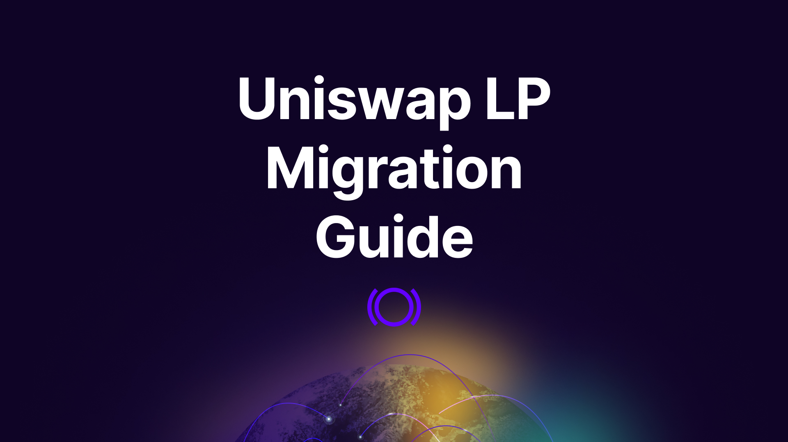

Liquidity providers (LPs) on Uniswap seeking to optimize their returns should consider the potential benefits of migrating their positions to Panoptic. Panoptic leverages innovative fee structures that can significantly increase earnings – up to **three times more** fees earned compared to LPing in Uniswap. This tutorial will explain how you can migrate your LP position to Panoptic to earn more.

 

### Questions We'll Answer
-   Why should I migrate my Uniswap LP position?
-   What are the risks of migrating?
-   What positions can I migrate?
-   How do I migrate my positions?
    

## Lend out your LP tokens to Earn 3x More Fees

Traders have the potential to earn up to three times more in fees by lending out their Uniswap LP tokens through Panoptic. Borrowers of your LP token pay the foregone Uniswap fees plus an additional amount called the [spread](https://panoptic.xyz/research/liquidity-spread), ranging from a base multiplier of 1x to 3.25x. The ability to lend out LP tokens offers LPs an attractive additional source of yield.

## Advantages of Migrating Uniswap LP Positions

Migrating Uniswap LP Positions to Panoptic have 4 distinct advantages:
1.   **Effective Position Management**: Once migrated, you'll have access to tools for managing your position: view profit and loss (PnL) with visual aids, track earned fees, see your Panoptic multiplier, monitor your price range against the current price, and easily open or close positions. **In Panoptic, all LP positions are displayed as “sold puts,”** because [LP = Options](https://panoptic.xyz/blog/uniswap-lp-equals-options).
2.   **Significantly Increased Fees**: The most prominent advantage is the potential to earn up to 3x more in fees. This is made possible by lending your LP tokens through Panoptic.
3.   **Flexibility**: Panoptic analyzes existing Uniswap LP positions and recommends new, optimized positions designed specifically to maximize earnings. LPs retain the ability to customize these suggestions before confirming migration.
4.   **Migration Process**: Panoptic aims to make the migration process from Uniswap V2 and V3 positions as smooth as possible. This includes automatic identification and migration of all LP positions.

    

## Migration Risks

While migrating Uniswap LP positions to Panoptic provides a unique opportunity for enhanced earnings, it’s essential to be aware of potential risks. Here are the main risks to consider:

-   Liquidation Risk: Manually created LP positions in Panoptic are undercollateralized, which may be subject to liquidation if the underlying asset's price experiences a significant drop. To reduce this risk, LPs should consider using the upcoming Migrator Button, avoid maxing out position size, and keep [buying power usage](https://panoptic.xyz/docs/product/liquidations#keep-buying-power-usage-low) low.
-   Position Closure Challenges: LP positions are lent out to options traders in Panoptic, so certain positions may encounter restrictions when closing. Some positions may not be closeable, while others may be forcibly closed for a fee. For detailed guidance, please refer to our [documentation](https://panoptic.xyz/docs/product/closing-a-position#troubleshooting-issues-with-closing-a-position).
-   Commission Fees: Deploying a position in Panoptic incurs a 0.2% commission fee, which is directed to passive LPs on Panoptic who facilitate the creation of leveraged LP positions. The good news is that you have the potential to earn back these fees by keeping deposits within Panoptic.
    

Here’s how: during the migration process, you automatically become a passive LP on Panoptic. This means that future users who migrate their positions or trade options in the same Panoptic pool will pay commission fees, a portion of which will be directed to you. As long as your deposits remain in a Panoptic pool, you will continue to earn commission fees from activity within that pool.

## Migrate your V2 and V3 LP Positions

Panoptic will soon offer streamlined migration of Uniswap V2 and V3 LP positions from any supported chain. LPs will be able to connect their wallet to the Panoptic app to migrate and start earning more fees. The app will automatically identify and present all eligible LP positions to migrate.

## How to Migrate Uniswap LP Positions

Note: To simplify the migration experience, Panoptic is developing a “Migrator Button” designed to streamline the process for Uniswap LPs. This feature will allow LPs to migrate their positions with a few clicks, ensuring that all positions are set up correctly within Panoptic and fully collateralized to eliminate any risk of liquidation. With this feature, you can securely transition your LP positions with confidence and ease.

Manually created LP positions in Panoptic are undercollateralized and may be subject to liquidation if price falls significantly. 

In order to migrate your Uniswap LP position to Panoptic, follow these three steps:

1.  **Close your LP position on Uniswap**: Navigate to [Uniswap](https://app.uniswap.org/pools), connect your wallet, and close your LP position by selecting “Remove liquidity” and “Remove” 100% of the position. Take note of the size of your position in terms of both tokens.
    
 

 

2.  **Deposit funds into Panoptic**: Navigate to Panoptic and connect your wallet. Head to the “Markets” page and search for the token pair you want to LP in.
    
 

After selecting the pool, approve and deposit both tokens into Panoptic. You can use the same amounts as your original LP position from step 1.

 

3.  **Open a “short put” position on Panoptic**: On Panoptic, a short put is the exact equivalent to an LP position. You can select the short put strategy from among our one-click options strategies or choose “Uniswap LP” from our Uniswap LP strategies.

 

 

You can adjust your position’s price range by changing the strike price and timescale. The [strike price](https://panoptic.xyz/docs/product/opening-a-position#selecting-a-strike-price) is the middle of your price range and the [timescale](https://panoptic.xyz/docs/product/timescales) is the width of your price range. To adjust your position’s size, select the [number of contracts](https://panoptic.xyz/docs/product/opening-a-position#selecting-a-number-of-contracts). Avoid selecting “max”, as this will increase your risk of [liquidation](https://panoptic.xyz/docs/product/liquidations).

Once you’re satisfied, you can review your position and confirm the details. Congratulations, you’ve successfully migrated your LP position to Panoptic!

For tips on managing your position, see our guide [here](https://panoptic.xyz/docs/product/position-management).
 
_Join the growing community of Panoptimists and be the first to hear our latest updates by following us on our [social media platforms](https://links.panoptic.xyz/all). To learn more about Panoptic and all things DeFi options, check out our [docs](https://panoptic.xyz/docs/intro) and head to our [website](https://panoptic.xyz/)._
