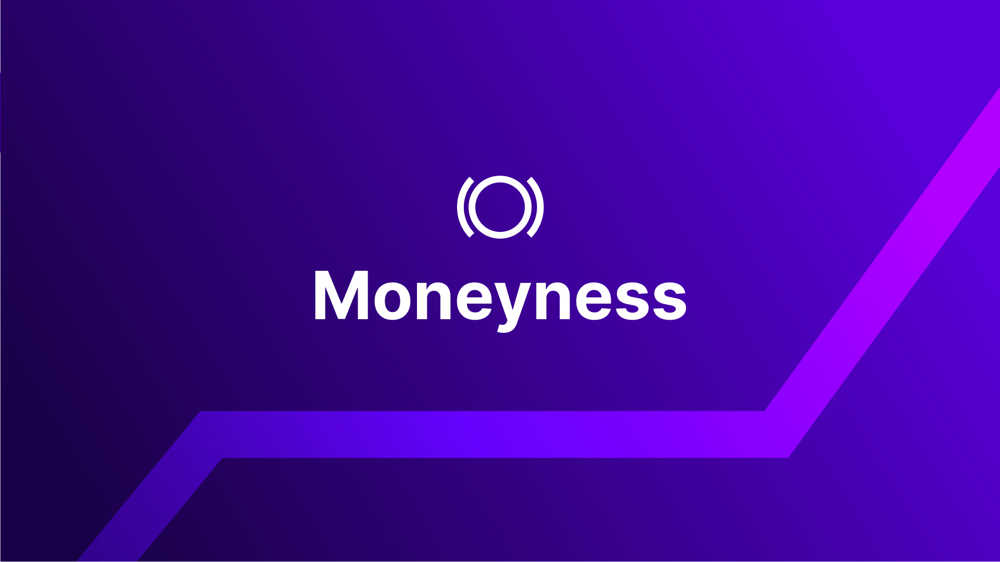

## Introduction

Moneyness is a measure of the relationship between the underlying asset price and the strike price of an option. This relationship determines whether a call or put option is ITM (in-the-money), OTM (out-of-the-money), or ATM (at-the-money). Moneyness impacts the potential payoff for buyers and sellers of options.

  

The definitions of ITM, OTM, and ATM options are crucial for understanding the options trading on the Panoptic platform.

>### Questions We'll Answer
>
>-   How can I trade an ITM option?
>-   How can I trade an OTM option?
>-   What are the benefits and risks of trading ATM options?
>-   What are the benefits and risks of trading deep ITM options?
>-   What are the benefits and risks of trading deep OTM options?
    

The difference between ITM, OTM, and ATM for call options is as follows:
1.  ITM: strike price of an option is less than the market price of an asset
2.  OTM: strike price of an option is greater than the market price of an asset
3.  ATM: strike price of an option is equal to the market price of an asset
    
The difference between ITM, OTM, and ORM for put options is as follows:
1.  ITM: strike price of an option is greater than the market price of an asset 
2.  OTM: strike price of an option is less than the market price of an asset
3.  ATM: strike price of an option is equal to the market price of an asset
    

## How can I trade ITM and OTM options?

### Trading an ITM option

You can create an ITM option on Panoptic by heading to the “Trade” page. Here are examples of creating ITM calls and puts.

  

*Creating an ITM call option*

  

*Creating an ITM put option*

### Trading an OTM option

You can also create OTM options in Panoptic. Here are examples of creating OTM calls and puts.

  

*Creating an OTM call option*
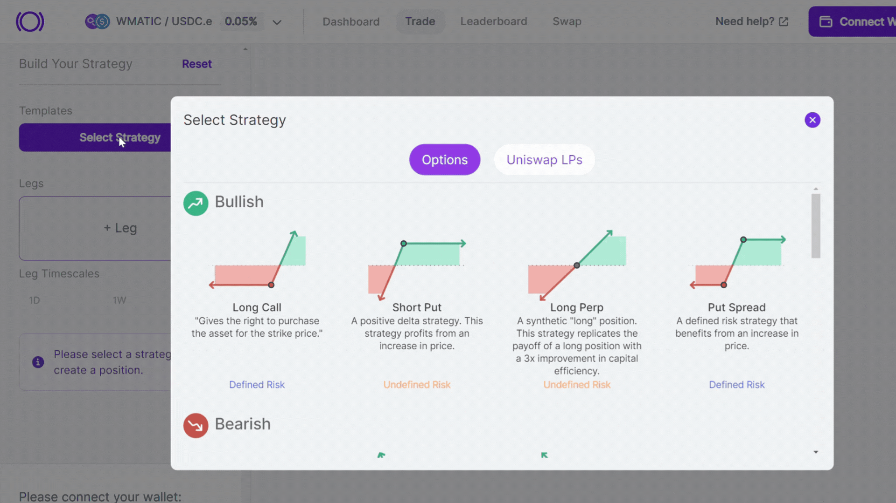
  

*Creating an OTM put option*

  

## What are the benefits and risks of trading ATM, ITM, and OTM options?

Trading options carries both benefits and risks. Let's explore the pros and cons of trading a specific type of option.

### Benefits and risks of trading ATM options

For buyers: You gain exposure to the underlying asset with limited downside risk (capped loss), but you pay [streamia](https://panoptic.xyz/docs/product/streamia) for this privilege.

  

For sellers: You receive streamia for selling options, but you have significant downside risk if the price of the underlying asset moves against you. Your capital may also become temporarily tied up in the position.

  

*ATM option for a buyer who pays streamia*
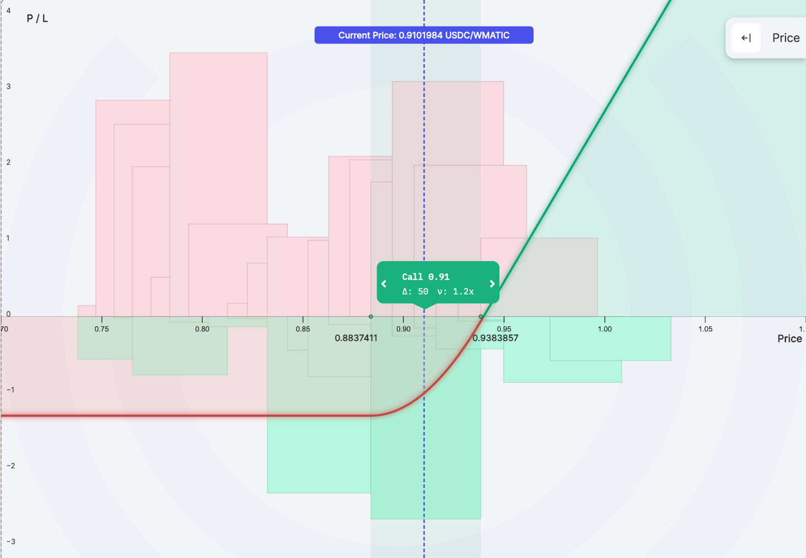

### Benefits and risks of trading deep ITM options

For buyers: You get the option for "free" – that is, you get 1:1 (100 [delta](https://panoptic.xyz/docs/product/delta)) exposure to the underlying asset without paying any streamia. However, you can be force exercised at any time, and the compensation received for this may be minimal, especially if your option is deeply ITM. To avoid this, consider purchasing an option that is closer to the money or has a longer timescale.

  

*Deep ITM option for a buyer*
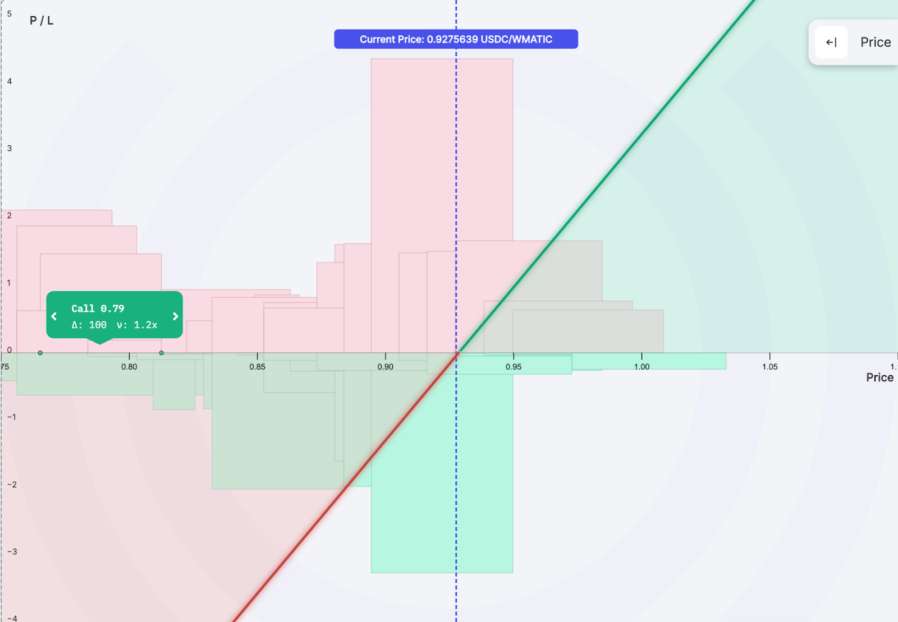

  

*Less Deep ITM option for a buyer*
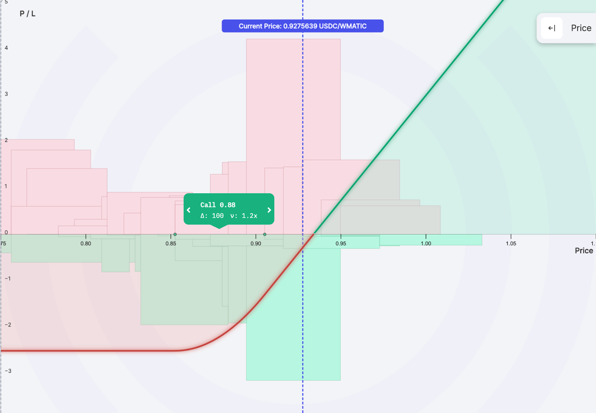

  

*Longer timescale ITM option for a buyer*
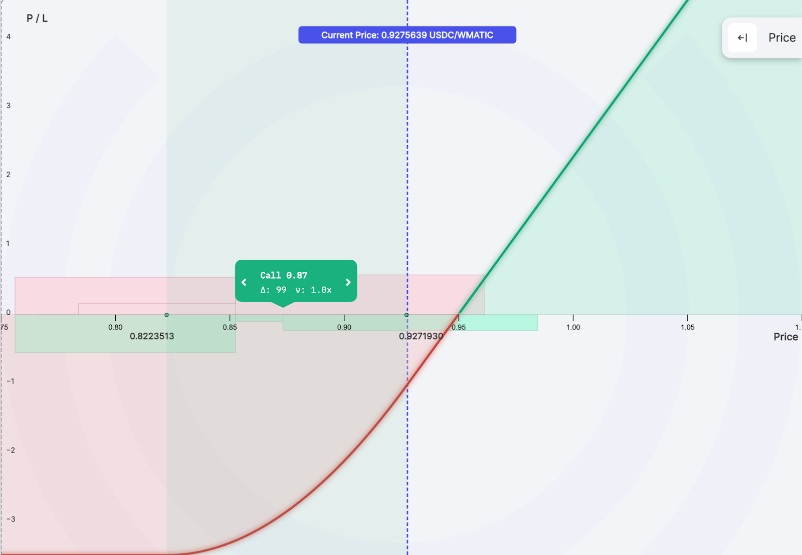

  

For sellers: you are selling a "free" option – that is, you don't receive any streamia while [the option is out of range](https://panoptic.xyz/docs/product/streamia#in-range-options-accumulate-streamia). Sellers should avoid selling deep ITM options and instead sell options that are closer to the money.

  

*Deep ITM option for a seller*
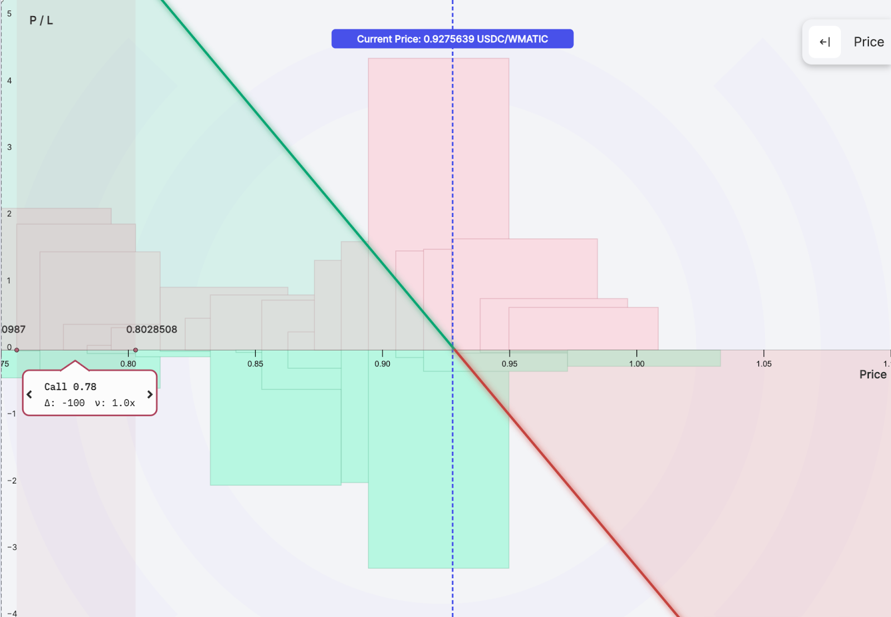

 
  

*Less deep ITM option for a seller*
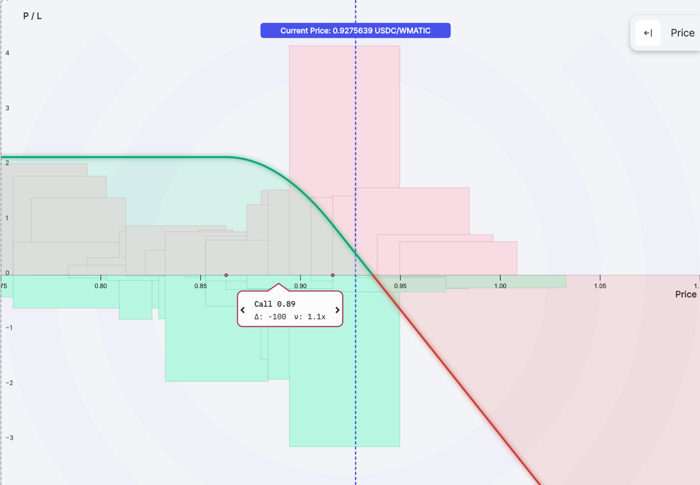

### Benefits and risks of trading deep OTM options

For buyers: you get the option for "free" – that is, you pay no streamia. However, you have no exposure to the underlying asset (0 delta) until the price of the underlying asset moves [in range](https://panoptic.xyz/docs/product/streamia#in-range-options-accumulate-streamia). This means that the price of the underlying asset can go up, but your option's value will not. Also, you can be force exercised at any time, and the compensation you receive for this may be minimal, especially if your option is deeply OTM. To avoid this, consider purchasing an option that is closer to the money or has a longer timescale.

  
  

*Deep OTM option for a buyer*
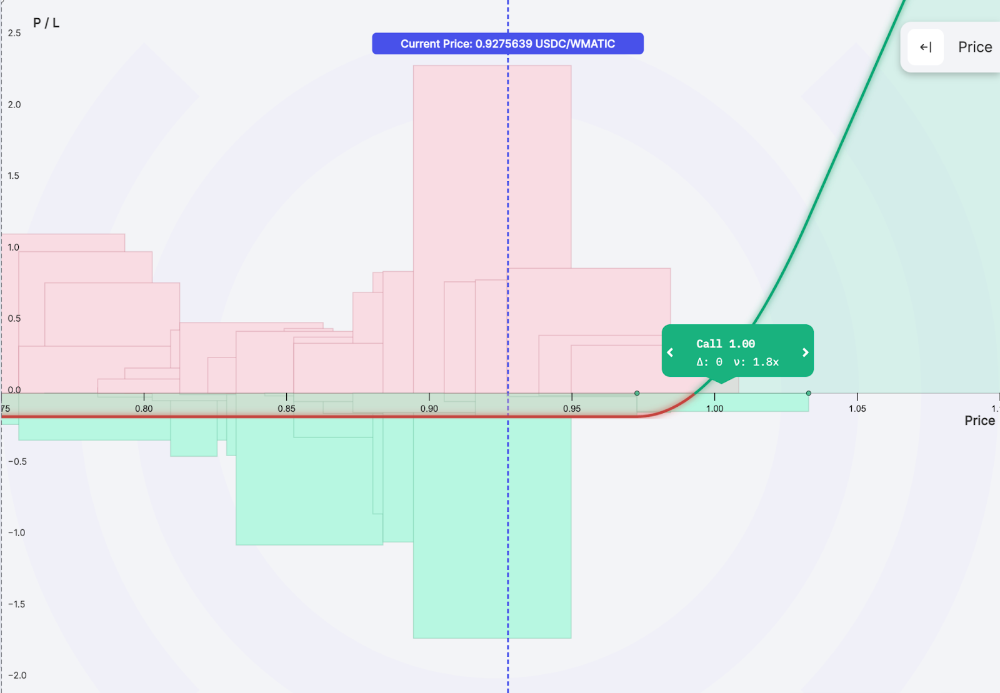

  

*Less Deep OTM option for a buyer*
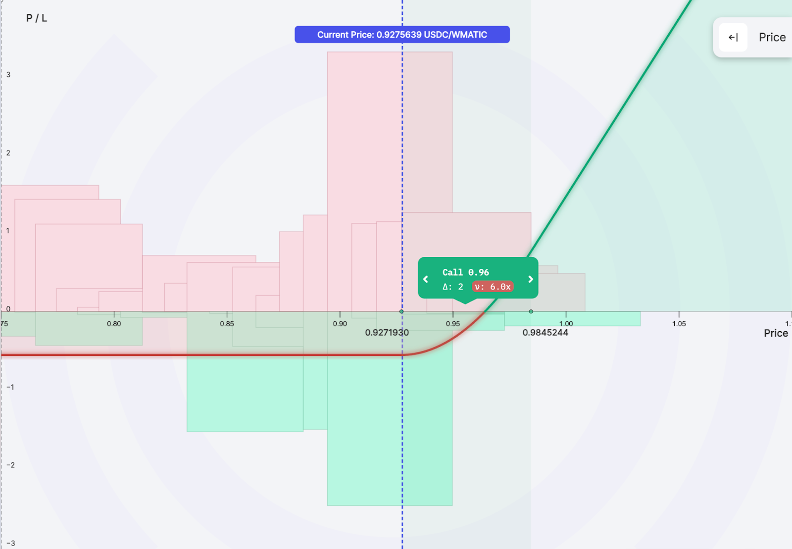

  

*Bigger timescale OTM option for a buyer*
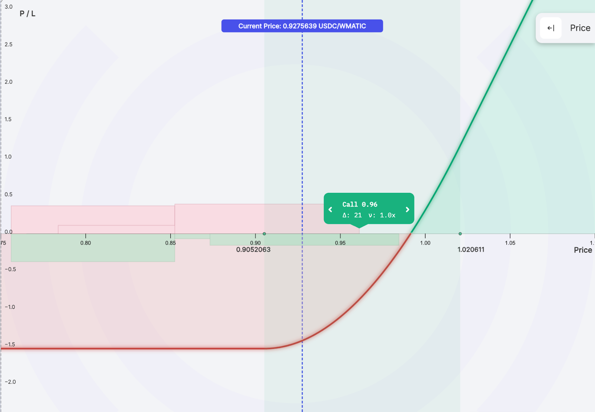

  

For sellers: you are selling a “free” option – that is, you do not receive any streamia while the option is out of range. Sellers should avoid selling deep OTM options and instead sell options that are closer to the money.

  

*Deep OTM option for a seller*
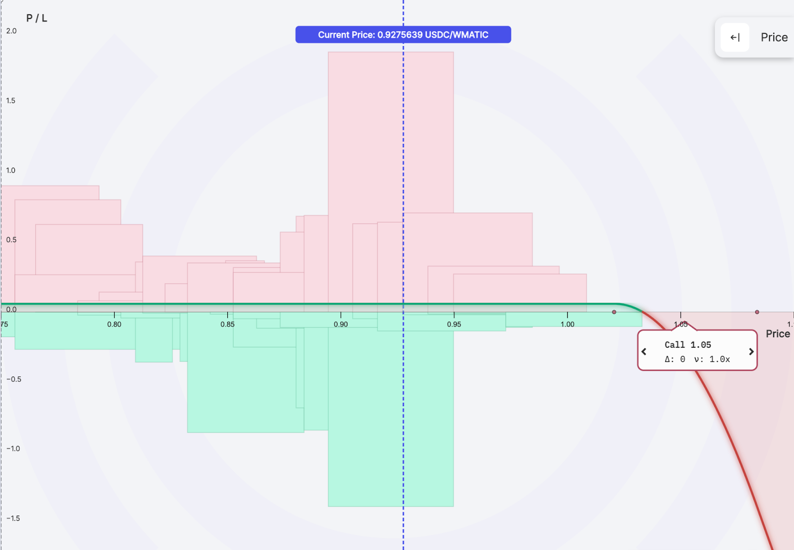
  
  

*Less Deep OTM option for a seller*
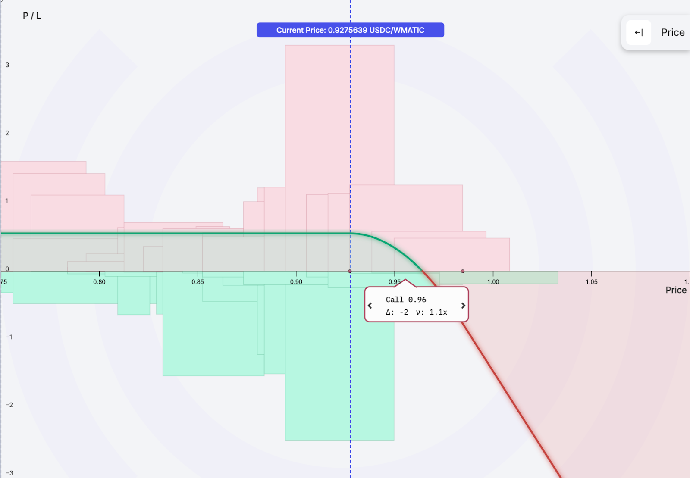

## Conclusion

This article covers the moneyness of options, which describes whether an option is in-the-money (ITM), out-of-the-money (OTM), or at-the-money (ATM). You can create each type of option using Panoptic. When trading ATM, ITM, or OTM options, it is important to remember both the benefits and risks involved.

*Join the growing community of Panoptimists and be the first to hear our latest updates by following us on our [social media platforms](https://links.panoptic.xyz/all). To learn more about Panoptic and all things DeFi options, check out our [docs](https://panoptic.xyz/docs/intro) and head to our [website](https://panoptic.xyz/).*