  

  

## Overview

  

Pantopic merges DeFi with full-featured options trading, allowing users to leverage traditional options concepts to trade DeFi-native perpetual options. Creating options on Panoptic is simple, thanks to our easy-to-use platform and tools provided for beginners. Moreover, advanced users can take advantage of Panoptic's flexibility to create customized strategies.

  

Creating an option sometimes can feel like an overwhelming or complicated task. At Panoptic, we aim to keep this straightforward. Here’s a step-by-step for creating a perpetual option on Panoptic.

  

## Connecting to Panoptic

  

Trading perpetual options (or Panoptions) on Panoptic is permissionless. Before picking a trading strategy and opening a position, traders must connect their wallet.

  

When accessing the Panoptic platform, users will find the “connect wallet” button in the top right corner of the screen. Once clicked, users can connect to the platform through their preferred wallet from the listed options. Keep in mind, Panoptic is currently built for desktop, with mobile support coming soon.

  
  

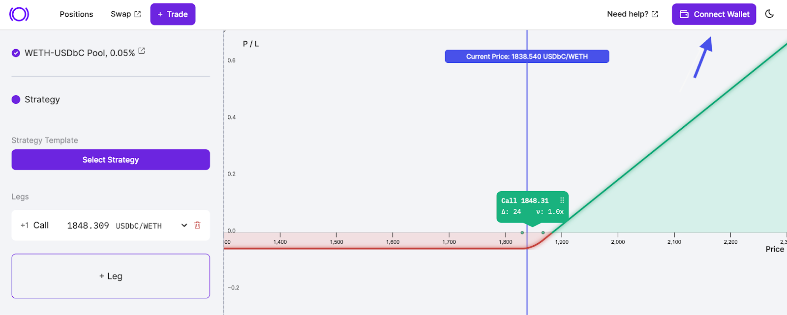
  

## Onboarding

  

To get started, traders must click the "Onboarding" button at the bottom right corner of the Panoptic app. Traders can then follow the onboarding modal to deposit collateral.

  

Remember that collateral deposits must be one of two assets in a trading pair. Later in the article, we will explain more on adding collateral.

  

  

Learn more about onboarding and depositing collateral [here](https://www.youtube.com/watch?v=iVfeZUVBN7E).

  

## Selecting Assets

  

Once onboarded, traders can select a trading pair, which are the two tokens used to create an option position, such as USDC-ETH. The trading pair represents the Uniswap pool Panoptic interacts with.

  

## Fee Tiers

  

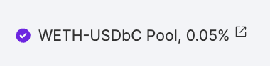
  

The trading pair pool fee is shown next to the trading pair represented as 5 basis points (bps) in this example. 5 bps, or 0.05% since one basis point is 0.01%, is the fee associated with the Uniswap pool from which the trading pair was derived.

  

Uniswap employs a proportional fee model, including 100, 30, and 5 basis point fee tiers. When opening a position on Panoptic, the fee will be one of these three tiers.

  
  
  

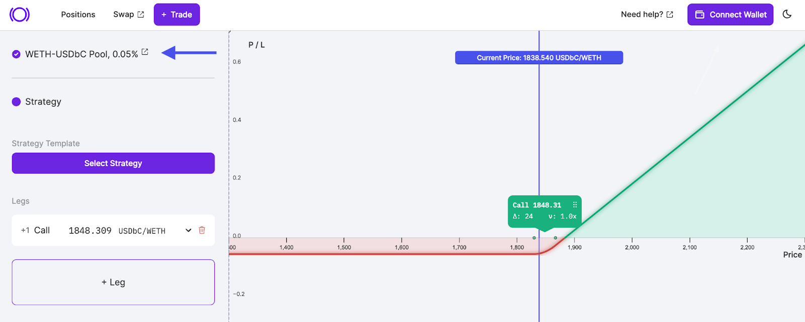
  

## Selecting a Strategy

  

Successful traders are widely known for having a trading strategy or plan to manage risk and maximize rewards. On Panoptic, users can deploy their options strategy by selecting from the strategy template. The template section consists of both bullish and bearish strategies for speculation on prices going up or down.

  

Within templates, there are a few different option types available for each directional (bearish or bullish) strategy. More templates will be added to our protocol by popular demand.

  

### Defined and Undefined Risk

  

Each trading strategy comes with a set of risks that’s either defined or undefined. Defined risk strategies are strategies where there is a maximum loss associated with the option. Undefined risk means the option can theoretically take on an infinite amount of loss.

  

Buying a call (also called a long call) has defined risk because the maximum potential loss is limited to the premium paid for the option contract. Selling a call option (also called a short call), has undefined risk, meaning the option can theoretically take on an infinite amount of loss. A short call has undefined risk because selling a call option creates an open-ended obligation. The seller is bound to fulfill the contract if the buyer chooses to exercise it, regardless of how high the price of the underlying asset may go.

  

Remember:

  

-   Long Call: profits from an increase in price of the underlying asset.
    
-   Short Call: profits from a decrease in price of the underlying asset.
    

  

For each strategy, Panoptic labels the risk profile under the option type which will either be defined or undefined.

  

### Viewing the Payoff Curve

  

When opening a new position, the payoff curve is typically the first thing traders see in the Panoptic interface. The payoff curve is the line used to show the profit and loss of the option strategy in regard to the current price.

  

Depending on the type of option and the selected strike price, the payoff curve will change. The red zone represents a loss, and the green zone shows profit.

  

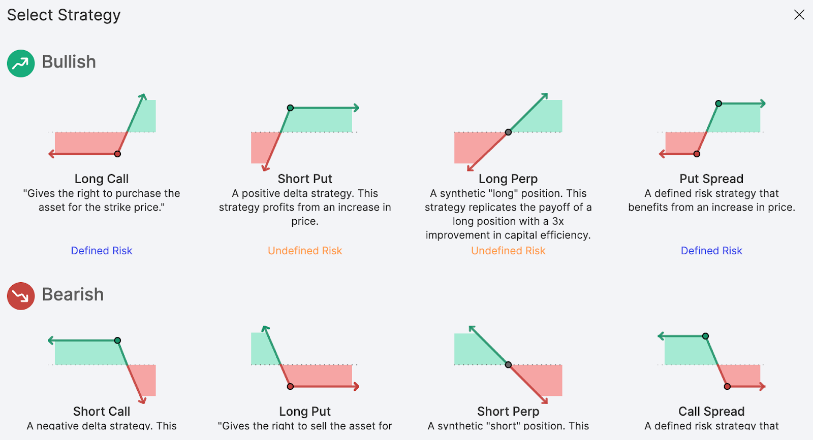
  

## Selecting a Leg

  

Once traders have selected a strategy, the option will appear as a new leg. Legs are components of an option strategy. A long call is considered as one leg. Advanced traders might add multiple legs to form a more complicated strategy.

  

When selecting a strategy from the templates, the strategy's leg(s) will appear on the profit and loss (PnL) graph. Each leg can be further refined by the user by selecting the:

  

-   Option Type: Selecting either a put or call position
    
-   Strike Price: The price at which an option can be exercised to buy/sell the underlying asset
    
-   Long/Short: Select to buy or sell the option. Short represents selling; long represents buying
    
-   Options Ratio: Specify the contract weight of a particular leg in a given strategy (often used in multi-leg strategies)
    

  

Keep in mind, adding legs, as well as editing legs, will influence the payoff curve.

  

For advanced traders, multiple legs can be added by using the “+ Leg” button. By using multiple legs, traders can build more advanced options strategies seen in traditional finance such as [iron condors, straddles, and strangles](https://panoptic.xyz/research/essential-options-strategies-to-know).

  

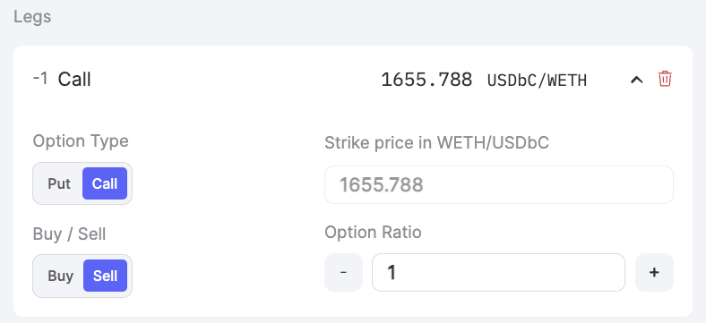
  

### Selecting a Strike Price

  

The strike price is one of the most pivotal variables when trading options, since it represents the price traditional options can be exercised to buy or sell the underlying asset. When selecting a strike price on Panoptic, traders must use the strike to determine the profitability of the option based on the payoff curve.

  

On Panoptic, the strike price can be easily found and edited using the chart interface displayed within the chart's UI. Users can either manually edit the strike price within the 'legs' section or directly on the chart itself. To adjust it on the chart, simply drag the strike position marker across the price axis.

  

## Earning Streamia

  

Understanding when [streamia](https://panoptic.xyz/blog/streamia-defi-native-options-pricing) (streaming premia) is paid in Panoptic is simplified by visual cues on the PnL graph, which are represented by two dots to the left and right of the strike price. These dots indicate the price range within which buyers pay sellers streamia to keep their option open. When the price of the underlying goes outside of this range, buyers no longer pay streamia to sellers.

  

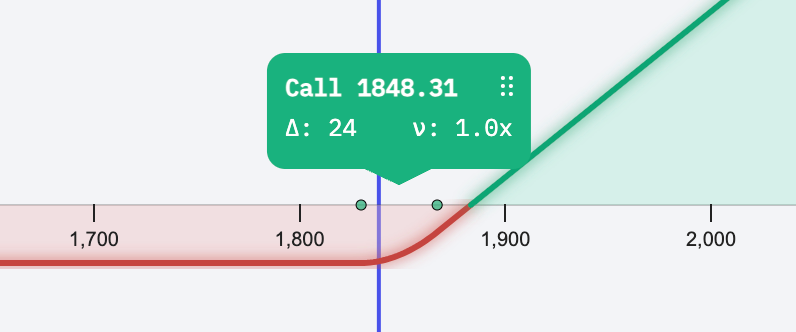
  

## Selecting a Number of Contracts

  

Once the strategy and strike are determined, users need to choose the number of contracts they would like to trade. On Panoptic, minimum contract sizes don’t exist and fractional amounts are supported.

  

The more contracts a user trades, the greater their exposure is to the underlying asset. For example, a deep in-the-money 1 ETH call will give the user exposure to 1 ETH worth of funds.

  

### Selecting Contracts and Managing Collateral

  

Panoptic makes it easy to select a number of contracts by allowing users to specify the amount based on the buying power they have in their account.

  

For example, suppose a trader has $100 worth of USDC collateral and can buy up to $1,000 worth of options (buying power = $1,000 which is essentially 10x leverage). The trader can select the “5%” option which will use 5% of their buying power to purchase $50 worth of ETH options.

  

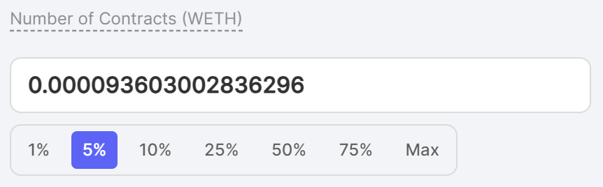
  

Note: users cannot buy/sell options in excess of their buying power, otherwise they will receive the following error message:

  

Available collateral balance exceeded! Please lower your contract amount.

  
  

## Managing and Adding Collateral

  

In the collateral section, traders can use the toggle to view collateral details in terms of either asset. For example, if traders are dealing with an ETH-USDbC pair, the toggle allows them to view collateral requirements in terms of either ETH or USDbC.

  

Note that toggling the collateral details does not change the type of collateral being provided. Rather, positions in Panoptic are cross-collateralized so that users can deposit collateral in either token. That said, settlement requires payment in a specific token. For example, commissions, in-the-money (ITM) spreads, and the intrinsic value of an option must be paid in the specified token.

  

Within the interface, traders can view how much collateral is needed for the  position and how much collateral they currently have in Panoptic.

  
  

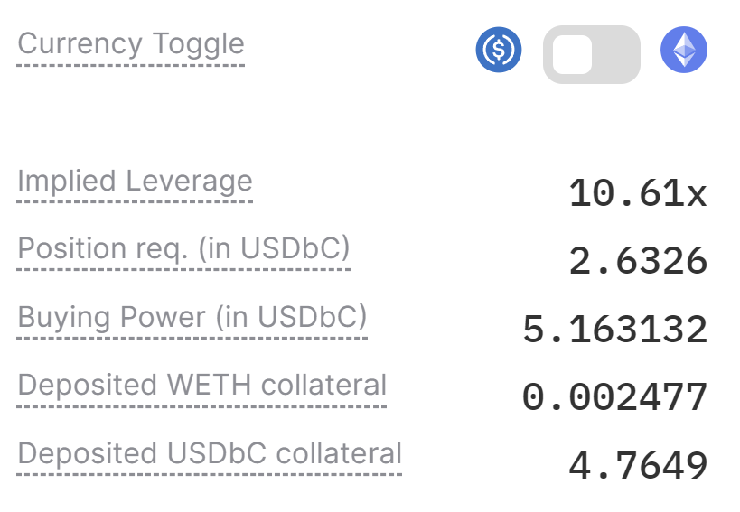
  

## Liquidity

  

Liquidity is a key component in all forms of trading. Without liquidity, traders cannot fulfill their desired orders at the best pricing. Panoptic aims to address one of the largest issues in DeFi – fragmented liquidity – which is preventing mass option adoption. Since Panoptic leverages Uniswap liquidity, traders can source from one of the deepest markets in DeFi.

  

Options in Panoptic are unique because traders can sell any amount of options and still receive streamia thanks to Uniswap spot traders paying fees. However, it's important to note options must be sold before they can be purchased in Panoptic. The amount of sold options liquidity is shown by toggling this button:

  

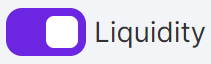
  
  

Without sufficient liquidity traders will see the following error message:

  

Insufficient liquidity deployed at the strike! Please lower your contract amount

  

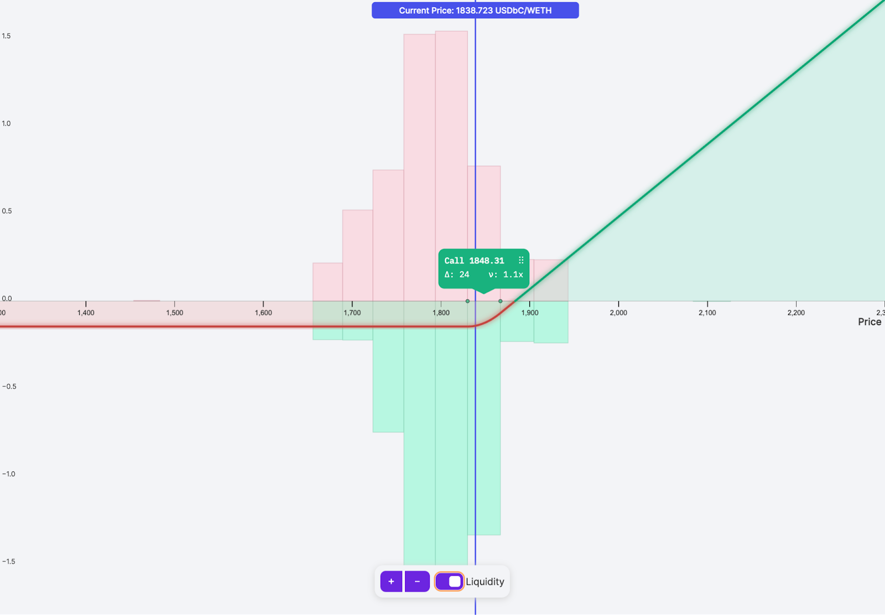
  

## Reviewing a Position

  

Once all the core inputs are confirmed, traders will need to submit their order to be added onto the blockchain which confirms the trade. Within the Review Position interface, traders can confirm the trading pair, strike, pool fee, delta, max loss, buying power, payoff curve, and selected legs.

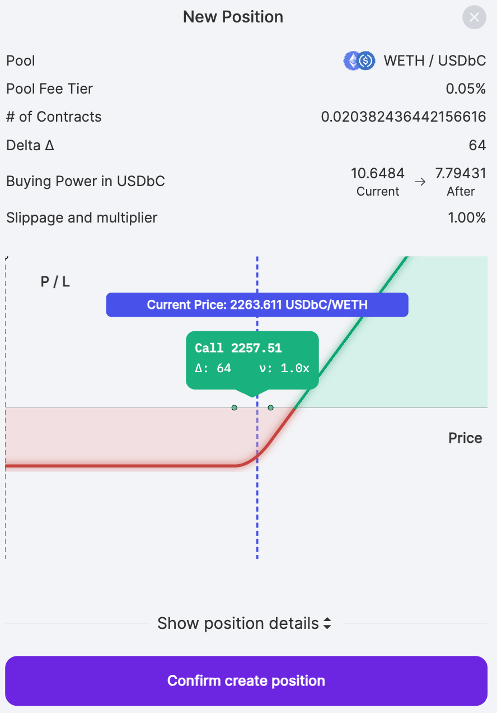
  

If traders find they want to alter any of these inputs, they can close the confirmation screen and edit their trade inputs.

  

### Slippage Tolerance and Spread Limit

  

Traders can input their slippage tolerance and spread limits to add additional constraints for risk management.

  

Slippage tolerance refers to the price of the underlying asset initially quoted versus the price of the underlying asset at which the trade is executed. Slippage typically occurs due to external factors such as price changes and arbitrageurs.

  

Spread tolerance refers to a limit in the spread multiplier. If the spread multiplier goes above a user's spread tolerance while opening the position, the transaction will be canceled. Note that high spreads occur when there's not much liquidity.

  

The spread is a multiplier on the Uniswap fees charged for holding a position. For example, if the spread is two, the fees for holding that option will be twice as much as the regular Uniswap fees for that position. Keep in mind, this spread can change anytime, so it's wise to keep an eye on it and close your position if the spread increases too much after minting your option.

  

Note: the spread tolerance has no effect after the position is opened. If the spread subsequently increases, users will incur higher spreads unless they decide to close their positions.

  

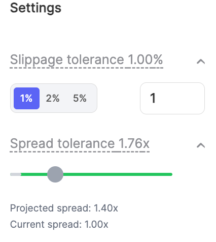
  

## Conclusion

  

Once traders confirm and create their position, they can manage and monitor the position from the Positions tab.

  

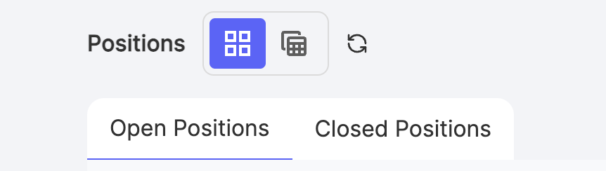
  

Congratulations, you are officially a Panoptic Trader! To monitor your positions, click the “Positions” button at the top left of your screen.

  

*Join the growing community of Panoptimists and be the first to hear our latest updates by following us on our [social media platforms](https://links.panoptic.xyz/all). To learn more about Panoptic and all things DeFi options, check out our [docs](https://panoptic.xyz/docs/intro) and head to our [website](https://panoptic.xyz/).*