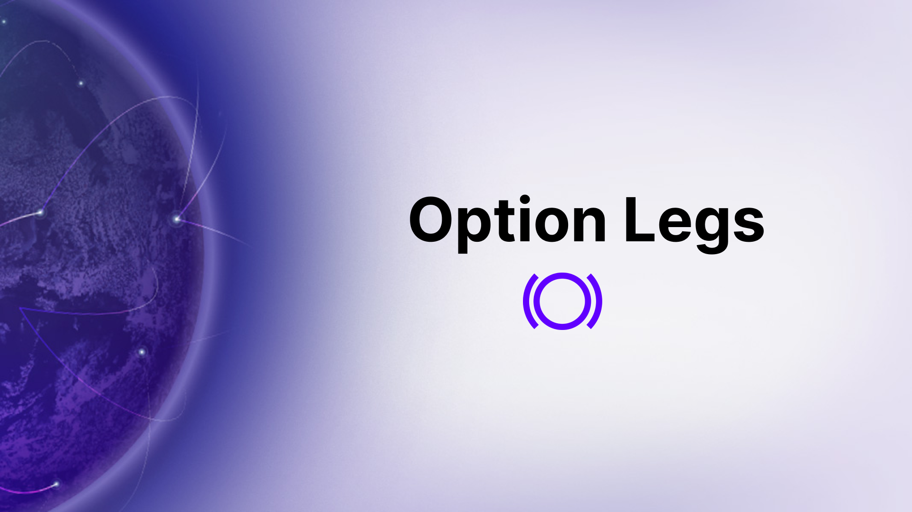
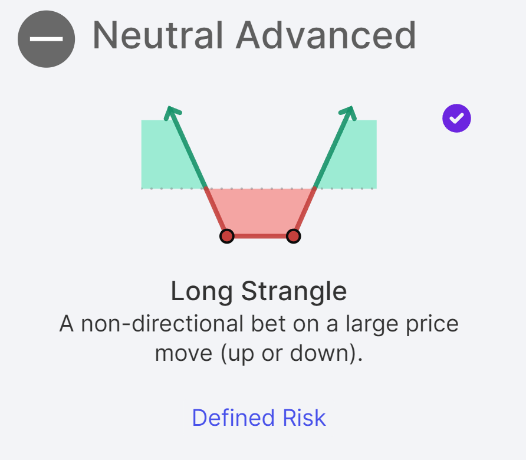
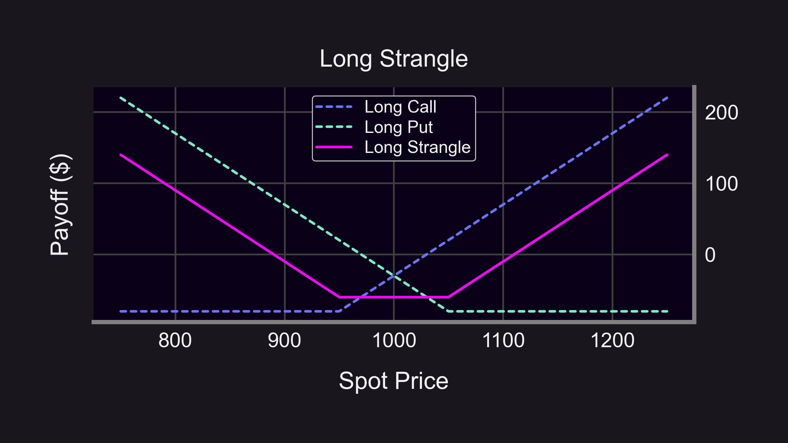
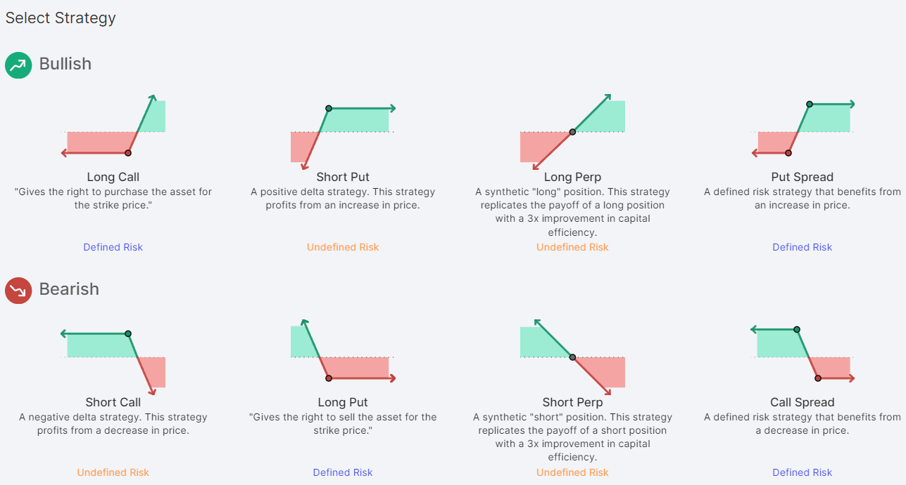
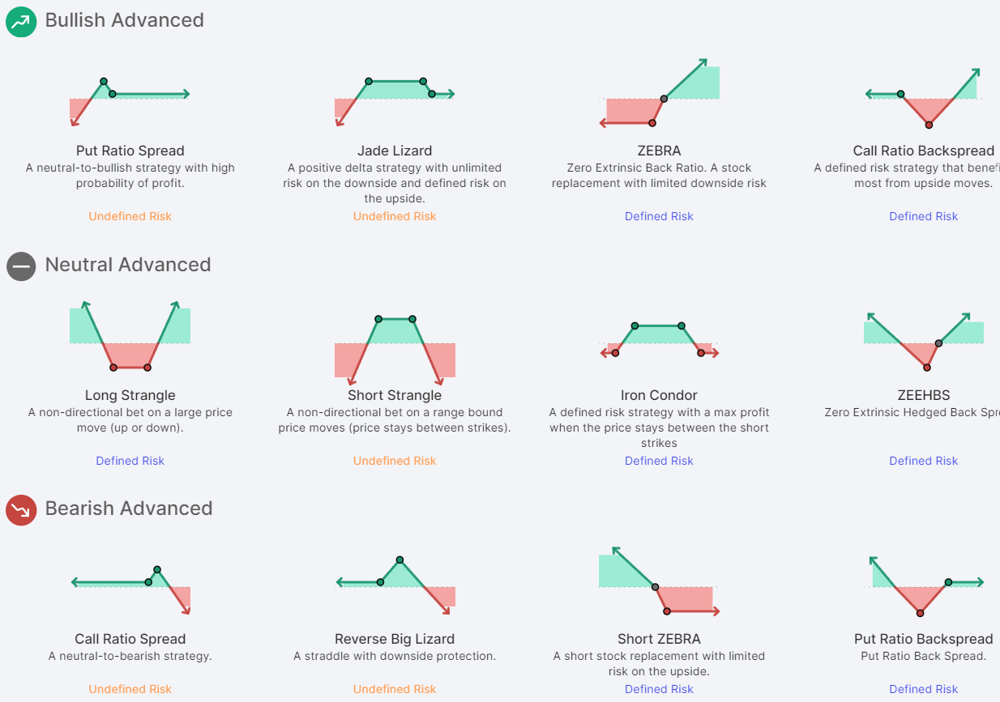
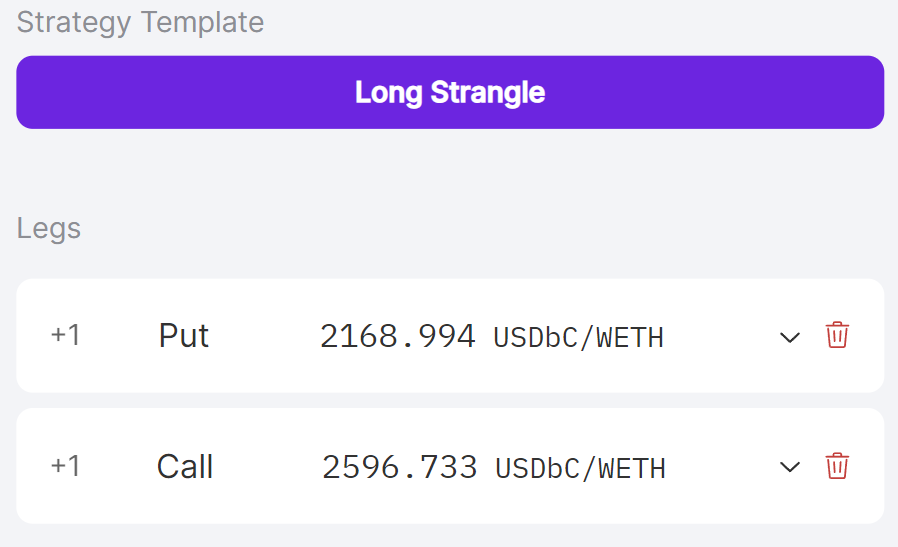
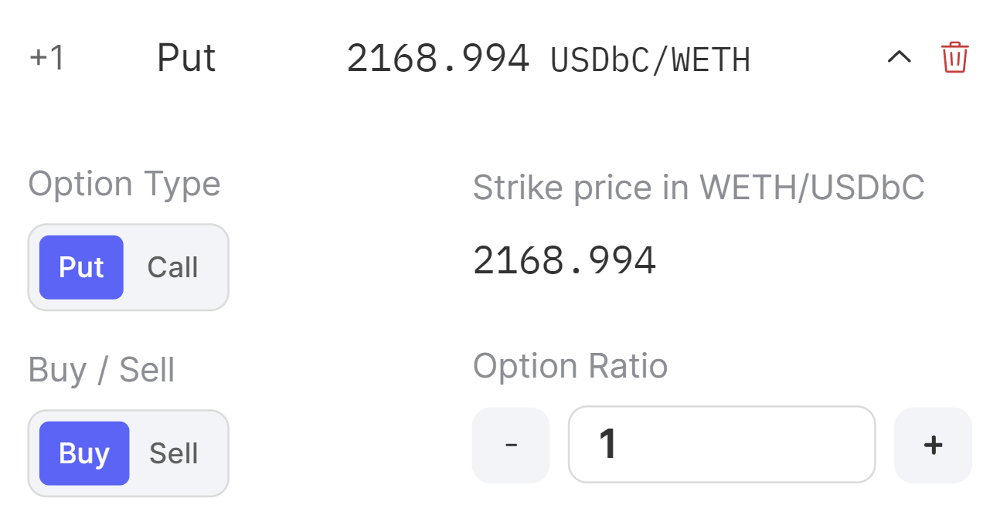
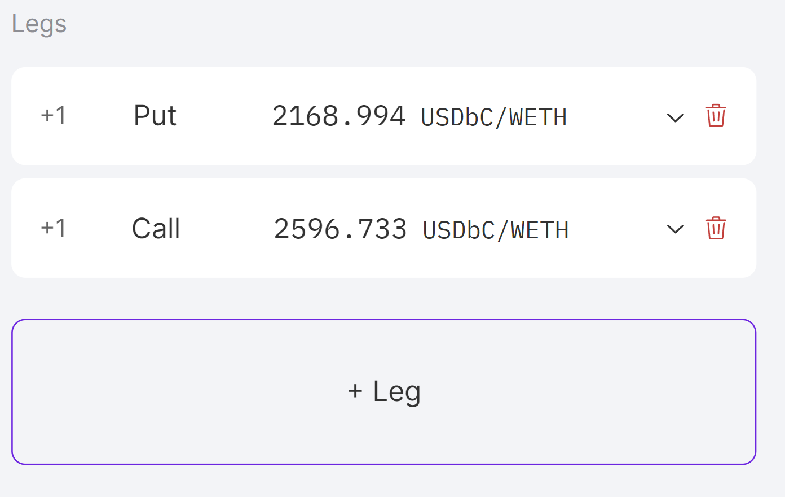
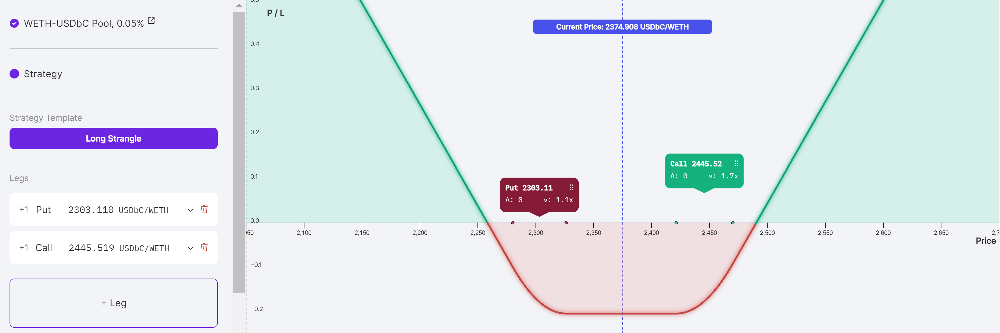

Options trading offers unique opportunities in the financial markets. This guide focuses on how Panoptic enables traders to utilize option strategies effectively.

>### Questions We'll Answer
>
>-   What are options and how do they work in trading?   
>-   What are option legs and how do they form complex trading strategies?
>-   How does Panoptic simplify options trading for both beginners and advanced traders?
>-   What are the additional benefits of using Panoptic's platform for option trading?
    

  

# Introduction to Options Trading

  

Options are versatile instruments in the financial landscape, allowing traders to speculate and hedge with more flexibility compared to other financial products. A basic understanding of options – [calls and puts](/docs/product/basic-options-strategies) – sets the stage for more advanced strategies.

  

# The Role of Option Legs in Trading Strategies

  

Option legs are the building blocks of options strategies. A single leg might be a straightforward call or put option. However, combining these into multiple-leg strategies, such as a long strangle, enables traders to profit from significant price movements in any direction. This can be visually represented as in the picture below, where the pink line indicates profits and dotted lines show individual legs.

  

  

# Panoptic’s Approach to Options Trading

  

On Panoptic's, users are offered a versatile approach to options trading that caters to both newcomers and seasoned traders. Here, you can either manually add individual legs to create a custom strategy or conveniently select from pre-configured strategies that automatically assemble the appropriate legs for you.

  

Outside of creating strategies, option legs have additional benefits to Panoptic traders.

### Gas Efficiency

A significant perk of executing up to 4 legs in a single transaction is the substantial savings on gas fees. This is crucial on blockchains like Ethereum mainnet where increasing usage leads to high transaction costs.

### Risk Management

The multi-leg option also aids in the specialized treatment of defined or limited risks within the collateral system. This feature adds an extra layer of security while increasing capital efficiency for users who want less risk and more leverage.

### Ease of Linking

When you have multiple legs in a transaction, your portfolio risk is easier to understand. Multi-leg options eliminates the need to craft complex solutions to trade defined risk positions, saving traders both time and effort.  

### How to add a leg on Panoptic

As mentioned, traders on panoptic can select a given strategy or manually assemble their own legs to create their own strategies. On Panoptic, users can select from dozens of one-click strategies according to their trading needs.

  

  

Once traders select a strategy, panoptic will automatically create the necessary legs. Once selected, a list of the strategy’s legs will appear.

  

  

Traders can also edit the leg details. Fields such as the option type, whether to buy or sell, and the options ratio are configurable in the drop down view.

  

  

-   Option Type: Traders can select either a put or call position.
    
-   Strike Price: The price at which an option can be exercised to buy/sell the underlying asset. Users can configure the strike directly on the payoff graph by clicking and dragging any leg.
    
-   Buy/Sell: Traders can select if they would like to buy or sell the option. Short representing selling, and long representing buying the option.
    
-   Options Ratio: Often used in multi-leg strategies, they specify the contract weight of a particular leg in a given strategy.
    

  

The comprehensive dashboard enables traders to make changes on the fly and ensure their strategy is properly defined to their liking.

  

  

If traders want to manually add a leg, they can do so by selecting the `+ Leg` button. Traders can always remove legs from a strategy by selecting the trash bin icon on the right side of the leg menu.

  

  

By adding new legs, the payoff curve changes based on those additions. In the long strangle example provided, the call leg will yield a profit on the right side of the curve as asset prices rise. Conversely, the put leg will yield a profit on the left side of the curve as asset prices fall.

  

Once the position is built, traders can follow our [tutorial on opening a position](https://panoptic.xyz/research/opening-a-position-on-panoptic) to finish and submit their trade.

  

Legs are at the heart of options strategies and allow for greater flexibility and capital efficiency. Panoptic makes it easy for both the beginner and advanced traders to build their desired strategy.
