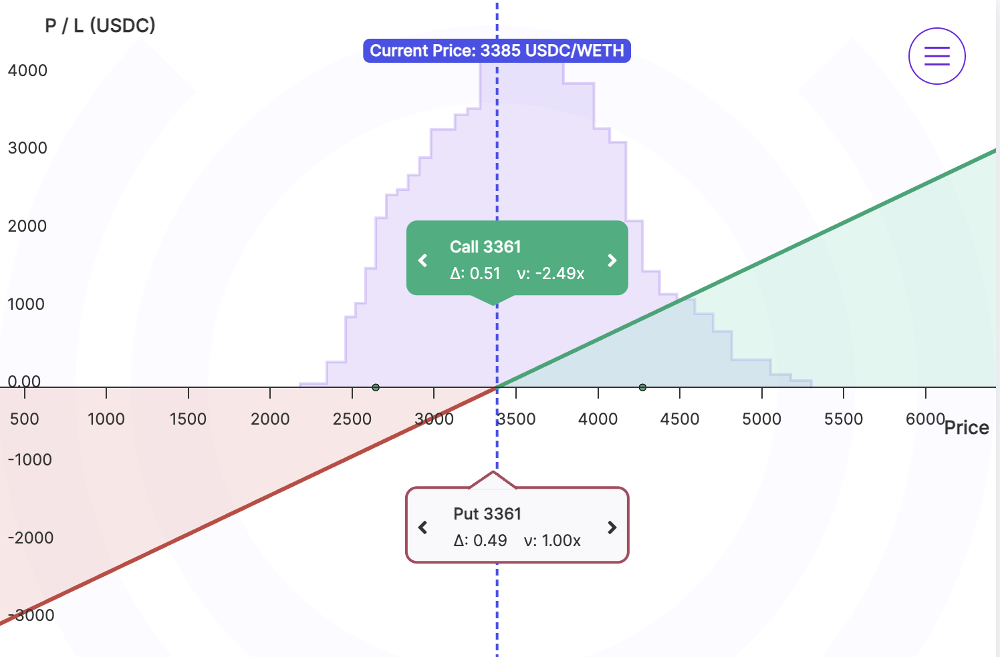

What if you could trade without the clock ticking? What if you could speculate on the future of anything tradable, not just what some exchanges deem as worthy?

That’s the freedom Panoptic provides. Traditional markets dictate what you can trade and when it expires. At Panoptic you can trade options on any token. It’s a revolution in democratizing financial access and giving everyone the opportunity to participate.

Perp have become a staple in the crypto trading world, offering flexibility and unique advantages for traders. Whether you're new to perps or looking to leverage them more effectively, this guide will walk you through everything you need to know to start trading perps on Panoptic.

## What Are Perpetual Futures (Perps)?

Perpetual futures contracts, or perps, are a type of futures contract that don't have an expiration date. Unlike traditional futures, which require traders to manage contract rollovers, perps continue indefinitely, providing uninterrupted exposure to the underlying asset. This seamless trading experience and the ability to speculate on future asset prices make perps an essential tool for crypto traders.

## Why Trade Perps on Panoptic?

-  **New Markets:** Panoptic offers dozens of perps markets that are not available on other exchanges. Panoptic is able to offer new markets for perps trading on virtually any token tradable on Uniswap thanks to its innovative [design](/docs/panoptic-protocol/design) that is completely permissionless, oracle-free, and utilizes Uniswap LP positions to [create perps](/research/introduction-synthetic-perps) and options.
-   **Leverage that works for you:** Panoptic offers up to 3.3x leverage on perps and 10x on perpetual options.  
-   **Trade without expiry:** No rollovers, no expiration stress. Keep your position as long as you want.
-   **Your keys, your coins:** Non-custodial and on-chain. Trade with confidence, not trust.  
-   **Permissionless from start to finish:** Deposit, trade, and earn.
-   **Any token, right now:** If it's an ERC-20 on Uniswap, you can trade it on Panoptic.
    

## Getting Started: How to Trade Perps on Panoptic

### Step 1: Connect Your Wallet

To start trading on Panoptic, you’ll first need to connect your wallet. Panoptic supports multiple wallet providers.

### Step 2: Choose Your Market

Select the [market](/docs/product/markets) you wish to trade in. With Panoptic’s permissionless nature, you’re free to choose any token pair available on Uniswap, giving you a wide array of options to speculate on or hedge against.

### Step 3: Decide on Your Strategy

Determine whether you want to go [long or short](/docs/trading/multi-leg-strategies#synthetic-positions) on the chosen asset.

If you’re bullish, consider a long perp.

If you’re bearish, consider a short perp.

### Step 4: Check Your Leverage

Panoptic allows up to 3.3x leverage on perps and 10x leverage on perpetual options. The [leverage](/docs/product/leverage) is calculated based on the strategy used and the pool utilization.

### Step 5: Check The Funding Rate

You can check the instantaneous funding rate by summing the [spread multiplier](/docs/product/spread) of each leg.

The [effective funding rate](/research/introduction-synthetic-perps#funding-rate-for-synthetic-perps) in this example is -0.37x of the Uniswap fees at each block. This rate is derived from the -1.37x multiplier contributed by the long call and the 1.00x multiplier from the short put, resulting in a combined spread multiplier of -0.37x.

In Panoptic, the effective funding rate can be positive or negative. A negative funding rate means that long perp positions pay, while short perp positions earn the funding fee. In this example, the funding rate is negative, so the long perp position would pay -0.37x of the Uniswap fees.

The funding fee in Panoptic is settled at each block (approximately every 12 seconds on Ethereum) and depends on both the effective funding rate and the Uniswap fees from the underlying liquidity provider (LP) positions tied to the synthetic perp. Note that the funding rate is a floating rate and may change at each block, as it reflects the popularity of the underlying put and call options during that time.

### Step 6: Open Your Position

Once you’ve decided on your strategy and leverage, it’s time to [open your positio](/docs/product/opening-a-position)n. Panoptic’s interface makes it easy to execute your trade and manage your position over time.

### Step 7: Monitor and Manage Your Position

[Keep an eye](/docs/product/position-management) on your trade to decide when the best time is to lock in profits or cut losses. The crypto market doesn’t wait for anyone!

### Step 8: Close Your Position

When your trade has achieved its desired outcome, or if it’s necessary to mitigate losses, [close your position](/docs/product/closing-a-position) to realize your gains or minimize potential losses.

---

Panoptic provides the tools and flexibility you need to succeed. Users can trade perps and options on any asset available on Uniswap. To learn more, check out our [resources](/docs/getting-started/perps-traders#advanced-resources) for perps traders.

*Join the growing community of Panoptimists and be the first to hear our latest updates by following us on our [social media platforms](https://links.panoptic.xyz/all). To learn more about Panoptic and all things DeFi options, check out our [docs](https://panoptic.xyz/docs/intro) and head to our [website](https://panoptic.xyz/).*
