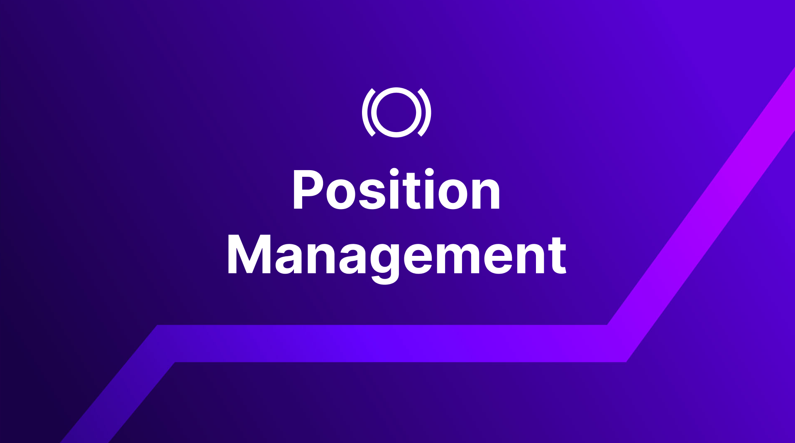
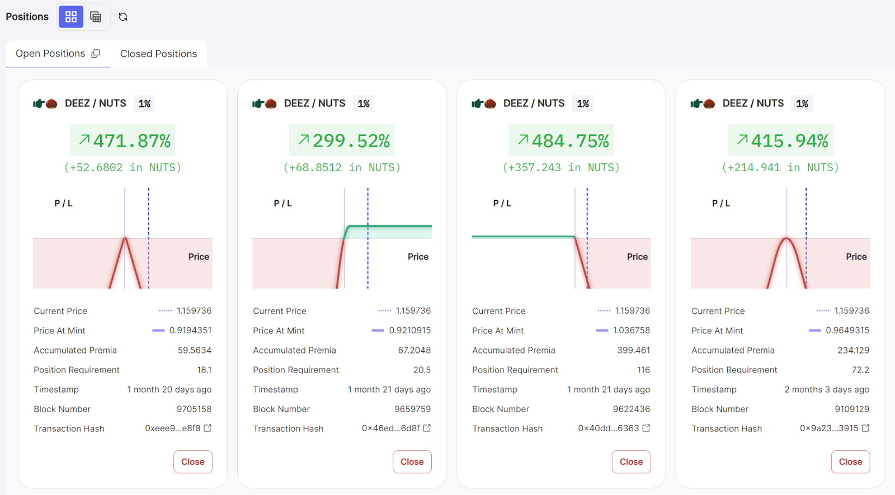
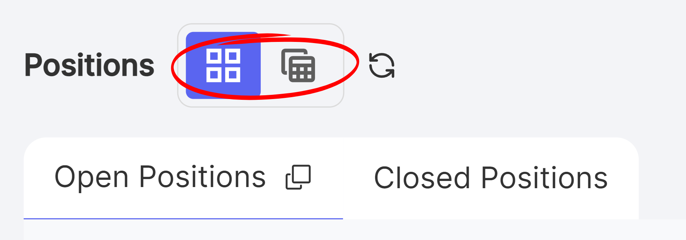
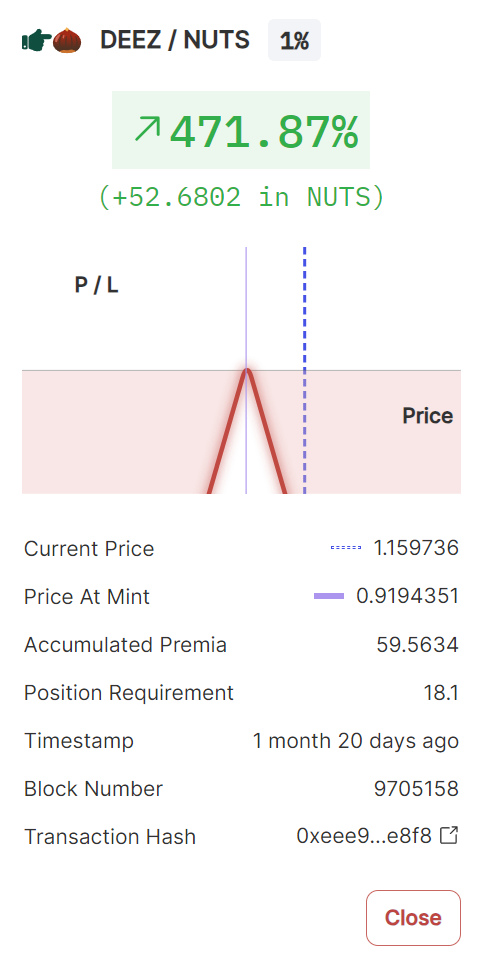
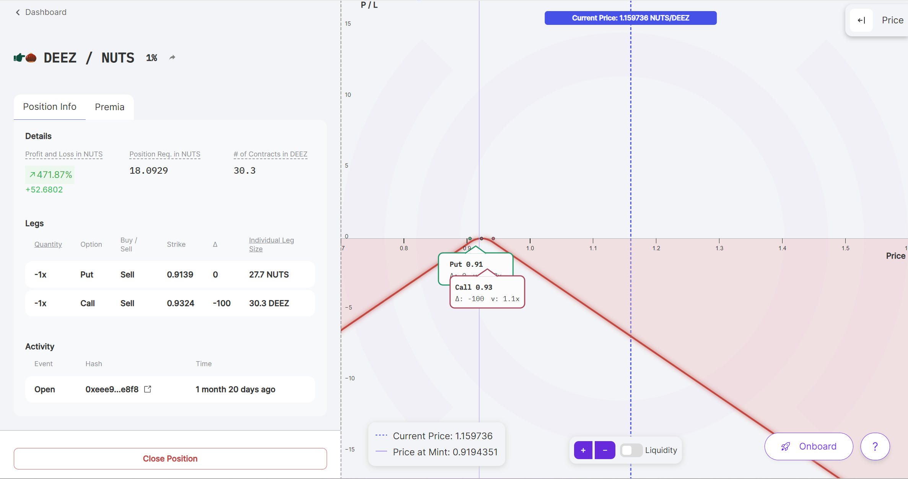
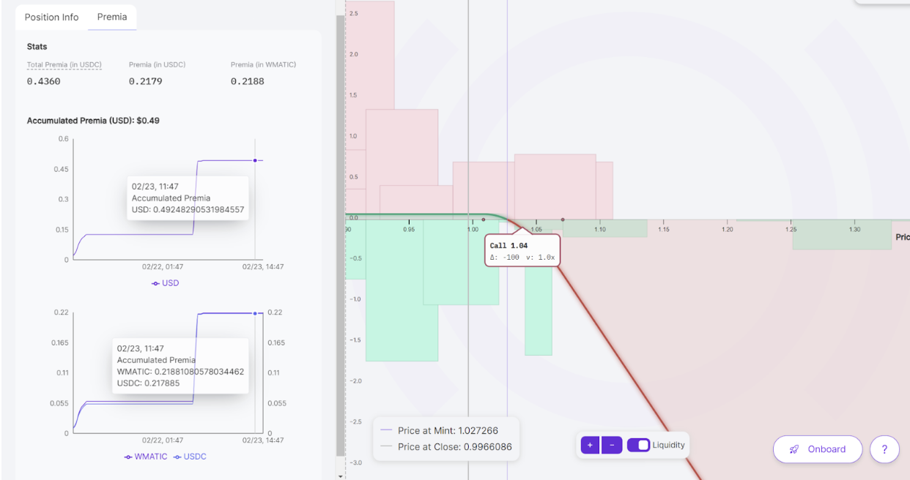
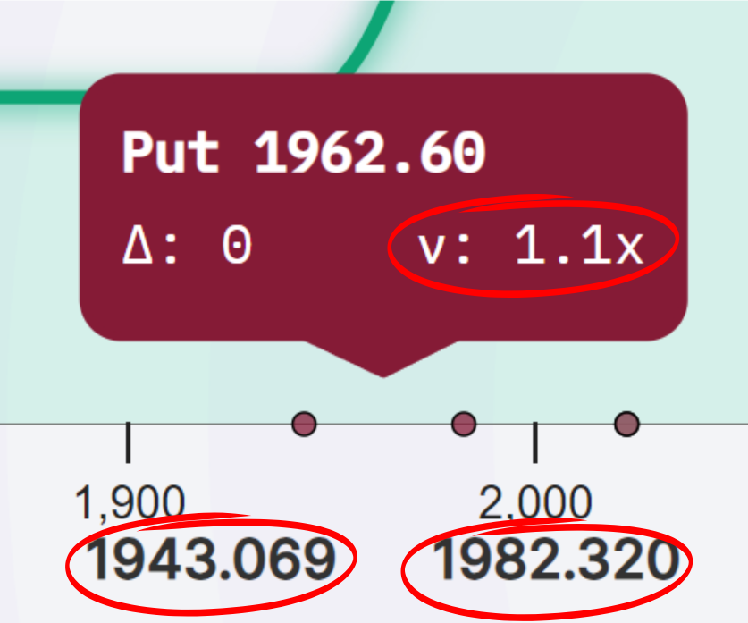
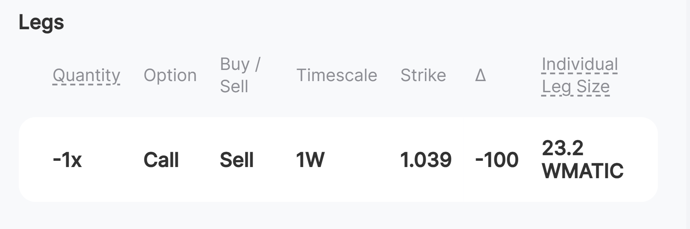
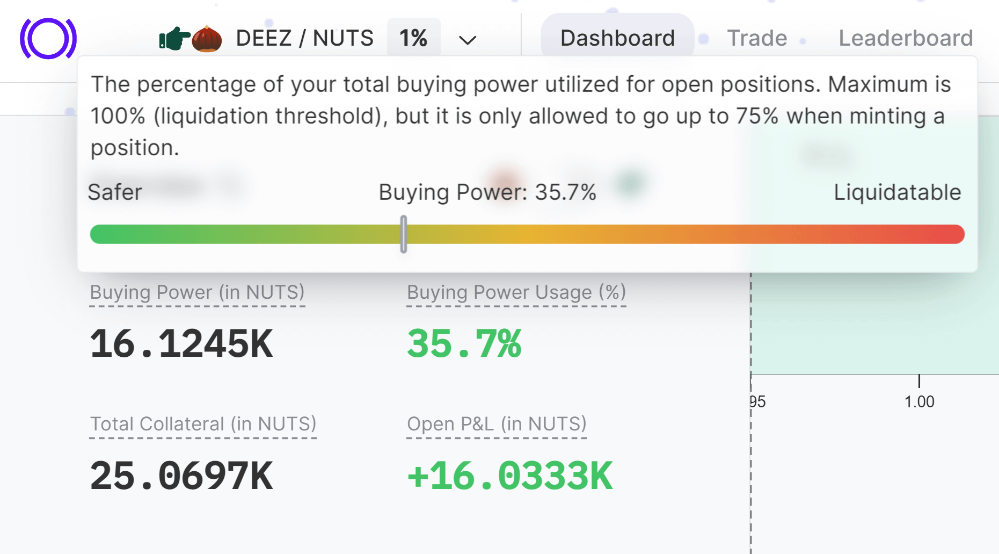

Congratulations on opening your first position on Panoptic! The next step is to effectively manage your positions to enhance returns and mitigate risks. This article will delve into essential concepts you need to grasp for managing open positions, ensuring you're well-equipped for what comes next.

## Positions Overview

Let’s begin by examining a position. After connecting your wallet, head to the ‘Dashboard’ page where you will see an overview of any open positions you have.

###  Position Card

For each open position, a position card will display metrics that provide an overview of your position. You can toggle between the grid or list display of positions by clicking the button next to “Positions”.

Here are the metrics that are shown in the position card:

-   **Current price**: The price of the underlying asset
    
-   **Price at mint**: The price of the underlying asset when the position was created
    
-   **Accumulated premia**: The amount of premia you have earned (if positive) or owed (if negative) so far. Panoptic uses a continuous pricing model called [streamia](/docs/product/streamia) where buyers pay sellers over time on a block-by-block basis.
    
-   **Position requirement**: The minimum amount of collateral [required](/docs/product/collateral-and-buying-power) to cover the position
    
-   **Timestamp**: Represents the time when the position was opened.
    
-   **Block number**: The block at which the position was opened.
    
-   **Transaction hash**: The unique identifier of the transaction when the position was created. This is like an on-chain receipt that curious users can copy and paste into a block explorer to view more details.
    

  

Note that you can close any open position by clicking on the ‘Close’ button in the bottom right corner of the position card.

  

  

## Position Details

If you are looking for more details about your position, click on the position card corresponding to the position. On the position details page, you will see additional details about the profitability of that position.

  

  
  

-   **Profit and Loss**: The amount of profit (or loss) your position made as a percent of the position requirement.
    
-   **Position requirement**: The minimum amount of collateral required to cover the position.
    
-   **Number of Contracts**: Determines the size of the overall position. Specifically, the number of contracts multiplied by the leg quantity determines the individual leg size. The sum of the size of all legs determines the size of the overall position.
    

  

Switching to the ‘Premia’ tab on the position details page will reveal more information about the cost or earnings of the position.

  

-   **Total Premia**: The amount of premia accumulated by the position. Positive numbers indicate premia earned for selling options, while negative numbers indicate premia owed for buying options. Since premia is accrued in two different tokens, the breakdown of premia by each token is also shown.
    

-   **Range**: The lower and upper price of the underlying asset where the position is considered in range and accumulates streamia. Purchased options that are in range owe streamia, and sold options that are in range earn streamia. Options that are out of range do not accumulate streamia. Clicking on the leg card will display the lower and upper price range within which that leg earns streamia, as shown in the example above. Here, the put option accumulates streamia as long as the price remains between 1943.069 and 1982.32.
    
-   **Spread Multiplier (ν)**: The [spread](/docs/product/spread) is a dynamic adjustment mechanism that reflects contract popularity and implied volatility, increasing the cost of an option by up to 3.25x. In the example below, the put option is currently accumulating 1.1x the Uniswap fees in streamia.
    

### Leg Details

The position details page also contains information about the position’s [legs](/docs/product/option-legs).

  

-   **Quantity**: Determines the exposure level of a leg within a position, functioning as a size multiplier. Specifically, it adjusts the leg's size by multiplying the quantity by the number of contracts in the position. A positive quantity signifies a purchased leg and a negative quantity signifies a sold leg.
    -   +2x = the size of this purchased leg is twice the position’s number of contracts. 
    -   -1x = the size of this sold leg is the same as the position’s number of contracts .
    

-   **Option**: The type of option, either a call or put.
    
-   **Buy/Sell**: Whether the option was bought (long) or sold (short).
    
-   **Timescale**: The estimated time for which the option will stay in range and accumulat streamia.
    
-   **Strike**: The price at which the option can be exercised.
    
-   **Delta (∆)**: The amount of [directional risk](/docs/product/delta) you are exposed to. A position with zero delta (also called a delta-neutral position) has no exposure to small price movements up and down.
    
-   **Individual Leg Size**: The amount of tokens represented by the leg. This amount is moved to Uniswap for sold legs and is moved from Uniswap for purchased legs.
    

## Strategic Decisions for Closing a Position

Now that we've delved into the specifics of our position, a crucial question arises: how does one decide when to close a position? In Panoptic, options are perpetual, placing the responsibility on the user to determine the optimal time to exit. Here are some key factors traders should consider when making this decision.

### Range

Streamia accumulates only when the position is in range. Consequently, traders should consider closing positions that are not earning enough streamia or are becoming too expensive to hold.

-   **Sold options**: If the option is in range, you may want to keep the position open to continue earning streamia. Consider closing the position when it is out of range, since you are no longer earning additional streamia.
    
-   **Purchased options**: If the option is in range, the position will owe additional streamia the longer you hold it. If the position has accumulated too much streamia, you may want to consider closing the position to stop your losses. When the position is out of range, you may want to keep the position open since it costs nothing in terms of additional streamia owed.
    

### Avoiding Liquidations

When a trader takes on too many losses, their account becomes liquidatable. In order to avoid liquidation, you should closely monitor your buying power usage.

  

A high buying power usage puts your account at risk of becoming liquidated. The closer the account’s buying power usage is to 100%, the more likely the account will become liquidatable. You should closely monitor your buying power usage and reduce high usage by closing positions or depositing more collateral.

### Capturing Profits and Stopping Losses

For many traders, the ultimate goal is to maximize their profits while minimizing their risks. Traders should monitor their positions’ profit and loss (PnL) in order to lock in any gains or cut off any further losses. If you reach your target profit level, you may want to consider closing your position to capture those gains. If you are at a loss, you may want to consider closing your position to prevent any further losses.

## Conclusion

Effectively managing positions in options trading requires a strategic approach. Traders must weigh factors such as the range of their positions, potential for liquidation, and their profit and loss thresholds to make informed decisions about when to close positions or top up collateral. This careful consideration ensures that traders can maximize their returns while minimizing risks.

  

*Join the growing community of Panoptimists and be the first to hear our latest updates by following us on our [social media platforms](https://links.panoptic.xyz/all). To learn more about Panoptic and all things DeFi options, check out our [docs](https://panoptic.xyz/docs/intro) and head to our [website](https://panoptic.xyz/).*
