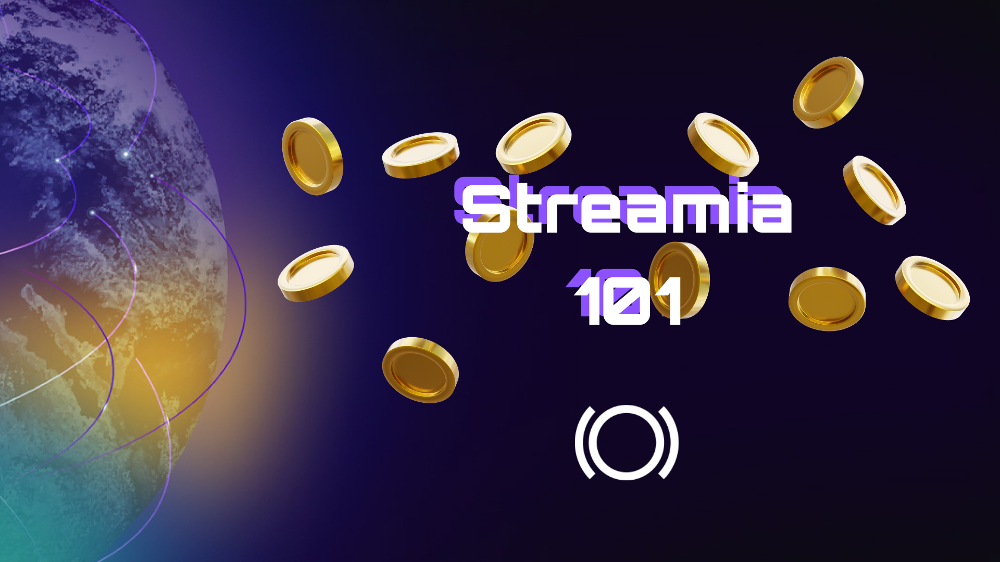
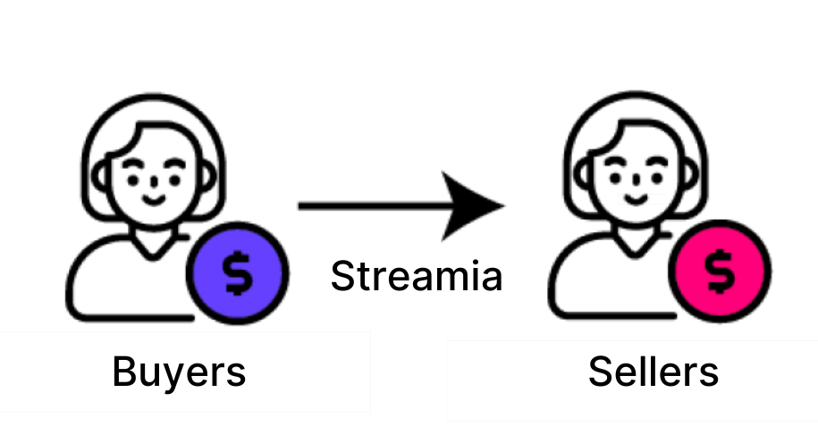
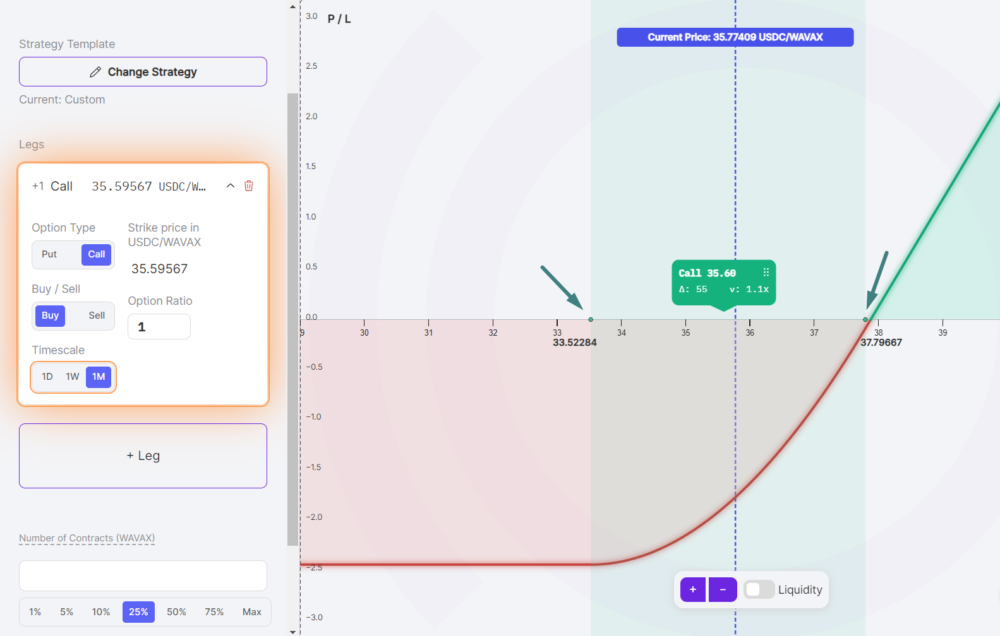

Because perpetual options never expire, it is difficult to assess the fair price upfront of endless exposure to an asset. Panoptic uses the streamia pricing model, based on spot market activity, to accurately price these options.

>### Questions We'll Answer
>
>-   How much does an option cost in Panoptic?
>-   Who earns and who pays streamia?
>-   When does streamia accumulate?
>-   How can I avoid being liquidated?
    

## What is Streamia?

<iframe width="560" height="315" src="https://www.youtube.com/embed/Gfl-_yPGZyU?si=-8ERRxZfmXX3xHF1" title="YouTube video player" frameborder="0" allow="accelerometer; autoplay; clipboard-write; encrypted-media; gyroscope; picture-in-picture; web-share" allowfullscreen></iframe>

  

Streamia, or streaming premia, is a periodic payment between traders to compensate for the risks of sellers. Streamia is similar to the funding rate in perps, where continuous payments are made between long and short traders. With streamia, small payments are made at every block between option buyers and sellers.

  

A simple way to conceptualize the streamia for perpetual options is to think of a continuous series of options that expire over a short period of time with the total premia gradually accumulating each time the option is rolled.

  

## How is the Streamia Determined?

The price of a perpetual option, or streamia, is calculated by the Panoptic smart contracts at each block. The value of the perpetual option depends on the underlying automated market maker (AMM) pool fees and the option contract.

  

### Underlying AMM pool

Every Panoptic options pool has a corresponding AMM pool. For example, the ETH-USDC-5bps Panoptic pool might use the ETH-USDC-5bps Uniswap V3 pool as its underlying AMM pool. The AMM pool enables spot trading between ERC-20 tokens, and charges a swap fee for the benefit of always-ready liquidity. The fees generated from the liquidity determine the base amount of streamia of an option.

### Option Contract

The option contract is defined by several characteristics:

1.  Strike price
    
2.  Timescale – 1D, 1W, or 1M
    
3.  Option type – put or call
    

  

Each option contract is uniquely defined by the three components above. For example, a 2000 1D ETH put differs from a 2100 1W ETH call. The proportion of available options liquidity in Panoptic determines the spread multiplier on the base amount of streamia buyers must pay to purchase the option.

  

For example, a 2000 1D ETH put might owe a base amount of $1 in Uniswap fees. If the option is in high demand, there may be an additional $0.50 of streamia owed (i.e. a 1.5x multiplier).

  

In summary, the streamia is assessed at each block, and is calculated as the Uniswap fees generated by the option contract’s corresponding LP token, which is then multiplied by a spread factor that is determined by the popularity of that option contract.

  

## Buyers Pay Sellers

Streamia is the perpetual options payment flow between buyers and sellers. Option buyers pay streamia, while option sellers receive streamia. Similar to how a positive funding rate in perps means longs pay shorts, the streamia in perpetual options means buyers pay sellers.

  

Streamia can take on negative or positive values, depending on whether the perpetual option position is long or short:

- A buyer goes long on an option, and consequently accrues negative streamia. Buyers have negative streamia because it is the amount owed to sellers for the privilege of purchasing the option.
- A seller goes short on an option, and consequently accrues positive streamia. Sellers have positive streamia because it is the amount earned for the risk of selling the option.

  

Traders who create [multi-legged](/docs/product/option-legs) positions consisting of both long and short legs may accrue negative or positive streamia. The long legs of the position accrue negative streamia, while the short legs accrue positive streamia. The net accumulation can be calculated by summing up the streamia accrued on each leg of the position. This net streamia may be either positive or negative.

  

## In-Range Options Accumulate Streamia

When a perpetual option is in range, the position will accumulate streamia. An option is in range when the price of the underlying asset is in between the lower and upper price range, as indicated by the dots in the graphic below. As long as the spot price moves within the option’s range, the option will accumulate streamia. For buyers, an in-range option will accrue costs. For sellers, an in-range option will earn streamia.

  

  

When a perpetual option is out of range, the position will stop accumulating streamia. An option is out of range when the spot price is below the lower price or above the upper price, as indicated in the graphic above. As long as the spot price stays out of the option’s range, the option will not accumulate additional streamia. For buyers, an out-of-range option is like a free option. For sellers, an out-of-range option does not earn additional streamia.

## Streamia-Induced Liquidation

Streamia accumulation can cause an account to become liquidatable. Recall that buying an option or creating multi-leg positions with long legs accrue negative streamia. Negative streamia increases the [collateral requirement](/docs/product/collateral-and-buying-power) of the position because negative streamia is streamia owed by the buyer.

  

While streamia accumulation typically occurs gradually, certain positions and market conditions can accelerate the rate of streamia accumulation and hence the risk of liquidation.

  

### Short Timescale Positions

Options with short timescales (e.g. 1H or 1D) accumulate streamia faster than positions with longer timescales (e.g. 1W or 1M). This is because a shorter timescale corresponds to a narrower-range LP position in Uniswap, which magnifies the streamia owed by the buyer.

  

### Popular Options Contracts

When option buying exceeds selling, streamia accumulation is magnified. Buying options at a popular strike price can result in a higher spread multiplier, which rapidly increases the amount of streamia owed. For example, a popular option contract with few sellers might yield a 3x spread multiplier, resulting in buyers owing three times the Uniswap fees.

  

High spread multipliers also occur in illiquid options contracts. If there are not a lot of sellers for a contract, the spread multiplier associated with the contract will be relatively high.

### Illiquid Spot Markets

Options on assets with low liquidity in Uniswap accumulate streamia faster than options on assets with liquid spot markets. This is because low liquidity Uniswap pools are at risk of sudden and large price changes, which can correspond to rapid streamia accumulation.

  

## Conclusion

Streamia is part and parcel to perpetual options, and understanding how options are priced is essential to trading smart on Panoptic.

*Join the growing community of Panoptimists and be the first to hear our latest updates by following us on our [social media platforms](https://links.panoptic.xyz/all). To learn more about Panoptic and all things DeFi options, check out our [docs](https://panoptic.xyz/docs/intro) and head to our [website](https://panoptic.xyz/).*
