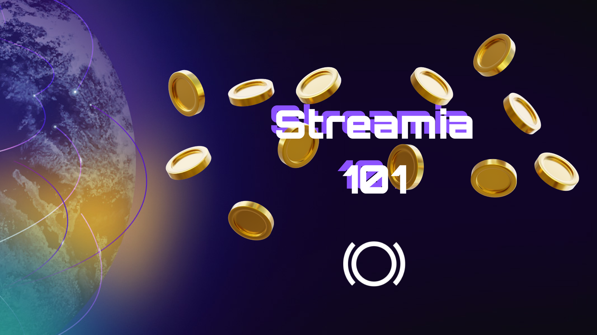
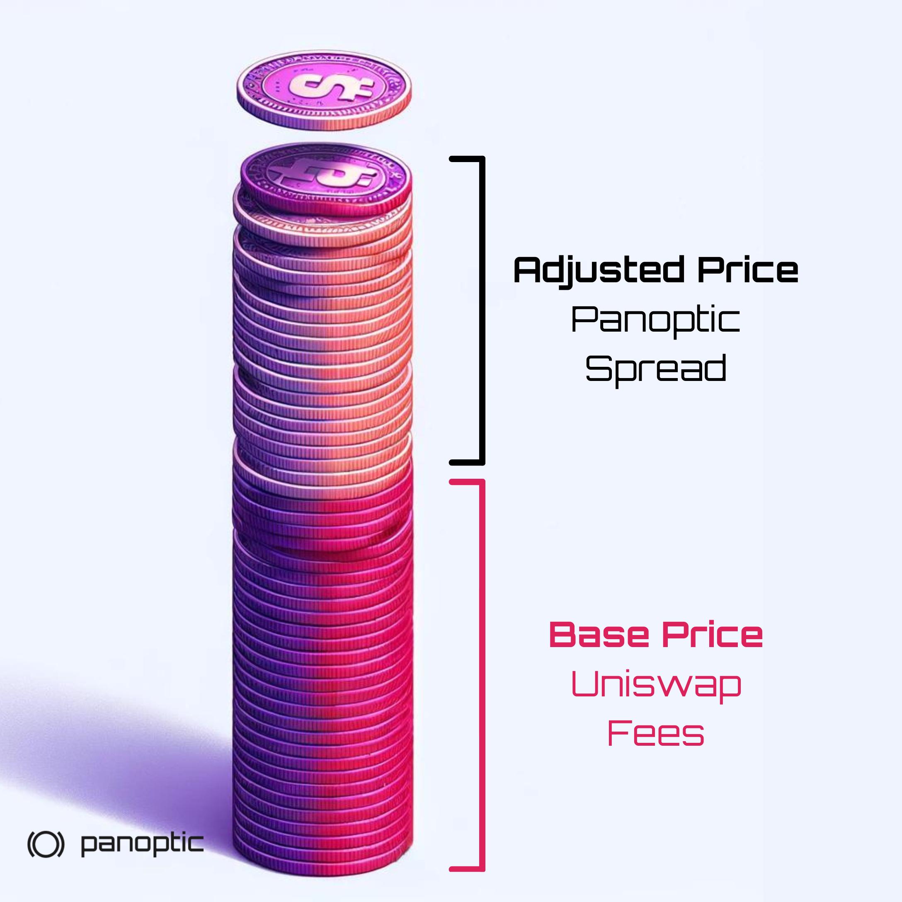
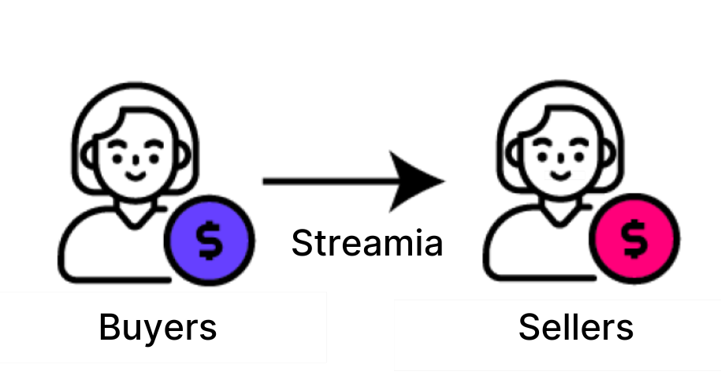
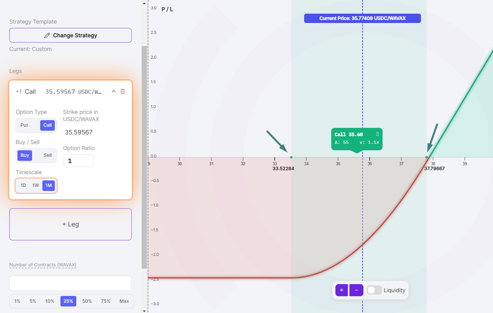
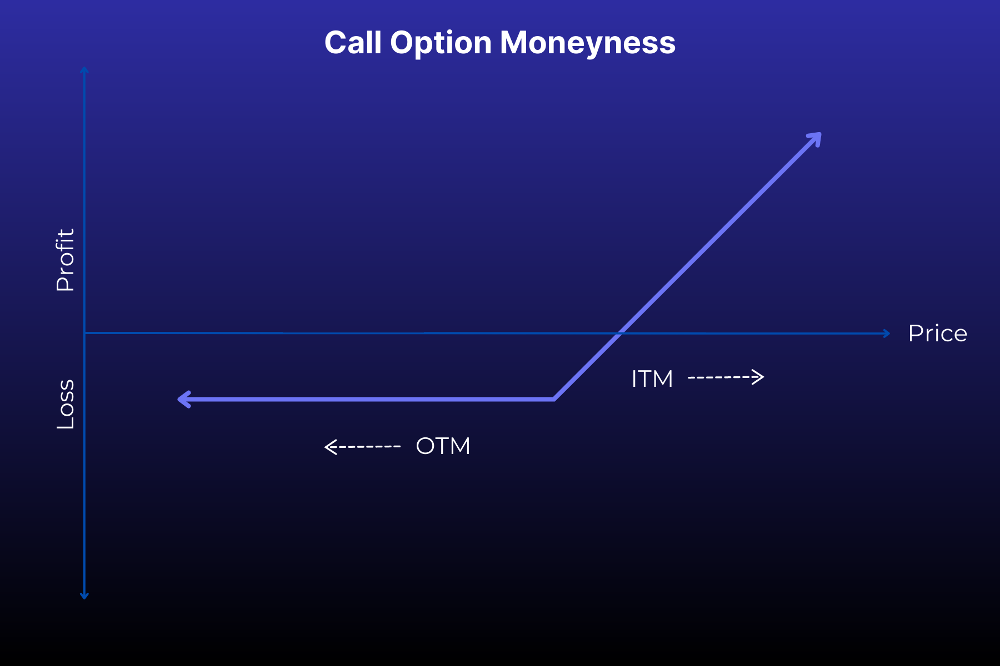
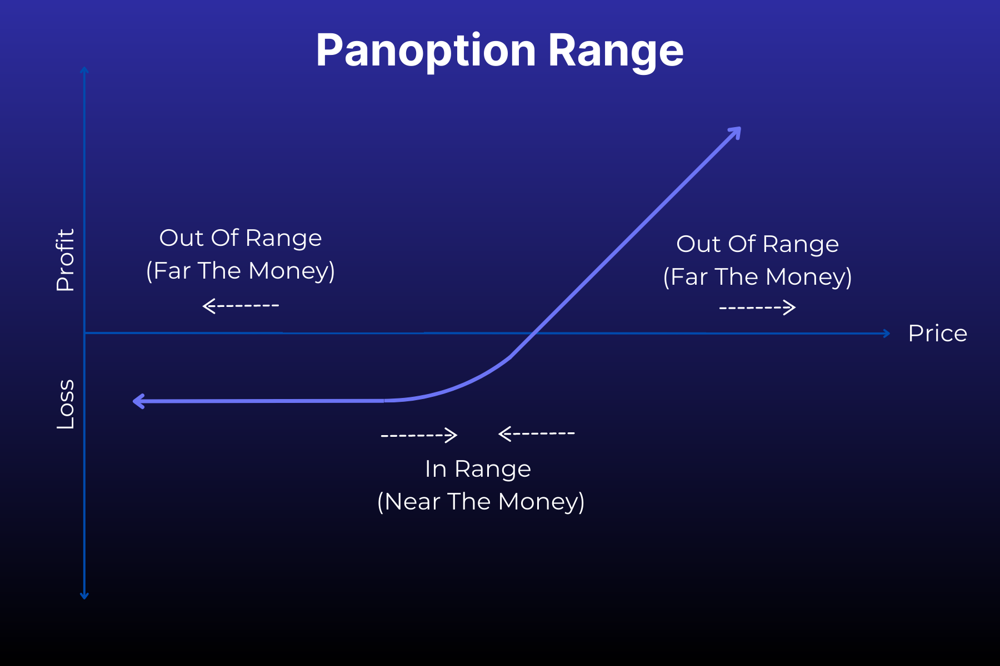
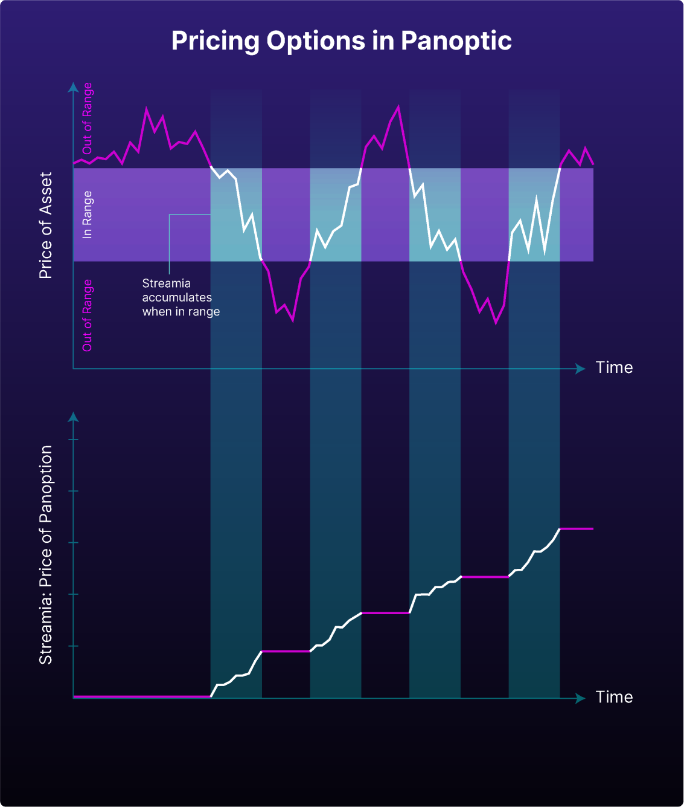
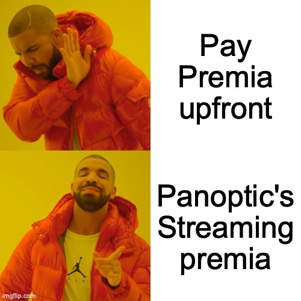

## What is Streamia?

Streamia is a continuous payment from option buyers
to option sellers that compensates sellers for the risk they take on. It
replaces the upfront premium of traditional options: instead of paying once
at purchase, a buyer's streamia accrues every block, based on the Uniswap
fees earned in the option's price range, and is settled when [the position
is closed or its accrued streamia is explicitly settled](/docs/panoptic-protocol/V2/settlement-flows).

Streamia works like the funding rate in perpetual futures, with one
difference: funding can flow either way, while streamia always flows from
buyers to sellers.

<iframe loading="lazy" width="560" height="315" src="https://www.youtube.com/embed/Gfl-_yPGZyU" title="What is streamia?" frameborder="0" allow="accelerometer; autoplay; clipboard-write; encrypted-media; gyroscope; picture-in-picture; web-share" allowfullscreen></iframe>

Because perpetual options never expire, it is difficult to assess the fair price upfront of endless exposure to an asset. Panoptic uses the streamia (streaming premium) pricing model, based on spot market activity, to accurately price these options.

>### Questions We'll Answer
>
>-   How much does an option cost in Panoptic?
>-   Who earns and who pays streamia?
>-   When does streamia accumulate?
>-   How can I avoid being liquidated?

## Who pays streamia: buyers or sellers?

Buyers pay streamia and sellers earn it. An option buyer accrues streamia owed for as long as the option is in range, and an option seller accrues the same streamia as income. In a multi-leg position, long legs pay and short legs earn, so the net streamia can be either paid or earned. Out-of-range options accrue nothing.

## Streamia vs funding rate

Streamia replaces an upfront option premium with ongoing payments. Perp funding is a separate mechanism: a periodic transfer between long and short positions that keeps the futures price near spot, and it can flow from longs to shorts or the reverse. Streamia prices an option, always flows from buyers to sellers, accrues every block instead of every few hours, and is driven by Uniswap fees rather than a futures–spot gap.

## How is streamia calculated?

Each block, Panoptic measures the Uniswap swap fees earned by the liquidity in the option's price range. That base amount is multiplied by a spread factor that rises with the ratio of liquidity removed by buyers to liquidity remaining in each chunk. Narrower ranges can make streamia accrue faster when price stays inside them, and low-liquidity pools can when price moves through the range more often. A popular strike raises the spread only when buying there increases the removed-to-remaining ratio. See [How is the Streamia Determined?](#how-is-the-streamia-determined) for details.

## Streamia vs Black-Scholes premium

The [pricing-model comparison](/research/perpetual-option-pricing-model-comparison) reports that Monte Carlo simulations under diffusive price paths show total streamia converging to the Black-Scholes price of the equivalent option on average, with wide variation across individual paths. It does not publish its simulation parameters or numerical results. The difference is timing: a Black-Scholes premium is paid upfront and fixed, while streamia is paid over time and depends on how long price stays in range.

A simple way to think about it: a perpetual option behaves like a series of
very short-dated options that are rolled continuously. Each roll costs a
small premium, and streamia is the running total of those costs.

## How is the Streamia Determined?

The price of a perpetual option, or streamia, is calculated by the Panoptic smart contracts at each block. The value of the perpetual option depends on the underlying automated market maker (AMM) pool fees and the option contract.

  

### Underlying AMM pool

Every Panoptic options pool has a corresponding AMM pool. For example, the ETH-USDC-5bps Panoptic pool might use the ETH-USDC-5bps Uniswap V3 pool as its underlying AMM pool. The AMM pool enables spot trading between ERC-20 tokens, and charges a swap fee for the benefit of always-ready liquidity. The fees generated from the liquidity determine the base amount of streamia of an option.

### Option Contract

The option contract is defined by several characteristics:

1.  Strike price
    
2.  Timescale – 1D, 1W, or 1M
    
3.  Option type – put or call
    

  

Each option contract is uniquely defined by the three components above. For example, a 2000 1D ETH put differs from a 2100 1W ETH call. The proportion of available options liquidity in Panoptic determines the spread multiplier on the base amount of streamia buyers must pay to purchase the option.

  

For example, a 2000 1D ETH put might owe a base amount of $1 in Uniswap fees. If the option is in high demand, there may be an additional $0.50 of streamia owed (i.e. a 1.5x multiplier).

  

In summary, the streamia is assessed at each block, and is calculated as the Uniswap fees generated by the option contract’s corresponding LP token, which is then multiplied by a spread factor that is determined by the popularity of that option contract.

  

## Buyers Pay Sellers

Streamia is the perpetual options payment flow between buyers and sellers. Option buyers pay streamia, while option sellers receive streamia. Similar to how a positive funding rate in perps means longs pay shorts, the streamia in perpetual options means buyers pay sellers.

  

Streamia can take on negative or positive values, depending on whether the perpetual option position is long or short:

- A buyer goes long on an option, and consequently accrues negative streamia. Buyers have negative streamia because it is the amount owed to sellers for the privilege of purchasing the option.
- A seller goes short on an option, and consequently accrues positive streamia. Sellers have positive streamia because it is the amount earned for the risk of selling the option.

  

Traders who create [multi-legged](/docs/product/option-legs) positions consisting of both long and short legs may accrue negative or positive streamia. The long legs of the position accrue negative streamia, while the short legs accrue positive streamia. The net accumulation can be calculated by summing up the streamia accrued on each leg of the position. This net streamia may be either positive or negative.

  

## In-Range Options Accumulate Streamia

When a perpetual option is in range, the position will accumulate streamia. An option is in range when the price of the underlying asset is in between the lower and upper price range, as indicated by the dots in the graphic below. As long as the spot price moves within the option’s range, the option will accumulate streamia. For buyers, an in-range option will accrue costs. For sellers, an in-range option will earn streamia.

  

  

When a perpetual option is out of range, the position will stop accumulating streamia. An option is out of range when the spot price is below the lower price or above the upper price, as indicated in the graphic above. As long as the spot price stays out of the option’s range, the option will not accumulate additional streamia. For buyers, an out-of-range option is like a free option. For sellers, an out-of-range option does not earn additional streamia.

## Streamia-Induced Liquidation

Streamia accumulation can cause an account to become liquidatable. Recall that buying an option or creating multi-leg positions with long legs accrue negative streamia. Negative streamia increases the [collateral requirement](/docs/product/collateral-and-buying-power) of the position because negative streamia is streamia owed by the buyer.

  

While streamia accumulation typically occurs gradually, certain positions and market conditions can accelerate the rate of streamia accumulation and hence the risk of liquidation.

  

### Short Timescale Positions

Options with short timescales (e.g. 1H or 1D) accumulate streamia faster than positions with longer timescales (e.g. 1W or 1M). This is because a shorter timescale corresponds to a narrower-range LP position in Uniswap, which magnifies the streamia owed by the buyer.

  

### Popular Options Contracts

When option buying exceeds selling, streamia accumulation is magnified. Buying options at a popular strike price can result in a higher spread multiplier, which rapidly increases the amount of streamia owed. For example, a popular option contract with few sellers might yield a 3x spread multiplier, resulting in buyers owing three times the Uniswap fees.

  

High spread multipliers also occur in illiquid options contracts. If there are not a lot of sellers for a contract, the spread multiplier associated with the contract will be relatively high.

### Illiquid Spot Markets

Options on assets with low liquidity in Uniswap accumulate streamia faster than options on assets with liquid spot markets. This is because low liquidity Uniswap pools are at risk of sudden and large price changes, which can correspond to rapid streamia accumulation.

  

## Conclusion

Streamia is part and parcel to perpetual options, and understanding how options are priced is essential to trading smart on Panoptic.

## Rangeness vs. Moneyness

Traditional option premiums are paid upfront. Moneyness compares spot with strike: a call is in the money above its strike and a put is in the money below it. A premium can include both intrinsic value and time value; paying a premium does not guarantee a profitable exercise.

Streamia instead depends on **rangeness**: whether spot is between the option’s lower and upper bounds. A position may be in or out of the money while still in range. “Near the money” and “far from the money” describe proximity to the strike, rather than whether exercising is profitable. See the [near-the-money definition](https://www.investopedia.com/terms/n/near-the-money.asp) and [delta and moneyness discussion](/research/defi-option-strangle-straddle#delta-as-the-probability-of-being-itm).

One intuition is a sequence of short-lived options whose premiums accumulate as they are [rolled](https://www.tastylive.com/definitions/rolling-options). This is a pricing analogy, not an expiry date for a Panoption. The [whitepaper](https://paper.panoptic.xyz) explains the relationship to Black–Scholes pricing under its modeling assumptions.

## Streamia Accumulation Example

On Panoptic, say a seller creates a put Panoption on the USDC/ETH pair. The current market price of ETH is 1800 USDC, and the strike price of the Panoption is 2000 USDC with a [width of 10%](https://panoptic.xyz/research/uniswap-lp-calculate-price-range). That means the upper bound of the range is $2200 and the lower bound of the range $1818.

To create the put option, the seller can either borrow liquidity from the Panoptic pools provided by Panoptic liquidity providers (PLPs) or use their own funds to deposit the token pair in the corresponding Uniswap v3 pool.

When a trader buys this put option, the funds for the option are moved from Uniswap to the corresponding Panoptic pool. The upfront cost to the buyer is zero dollars and the streamia will not start to accumulate until the Panoption is IR.

If the price of ETH never exceeds $1818 (the lower bound of the put option) while the buyer holds the contract, no streamia will accumulate because the Panoption is OOR.

If the price of ETH rises above $1818 (the lower bound) and remains below $2200 (the upper bound), then streamia will accumulate because the Panoption is IR. Learn more about the exact formula [here](https://panoptic.xyz/docs/panoptic-protocol/streamia).

If the price of ETH skyrockets past $2200 (the upper bound of the put option), putting this put option out of the money, then no streamia will accumulate because the option is no longer IR.

Please note that the streamia is a fee paid by buyers to sellers. There are other fees associated with trading options on Panoptic outside of streamia which you can read more about [here](https://panoptic.xyz/docs/faq/#fees).

The zero upfront **streamia** in this example does not mean zero collateral, commission, borrowing costs or gas. For accounting formulas, see [streamia fee accumulators](/docs/panoptic-protocol/streamia). For model assumptions and tradeoffs, see [streamia versus Black–Scholes](/blog/black-scholes-streamia-defi-options-pricing-models).

## Why Streamia?

Streamia lets a perpetual option be priced as exposure is held, without selecting a contractual expiry or repeatedly rolling an expiring contract. Pricing follows the underlying AMM’s activity rather than an external option-price feed. The gradual payment model removes an upfront option premium, but accrued costs can still consume collateral and trigger liquidation; rapid accrual is possible in the conditions described above.

