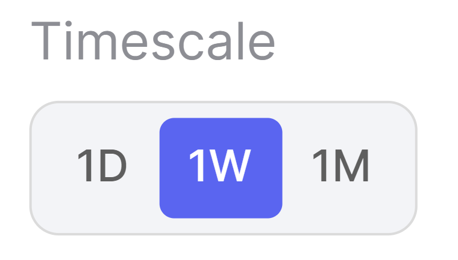
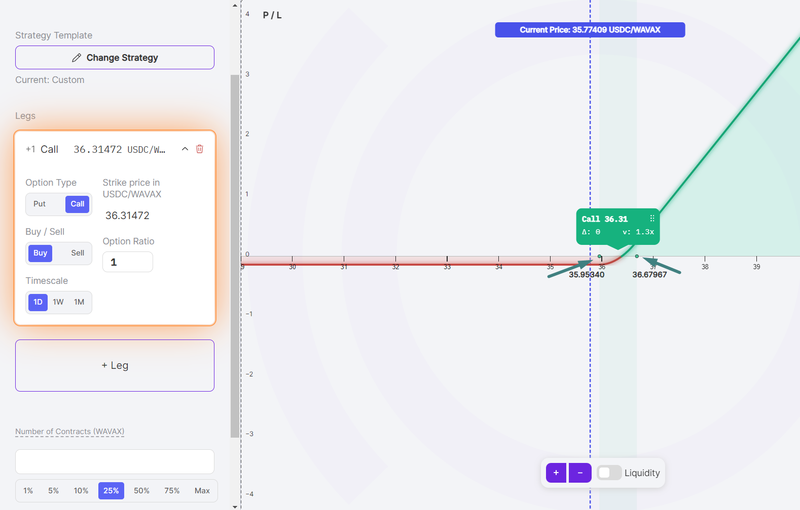
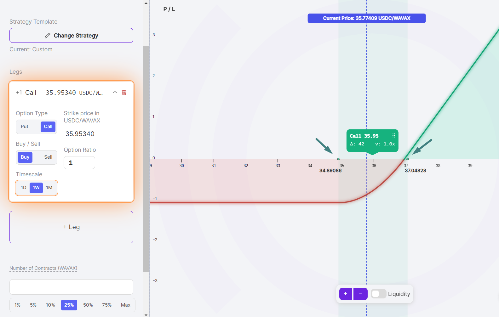
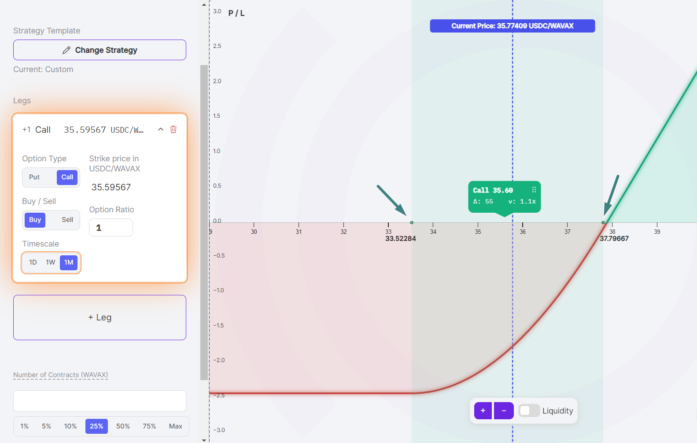
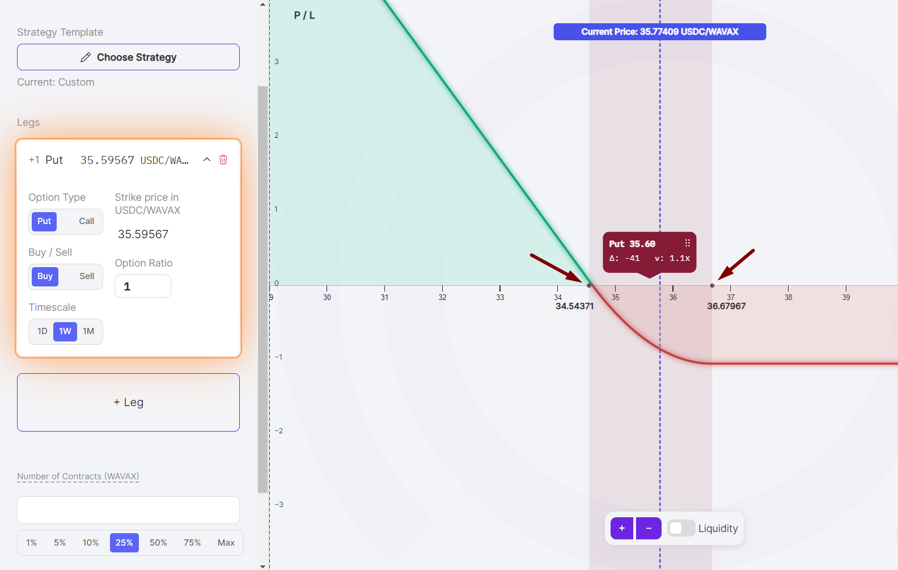
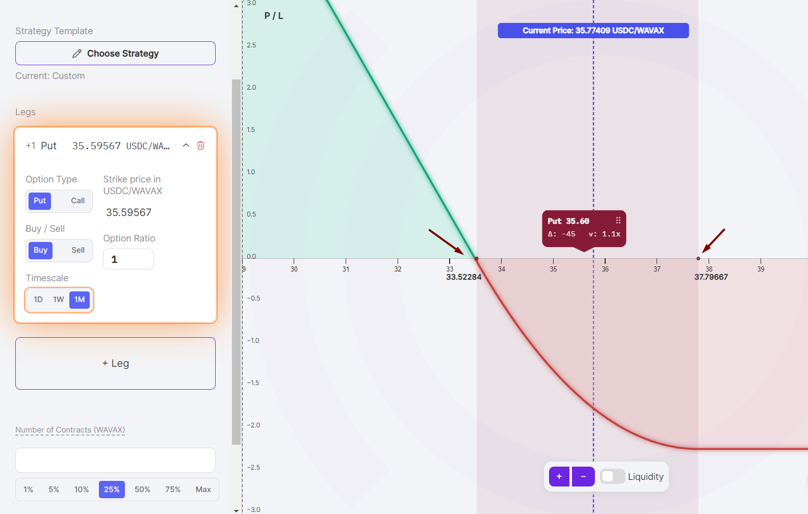

<iframe
  src="https://www.youtube.com/embed/MlgZTeF8uLU?si=dneBt3gCvtmugi2z"
  title="YouTube video player"
  style={{
    width: '100%',
    height: 'auto',
    aspectRatio: '16/9',
    border: 'none',
  }}
  frameborder="0"
  allow="accelerometer; autoplay; clipboard-write; encrypted-media; gyroscope; picture-in-picture; web-share"
  referrerpolicy="strict-origin-when-cross-origin"
  allowfullscreen>
</iframe>

Perpetual options, unlike traditional options, do not have expiry dates but operate with a unique characteristic known as timescales. This guide will explore how timescales function on Panoptic's trading platform.

>### Questions We'll Answer
>
>-   What are timescales?
>-   How do timescales differ from expiries?
>-   How does pricing differ across timescales?
>-   What are the trade-offs of choosing a shorter or longer timescale?
    

## Perpetual Option Timescales

The timescale of a perpetual option represents the estimated duration over which the option is likely to accrue [premia](/docs/product/streamia). This concept is similar to the width of a LP position in Uniswap V3, where the LP position aims to earn fees over a certain period.

### Common Misconceptions of Timescales

The timescale is not an actual expiry date, nor does it indicate how often the option is rolled. Unlike traditional options, perpetual options do not expire but are continuously rolled every block, allowing them to accumulate streaming premia (streamia). Perpetual options behave like Uniswap LP positions – even if the price moves out of range, you can still expect to earn fees if the price returns within range.

This introduces new opportunities for traders, such as perpetual [calendar spreads](https://panoptic.xyz/research/essential-options-strategies-to-know#call-calendar-spread-).

### Panoptic's Timescales Explained

Panoptic offers options with varying timescales:

Pick a [timescale](/docs/product/timescales) that fits your expected duration in range:
- `1H` (One Hour) ≈ ±1% wide LP price range
- `1D` (One Day) ≈ ±%4 wide LP price range
- `1W` (One Week) ≈ ±13% wide LP price range
- `1M` (One Month) ≈ ±27% wide LP price range
- `1Y` (One Year) ≈ ±112% wide LP price range
  
Each timescale indicates a different width of the option, influencing the price range in which the option can accumulate streamia. For instance, longer timescales offer a broader price range, potentially increasing the duration streamia is accumulated but might result in lower fee accrual per unit of time.

The timescale corresponds to the underlying LP position in Uniswap, where the timescale is the estimated amount of the time that an LP position will stay "in range", assuming 50% volatility. The mathematical formula for the estimated timescale can be found [here](/research/zero-dte-defi-options).

Below are some examples of varying timescales for AVAX calls.

A one-day call option on AVAX, which earns streamia between $35.95 and $36.68:

A one-week call option on AVAX, which earns streamia between $34.89 and $37.05:

A one-month call option on AVAX, which earns streamia between $33.52 and $37.80:

Notice that as the timescale increases in duration, the price range of the option widens. It's important to remember that the timescale is an estimate, not a guarantee, of the duration over which the option will earn streamia.

## Determining Pricing

The price, or streamia, of a perpetual option depends on its timescale. Here are some examples to understand the relationship between pricing and timescale.

The example above shows a one-week timescale. The price range of the AVAX put is between $34.54 and $36.68. This option has a width of $2.14 (2.14 = 36.68 - 34.54). This means that the option will accumulate streamia as long as the AVAX price is between $34.54 and $36.68.

 
Now, let’s look at the same strategy with a one-month timescale:

For this one-month AVAX put option, the price range is between $33.52 and $37.80, giving this option a width of $4.28 – twice as wide as the observed one-week timescale option.

Streamia is accumulated when in range. The longer the timescale, the wider the range, and hence the longer one might expect to earn streamia.

 | Timescale | Range                        | Streamia                        |
|-----------|------------------------------|---------------------------------|
| 1D        | Less likely to stay in range | More premia earned while in range |
| 1W        | Average                      | Average                         |
| 1M        | More likely to stay in range | Less premia earned while in range |
 
*Join the growing community of Panoptimists and be the first to hear our latest updates by following us on our [social media platforms](https://links.panoptic.xyz/all). To learn more about Panoptic and all things DeFi options, check out our [docs](https://panoptic.xyz/docs/intro) and head to our [website](https://panoptic.xyz/).*
