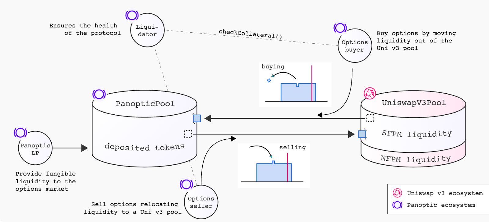
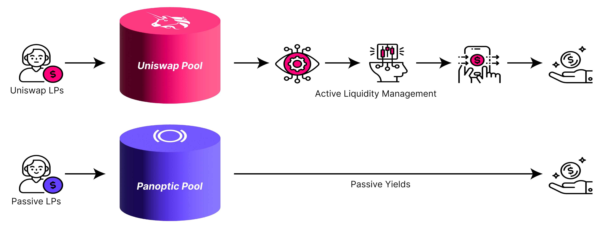
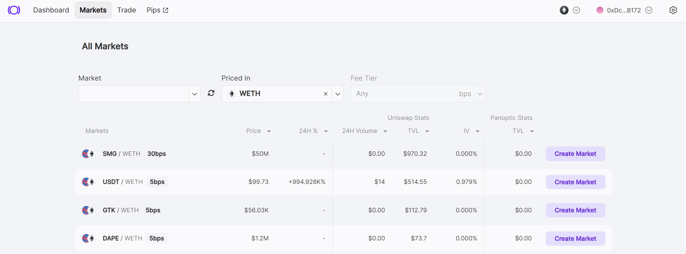
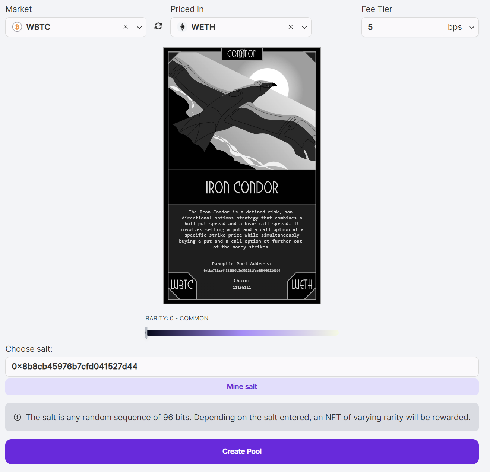
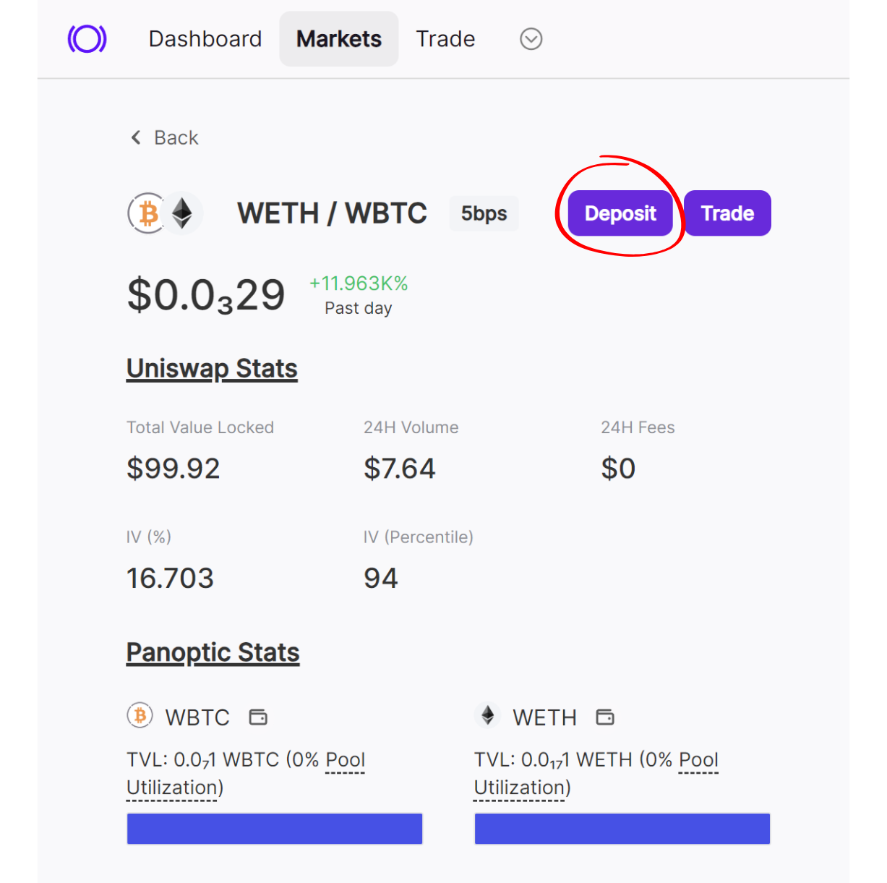
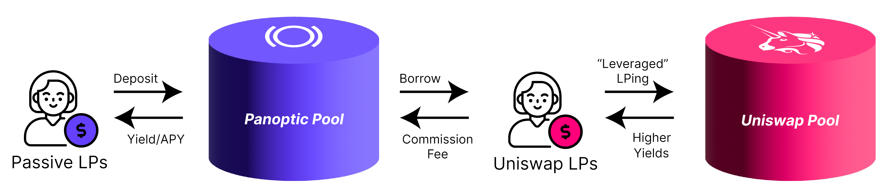
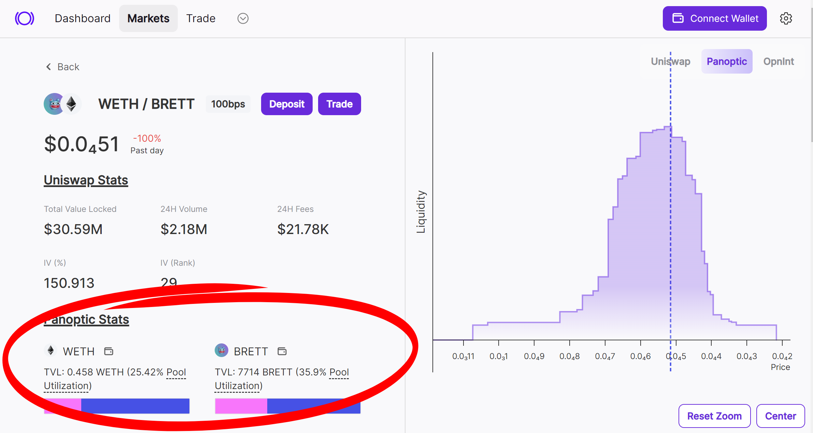

Launching a new token or project? With Panoptic, bootstrapping liquidity is easier than ever. Panoptic’s [passive liquidity provision](/docs/getting-started/passive-lp) allows you to attract and sustain liquidity for your Uniswap pool, ensuring a smooth start for your project.

## Simplifying Liquidity Provision

Providing liquidity on Uniswap v3 often involves active management—selecting price ranges, rebalancing positions, and managing impermanent loss. At Panoptic, we simplify the process by offering a single-sided, passive solution. Token launchers can [lend out their tokens](/blog/bringing-passive-liquidity-to-uniswap) and delegate the complexities of active management to other liquidity providers. This allows for hands-off liquidity bootstrapping without sacrificing capital efficiency.

###   Why Choose Panoptic?
-   **Single-Sided Deposits:** Deposit just your token without needing to pair it with ETH or stablecoins.
-   **Passive Management:** Say goodbye to constant monitoring, complex decisions, and lost earnings from being out of range.
-   **No Impermanent Loss:** By lending your token to other LPs, you avoid [impermanent loss](/blog/turning-impermanent-loss-into-gain) (IL) and [loss-versus-rebalancing](/research/panoptic-solves-lvr#solution-2-lps-can-be-passive-on-panoptic) (LVR).
-   **Automatic Reinvestment:** All earnings are compounded automatically, maximizing your returns.

## Get Started In Three Steps

Ready to bootstrap your token’s liquidity? Visit our [app](https://app.panoptic.xyz) and follow these three simple steps to kickstart your token on Panoptic today.

1.  **Select Your Pool:** Choose the Uniswap pool which you want to provide liquidity to. If the pool doesn’t exist, follow our guide to [create](/docs/product/token-launchers/create-a-market) one.
    
2.  **Create the Lending Pool:** Set up a Panoptic lending pool that corresponds to your chosen Uniswap pool. Learn more in our detailed [guide](/docs/product/token-launchers/create-a-market).
    
3.  **Deposit Tokens:** Provide passive liquidity by depositing your tokens into the Panoptic pool. There are no restrictions on how much you can deposit.
    

For a new market to become tradable on Panoptic, it must fulfill a few basic [criteria](/docs/contracts/pool-criteria), including a minimum level of activity in its corresponding Uniswap pool. Specifically, the Uniswap pool must record either a swap or an LP position update across at least four different blocks. Once this condition is met, the market will become tradable on Panoptic within 10 minutes.

Once set up, your tokens are ready for anyone to borrow and use as liquidity on Uniswap—effortlessly and permissionlessly.

## Earn More With Panoptic

By lending your tokens through Panoptic, you earn two streams of [income](/docs/contracts/parameters#commission_fee):
1.  **LP Commissions**: Receive fees from LPs borrowing your tokens to provide liquidity on Uniswap.
2.  **Options Trading Commissions**: Earn fees from options traders on Panoptic.

All earnings are automatically reinvested, maximizing your yield. Note that you’ll be able to better track your passive LP earnings with the upcoming [gRHO](/blog/panoptic-awarded-uniswap-foundation-grant) interface as well as see APYs for your pool. In the Panoptic trading [app](https://app.panoptic.xyz), you will be able to monitor the pool utilization for each token.

For example, a pool utilization rate of 25% means that 25% of WETH passive liquidity in Panoptic is currently being borrowed and deployed into Uniswap by active LPs.

## Unlock These Benefits for Your Project

By providing liquidity, your deposited tokens serve as collateral for options traders. In return, you receive commissions from trades and yield on your deposited tokens.

-   **Single-Sided Deposits:** Focus on your token without worrying about pairing assets
-   **Separate Liquidity Supply:** Lend your tokens while other participants bring ETH or stablecoins to the pool
-   **Passive Strategy:** No active management or impermanent loss, allowing you to focus on your project
-   **Fair and Transparent:** Fully permissionless and on-chain
-   **Deeper Liquidity:** Attract more participants to strengthen your token’s liquidity
-   **Stable Token Price:** Enhanced liquidity helps stabilize your token’s market value
-   **Community Engagement:** By allowing your community to earn in a simple way, you create stronger bonds and incentivize long-term participation.
-   **Active LP Opportunities:** The option to manage your own liquidity on Uniswap and [earn up to 3x more fees](/blog/uniswap-lps-unlock-3x-more-fees-with-panoptic) with Panoptic
    
With Panoptic, bootstrapping liquidity is easier than ever. Get started by visiting our [app](https://app.panoptic.xyz)!

*Join the growing community of Panoptimists and be the first to hear our latest updates by following us on our [social media platforms](https://links.panoptic.xyz/all). To learn more about Panoptic and all things DeFi options, check out our [docs](https://panoptic.xyz/docs/intro) and head to our [website](https://panoptic.xyz/).*

