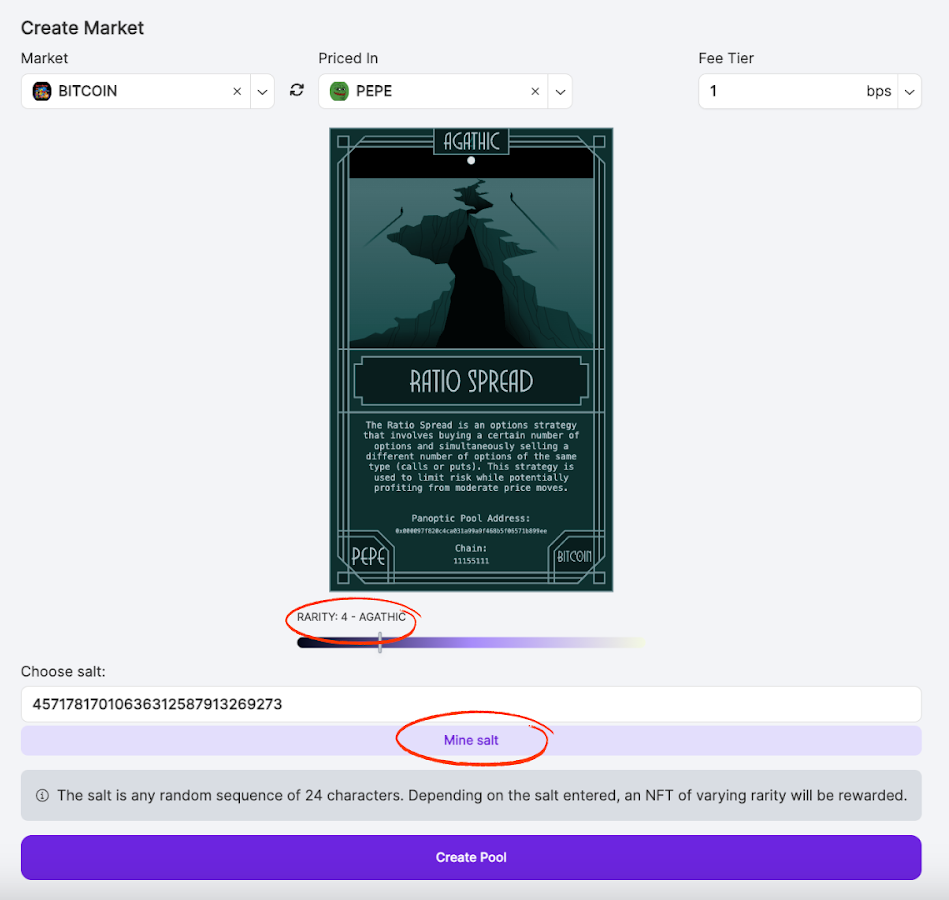

On Panoptic, users can trade options on any token and in any size. If the market you need isn’t listed, you can create your own! This guide will walk you through creating a new market to enable permissionless options trading on any token pair.

## Step-by-Step Guide to Launch A Market on Panoptic
1.  **Choose Your Tokens:** Use the search bar on the Markets Page to find the tokens you want to create a market for and select them.

    
2.  **Pick Your Fee Tier:** Select a fee tier corresponding to the Uniswap pool’s fee tier. Consider the [Uniswap pool’s](https://app.uniswap.org/explore/pools) stability, liquidity, and volume to guide your decision. Use the table below as a general guideline:

    | **Fee Tier** | **Percentage** | **Best For** | 
    |--------------|----------------|-------------------------| 
    | 1 bp | 0.01% | Very stable pairs | 
    | 5 bps | 0.05% | Stable pairs | 
    | 30 bps | 0.3% | Most pairs | 
    | 100 bps | 1% | Exotic pairs |
    
3.  **Create the Uniswap Pool (if needed):** If a corresponding Uniswap pool doesn’t exist, you’ll be prompted to create one. Set the initial price of the Uniswap pool and click “Create Uniswap Pool.”
    
4.  **Mine a Pool Address:** Choose a salt to customize your pool’s address.
    -   What is a salt? A salt is a random value used to generate a unique contract address for your Panoptic pool.
    -   You can either:
        - Input a custom salt.
        - Click ‘mine salt’ to try obtaining a rarer NFT and pool address.
    -   What are leading zeros? Leading zeros are zeros at the beginning of an Ethereum address. The more leading zeros, the rarer the NFT you earn. Example:
        - 0x0000000000000000000000000000000000000001 (39 leading zeros, very rare)
        - 0x1111111111111111111111111111111111111111 (0 leading zeros, common)
        
    Use our [NFT mining guide](/docs/product/token-launchers/nft-mining) for more advanced strategies.
    
5.  **Launch Your Panoptic Pool:** Click “Create Pool” to launch your Panoptic market. Your market will be available for trading on Panoptic within ten minutes after the corresponding Uniswap pool records a swap or LP update across at least four blocks. For a full list of requirements, refer to our [docs](/docs/contracts/pool-criteria).
    

## Earn Rare NFTs When You Launch a Market

As a Panoptic market creator, you’ll earn a unique NFT that represents your pool. The rarity of your NFT depends on the number of leading zeros in your market’s contract address, making it a valuable badge of your contribution to Panoptic.

Here's how it works:
-   When you create a new market (Panoptic pool), you pay the required gas fees.
-   You receive an NFT as a reward.
-   The NFT displays the contract address of the pool you created.
-   The more leading zeros in the address, the rarer the NFT.
    
    

### FAQ

#### Why Do Leading Zeros Matter?

-  **Cumulative Gas Savings**: The Ethereum Virtual Machine (EVM) can compress and process data more efficiently with leading zeros, reducing gas fees for interactions Over time, these small efficiencies can lead to significant savings for users, especially for frequent blockchain interactions.
-  **Vanity**: The addresses look cool and are easier to remember. Also, you’ll get a rarer NFT from Panoptic.

### What Can I Do With My Panoptic NFT?
The Panoptic NFT awarded to market creators are tradable and fully transferable ERC-721s. They symbolize your contribution as the original pool creator. Rarer NFTs reflect the resources spent on mining your pool.

Visit the Panoptic [app](https://app.panoptic.xyz) (coming soon) to create your market, earn rewards, and enable [passive liquidity](/docs/product/token-launchers/bootstrap-liquidity) for your token pair. Take the first step in enabling permissionless options trading today!

*Join the growing community of Panoptimists and be the first to hear our latest updates by following us on our [social media platforms](https://links.panoptic.xyz/all). To learn more about Panoptic and all things DeFi options, check out our [docs](https://panoptic.xyz/docs/intro) and head to our [website](https://panoptic.xyz/).*

