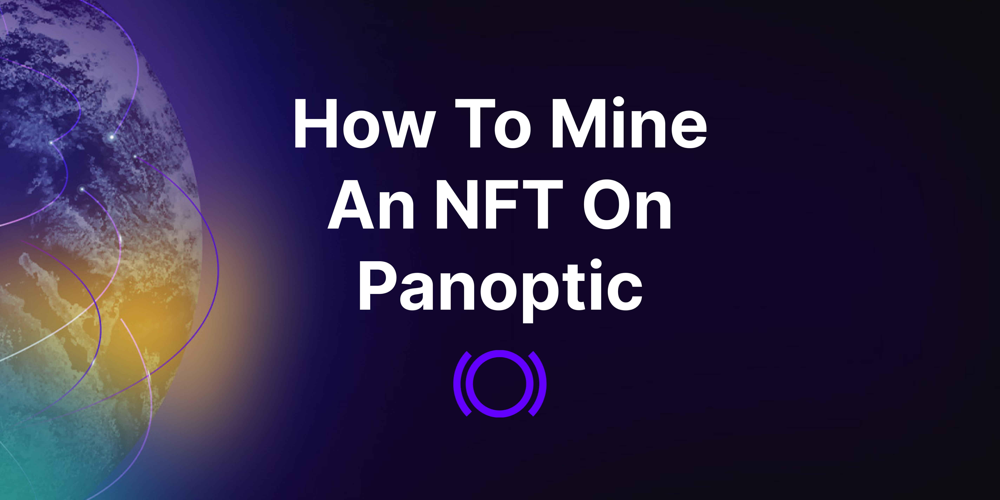
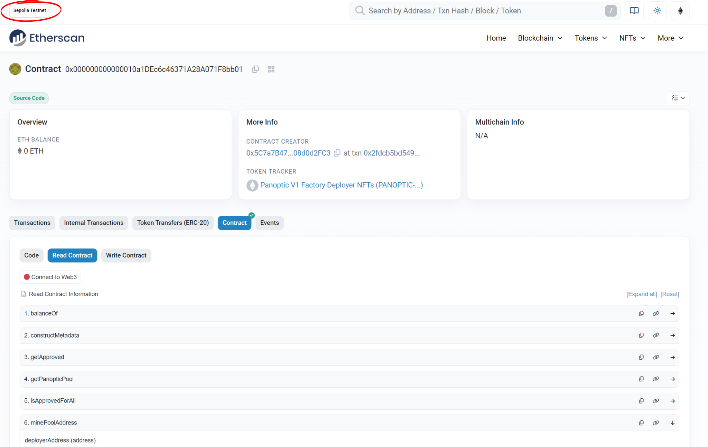
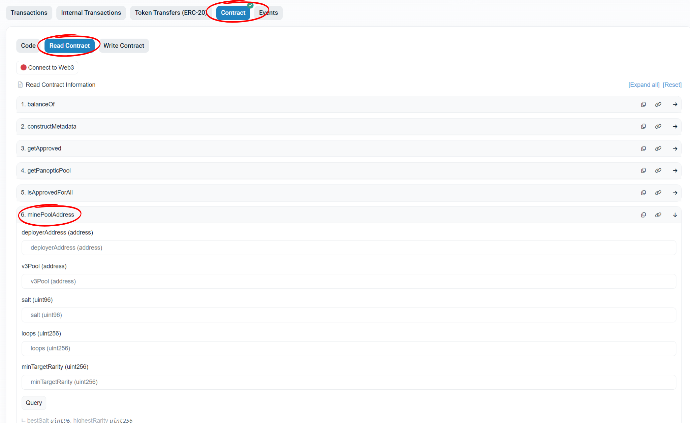
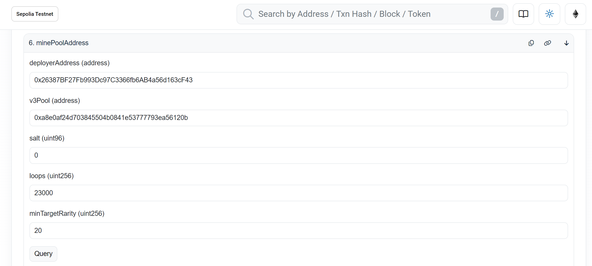
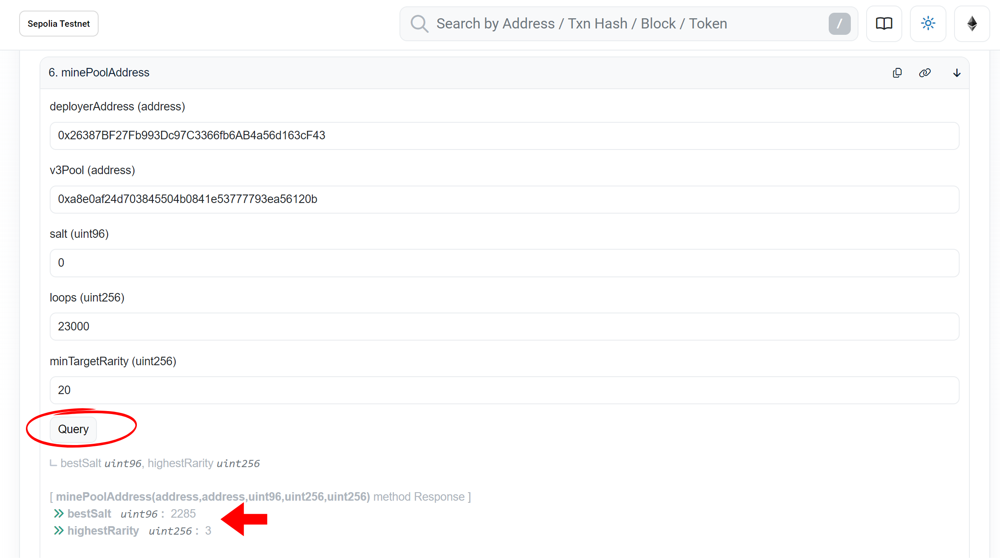
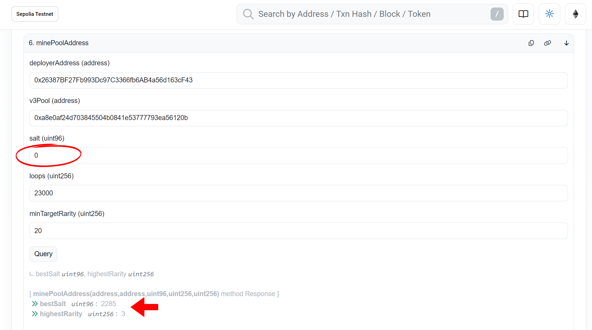
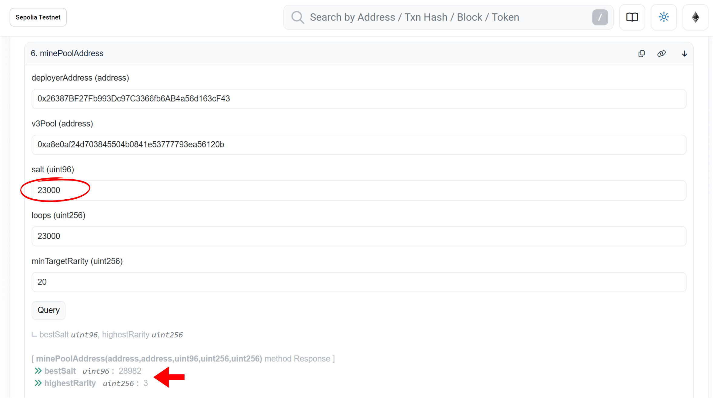
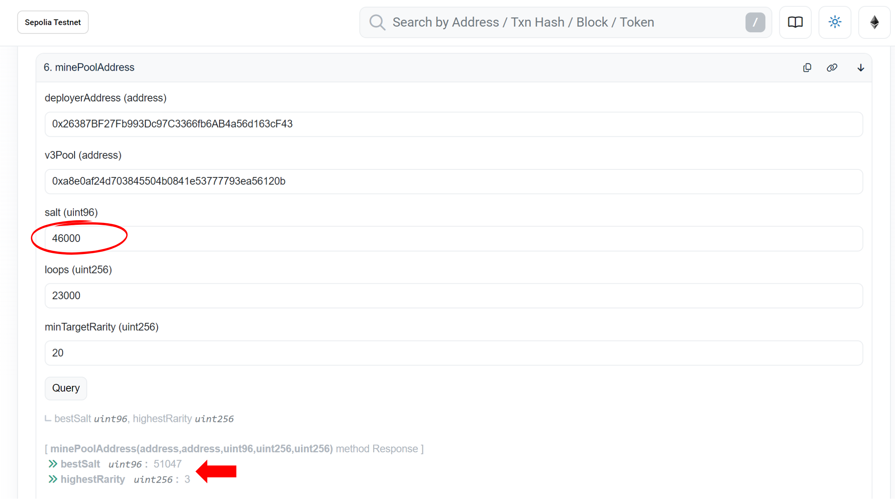
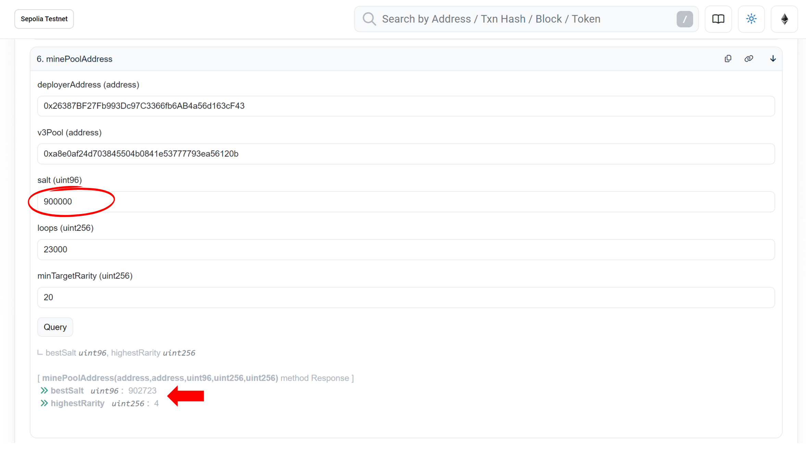

Creating a pool on Panoptic rewards users with NFTs, making it an incentive for token launchers. The rarity of your NFT depends on the number of leading zeros in its contract address.

Follow this step-by-step guide to mine your Panoptic NFT and begin [creating a Panoptic market](/docs/product/token-launchers/create-a-market).

## Step-by-Step Guide to Mining a Pool Address

1.  **Access Etherscan:** Visit Etherscan and select the contract address for the blockchain network where you want to mine the NFT.
	Supported blockchain networks:
	-   [Sepolia testnet](https://sepolia.etherscan.io/address/0x000000000000010a1DEc6c46371A28A071F8bb01#readContract) (example)
	-   Ethereum mainnet (coming soon)
	

2.  **Navigate to the Contract:** On Etherscan, click "Contract" and then "Read Contract". Locate and select the "minePoolAddress" function.
	

3.  **Input Required Parameters:** Fill in the following parameters for mining:
	-   `DeployerAddress`: Your wallet address. This is the address you want to receive the Panoptic NFT and deploy the Panoptic pool.
	-   `v3Pool`: The Uniswap v3 pool address on which you want to deploy the Panoptic pool.
		-  Example: `0xa8e0af24d703845504b0841e53777793ea56120b` ([WETH/USDT](https://www.geckoterminal.com/sepolia-testnet/pools/0xa8e0af24d703845504b0841e53777793ea56120b) 0.05% Uniswap v3 pool on Sepolia).
	-   `Salt`: A random value used to generate a unique contract address for your Panoptic pool. You can start by entering `0`.
	-   `Loops`: Set this to `23,000`. This determines how many iterations will be attempted.
		- If you run into an "out of gas" error, you can reduce this number and try again.
	-   `MinTargetRarity`: Set this to `20`. The miner will stop either when the rarity target is met or when the specified loops are completed.
	

  

4.  **Start Mining:** Click "Query" to initiate the mining process. The system will return two key outputs:
	-   `bestSalt`: The optimal salt value for creating your pool.
	-   `highestRarity`: The rarity level of the NFT you will receive (based on the number of leading zeros in the mined pool address).
    

  

If you’re happy with the rarity level, save the `bestSalt` value for use when [creating your Panoptic market](/docs/product/token-launchers/create-a-market).

## Improving Your Rarity

If you’re not satisfied with the mined NFT’s rarity, you can repeat the process with a modified salt. Adjust the salt by adding the cumulative number of loops completed in previous runs.

### Example

1. First Run:
	- Original salt: 0
	
2. Second Run (after 23,000 loops):
	- New salt: 23000
	
3. Third Run (after 46,000 loops):
	- New salt: 46000
	

In this example, we achieved a rarity level of 3 after a few attempts. Further attempts might yield more success:

### Start Mining Today

Ready to earn a rare NFT for your Panoptic pool? Head to Etherscan and start mining. To receive your NFT, follow our guide on creating a Panoptic market and start enabling permissionless options trading today!

*Join the growing community of Panoptimists and be the first to hear our latest updates by following us on our [social media platforms](https://links.panoptic.xyz/all). To learn more about Panoptic and all things DeFi options, check out our [docs](https://panoptic.xyz/docs/intro) and head to our [website](https://panoptic.xyz/).*
