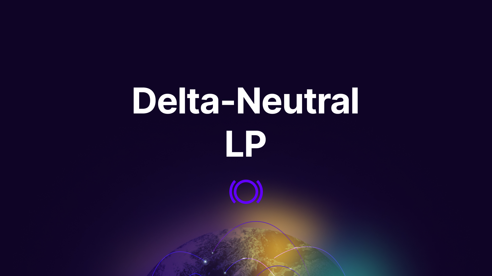
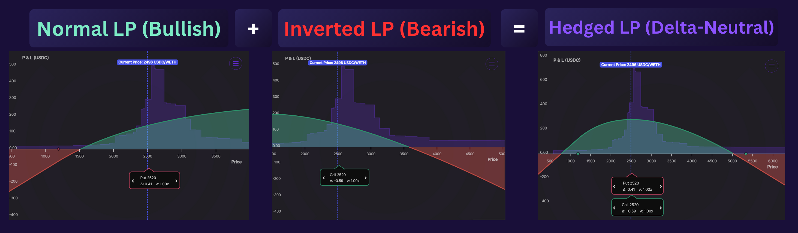
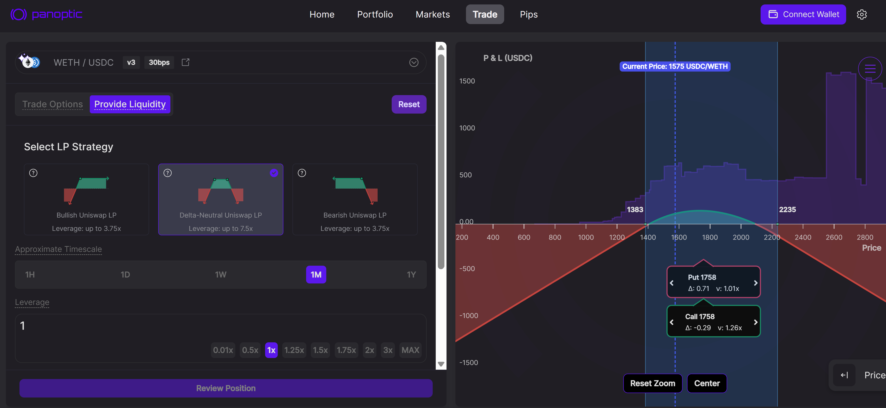
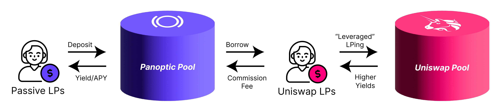
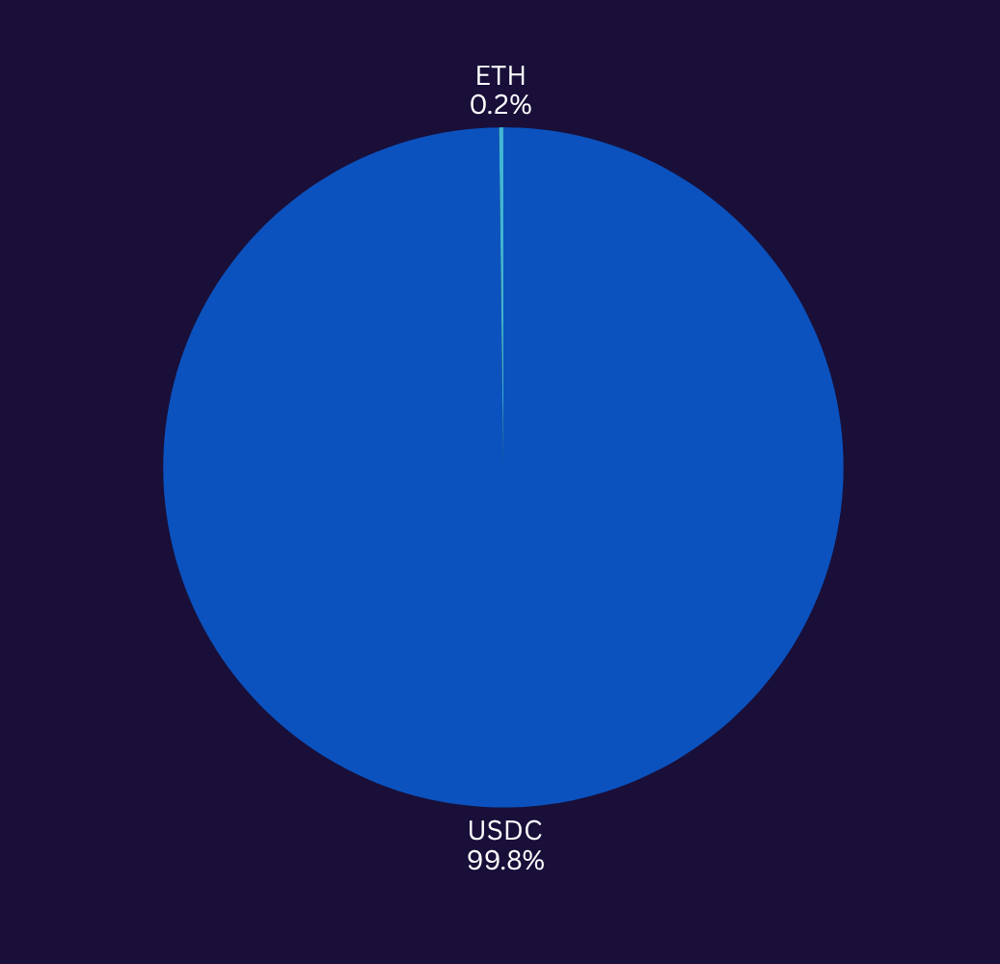
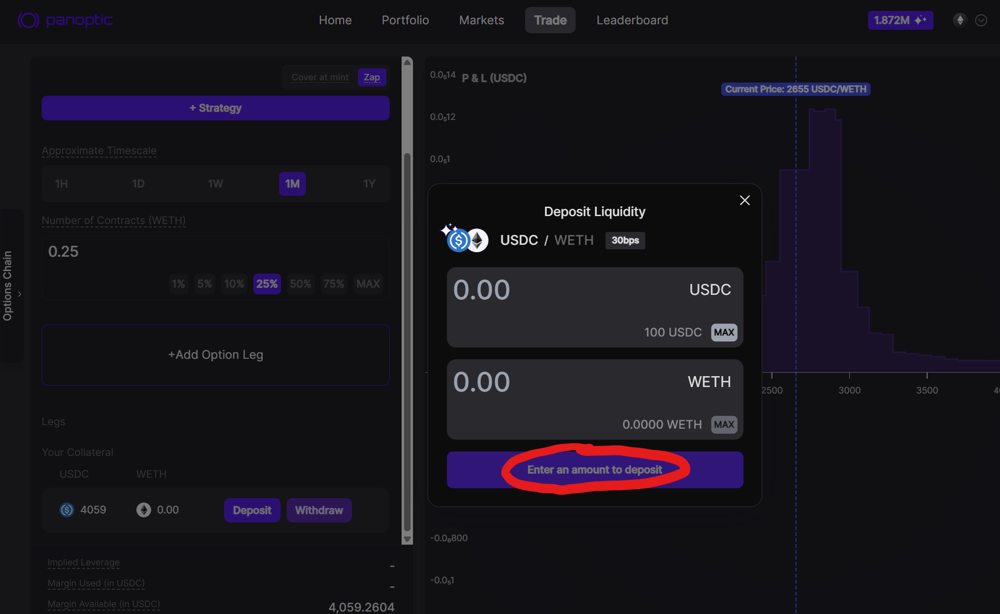

Providing delta-neutral liquidity on Panoptic is a powerful way to earn yield without taking on directional exposure to ETH. This strategy allows you to earn fees from hedged LP positions while maintaining near-full USDC exposure, with only a minimal ETH requirement. Here’s a step-by-step guide using real numbers and examples.

---

## Step 1: Understand the Setup

Delta-neutral LPing on Panoptic means creating a [hedged LP position](/blog/delta-neutral-lp-hedge-uniswap-position). Rather than simply providing liquidity in a single direction (bullish or bearish), a delta-neutral LP combines a [normal LP position](/blog/make-uniswap-great-again#bullish-lp-position) (which is bullish) with an [inverted LP position](/blog/make-uniswap-great-again#bearish-lp-position) (which is bearish) to produce a [market-neutral](/blog/make-uniswap-great-again#delta-neutral-lp-position) strategy.

You can access this easily on Panoptic by [navigating](/docs/product/uniswap-lps/provide-liquidity#step-8-select-lp-strategy) to the **Trade** page, selecting **LP Mode**, and clicking **"Delta-Neutral LP"**.

This is made possible because Panoptic has its own built-in [lending and borrowing market](/blog/bringing-passive-liquidity-to-uniswap#where-does-the-yield-come-from), enabling users to single-sidedly enter a Uniswap v3 or v4 LP position. For example, that means you can start with primarily USDC and still gain exposure to a delta-neutral LP strategy. The only limitation is that there must be enough ETH available to borrow on Panoptic at the time you initiate your position.

## Step 2: Allocate Capital

Suppose you want to deploy $1,000,000 of liquidity.

To stay delta-neutral, your collateral mix can be:

- **$998,000 USDC**
- **2 ETH** (e.g., if ETH is priced at $1,000)

This ETH covers:
- The commission fee (0.1% in ETH, 0.1% in USDC) when initiating the position.
- A potential small ETH top-up if the ETH price rises and you want to close the position.

This setup gives you nearly 99.8% USDC exposure while enabling a hedged LP position.

## Step 3: Deposit Your Collateral

1. Go to [app.panoptic.xyz](https://app.panoptic.xyz)
2. [Deposit](/docs/product/uniswap-lps/provide-liquidity#step-6-deposit-tokens) $998,000 USDC (or 99.8% in USDC)
3. Deposit 2 ETH (or 0.2% in ETH)

You're now ready to provide liquidity.

## Step 4: Create the Delta-Neutral Position

1. [Navigate](/docs/product/uniswap-lps/provide-liquidity#step-8-select-lp-strategy) to the **Trade** page on Panoptic
2. Toggle to **LP Mode**
3. Select **"Delta-Neutral LP"**
4. Choose the Uniswap pool you want to LP in (e.g., WETH/USDC 0.3%)
5. Specify the size of your position (e.g., 500 ETH contracts)
6. Specify the [timescale](/docs/product/uniswap-lps/provide-liquidity#step-9-choose-a-timescale) of your position. A longer timescale (e.g. '1Y' or '1M') corresponds to a wider price range. A wider position allows you to stay delta-neutral longer, but earns less fees per unit of liquidity.
7. Confirm and click **"Provide Liquidity"**

Panoptic automatically handles the hedging in protocol. This creates an LP position in Uniswap that earns fees and is less affected by small price movements in either direction.

## Step 5: Monitor and Maintain

- **Passive earnings:** You earn fees in USDC and ETH
- **Impermanent loss:** Your position is hedged, so directional price movement has less impact on your PnL
- **Rebalance:** If the ETH price moves significantly, your position may no longer be delta-neutral. You can rebalance by [closing](/docs/product/closing-a-position) and reopening your position to restore neutrality.
- **ETH Top-Up:** If the ETH price increases and you unwind your LP, you may need to supply a small additional amount of ETH to fully close the position.

## Summary

- **Strategy:** Delta-neutral = Hedged LP by combining normal and inverted positions
- **Capital needed:** 99.8% USDC + 0.2% ETH
- **Returns:** Earn fees in both USDC and ETH with less price exposure
- **Benefits:** Minimizes impermanent loss on the downside, capital-efficient

_Join the growing community of Panoptimists and be the first to hear our latest updates by following us on our [social media platforms](https://links.panoptic.xyz/all). To learn more about Panoptic and all things DeFi options, check out our [docs](https://panoptic.xyz/docs/intro) and head to our [website](https://panoptic.xyz/)._