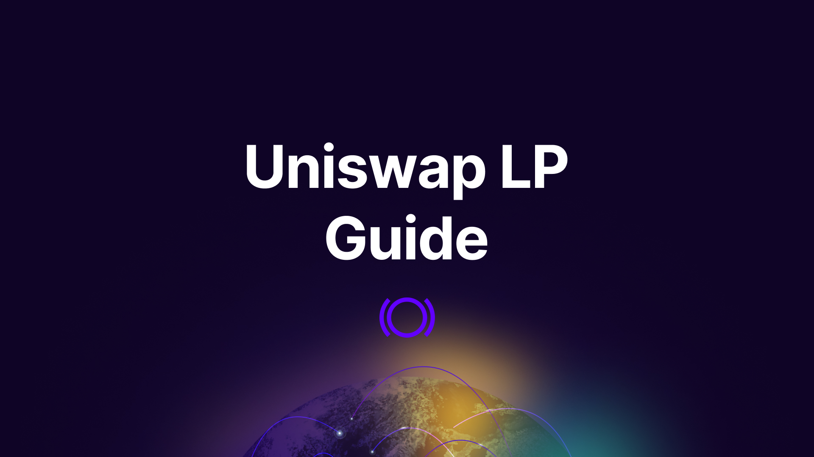

Panoptic lets you provide liquidity to Uniswap through the Panoptic protocol — unlocking higher yields by earning additional **premiums** on top of Uniswap trading fees.

## LP on Panoptic

Follow these steps to start LPing.

### Step 1: Go to [app.panoptic.xyz](https://app.panoptic.xyz)

This is the official Panoptic trading interface.

### Step 2: Connect Your Wallet**

Click **Connect Wallet** and choose your preferred wallet provider. Then, select the **network** you want to provide liquidity on (e.g., Ethereum, Base, Unichain, etc.).

### Step 3: Navigate to the _Markets_ Tab

This shows all Uniswap pools available through Panoptic.

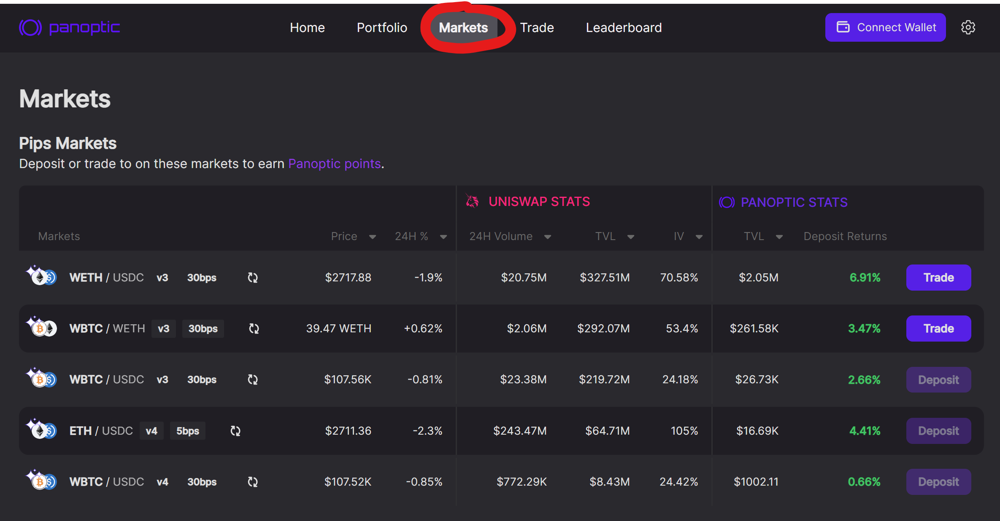

### Step 4: Choose a Pool

Click a pool you’re interested in (e.g., WETH/USDC 30bps v3).  
- **Fee tier (30bps)** means the Uniswap pool charges 0.3% per swap — higher fees often mean more rewards.  
- **v3 vs v4**: Panoptic currently supports Uniswap v3 and v4. Uniswap v4 adds new features like hooks.

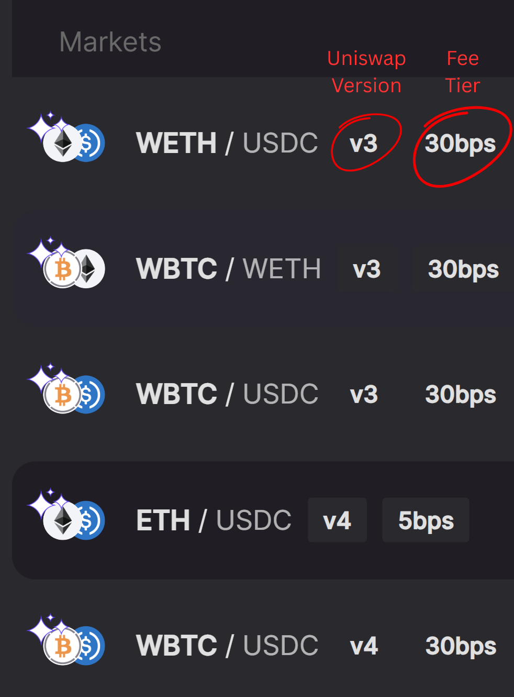

### Step 5: Click _Trade_

This opens the trading panel for the selected pool.

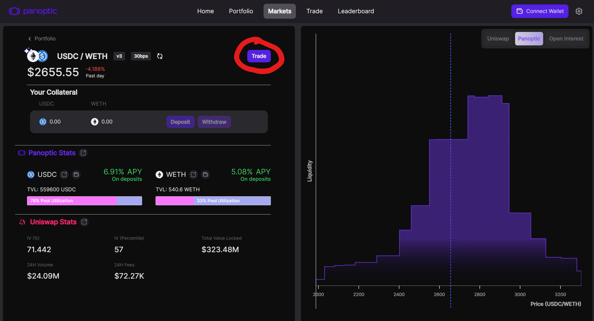

### Step 6: Deposit Tokens

You can deposit any amount of either token.  
- It’s recommended to deposit at least a small amount of each token (e.g., both WETH and USDC), even if it’s not 50:50.  
- Don’t worry about perfect balance — Panoptic has built-in lending markets that let you borrow the missing token.

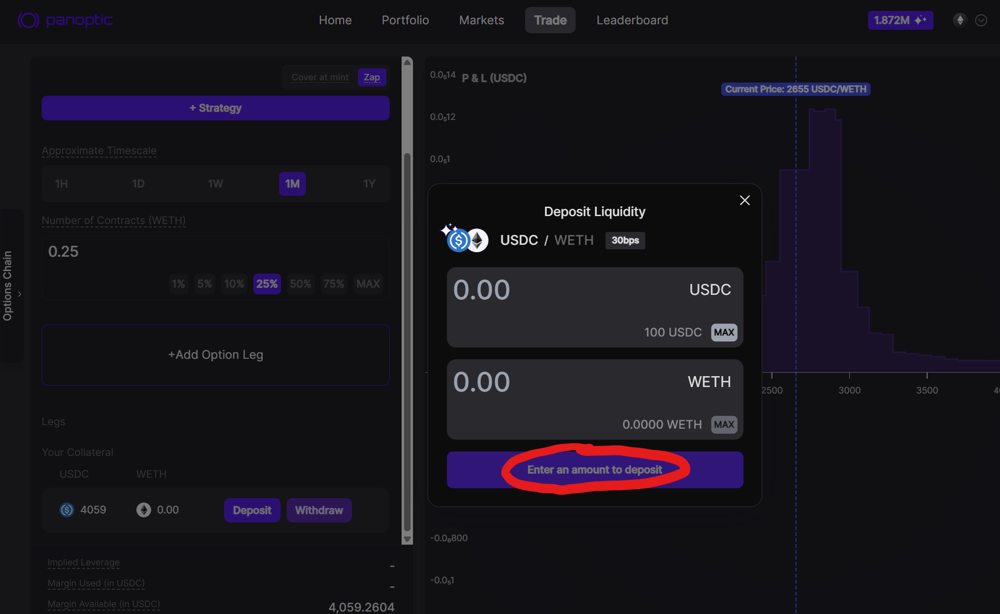

### Step 7: Click _Provide Liquidity_

Switch from “Trade Options” to “Provide Liquidity” mode.

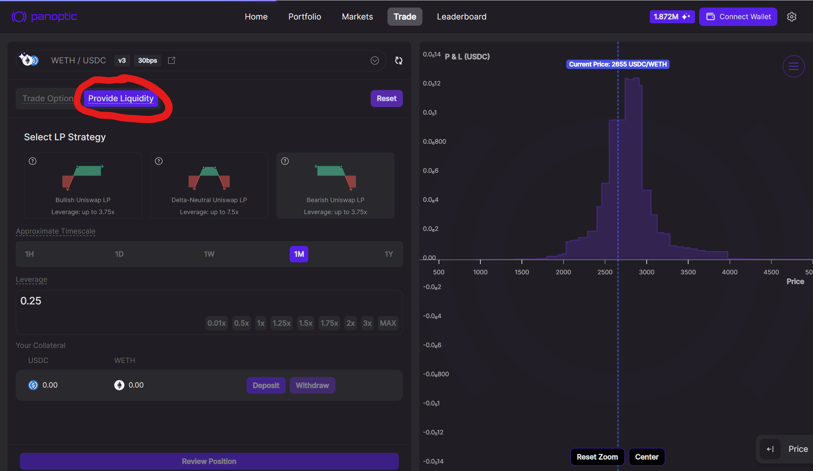

### Step 8: Select LP Strategy

Panoptic comes with built-in Hedging

A Uniswap LP is structurally bullish: when price falls, you receive more of the underperforming token and book *impermanent loss*. Panoptic makes that risk optional:

| **Exposure**              | **What Happens when Price Drops**                          | **What Happens when Price Rises**                         |
|--------------------------|-------------------------------------------------------------|------------------------------------------------------------|
| Standard LP (bullish)    | You hold more of the falling token  → *impermanent loss*    | You hold more of the quote token  → *limited gain*         |
| Inverted LP (bearish)    | You gain on the falling price  → *impermanent gain*         | You lose as the price rises  → *impermanent loss*          |
| Delta-neutral LP         | You are hedged against price dropping                       | You are hedged against price rising                        |

With one click you can choose between [bullish, bearish, or fully delta‑neutra](https://panoptic.xyz/blog/make-uniswap-great-again#3-ways-to-lp-which-one-actually-profits)l stances.

Each strategy comes with different payoff shapes and leverage limits.

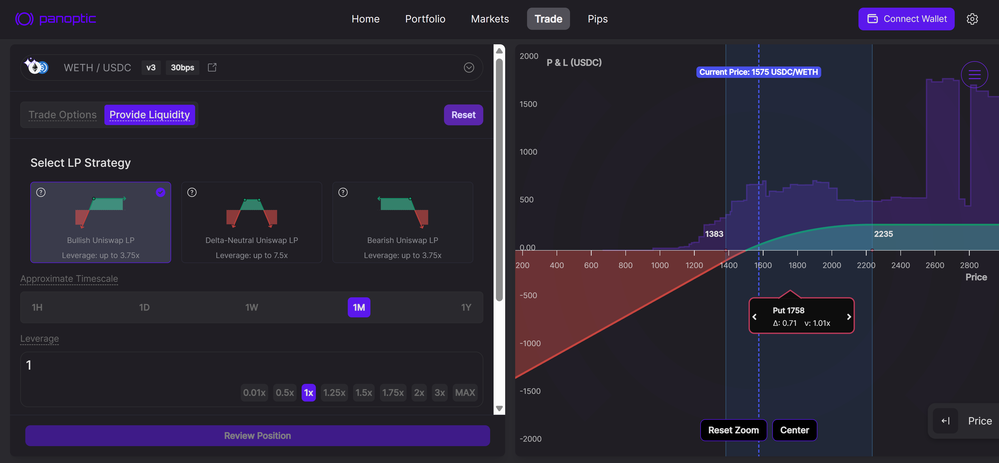
_Standard Uniswap LP Position (Bullish)_

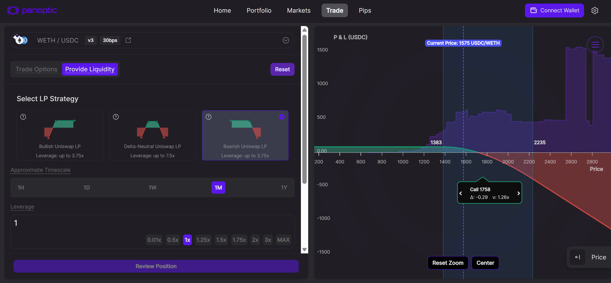
_Inverted Uniswap LP Position (Bearish)_

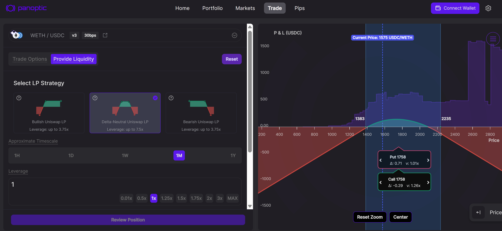
_Delta-Neutral Uniswap LP Position_

### Step 9: Choose a Timescale

Pick a [timescale](/docs/product/timescales) that fits your expected duration in range:
- `1H` ≈ ±1% wide LP price range
- `1D` ≈ ±%4 wide LP price range
- `1W` ≈ ±13% wide LP price range
- `1M` ≈ ±27% wide LP price range
- `1Y` ≈ ±112% wide LP price range

This affects your LP price range width and projected fee earnings.

Also, choose your [leverage](/docs/product/leverage). Higher leverage = higher returns, but higher risk of [liquidation]((/docs/product/liquidations)).

### Step 10: Review and Confirm Position

Inspect your position details, payoff chart, and estimated earnings. Click **Create Position** to mint your LP position. You now earn **Uniswap fees** + **Panoptic streaming premiums**.

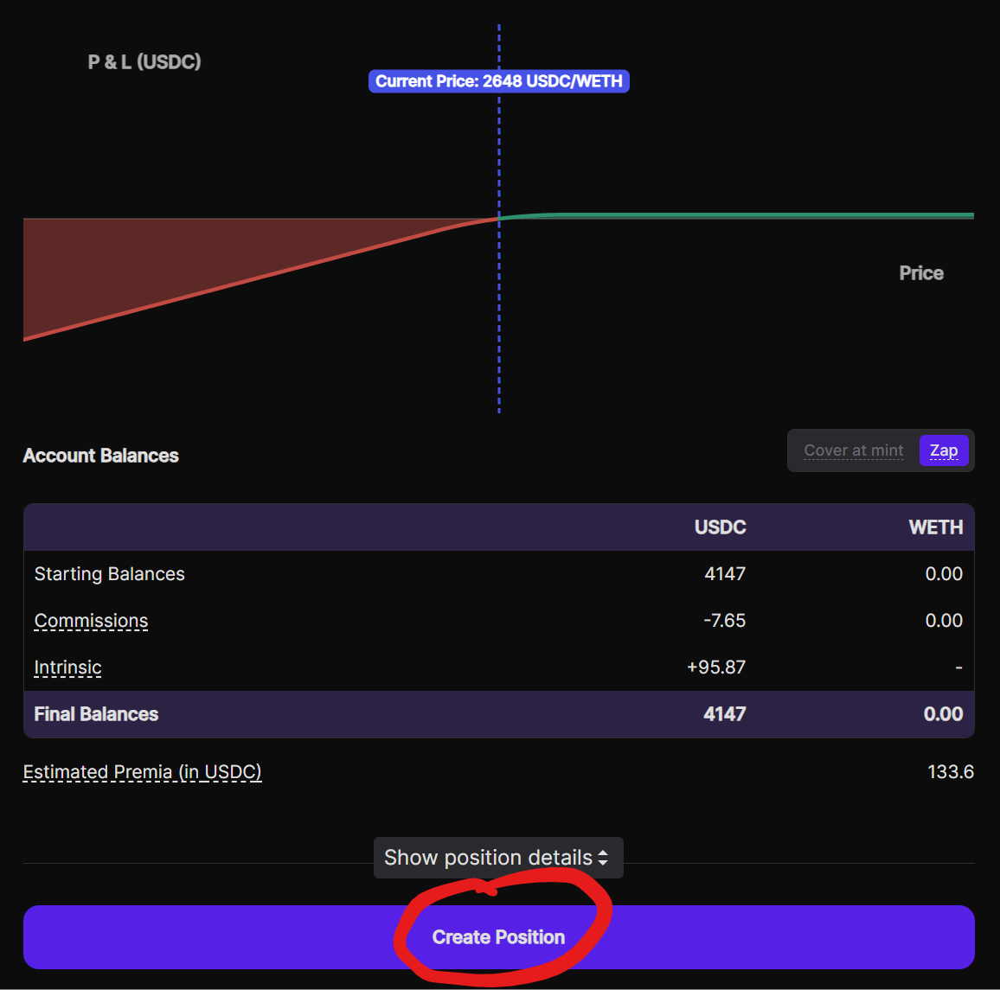

To learn how to manage or exit your position, visit: [Panoptic Position Management Guide](/docs/product/position-management)

---

## LP Returns

Historical data shows that Panoptic liquidity providers may have earned **25 %–112%+ APR** on fees. These earnings combine:

1. **Uniswap trading fees (21%-95%)** – the baseline return every LP receives.
2. **Panoptic streaming premia (4%-17%)** – an [extra premium](https://panoptic.xyz/research/loss-versus-panoptic-why-lps-are-losing#the-panoptic-spread) from lending out LP positions to option buyers that can increase total fees to as much as **3×** the Uniswap amount.

Additional Incentives: UNI Tokens ([currently live](https://gov.uniswap.org/t/governance-proposal-uniswap-unleashed-unichain-and-uniswap-v4-liquidity-incentives/25250) on select Unichain and Ethereum v4 pools and coming to Base)

### LP Backtest (Weekly Rebalancing)
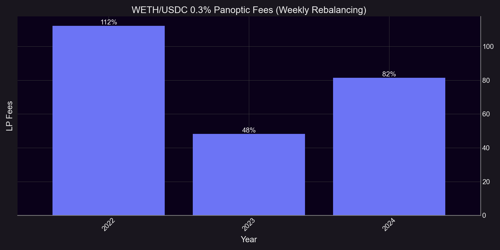

### LP Backtest (Monthly Rebalancing)
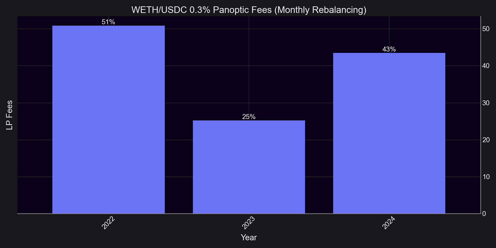

## Risk Highlights

1. **Smart Contract Risk**:
    Panoptic completed multiple [third-party audits](https://panoptic.xyz/docs/security/security_audits#smart-contract-audits) (Cantina, Code4rena, Trail of Bits, OpenZeppelin, ABDK) and [economic reviews](https://panoptic.xyz/docs/security/security_audits#economic-audits) (Three Sigma, Simtopia).
    
2. **Impermanent Loss**:
    LP positions underperform compared to HODL when price moves rapidly out of range. This risk can be hedged in Panoptic by creating [inverted LP positions](https://panoptic.xyz/blog/make-uniswap-great-again#bearish-lp-position) or even [shorting LP positions](https://panoptic.xyz/blog/turning-impermanent-loss-into-gain#shorting-lp-tokens-for-impermanent-gain) for impermanent gain.
    
3. **Liquidity Lock-Up Risk**:
    If LP positions are borrowed in Panoptic, then only a portion of the position may be closed. When liquidity utilization reaches 90**%**, positions can temporarily become uncloseable until utilization falls. To incentivize LPs, Panoptic dynamically increases the fees they earn as their positions are borrowed—these fee curves grow non-linearly, with accelerating rates as utilization nears full capacity. If an LP position goes out of range, LPs may forcibly close it at any time by paying a fee, even if it’s currently being borrowed.
    
4. **Liquidation Risk**:
    Panoptic lets LPs provide liquidity at up to **5× effective leverage**, increasing potential profits and losses. If the value of LP positions in a pool falls below the account’s maintenance margin, the protocol can [liquidate](/docs/product/liquidations) the account to protect its solvency. LPs can curb this risk by:
    - Sticking to lower leverage ratios.
    - Monitoring the position’s health or setting stop‑losses.
    - Topping up collateral before the margin buffer is breached.

_Join the growing community of Panoptimists and be the first to hear our latest updates by following us on our [social media platforms](https://links.panoptic.xyz/all). To learn more about Panoptic and all things DeFi options, check out our [docs](https://panoptic.xyz/docs/intro) and head to our [website](https://panoptic.xyz/)._