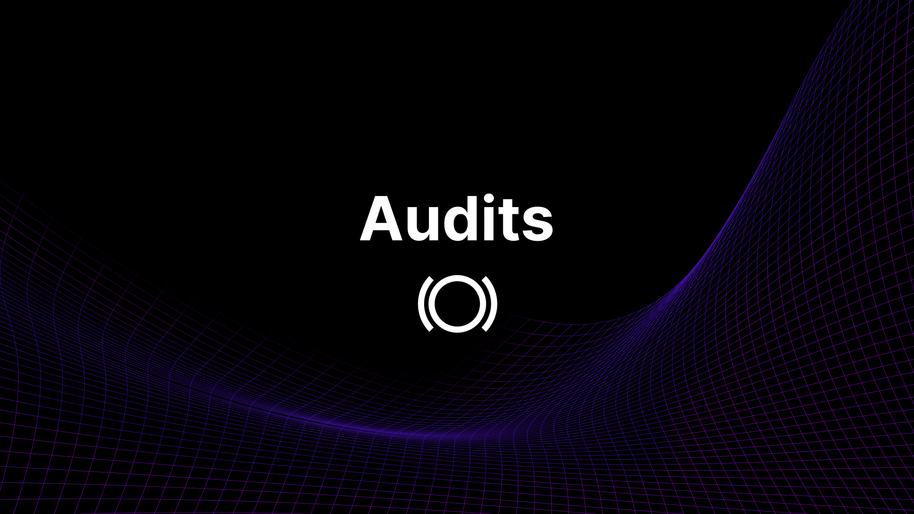

 
# Security & Audits

Panoptic has undergone numerous economic and security reviews by leading firms. The following reports are available for public review.

## Smart Contract Audits

### Cantina
The final [review](https://cantina.xyz/portfolio/0eb3624c-90d4-40d8-93b7-558cb130f753) of the Panoptic V1.1 Protocol was completed by [Cantina](https://cantina.xyz/) on November 20, 2024.

The initial Panoptic V1.1 Protocol [report](https://cantina.xyz/portfolio/5a11e7c3-da1e-4d0f-8700-bfc364d8b85a) was completed by Cantina on November 7, 2024.

### Code4rena
The final [review](https://code4rena.com/reports/2024-09-panoptic) of the Panoptic V1 Protocol was completed by [Code4rena](https://code4rena.com/) on October 10, 2024 and found _**no High or Medium severity issues**_.

The second Panoptic V1 protocol audit [report](https://code4rena.com/reports/2024-06-panoptic) was completed by Code4rena on June 10, 2024.

The initial Panoptic V1 protocol audit [report](https://code4rena.com/reports/2024-04-panoptic) was completed by Code4rena on April 22, 2024.

The Semi-Fungible Position Manager (SFPM) audit [report](https://code4rena.com/reports/2023-11-panoptic) was completed by Code4rena on December 11, 2023.

### Trail of Bits
The invariant testing [report](/pdf/TrailOfBits_Panoptic.pdf) was completed by [Trail of Bits](https://www.trailofbits.com/) on June 4, 2024 and found no issues of any severity.

### OpenZeppelin
The second comprehensive smart contract audit [report](/pdf/OpenZeppelin_Panoptic.pdf) was completed by [OpenZeppelin](https://www.openzeppelin.com/) on December 27, 2023.

### ABDK
The initial smart contract audit [report](/pdf/ABDK_Panoptic.pdf) was completed by [ABDK](https://abdk.consulting/) on April 26, 2023.

## Economic Audits

### Three Sigma
The second economic analysis [report](/pdf/ThreeSigma_Panoptic.pdf) was completed by [Three Sigma](https://threesigma.xyz/) on May 21, 2024.

### Simtopia
The initial economic analysis [report](/pdf/Simtopia_Panoptic.pdf) was completed by [Simtopia](https://www.simtopia.ai/) on March 7, 2023.