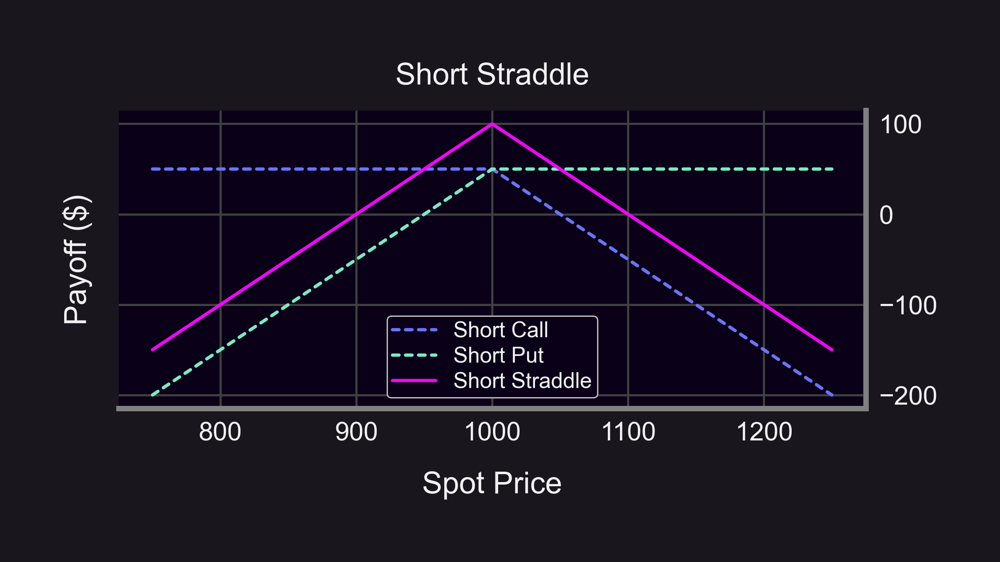

# Capital efficiency
In options trading, capital efficiency refers to the ability of an options strategy to control a maximum amount of funds with minimal capital investment. It is a measure of how effectively an options trader uses their available capital to achieve their desired trading objectives.

For example, a capital-efficient options strategy may involve using options to gain exposure to a crypto asset while requiring less capital than buying the crypto asset outright. This can be achieved through strategies such as call options or options spreads.

Options trading can be a powerful tool for investors looking to maximize their capital efficiency. By leveraging the unique features of options, traders can better manage risk, generate additional income, and potentially enhance returns. In this section we'll explore the basics of options trading and delve into strategies that can help you optimize your capital's potential.
For a primer on terminology see [here](/docs/terms/glossary.md).

The numerical collateral examples on this page describe the historical V1 assumptions used in the 2023 comparison. They are not current V2 limits. For a current position, inspect the pool’s [risk engine](/docs/panoptic-protocol/V2/risk-engine-overview) and [portfolio collateral requirements](/docs/panoptic-protocol/V2/collateral-overview).

### Leverage

Options provide leverage, allowing traders to control a large amount of the underlying asset with a small amount of capital. By purchasing options instead of the underlying asset, traders can gain exposure to price movements without committing a significant amount of capital.

### Examples of Capital Efficient Options Strategies

#### Long Calls
Buying a call option is a capital efficient strategy for obtaining upside exposure to an asset. Rather than having to purchase the underlying asset at full price, one only needs to pay the price of the call option (which is usually significantly less).

For example, let's say that ETH is trading at $1,000. Buying ETH outright would require $1,000 (1x leverage). But under normal circumstances in Panoptic, buying a 1 ETH call option would only require $100 of collateral (10x leverage). So for 10x less capital, one is able to get equivalent upside exposure to the underlying asset.

#### Short Straddles and Strangles
Selling straddles and strangles are extremely capital efficient. That’s because they’re made up of one short put and one short call, and only one of those legs can be “tested” at any given time. For example, if the put is ITM, then the call is OTM, and vice versa.

Because of this, the collateral requirements for selling a straddle or strangle is relaxed. The collateral requirement for a short straddle or strangle is just the collateral requirement of one of its legs (either the short put or short call, whichever is larger).

<blockquote class="twitter-tweet" data-conversation="none">
Cool fact about capital efficiency which will be implemented in <a href="https://twitter.com/Panoptic_xyz?ref_src=twsrc%5Etfw">@Panoptic_xyz</a>  Collateral for selling options on <a href="https://twitter.com/search?q=%24SPY&amp;src=ctag&amp;ref_src=twsrc%5Etfw">$SPY</a>:  -25∆ put=$5800  -25∆ call=$5900  -Strangle=25∆ put + call =$5960  Why not 2x larger? Only one side can be ITM at a time, so no extra risk for adding 2nd leg!
&mdash; Guillaume Lambert | gee-yohm.eth | 🦇🔊 (@guil_lambert) <a href="https://twitter.com/guil_lambert/status/1593370796650545153?ref_src=twsrc%5Etfw">November 17, 2022</a></blockquote> 

For example, let's say that ETH is trading at $1,000. Under normal circumstances in Panoptic, selling a 1 ETH naked put option would require $200 of collateral (5x leverage). Similarly, selling a 1 ETH naked call option would require 0.2 ETH of collateral (5x leverage). However, selling BOTH a 1 ETH put option AND a 1 ETH call option together would only require $200 of collateral (10x leverage).

#### Synthetic Long Asset
Exposure to assets can be mimicked through options strategies that are more capital efficient. A "synthetic long asset" is created by selling an ATM put option and buying an ATM call option, which creates a similar payoff to that of owning the underlying asset, but with less capital required.

For example, let's say that ETH is trading at $1,000. Buying ETH outright would require $1,000 (1x leverage). To create a synthetic long ETH position, one could sell an ATM put and buy an ATM call. Under normal circumstances in Panoptic, selling 1 ATM ETH put option would require $200 of collateral and buying 1 ATM ETH call option would require $100 of collateral, for a total required collateral of $300 (3.33x leverage).

So for 3.33x less capital, one is able to get similar exposure (upside and downside) to the underlying asset.

## Comparing four selling strategies

The following worked comparison and figures preserve the 2023 V1 strategy study. Its ratios assume target pool utilization and the collateral rules stated in the examples.

### Notional value versus collateral

In options trading, it's the ability to control a maximum amount of funds with minimal capital investment. It measures how effectively you use available capital to achieve your desired trading objectives.

Sounds complicated? Don’t worry, we’ll ELI5 (🐵👑👇)!

Imagine a conveyor belt of small bananas 🍌. As the bananas 🍌 pass through the magic box 📦, they turn into GIANT bananas 💉🍌.

-   Small banana 🍌 = initial investment

-   GIANT banana 💉🍌 = funds you control

-   💉= Panoptic's collateral tracker

Let's look at the formula👇

$\text{Capital Efficiency} = \frac{(💉🍌)}{🍌}$

That is, capital efficiency is the ratio of "notional value" to collateral.

-   Collateral: Funds backing the position

-   Notional Value: The value a position controls

(Both of these differ from "option value", which is the streamia (streaming premium))

In Panoptic:

-   _Sellers_ get up to 5x leverage

-   _Buyers_ get up to 10x leverage

In other words:

-   _Selling_ a 1 ETH option requires 0.2 ETH in collateral

-   _Buying_ a 1 ETH option requires 0.1 ETH in collateral

So which strategy is most efficient? Let's find out!

----------

### Strategy #1 - Naked Call

Naked calls 🙈📞 are pretty efficient...Naked Call 🙈📞 = sell 1 call:

<blockquote class="twitter-tweet" data-conversation="none">
2/14 💰 Selling call options gives you the ability to earn premium income.  But if you sell a naked (unhedged) call, you&#39;re taking on unlimited risk since you&#39;re obligated to sell the underlying asset at a preferential price if the buyer exercises the option. <a href="https://t.co/FrNnDLzcMh">pic.twitter.com/FrNnDLzcMh</a>
&mdash; Panoptic (@Panoptic_xyz) <a href="https://twitter.com/Panoptic_xyz/status/1641834029581492225?ref_src=twsrc%5Etfw">March 31, 2023</a></blockquote> 

-   Collateral: 0.2 ETH

-   Notional Value: 1 ETH

-   → Capital Efficiency: 5x 😁

That's very capital efficient 😁, but also risky 😳: naked calls have infinite risk 💀

Let's compare with covered calls!

### Strategy #2 - Covered Call

Covered Call 🛌🏻📞 = sell 1 call + hold asset:

<blockquote class="twitter-tweet" data-conversation="none">
4/14 The payoff of selling a covered call is the same as a naked put.  (Bonus point: covered call = naked put = Uniswap LP 🤯) <a href="https://t.co/1d7xAO8pVr">pic.twitter.com/1d7xAO8pVr</a>
&mdash; Panoptic (@Panoptic_xyz) <a href="https://twitter.com/Panoptic_xyz/status/1641834042512543745?ref_src=twsrc%5Etfw">March 31, 2023</a></blockquote> 

-   Collateral: 1 ETH

-   Notional Value: 1 ETH

-   → Capital Efficiency: 1x 😔

Covered calls require you to hold the full amount of the underlying asset, so it won't be as efficient.

Let's try the "Poor Man's Covered Call"!

### Strategy #3 - Poor Man’s Covered Call

Poor Man's Covered Call (PMCC) ↗️🧈 is a synthetic covered call. It's like a covered call, but you don't need to hold the underlying asset. PMCC ↗️🧈 = sell 1 call + buy 1 call:

<blockquote class="twitter-tweet" data-conversation="none">
17/25 A variation of 📅🧈 is the &quot;diagonal spread&quot; ↗️🧈  Also called a &quot;Poor Man&#39;s Covered call&quot; — useful when you expect minor price movement.  Limited upside 😋 Limited downside 😋 Bullish ⬆️  Long long-term call + short short-term call (different strikes) <a href="https://t.co/zoj4CKVJUK">pic.twitter.com/zoj4CKVJUK</a>
&mdash; Panoptic (@Panoptic_xyz) <a href="https://twitter.com/Panoptic_xyz/status/1628530324262223872?ref_src=twsrc%5Etfw">February 22, 2023</a></blockquote> 

-   Collateral: 0.2 ETH + ~0.1 ETH

-   Notional Value: 2 ETH

-   → Capital Efficiency: ~6.66x 😍

(Note: the collateral for buying the call is slightly larger than 0.1 ETH. This is because there is an “in-the-money amount” that is equal to the max loss the long position can suffer in terms of intrinsic value. Hence, the capital efficiency will be slightly less than 6.66x.)

### Strategy #4 - Short Straddle

Selling straddles is a bet against volatility. Can straddles beat the previous 6.66x efficiency? Straddle 🤸🏽‍♂️ = sell 1 call + sell 1 put:

-   Collateral: 0.2 ETH + 0 ETH

-   Notional Value: 2 ETH

-   → Capital Efficiency: 10x 🤪

Wow, 10x efficiency is the most! Why's that? Straddles are made up of 2 legs: 1 call & 1 put. Only one leg can be “tested” at any given time, i.e. if the put is ITM then the call is OTM, and vice versa. Hence, collateral req. for selling straddles is relaxed to just the req. of one leg (whichever is larger). 🤯

<blockquote class="twitter-tweet" data-conversation="none">
Cool fact about capital efficiency which will be implemented in <a href="https://twitter.com/Panoptic_xyz?ref_src=twsrc%5Etfw">@Panoptic_xyz</a>  Collateral for selling options on <a href="https://twitter.com/search?q=%24SPY&amp;src=ctag&amp;ref_src=twsrc%5Etfw">$SPY</a>:  -25∆ put=$5800  -25∆ call=$5900  -Strangle=25∆ put + call =$5960  Why not 2x larger? Only one side can be ITM at a time, so no extra risk for adding 2nd leg!
&mdash; Guillaume Lambert | lambert.eth | 🦇🔊 (@guil_lambert) <a href="https://twitter.com/guil_lambert/status/1593370796650545153?ref_src=twsrc%5Etfw">November 17, 2022</a></blockquote> 

----------

### Comparison summary

In order of capital efficiency:

1.  Straddle

2.  Poor Man's Covered Call

3.  Naked Call

4.  Covered Call

Caveats:

-   Collateral requirements above assume normal market conditions ("target pool utilization")

-   See more [here](https://panoptic.xyz/docs/panoptic-protocol/buying-power)

For more examples of capital efficient strategies and Options Trading 101 basics, visit [here](https://panoptic.xyz/docs/trading/capital-efficiency).
