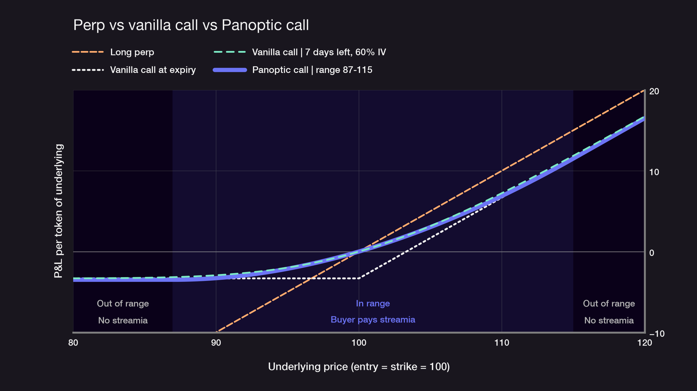

# Perps vs options

<head>
  
</head>

## Perps vs options: the short answer

**Perps** (perpetual futures) give you linear, leveraged exposure to price with no expiry. You gain and lose one-for-one, pay or receive a funding rate, and can be liquidated. **Options** give you a convex payoff: as a buyer, your loss is capped at the premium while gains grow with the move. Traditional options expire; perps don't. [Perpetual options](/docs/trading/perpetual-options) combine the two.

## Comparison table

| | Perps | Traditional options | Perpetual options (Panoptic) |
|---|---|---|---|
| **Payoff shape** | Linear | Convex | Convex |
| **Max loss (buyer)** | Your margin, up to liquidation | Premium paid upfront (includes any intrinsic value) | Intrinsic value paid at entry (the in-the-money amount, partial while in range) + streamia paid over time |
| **Cost (buyer)** | Funding rate, either direction | Upfront premium | Streamia, buyers pay sellers |
| **Liquidation (buyer)** | Yes, on adverse price moves | No for a fully paid long option | Yes, if accrued streamia exhausts collateral |
| **Expiry** | None | Fixed date | None |
| **Leverage** | Built in, often high | Implicit through premium | Through collateral and buying power |
| **Trade volatility?** | No | Yes | Yes |

## Payoff diagram

The chart shows profit and loss at each price after the upfront cost (premium for the vanilla call, entry value for the Panoptic call), excluding funding, streamia, and fees. A long perp is a straight line: it loses as fast as it gains. A vanilla call at expiry has a hard kink at the strike: below it, the most you lose is what you paid.

A Panoptic option has a **range** (lower to upper tick), not a single strike, so its payoff is curved inside the range. That curve closely matches a vanilla call **several days before expiry**: here, a 87–115 range tracks a 7-day call at 60% implied volatility. Outside the range, the payoff is flat (far out of the money) or linear (far in the money), and no streamia accrues.

## When to use perps

- **Short-term directional trades** where you want price exposure one-for-one, with no premium.
- **High-conviction moves** where paying for downside protection isn't worth it.
- **Hedging delta** on an options position, as in [gamma scalping](/research/gamma-scalping).
- **Liquid majors** where funding is low and order books are deep.

The trade-off: a sharp move against you can liquidate the position before price recovers.

## When to use options

- **Defined risk:** you want a known maximum loss, especially around events or in volatile markets.
- **Volatility views:** you expect a big move but not its direction (a [straddle](/research/defi-option-straddle-101)), or you expect calm (sell options).
- **Hedging spot:** buy puts to protect holdings without selling them.
- **Income:** sell calls or puts and earn premium.

The trade-off: buyers pay for that protection, and with traditional options the position loses value as expiry approaches.

## Perpetual options: the middle ground

[Perpetual options](/docs/trading/perpetual-options) have no expiry, so there's nothing to roll. For buyers, the payoff is convex, so a long does not lose one-for-one with price. Sellers take the mirror image: their gains are limited to streamia earned, while their losses can grow with the move. There's no upfront premium: buyers pay [streamia](/docs/product/streamia) to sellers only while price is inside the option's range, and pay nothing while it is far out of range.

That last point is what neither perps nor vanilla options have. A perp pays or receives funding all the time; a vanilla option prices time decay upfront no matter where price goes. A perpetual option costs nothing while price is far in or far out of the money.

The trade-offs:

- **For buyers:** the premium is not prepaid and not capped. Hold an in-range long long enough and streamia can exhaust your collateral.
- **For sellers:** buyers can close freely, but a seller may be unable to close a position that has been bought if there isn't enough liquidity to return.

On Panoptic, you can buy or sell perpetual options on tokens that trade on Uniswap, including many altcoins no other options venue lists. For a deeper comparison, see [perpetual futures vs options](/research/perpetual-futures-vs-options).

## FAQ

### Why use perps instead of options?

Perps are simpler and cheaper for short-term directional trades: there is no premium and no expiry, so the position follows price one-for-one. They suit traders who want leverage on a strong directional view and can manage liquidation risk.

### Why use options instead of perps?

Options cap the buyer's downside at the premium paid, so a sharp move against you does not wipe out the position. They also let you trade volatility, hedge spot holdings, or earn income by selling options, which a perp cannot do.

### Are options safer than perps?

For buyers, yes in one important way: a long option doesn't lose one-for-one with price, so a short, sharp wick that liquidates a leveraged perp leaves the option intact. A perpetual option is safer than a perp against a wick, but not safer than a vanilla long against a long stay in range: a vanilla premium is prepaid and capped, while streamia keeps accruing for as long as price stays in range. Option sellers take on risk similar to or greater than a perp position.

### What is a perpetual option?

A call or put with no expiry date. Like a perp, it never needs to be rolled; like an option, it has a convex payoff. On Panoptic, the buyer pays streamia to the seller over time instead of an upfront premium.
