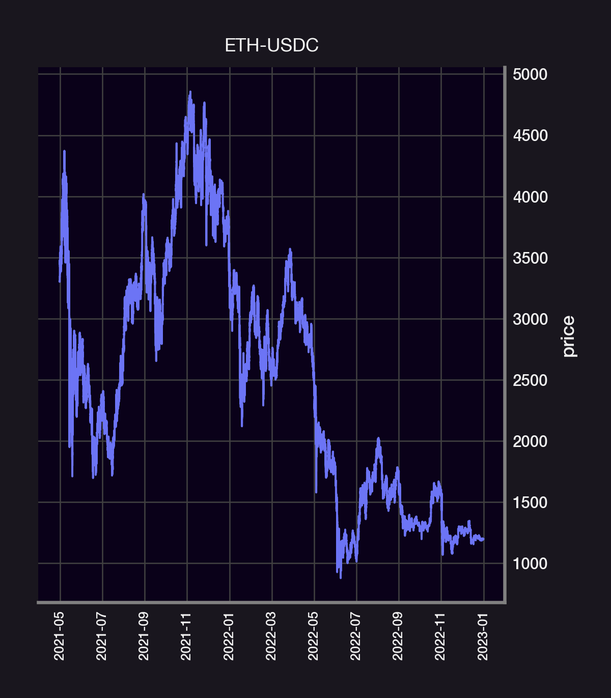
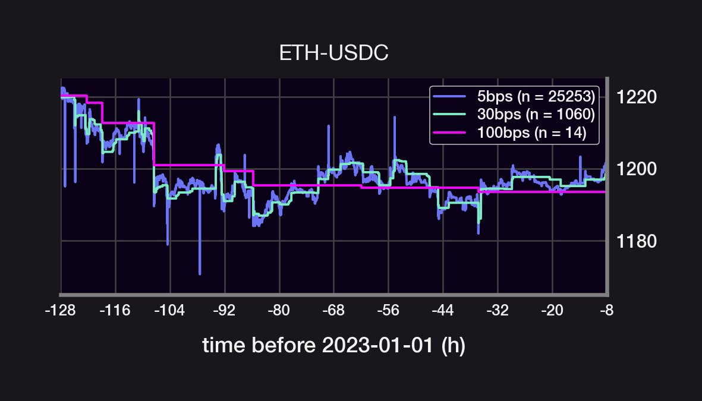
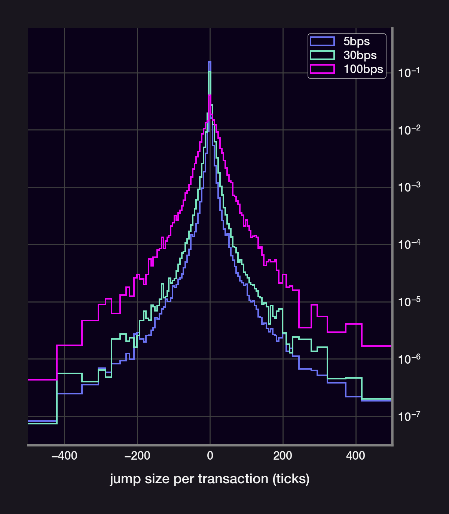
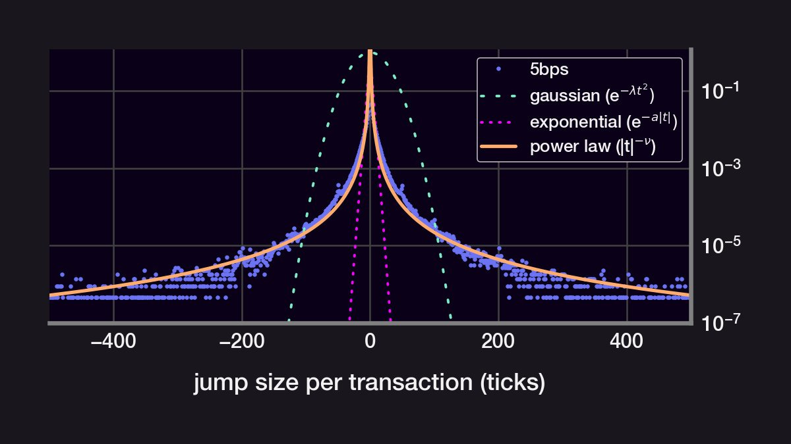

One of the core assumptions behind financial models is that prices follow a geometric brownian motion (GBM) — e.g. Black-Scholes. Does the price of the most traded asset in Uniswap v3 also follow a GBM? Let's find out! 👇

<!--truncate-->

We will analyze the 5, 30, and 100bps ETH-USDC UniV3 pools. The 5bps pool gets 90% of all volume and, zooming in on the price action, appear to have a smaller "per trade impact" than the 30 and 100bps pools What is the size distribution of the price jumps for each pool?

If the price were a GBM, then the size of the price jumps would be normally distributed. Instead, the price jumps are narrowly peaks around size~0. They also have a kurtosis that's much larger than a normal distribution's (high kurtosis = long-tail events are more likely).

We model the price S of an asset using a geometric Brownian motion, ie., we assume that S satisfies the following Stochastic Differential Equation:

$\frac{\mathrm{d}S_t}{S_t} = \underbrace{\mu\cdot\mathrm{d}t}_\text{drift}+\underbrace{\sigma\cdot\mathrm{d}W_t}_\text{volatility} \text{, where } \mathrm{d}W_t = \text{ Gaussian noise}$

Indeed, the distributions can't be fit to a gaussian. An exponential distribution also fails to cover the distribution's "long-tail". Surprisingly, the size of each price jump fits very closely to a power law distribution.

Key insights:

- The 5bps pool gets 90% of all USDC volume
- The 5bps pool likely follows the CEX price more closely due to its 0.05% arbitrage fee
- The distribution of price jumps does not follow a normal distribution
- The price jumps follow a power law distribution (!)

Questions/Caveats:
- Can a GBM have a power law random process?
- What is the impact of a large kurtosis on price action?
- These distribution may be colored by uneven time steps
- A lot of the volume is arbitrage and not reflect "organic" order flow.

We may tackles these questions in a future.

Disclaimer: This content is for educational purposes only and should not be relied upon as financial advice.