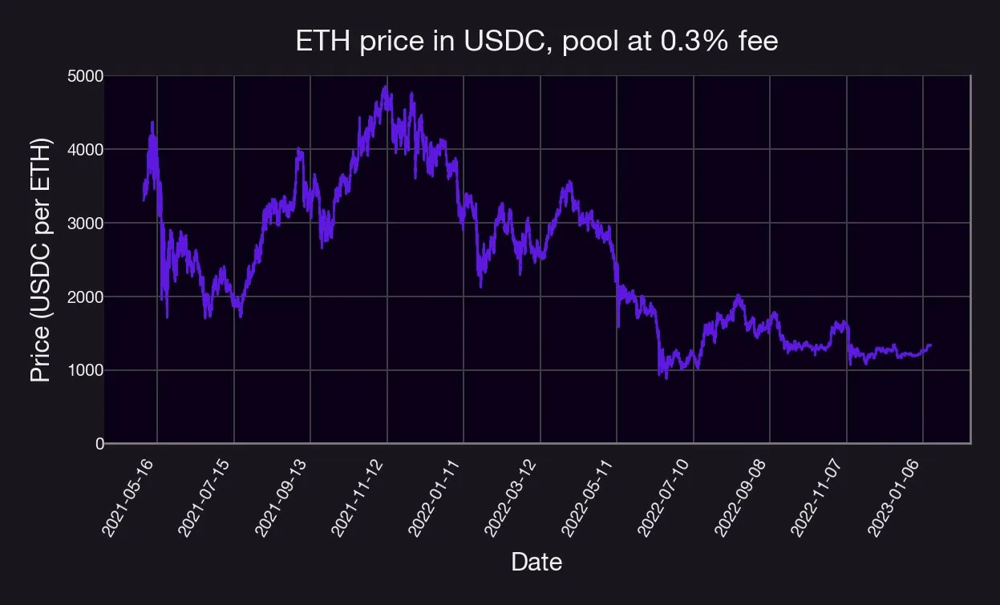
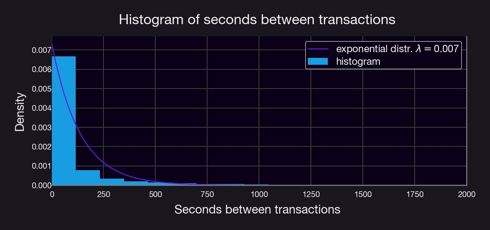

Have you ever wondered how to obtain historical Uni V3 data? 🧵

We created a short tutorial on how to do it using Python and GBQ ([LINK HERE](https://github.com/panoptic-labs/research/blob/main/_research-bites/_tutorials/gettingData.ipynb))

<!--truncate-->

NB: ☝️ can also be extended to other protocols.

In short, we created a query that:

1. Selects the relevant columns from GBQ’s public Ethereum logs database
2. Filters info by pool address (e.g. USDC-ETH pool at 0.3%)
3. Extracts relevant transaction data (e.g. amounts, sqrtPrice...)
4. Cleans & sorts the data.

**NB:** You will need a Google Big Query credential. See [here](https://cloud.google.com/bigquery/docs/authentication/service-account-file).

You will also need the following (standard) python packages:

- `pandas`
- `matplotlib`
- `http://google.cloud`
- `google.oauth2`
- `numpy`

Why do we want this data? It contains a wealth of information! As an example, by investigating the data for the ETH-USDC pool at a 0.3% fee, one can plot the asset price in the pool.

We can also look at the histogram of the time between any two transactions:

Notice that this distribution resembles an exponential distribution with parameter λ = 0.007, meaning that, on average, there is a transaction every ~136 seconds in this pool.

This tutorial is intended to be the "first step" in our series of #ResearchBites investigating Uni V3 pool data (e.g., prices, transactions, etc.), as well as trading strategies in these pools. Stay tuned for more upcoming #ResearchBites from the Panoptic_xyz team!

