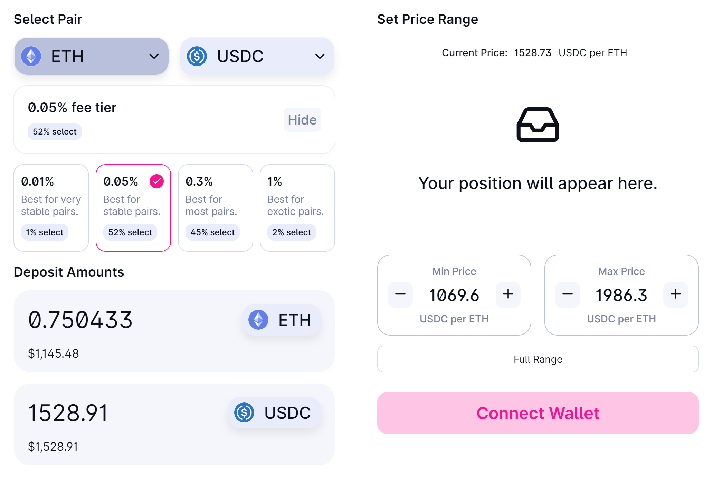
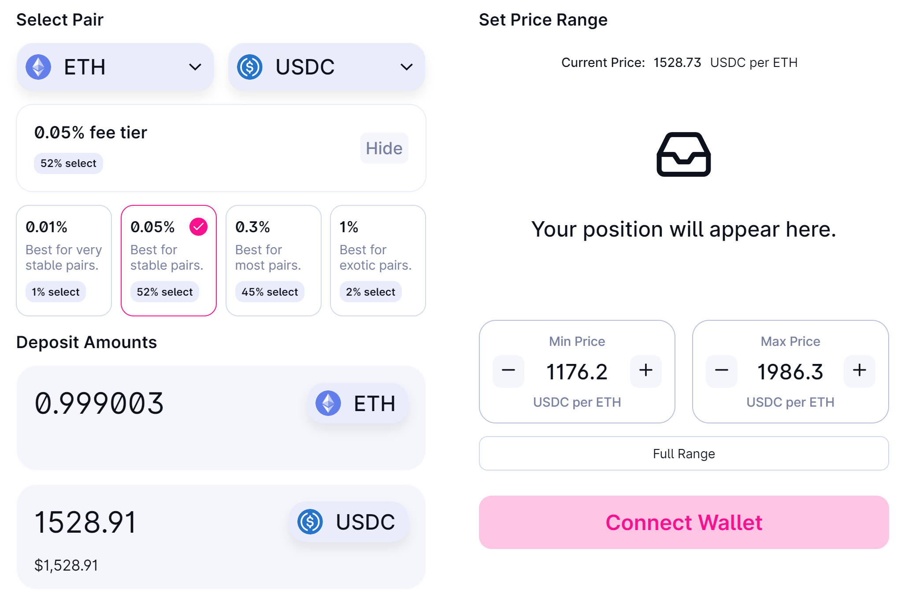
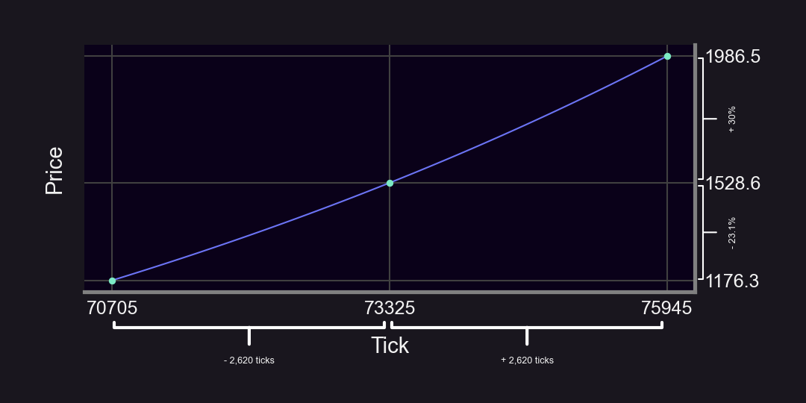

How do you LP on Uni v3 with a ±% range? E.g. if you wanted ±30% should you do:

- $\text{Lower: } P \cdot 70\%$
- $\text{Upper: } P \cdot 130\%$

or

- $\text{Lower: } \frac{P}{1.3}$
- $\text{Upper: } P \cdot 1.3$

Let's find out! 👇

<!--truncate-->

The upper price is the same since $P \cdot 130\% = P \cdot 1.3$. But what about the lower price? Should it be 70% or 76.9%? ($76.9\% = \frac{1}{1.3}$)

It turns out that only one of these is correct! Let's analyze.

- Pool: ETH-USDC
- Price: $1,528
- Our capital: split evenly (1 ETH and 1,528 USDC)

Let's try method 1 for a ±30% range: LP between 70% ($1,069) and 130% ($1,986).

*Spoiler alert: we can’t!* When we go to Uniswap it won’t let us LP all our capital. In fact, it will only let us deposit 0.75 ETH. That's $\frac{1}{4}$ of our ETH not earning any yield!

Now let's try method 2.

Since $\frac{1}{1.3} = 76.9\%$ and $1.3 = 130\%$, we LP between 76.9% (~$1,176) and 130% ($1,986).

Uniswap lets us deposit all our capital. Success!

So why is the lower range $\frac{P}{1.3}$ rather than $P \cdot 70\%$?

It turns out that we have to follow the equation:
 
$\frac{lower}{P} = \frac{P}{upper}$

E.g. if the lower range is $\frac{2}{3}$ of P, then P must be $\frac{2}{3}$ of the upper range. See [@atiselsts](https://twitter.com/atiselsts) paper (3.2.2) for more [here](https://atiselsts.github.io/pdfs/uniswap-v3-liquidity-math.pdf).

This seems unintuitive 🤔 Why can’t we simply do ±30% of P?

The answer is that we are working with tick math, which involves exponents. So LP ranges are linear in “tick space”, but non-linear in “price space”. There is a direct mapping between ticks and prices in Uni v3:

$Price = 1.0001 ^ {Tick}$

A price of \$1,528 corresponds to tick 73,325 (since $1.0001 ^ {73,325} ≈ \$1,528$).

If we LP on tick 73,325 with ±2,620 ticks, we get:

- $\text{Lower: } 1.0001 ^ {73,325 - 2,620} ≈ \$1,176$
- $\text{Upper: } 1.0001 ^ {73,325 + 2,620} ≈ \$1,986$

Key Insights:
1. The math is ±ticks, not ±%. This generalizes to any LP range.
2. For any LP Strategy of width ±X% (we used X = 30%), the proper price range to fully utilize capital is:
    - $\text{Lower: } \frac{P}{\frac{X}{100} + 1}$
    - $\text{Upper: } P \times (\frac{X}{100} + 1)$

Caveats/Questions:
- Don’t forget to leave some tokens to pay for gas (e.g. ETH on Ethereum, MATIC on Polygon).
- How well do ±X% LP strategies perform?
- What is a good X to pick?­

Disclaimer: This content is for educational purposes only and should not be relied upon as financial advice.