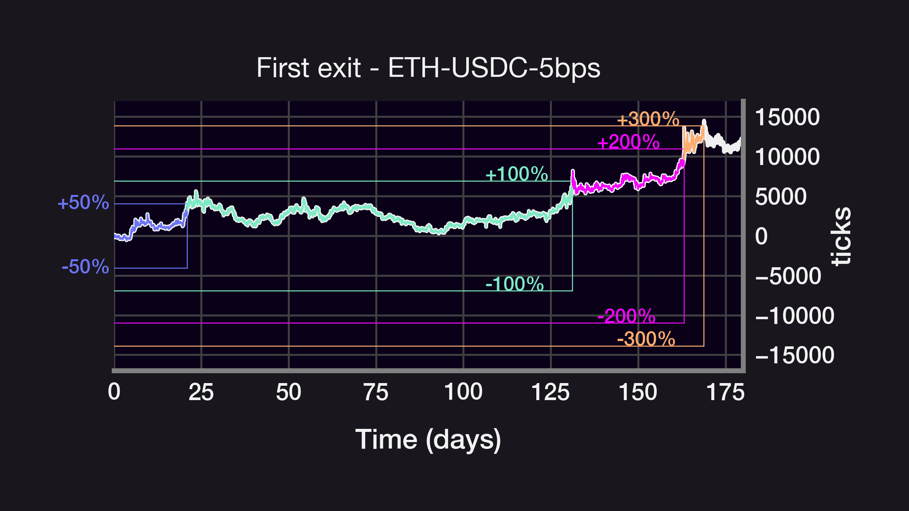
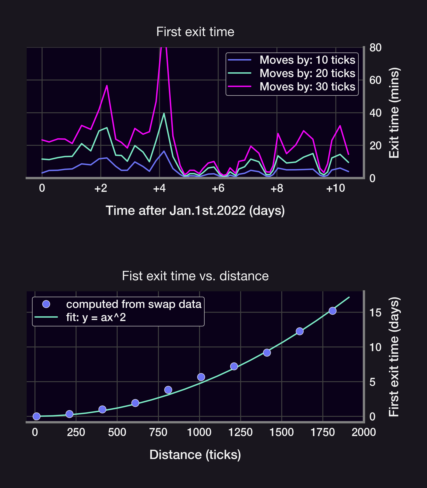
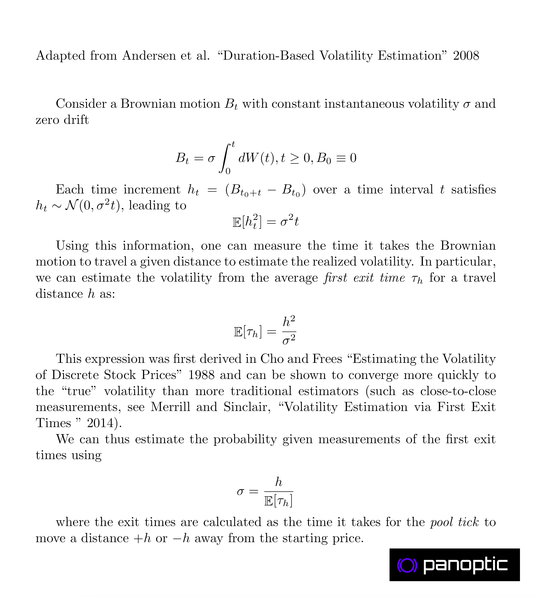
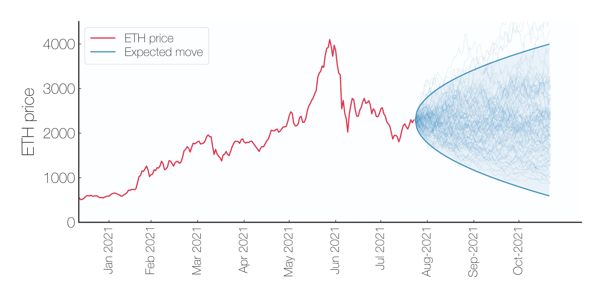

Liquidity provider positions in UniV3 only collect fees when the price is within that position's range. How long does the price remain within a given range? Let's find out! (Caution: contains math 🤓)

<!--truncate-->

---

We will consider positions centered at the current price at time `T=0` and monitor how long it takes the price to move a certain number of ticks up or down. In the example below, a position is minted on Jan. 1st 2022 and the price crossed `±2%`, `±3%`, `±5%`, and `±10%` in `<6` days.

Waiting for the price to move even more, from `±50%` to `±300%`, it now takes more than 5 months for the price to drift by 11,000 ticks (the ETH price did go down by `3x` YTD in May 2022). What's the relationship between the range and the first exit time? Let's look closer:

While crossing times do seem to converge for short exit times (see 10, 20, 30bps), it turns out that the average waiting time scales as the square of the range h:

$waitTime \sim h^2$

I'm deriving why this relationship exists based on work by Andersen 2008 and [Sinclair](https://twitter.com/SinclairEuan) 2014.

This `h^2` law is a consequence of the price *ticks* following a Brownian Motion with normally distributed steps: in a BM, the average displacement after a time `t` scales as `σ*t^2`, where `σ=volatility`. This relationship can be inverted to estimate `σ` from average crossing times!

Can we use those first exit times to derive a "per tx" volatility? Kind of! 👇 Per tx data is very noisy (blue dots), but using the average over 10,000 tx reveals known volatile periods like Luna/3AC/FTX collapses, or macro events like the Merge and the start of the Ukraine war.

Key insights:
-   The average time spent within a range ±h scales as `(h/σ)^2`
-   `E[first exit time]` can be used to develop resilient and efficient volatility estimators (when on-chain `σFTE`?)
-   The volatility calculation in the ETH-USDC pool can highlight volatile macro events
    

Caveats/Questions:
-   Does this still hold if price ticks [are not a Brownian motion](https://panoptic.xyz/research/uniswap-violates-geometric-brownian-motion)?
-   What about 30bps and 100bps pools?
-   Should the range be adjusted for different volatility environments?
-   What's the optimal range for a given `σ`?
