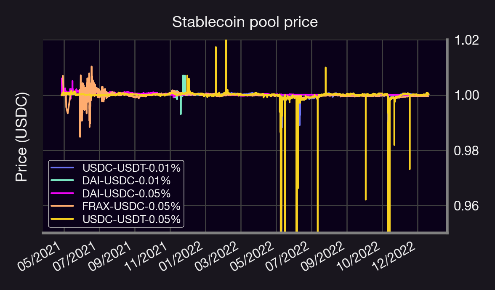
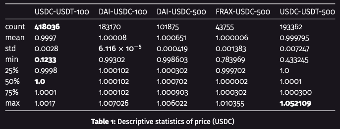
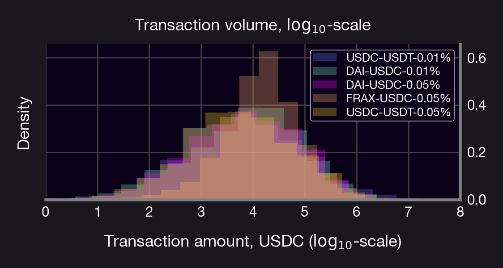
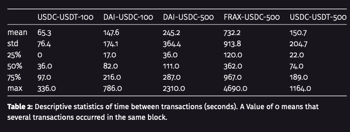
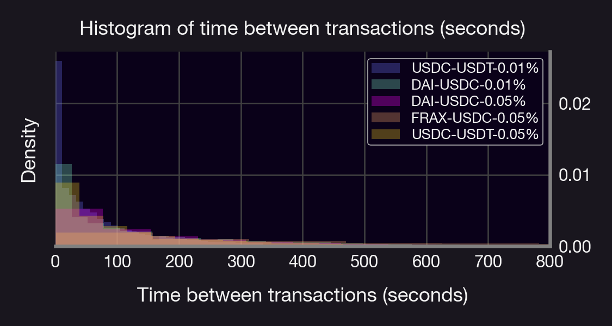
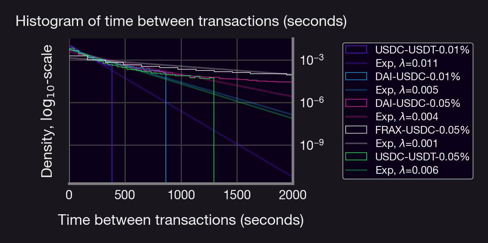

Someone told us that stablecoin pools were boring 😬🤯

Here's why they're wrong! 👇

<!--truncate-->

# Intro

- For starters, around 1B out of 3.7B TVL in Uni v3 is a stablecoin pool. That's around 27%!
- Of that 1B, about half of it (0.45B) is concentrated in the DAI-USDC pools at 0.01% and 0.05%.
- But it's not just about size. Let's dig deeper into some of these pools 👇

# Experiments

We investigate the following UniV3 pools:

- USDC-USDT (0.01%)
- USDC-USDT (0.05%)
- USDC-DAI (0.01%)
- USDC-DAI (0.05%)
- FRAX-USDC (0.05%)

Let's start by looking at prices. They should be super stable...right?

Mostly! Some stable pools are more stable than others 🐷🏠

Some pools exhibit short periods of large variability, likely due to whales + MEV + UniV3 liquidity math (e.g. USDC-USDT 0.05%)

Remark: The prices 👆 are ordered on a "per-tx" basis; thus, some of the larger spikes happen inside the same block as their neighboring transactions. 

# Some pool stats:
- Most stable: DAI-USDC (0.01%)
- Most popular: USDC-USDT (0.01%)
- Largest volatility: USDC-USDT (0.05%)
- Approximately log-normal distribution of txs (eyeballing it)

See histograms + summary statistics👇 

# What about time between txs?

- USDC-USDT (0.01%) is the busiest pool (~1 tx/min on avg).
- FRAX-USDC (0.05%) is the quietest pool. 
- Each distribution resembles a geometric (and hence exponential) distribution with a given parameter λ (but with fatter tails)

 See figs👇

Now let's examine price correlation b/t pools:

- Since txs occur at irregular intervals, we take the avg price over 5 minute intervals
- Not all are as strongly correlated as one would think 🤔
- High correlation b/t USDC-{USDT,FRAX} pools
- Low correlation for DAI pairs 

# Key insights:

- Per tx price is less stable than one would think!
- There is, on average, ~1 tx every 5 minutes across all pools
- Tx amount ~log-normal; time between txs ~exponential
- Price across some pools are weakly correlated, with Dai being the odd one out

# Why is this important?

- Understanding the behavior of stablecoin pools can help us model them (e.g. for forward testing); can't use GBM
- Understanding correlations b/t pools can help us develop beta-trading strategies (e.g. stat-arb)

(👆topics of future #ResearchBites)

# Why can't we use GBM? 

Intuitively, stablecoins should:

- Oscillate around 1 (e.g., USDC) 
- Have bounded variation (not stable otherwise) 

Whereas for GBM:

- Price either becomes unbounded (µ>0) or goes to 0 (µ<0)  in expectation
- Variance increases with time 

