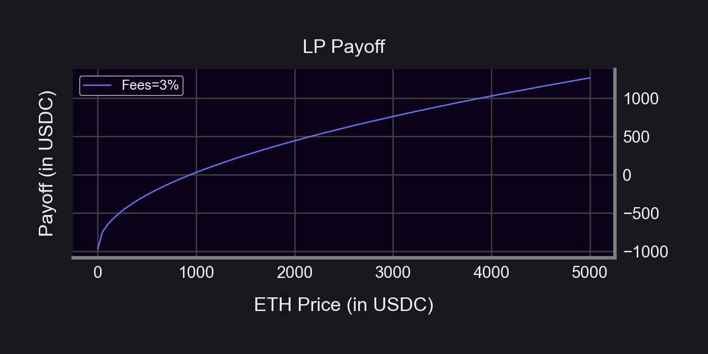
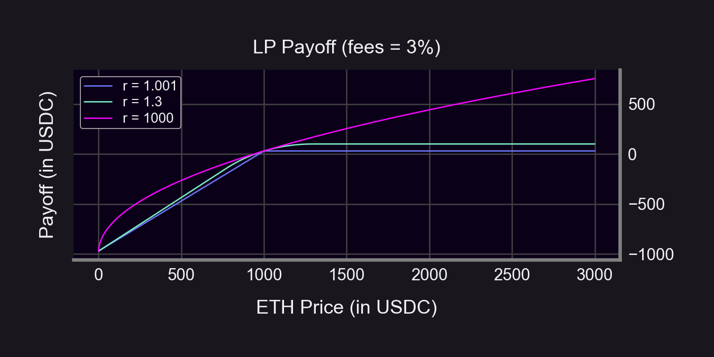
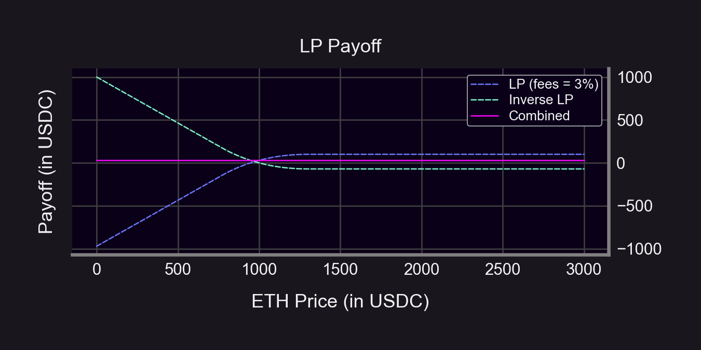
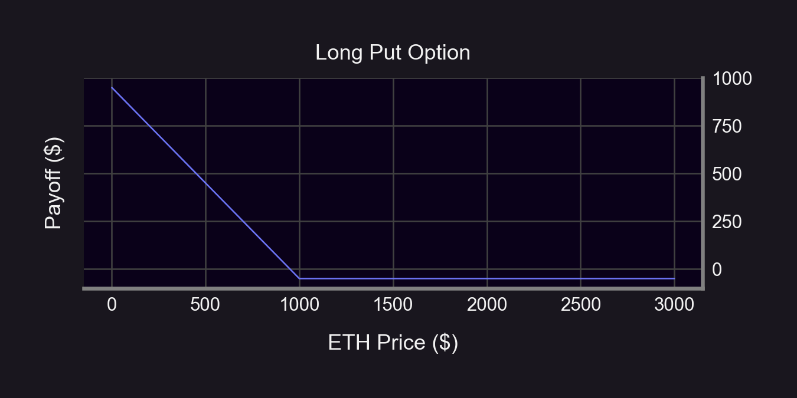
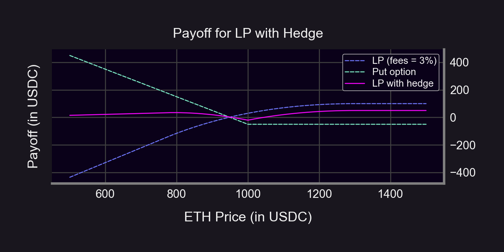
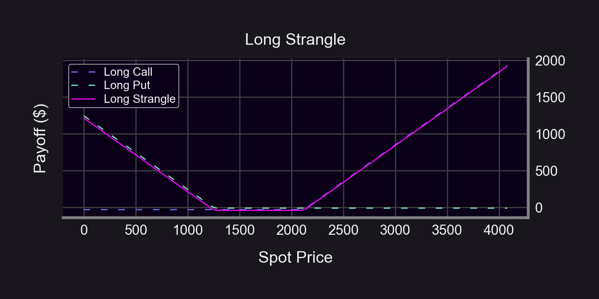
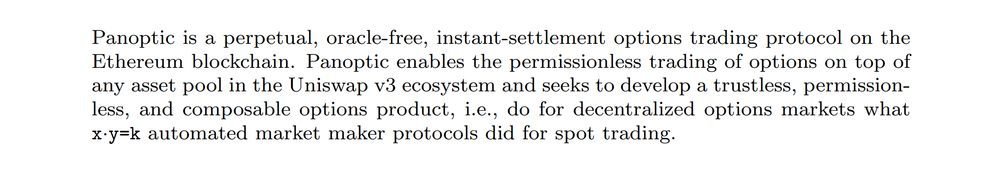

How to hedge ANYTHING (including UniV3 LP positions) with options 👇

Why options?
- Flexibility: Construct any payoff curve
- Greater protection: hedge against price going up AND down
- Capital efficiency: Low upfront cost for OTM puts/calls

Let's construct a hedge!

<!--truncate-->

### 1. Identify your strategy's position.

Assume initial ETH price is $1,000. Let's start with 1,000 USDC. We sell 50% of that for ETH:
- x0 = 0.5 ETH
- y0 = 500 USDC

We LP 0.5 ETH & 500 USDC in the ETH-USDC pool.

### 2. Calculate the payoff curve for your strategy's position.
- Uni v2 LP value: V = 2L√S + fees
- S = (Spot) price of ETH
- L = √(x0 * y0)

Subtract our initial capital:
- Payoff = 2L√S + fees - $1,000
- Derivation by [@p_e](https://twitter.com/p_e) [here](https://medium.com/auditless/how-to-calculate-impermanent-loss-full-derivation-803e8b2497b7)

And for Uni v3...
- A *bit* more complicated than Uni v2
- Formula (while in range) by [@guil_lambert](https://twitter.com/guil_lambert) [here](https://lambert-guillaume.medium.com/an-analysis-of-the-expected-value-of-the-impermanent-loss-in-uniswap-bfbfebbefed2)
- Example: r = 1.3 → ±30% LP range (see 🧵 for why)

<blockquote class="twitter-tweet" data-conversation="none">
1/13 Read our latest <a href="https://twitter.com/hashtag/ResearchBites?src=hash&amp;ref_src=twsrc%5Etfw">#ResearchBites</a> from <a href="https://twitter.com/brandonly1000?ref_src=twsrc%5Etfw">@brandonly1000</a> of the<a href="https://twitter.com/Panoptic_xyz?ref_src=twsrc%5Etfw">@Panoptic_xyz</a> research team!  ===== How do you LP on UniV3 with a ±% range?  E.g. if you wanted ±30% should you do:  1) Lower: P * 70%  Upper: P * 130%  or  2) Lower: P / 1.3  Upper: P * 1.3  Let&#39;s find out!👇 <a href="https://t.co/QChXAuIonz">pic.twitter.com/QChXAuIonz</a>
&mdash; Panoptic (@Panoptic_xyz) <a href="https://twitter.com/Panoptic_xyz/status/1615816389490802689?ref_src=twsrc%5Etfw">January 18, 2023</a></blockquote>  

 
$V(S)=\frac{2\sqrt{Kr}\left(\sqrt{S}-\sqrt{S_0}\right)-\left(S-S_0\right)}{r-1}+F,$

where
- $F\text{ = Accumulated fees},$
- $K=\sqrt{\text{PriceUpper}\cdot\text{PriceLower}},$
- $S_0=\text{Starting price},$
- $r=\sqrt{\frac{\text{PriceUpper}}{\text{PriceLower}}}$

### 3. Find an "inverted" payoff curve.

You want to hold a portfolio that pays the opposite. So just flip the payoff curve on its head. The goal is to flatten the curve into the pinkish line.

Example when r = 1.3 👇

### 4. Construct a portfolio replicating the inverse curve as closely as possible.

A long put option is a natural choice here since it benefits from $ movements down.

### 5. Finally, let's put them together.
Buy the hedge portfolio and hold it with your original position!

Assumptions:
- Initial ETH price = $1,000
- Long 1 ATM Put (strike = $1,000, DTE = 10)
- Put premium = $50
- LP fees = 3% ([r = 1.3 ⇔ DTE ≈ 10](https://lambert-guillaume.medium.com/how-to-create-a-perpetual-options-in-uniswap-v3-3c40007ccf1))

How'd we do?
- S < $1,000: hedged payoff is flatter (and positive at times!)
- S $\geq$ $1,000: hedged payoff is lower (due to premium)

Hedging always costs $. We need to earn enough fees to cover the hedge price.

# Summary
1. Understand how your position reacts to price changes
2. Find an opposite reaction
3. Figure out what assets you can hold to mimic the opposite reaction (this is your hedge!)
4. Buy the hedge (with Panoptic😉)!
5. Take comfort knowing you're protected🛡️

# What about impermanent loss (IL)?
- Notice we started with 100% of our capital in USDC.
- HODL portfolio of 100% USDC doesn't fluctuate
→ We already accounted for IL against a 100% USDC portfolio

But if we define IL against a 50/50 ETH-USDC HODL, we can hedge with a strangle:

# What about hedging with perps?

Pros:
- More liquid
- More asset listings
- Static delta (no gamma!)

Cons:
- Less flexible: can only short/long at current contract price
- Pay funding rate (if on the "wrong" side)
- Static delta (no gamma...)

# What about [hedging with Squeeth](https://my.itsa.global/blog/rudy-defi-insight-how-to-hedge-impermanent-loss)?

Pros:
- More liquid
- Able to completely hedge delta/gamma

Cons:
- Only works for ETH-stablecoin pools
- High funding rates

# What are the drawbacks to using options?
- Listings: no long-tailed assets on Deribit/OKX/Binance (just ETH/BTC)
- Illiquidity: lower liquidity on deep OTM options
- High maintenance: options expire + time decay

Panoptic solves this! Here's how 👇

Panoptic is permissionless:
- Listings: Permissionless pool creation on top of UniV3
- Liquidity: Permissionless LP for options at any strike price
- No expiry: XPOs are non-expiring, perpetual options

Read the whitepaper [here](https://paper.panoptic.xyz).

# Conclusion
Insights:
- LP positions look like short puts → LPers are selling options
- Only way to fully hedge an LP position is to short it

Only Panoptic enables shorting LP positions (any asset, any strike)!
- Broke: Hedging with expiring options
- Woke: Hedging with Panoptic XPOs

Disclaimer: This content is for educational purposes only and should not be relied upon as financial advice. Please DYOR!