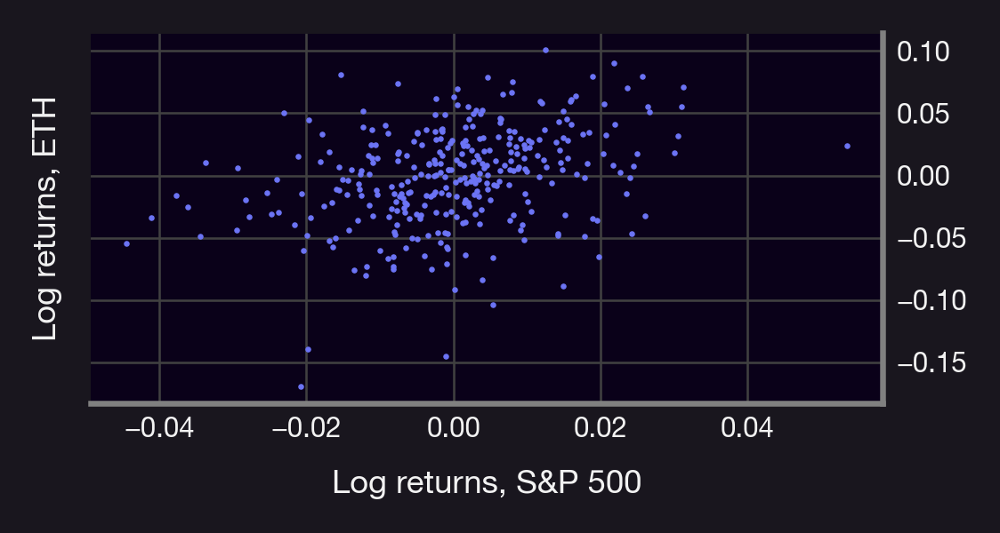
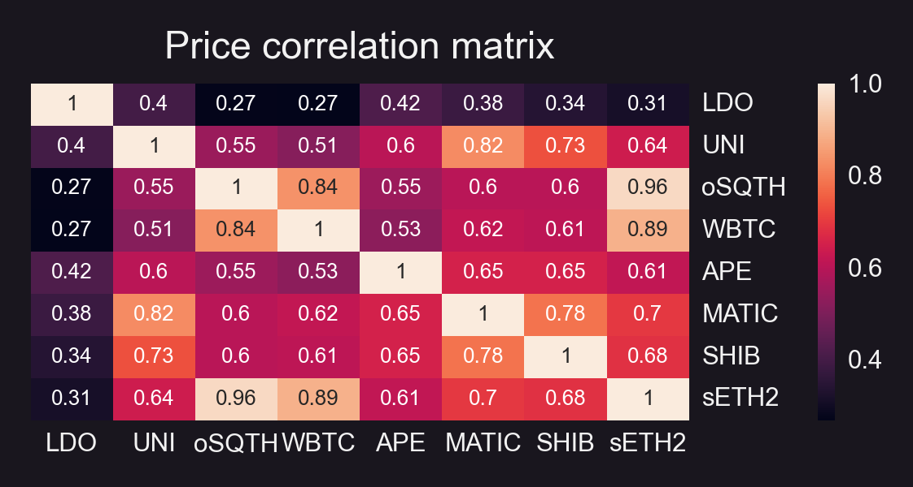
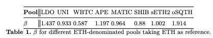

In this series, we will look at different (financial) Greeks.

Most know about alpha, but what about beta? How can we compute it? How can we use it to hedge our investments?

<!--truncate-->

---

First things first: Beta (β) measures the risk of an asset or portfolio, S, against the risk of a reference market index, M (e.g., S&P500). Furthermore, denote by $r_M$, and $r_S$ the rate of returns of M and S, respectively, and by $r_{M,t}$, $r_{S,t}$ the returns at some time $t$.

Lastly, assume that the following relation between $r_{M,t}, r_{S,t}$ holds true:

See the mathematical definition below👇🤓

$r_{s,t}=\alpha + \beta(S,M) r_{M,t}+x_t$

With x some random error with mean 0. It follows from the previous equation that the _Beta of S with respect to M_ (denoted by `β(S;M)` ) can be found using ordinary least squares and it’s given by:

$\beta(S;M):=\frac{\mathsf{Covariance}(r_S,r_m)}{\mathsf{Variance}(r_m)}$

denoted by $σ_A$ the volatility of an asset A, it then follows that β(S;M) can be written in terms of the correlation of S and M (denoted by ρ_{S,M}) as follows:

$\beta(S;M)=\frac{\mathsf{Covariance}(r_S,r_M)}{\mathsf{Variance}(r_M)}$

$=\frac{\mathsf{Covariance}(r_S,r_M)}{\sqrt{\mathsf{Variance}(r_M)\mathsf{Variance}(r_M)}}\frac{\sqrt{\mathsf{Variance}(r_S)}}{\sqrt{\mathsf{Variance}(r_S)}}$

$=\underbrace{\frac{\mathsf{Covariance}(r_S,r_M)}{\sqrt{\mathsf{Variance}(r_M)}\sqrt{\mathsf{Variance}(r_S)}}}_{:=\rho_{S,M}, \text{ the correlation}}\frac{\sqrt{\mathsf{Variance}(r_S)}}{\sqrt{\mathsf{Variance}(r_M)}}$

$=\rho_{S,M}\frac{\sigma_S}{\sigma_M}$

Beta increases w/correlation & relative risk (ratio of volatilities).

How can we interpret this? If:
-   β = 1.5 ⇒ The asset S increases 1.5% for each 1% increase in the index M
-   β = 0.5 ⇒ S increases 0.5% for each 1% increase in M
-   β = -1.5 ⇒S decreases 1.5% for each 1% increase in M
    

Let's take ETH and SPY as an example and compute daily returns using close prices. We get:
-   correlation(ETH; SPY) = 0.33
-   volatility(ETH) = 0.037
-   volatility(SPY) = 0.013
-   ⇒ β(ETH; SPY) = 1.239
    
⚠️Spoiler alert: ETH is more volatile than the SPY

From 👆, a 1% price move in SPY, implies a 1.2% price move in ETH.

However, comparing ETH to SPY is like comparing apples to oranges! Let's look look at token prices in UniV3 pools. (Psst! [here](https://panoptic.xyz/research/get-uniswap-on-chain-data-tutorial)'s a tutorial describing how to obtain these prices using Python and GBQ 😉)

We get the (1h) average token price of the following pools (all pools are at 0.3%):
-   LDO-WETH
-   UNI-WETH
-   WBTC-WETH
-   APE-WETH
-   MATIC-WETH
-   SHIB-WETH
-   WETH-sETH2
-   WETH-oSQTH

using ETH as the index M.

Note: All prices are converted to USDC using the USDC-WETH-0.3% pool price.

We obtain the following insights:
-   Betas ranging from 0.587 (WBTC) to 1.914 (oSQTH)
-   All betas considered are positive ⇒ prices (USD) positively correlated (see heatmap)
-   β(SHIB; ETH) < 1, not bad for a meme coin 🤭
    

Note: 👆would change if we take a different index!

Ok, but how can we use this?

Investing in any asset entails two types of risk:

1.  Unsystematic: related to the asset & industry
2.  Systematic: related to market & macro factors
    

We can hedge against (1) by portfolio diversification. We can use beta to hedge against (2). How can we hedge against market risk (for a given M)?

If we hold a portfolio S, shorting $V * β(S; M)$ worth of M (with V = value of portfolio) would cancel out the market risk (see derivation below👇🤓) Canceling out this risk means that our returns are independent of M! Indeed, let $V$ denote the value of the portfolio. Recall that:

$r_{S,t} = a + \beta(S; M) * r_{M,t} +x_t,\quad \mathbb{E}[x_t]=0\ \forall t\geq 0.$

Then, if the portfolio holder shorts $V * β(S; M)$ units of M, their returns are independent of the market M, indeed, in this case the total returns would be:

$r_{S',t}:= r_{S,t}-\beta(S; M)r_{M,t}=a + \beta(S; M) r_{M,t} +x_t-\beta(S; M)r_{M,t}=a+x_t,$

which is independent of M. Furthermore, since x has mean 0,, it then follows that $E[r_{S'}]=a$, i.e., the expected returns are given by $a$.

Caveats:
-   β measures risk wrt a market index M. Different markets = different β
-   No SPY equivalent in DeFi means that we'd need to construct a given M when β-hedging cryptos.
-   Can also use β to hedge options, but it's more complicated (we'll discuss this soon 😉)