We analyzed simulated LP performance on ETH-USDC 0.3% pool. Results were surprising: the optimal width was wider than expected! 📢
- What's the optimal width for max returns?
- How does that change for 🐂 vs 🐻 markets?

Find out 👇

<!--truncate-->

### LP Strategy
The strategy is simple:
- 💦 LP around the current ETH price with ±X% width
- ⚖️ Rebalance your LP position after a day, week, or month (you pick)
- 💵 Collect & compound your fees!

Our analysis includes >1.5 years of data (Jun 2021 - Jan 2023) on 5 different range factors:
- ±5% (r = 1.05)
- ±20% (r = 1.2)
- ±50% (r = 1.5)
- ±75% (r = 1.75)
- ∞ (UniV2 full-range, r = 1000)

<blockquote class="twitter-tweet" data-conversation="none">
1/13 Read our latest <a href="https://twitter.com/hashtag/ResearchBites?src=hash&amp;ref_src=twsrc%5Etfw">#ResearchBites</a> from <a href="https://twitter.com/brandonly1000?ref_src=twsrc%5Etfw">@brandonly1000</a> of the<a href="https://twitter.com/Panoptic_xyz?ref_src=twsrc%5Etfw">@Panoptic_xyz</a> research team!  ===== How do you LP on UniV3 with a ±% range?  E.g. if you wanted ±30% should you do:  1) Lower: P * 70%  Upper: P * 130%  or  2) Lower: P / 1.3  Upper: P * 1.3  Let&#39;s find out!👇 <a href="https://t.co/QChXAuIonz">pic.twitter.com/QChXAuIonz</a>
&mdash; Panoptic (@Panoptic_xyz) <a href="https://twitter.com/Panoptic_xyz/status/1615816389490802689?ref_src=twsrc%5Etfw">January 18, 2023</a></blockquote>  

Which one did best?🤔

### Full Period Results
For the FULL period (Jun 2021 - Jan 2023):
- Daily rebalancing: r* = ∞ (full range)
- Weekly rebalancing: r* = 1.5
- Monthly rebalancing: r* = ∞ (full range)

LPs end up w/negative returns for this pool, but were raking in $ during the bull market (~40% returns in < 6 months)

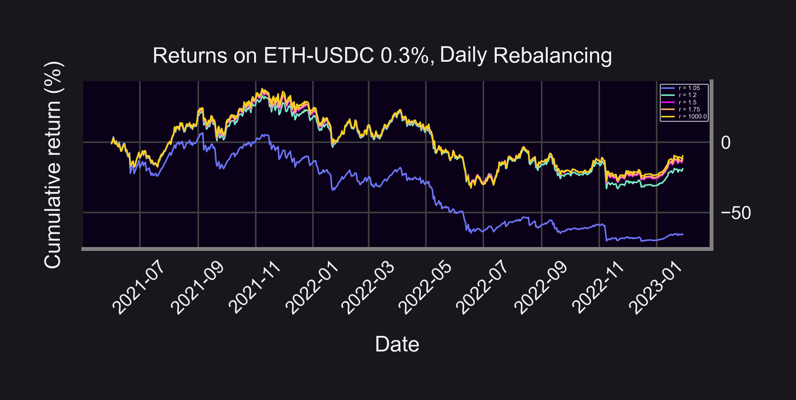
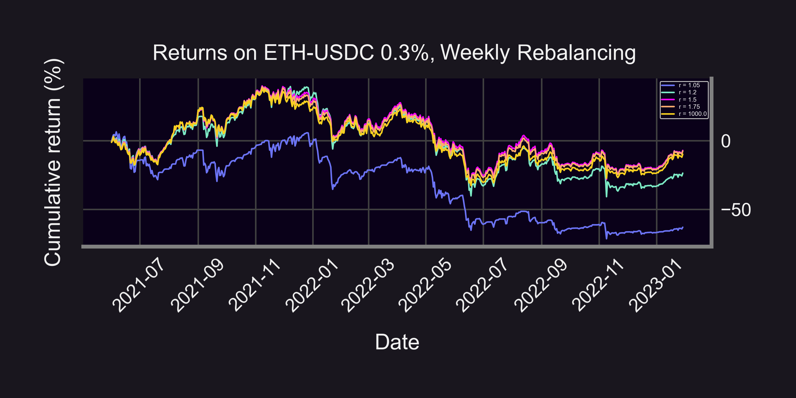
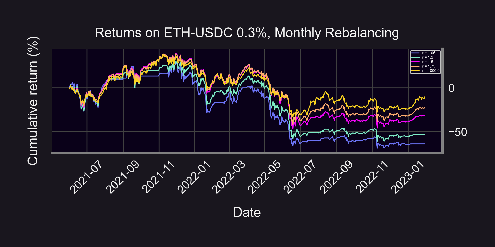

### Bull Market Results
For the 🐂 market (Jun 2021 - Mar 2022):
- Daily rebalancing: r* = 1.5 - ∞
- Weekly rebalancing: r* = 1.5
- Monthly rebalancing: r* = 1.75

LPs end up positive! (~20% returns in 10 months)

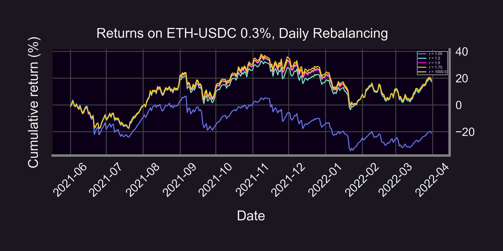
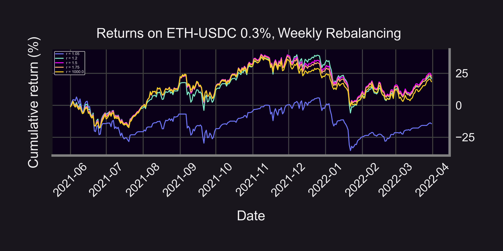
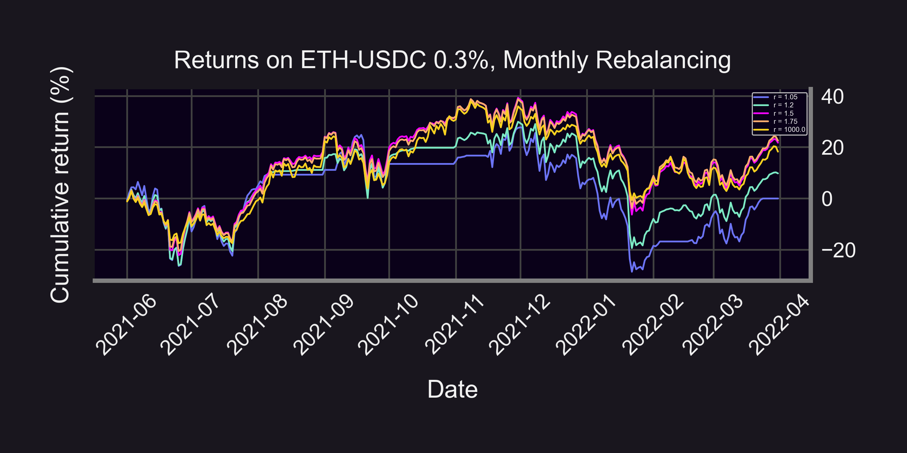

### Bear Market Results
For the 🐻 market (Apr 2022 - Jan 2023):
- Daily rebalancing: r* = ∞
- Weekly rebalancing: r* = 1.75 - ∞
- Monthly rebalancing: r* = ∞

LPs end up negative (-24% returns in 10 months, but compare that to -55% returns on ETH!)

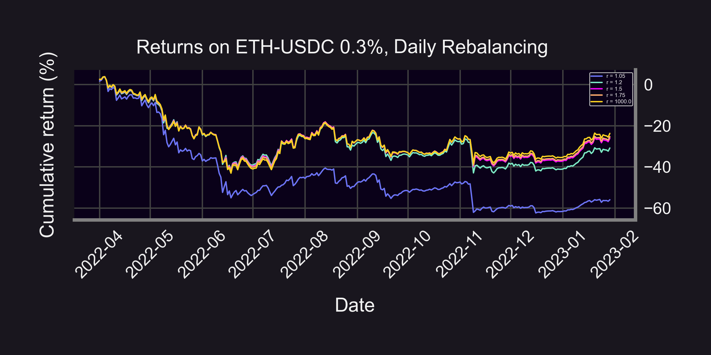
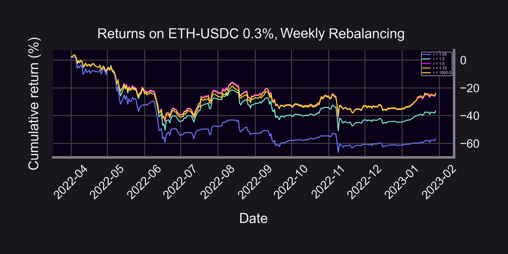
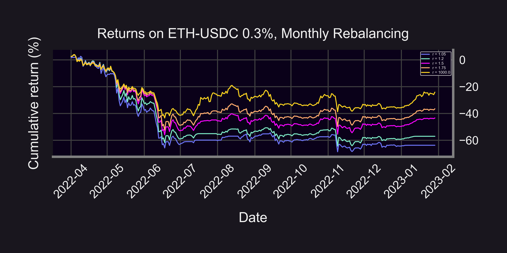

During 🐂 market, optimal range was tighter (r = 1.5 - 1.75). But during 🐻 market, optimal range was wider (r = 1.75 - ∞). Here's why 👇

### Summary
Tight range:
- 🤑 "Greedy"
- 🚀 More fees! (~6,000% cumulative fees in 1.5 years, r = 1.05)
- 💩 Buy losing asset faster, sell winning asset faster

Wide range:
- 🦺 "Safe"
- 🚀 Buy losing asset slower, sell winning asset slower
- 💩 Less fees (16% cumulative fees, r = ∞)

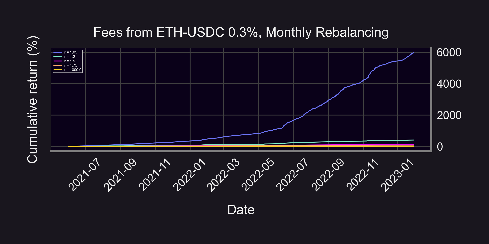
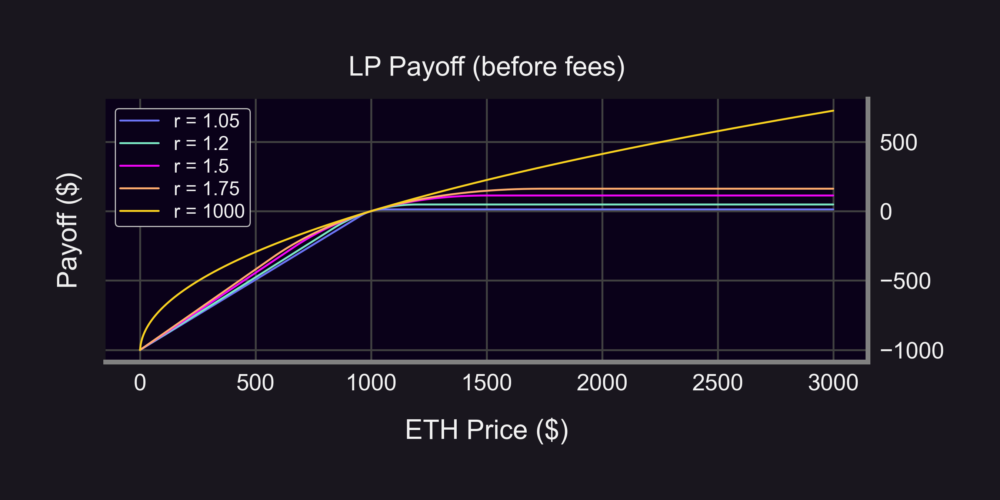

There's a tradeoff in choosing r:
- ⬆️ fees ⬇️ payoffs
or
- ⬇️ fees ⬆️ payoffs

[@guil_lambert](https://twitter.com/guil_lambert) has a good "[Guide For Choosing Optimal Uniswap V3 LP Positions](https://lambert-guillaume.medium.com/a-guide-for-choosing-optimal-uniswap-v3-lp-positions-part-1-842b470d2261)" 👇

- ✅ Gives probability of landing ITM
- ❌ Doesn't account for where we land ITM
- ❌ Doesn't account for time spent ITM

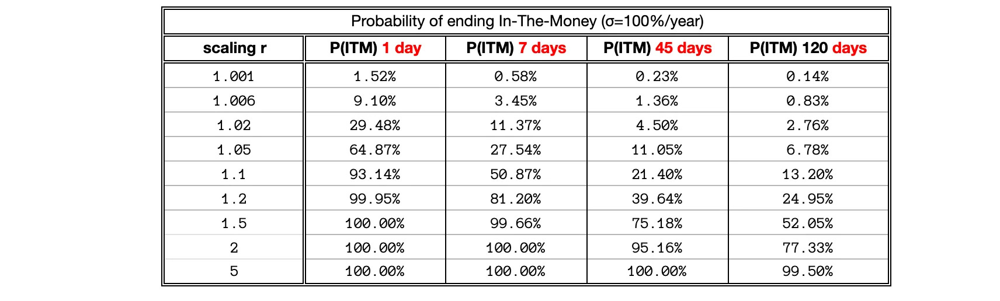

Caveats:
- ⛽ Ignores gas & rebalancing fees
- 📈 Assumes fees/returns compound day-over-day
- ⚠️ Past performance is no guarantee of future results!

Questions:
- 🌊 What about other pools? (🦄, ₿, SHIB, ...) 
- ⚖️ What about stablecoin pools?

<blockquote class="twitter-tweet" data-coversation="none">
Well it turns out ALL performed extremely well: 700% returns for the long/vanilla LP strategy over the past 2 years!   Even the short strategy gained 400%  What&#39;s going on here? Why are returns so high? <a href="https://t.co/YJ17pSFs3D">pic.twitter.com/YJ17pSFs3D</a>
&mdash; Guillaume Lambert | lambert.eth | 🦇🔊 (@guil_lambert) <a href="https://twitter.com/guil_lambert/status/1619046939307433984?ref_src=twsrc%5Etfw">January 27, 2023</a></blockquote> 

Disclaimer:
- 📢 None of this should be taken as financial advice.
- ⚠️ Past performance is no guarantee of future results!