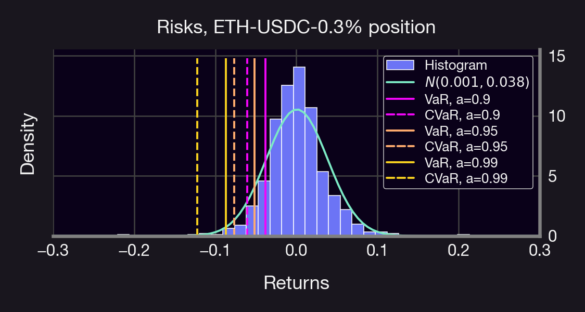
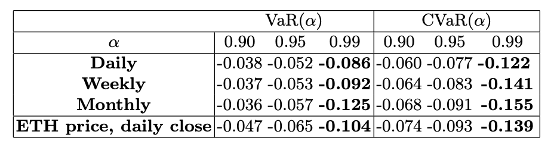

How do you know if one LP position or portfolio is riskier than another? Is LPing riskier than HODLing? We will discuss different types of risk, how to interpret them, and how to hedge them. Let's dive in!

<!--truncate-->

---

Risk measures (RMs) are crucial in assessing the stability and performance of a portfolio, and they can be used to guide investment decisions. When providing liquidity on Uni V3, there are several key risks to consider such as volatility, market risk, etc.

Some commonly used risk measures are:
-   Beta (β)
-   Value-at-Risk (VaR)
-   Conditional Value-at-Risk (CVaR)

All of these measures are related to the volatility of the portfolio. In particular, high volatility typically implies high risk. Let's discuss them in more detail.

Beta (β) measures the risk of a portfolio against the risk of a reference market index. While it's tricky to choose a reference market in crypto (as there's no SPY equivalent), we can always compare against BTC, ETH, or a portfolio. Check out our recent article on beta [here](https://panoptic.xyz/research/greeks-series-beta).

VaR calculates the maximum loss that a portfolio is expected to suffer within a certain confidence level over a given time horizon. It's calculated by taking the expected value of the losses divided by the probability of those losses occurring. More precisely, let $X$ be a random variable representing a PnL distribution. The VaR at a level α between (0,1), is the smallest number $y$ such that the probability that $Y=-X$ does not exceed $y$ is at least $1-α$. Mathematically, $VaR_α$ is the $1-α$ quantile of $Y$, i.e.,

$\text{VaR}_\alpha(X)=-\inf\left\{x\in\mathbb{R}: F_X(x)>\alpha\right\}=F^{-1}_Y(1-α)$

with F the cumulative distribution function of X.

CVaR (AKA expected shortfall) is an extension of VaR that quantifies the average loss over a specified time period of *unlikely scenarios beyond the confidence level.*

Example: If CVaR at a 99% conf. level is 1Ξ → We expect the 1% worst losses to be 1Ξ

$\text{CVaR}_\alpha(X)=-\frac{1}{\alpha}\int_0^\alpha \text{VaR}_\gamma(X)\mathrm{d}\gamma=-\frac{1}{\alpha}\int_{-\infty}^{-\text{VaR}_\alpha}x \mathrm{d} F_X$

Example: Suppose we have 1 ETH which we deploy on the ETH-USDC 0.3% Uni V3 pool. We deploy our LP position at the current price, at a width r = 1.3. In addition, we redeploy our position every
-   Day
-   Week
-   Month

Which strategy is the riskiest (see ["Optimal LP Width in Bull/Bear Markets"](https://panoptic.xyz/research/uniswap-lp-width) for reference)? We obtained the following results:
-   VaR ranges from 3.8% - 12.5% losses & CVaR from 6.1% - 15% losses
-   👆 means that the expected maximum loss is around those ranges
-   Daily rebalance is slightly less risky than holding ETH

Additionally:
-   In general, longer rebalancing period = larger risk
-   Larger α: larger risk
-   Risk of HODLing ETH over 1 day: VaR = 10%, CVaR = 14%
    
Plus an interesting conclusion:
> ETH-Stablecoin LP strategies are less risky than HODLing ETH.

Why? Intuitively, LP returns offset risk!

In summary, risk measures are used to make informed investment decisions, set risk management policies, and evaluate portfolio performance. Thus, a comprehensive understanding of RMs is essential for effective risk management. There's a caveat we haven't discussed.

RMs are based on historical data and can't predict future market movements. This means RMs are - in a way - biased towards the past. One way of alleviating this is to simulate forward paths using Monte Carlo methods. We'll release a tutorial on this shortly. Now that we know what risk measures are, in an upcoming topic we will discuss how to use them for hedging and position management 😉