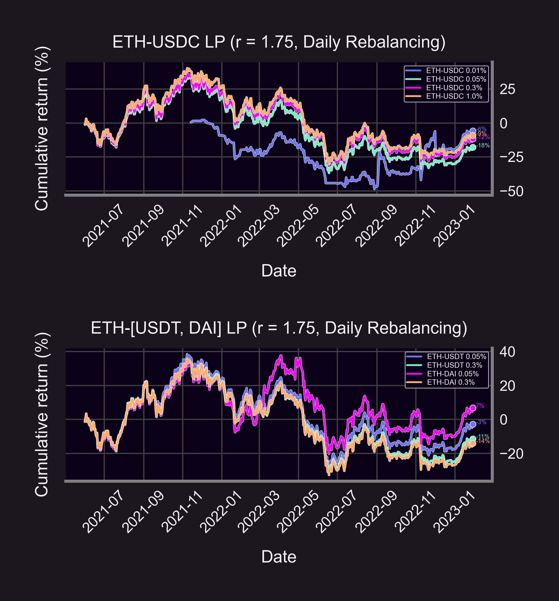
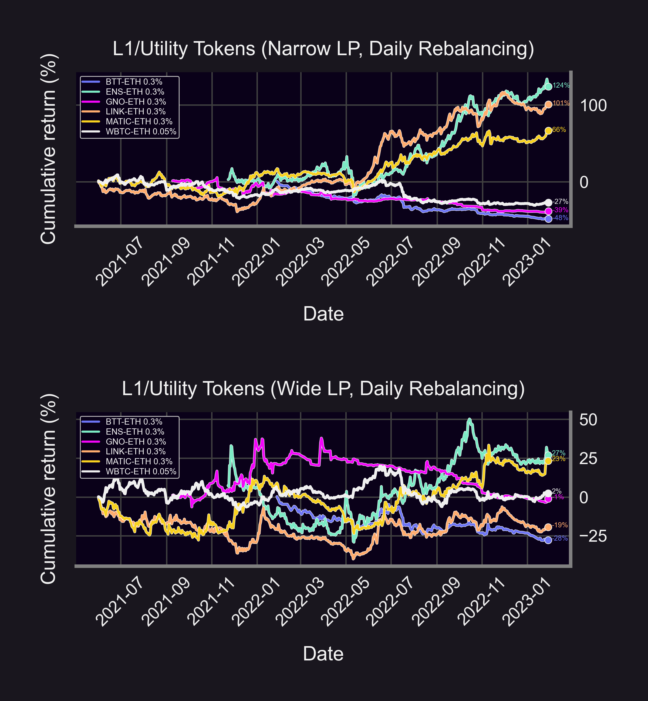
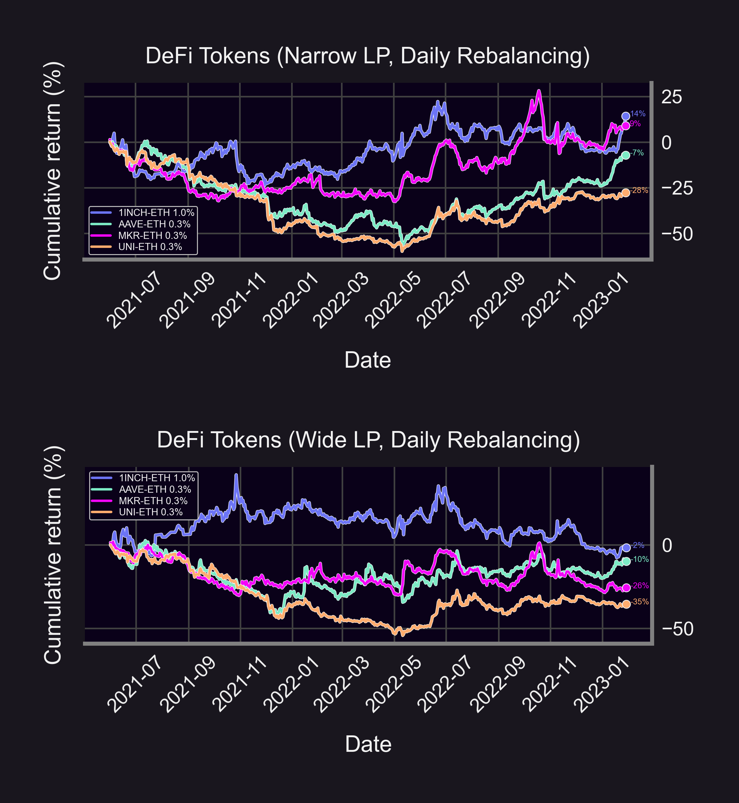
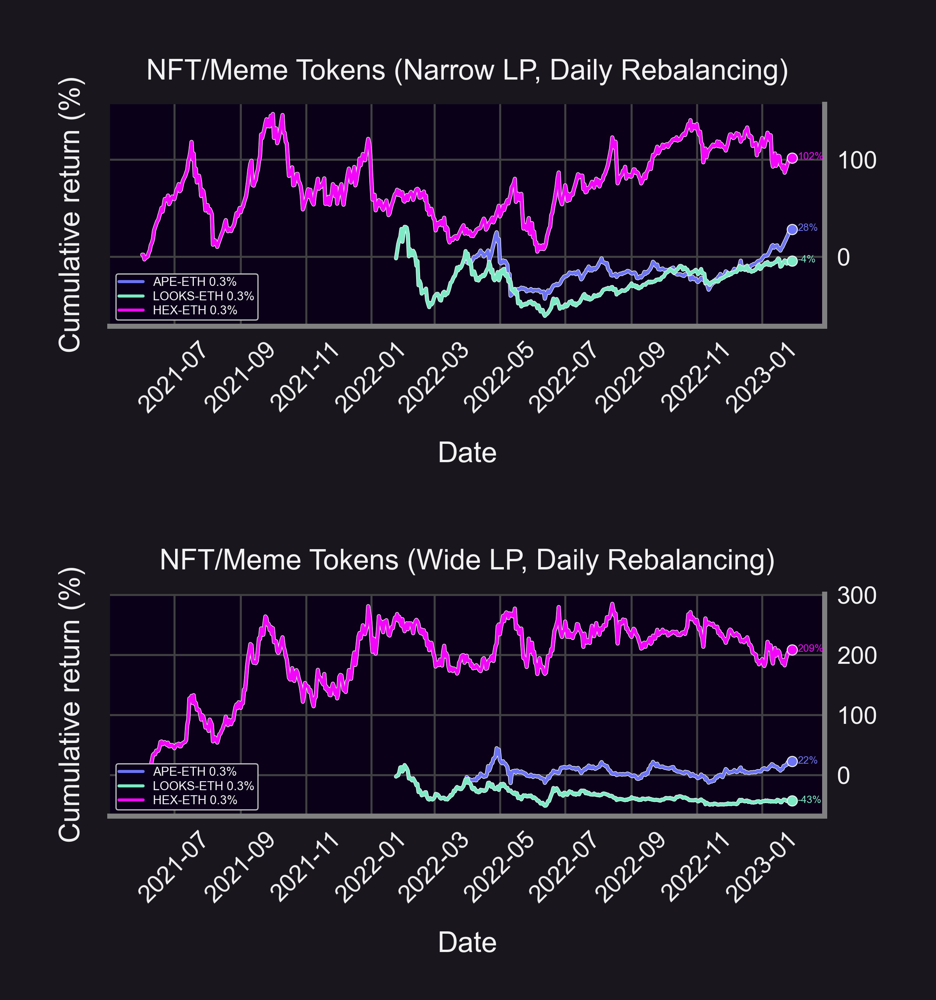
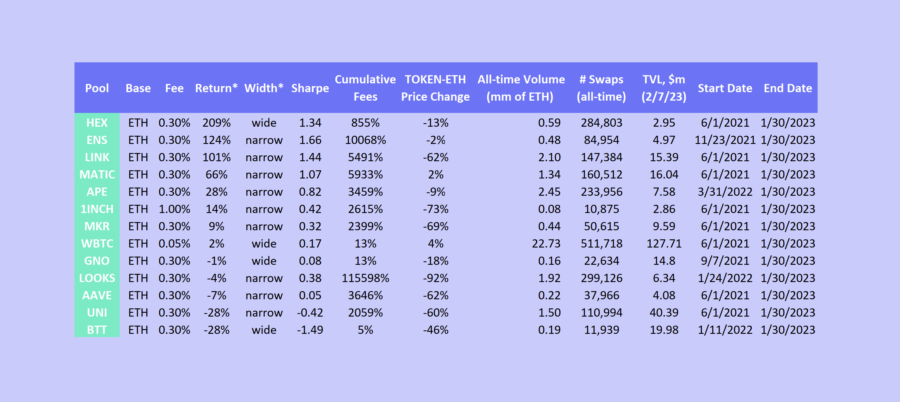

We simulated LP performance for 21 popular Uni V3 pools (high TVL & volume). Results were surprising: LPs can be profitable! 📢

- 💰 Which pools made the most?
- 📏 Are narrow or wide ranges better?

Find out 👇

<!--truncate-->

### Backtest Strategy

Previously, we explored the ETH-USDC 30bps pool.

<blockquote class="twitter-tweet" data-coversation="none">
1/12 We analyzed simulated LP performance on ETH-USDC 0.3% pool.  Results were surprising: 📢 The optimal width was wider than expected.  • What&#39;s the optimal width for max returns? • How does that change for 🐂 vs 🐻 markets?  Find out 👇
&mdash; Panoptic (@Panoptic_xyz) <a href="https://twitter.com/Panoptic_xyz/status/1621252130815483904?ref_src=twsrc%5Etfw">February 2, 2023</a></blockquote> 

For this study:

- 🗓️ Jun 2021 - Jan 2023 (20 months) for most pools
- ⚖️ Daily rebalancing
- 📏 Narrow (r = 1.05) & wide (r = 1.75) ranges

Here's how other ETH-stablecoin pools compare👇

### ETH-Stablecoin Pools
Bad pools 😔 (but can you spot the good pool 🐶?)
- ETH-USDC (5bps): -18%
- ETH-DAI (30bps): -14%
- ETH-USDC (30bps): -12%
- ETH-USDT (30bps): -11%
- ETH-USDC (100bps): -9%
- ETH-USDC (1bp): -6%
- ETH-USDT (5bps): -3%
- ETH-DAI (5bps): +7%

(Returns in stablecoin)

### L1/Utility Tokens
We lump some pools together and slap the label "L1/Utility Tokens" on 'em (see legend 👇 for pool details)

Good pools:
- 😊 MATIC (+66%, narrow)
- 😍 LINK (+101%, narrow)
- 🤩 ENS (+124%, narrow)

Bad pools:
- 😦 WBTC (+2%, wide)
- 😢 GNO (-1%, wide)
- 😭 BTT (-28%, wide)

### DeFi Tokens
Now for DeFi.

Good pools:
- 🙂 MKR (+9%, narrow)
- 😎 1INCH (+14%, narrow)

Bad pools:
- 😕 AAVE (-7%, narrow)
- 🙁 UNI (-28%, narrow)

### NFT/Meme Tokens
And NFT/Meme tokens???

Good pools:
- 😅 APE (+28%, narrow)
- 🤣 HEX (+209%, wide)

Bad pools:
- 😶 LOOKS (-4%, narrow)

For ERC20-ETH pools, returns are in ETH. Even if we earn 209% in ETH, if ETH price in $ is falling, we might lose in terms of $. But you can always hedge by shorting ETH! (Panoptic sooon!)

(What if we calculated returns in the ERC20 token...future #ResearchBites? 😉)

<blockquote class="twitter-tweet" data-conversation="none">
1/18 Read our latest: <a href="https://twitter.com/hashtag/ResearchBites?src=hash&amp;ref_src=twsrc%5Etfw">#ResearchBites</a> from <a href="https://twitter.com/brandonly1000?ref_src=twsrc%5Etfw">@brandonly1000</a> of the <a href="https://twitter.com/Panoptic_xyz?ref_src=twsrc%5Etfw">@Panoptic_xyz</a> research team!  =====  How to hedge ANYTHING (including UniV3 LP positions) with options 👇
&mdash; Panoptic (@Panoptic_xyz) <a href="https://twitter.com/Panoptic_xyz/status/1618353035138457600?ref_src=twsrc%5Etfw">January 25, 2023</a></blockquote> 

### Summary
Key Insights:
- 💀 $\frac{7}{8}$ ETH-stablecoin pools underperformed (too popular?)
- 🏆 $\frac{8}{13}$ ERC20-ETH pools outperformed (not enough ❤️)

Common traits for outperforming strategies:
- Narrow LP range
- Minimal pool price change
- ⬆️ Volume ⬇️ TVL

Caveats:
- ⛽ Ignores gas/slippage/swap fees
- 📈 Assumes fees/returns compound day-over-day
- ⚠️ Past performance is no guarantee of future results!

Question:
- 🐂🐻 What if we LP with bullish or bearish bias? (Future #ResearchBites 😉)

<blockquote class="twitter-tweet" data-conversation="none">
I&#39;ve created a couple of flowcharts to help beginners deploy+manage their <a href="https://twitter.com/Uniswap?ref_src=twsrc%5Etfw">@Uniswap</a> v3 liquidity position.  •Part 1: Choosing a size+range for a given holding timeline –eg. 1d, 1w, 1 mo, 1y?  •Part 2: Managing LP positions via daily checks –ie. when to exit position+take profits <a href="https://t.co/Y6mPe8Cp28">pic.twitter.com/Y6mPe8Cp28</a>
&mdash; Guillaume Lambert | lambert.eth | 🦇🔊 (@guil_lambert) <a href="https://twitter.com/guil_lambert/status/1484186937736970240?ref_src=twsrc%5Etfw">January 20, 2022</a></blockquote> 

Disclaimer:
- 📢 None of this should be taken as financial advice.
- ⚠️ Past performance is no guarantee of future results!