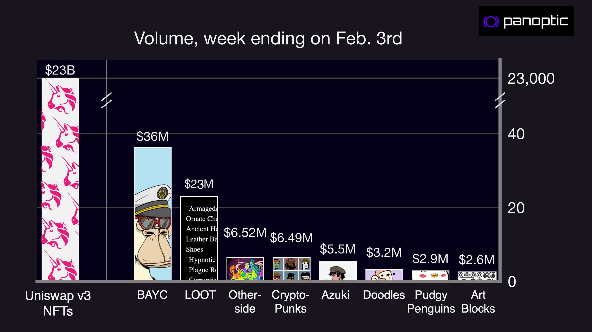
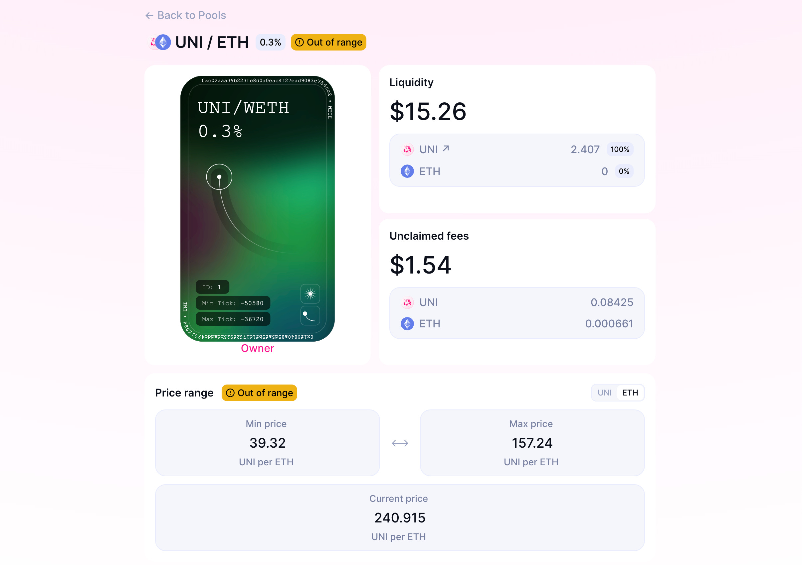
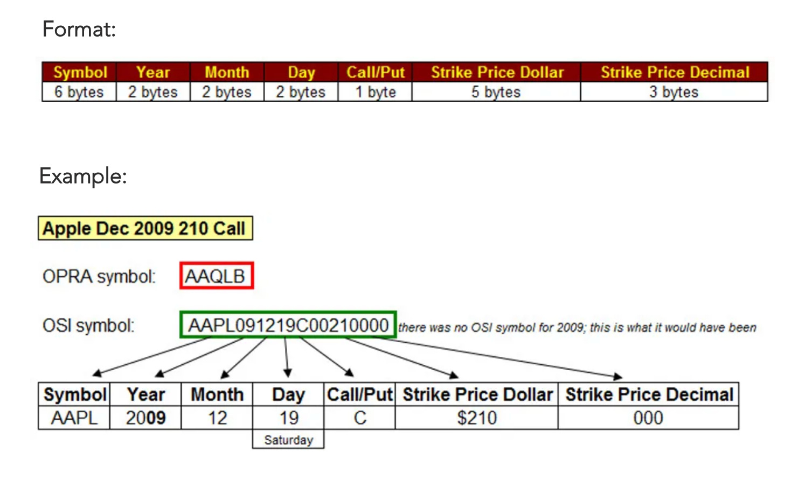
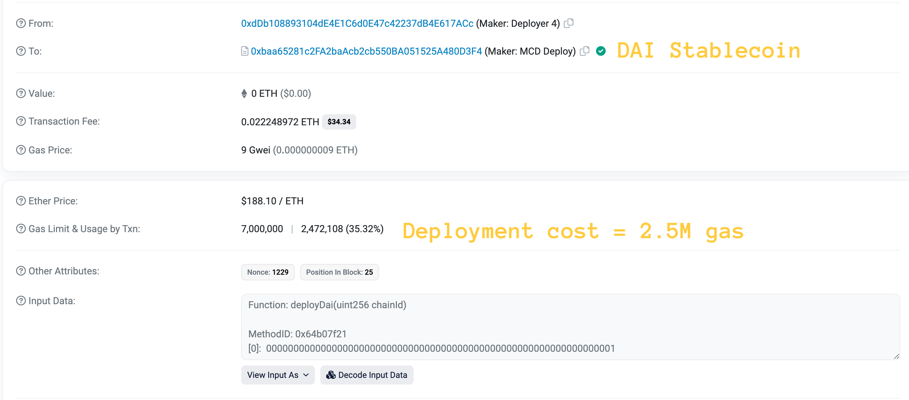
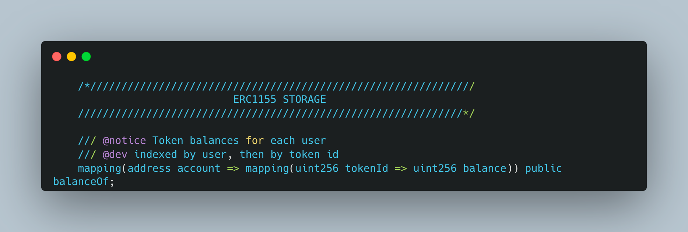
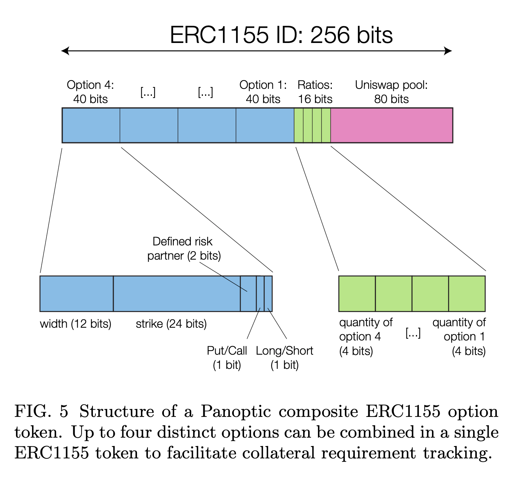
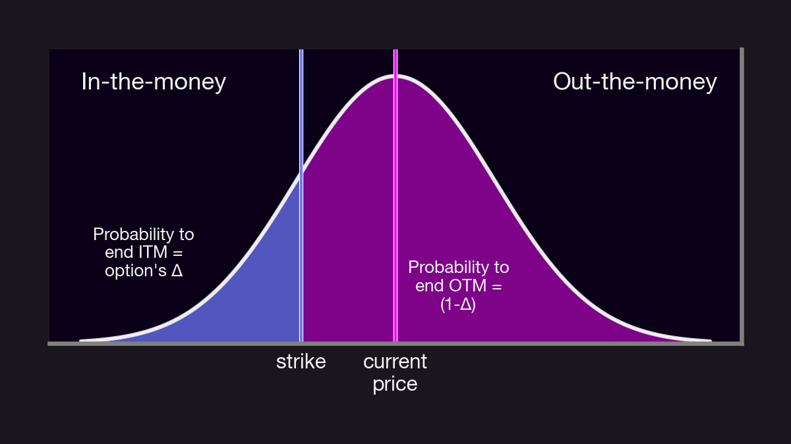

The weekly volume on all NFT trading platforms was $120M last week. This includes BAYC, CryptoPunks, LOOT, Azuki, etc. But...$23 billion (yes, with a B) of value was traded on Uni V3 as financial NFTs 📈

Here's 8 reasons why Panoptic is bullish on financial NFTs:

<!--truncate-->

---

### Uni V3 as a Financial NFT Platform

First of all: why is Uni V3 a financial NFT platform? Liquidity in Uni V3 is deployed under a price range, which means LP positions are non-fungible and can't be tracked using ERC20s. Instead, Uniswap issues an ERC721 to track the funds controlled by each LP position.

#### Reason 1: Most derivatives in TradFi *are* NFTs.

Futures contracts expire at a set date, and each underlying has multiple tickers. The Canadian dollar futures \6CH3 (exp. MAR-23) is different than the \6CM3 (JUN-23).

Options follow the OSI standard for exp, strikes, etc.

#### Reason 2: Tracking value using NFTs rather than ERC20 tokens does not require deploying new contracts.

Each ERC20 is its own smart contract. So an application that requires the tracking of multiple expiries/strikes/sizes will need to deploy many new contracts⛽️

#### Reason 3: the ERC1155 standard extends the capabilities of NFTs to enable "semi-fungibility".

The balance of any ERC1155 token can be anything from 0 to 2^256 (compared to 1 for ERC721). Each NFT is unique but can have a balance that tracks size or liquidity, for instance.

#### Reason 4: The token ID of an ERC1155 is a uint256 that can encode information.

In Panoptic, we encode info about the options positions inside its token ID. Each token encodes up to 4 legs which facilitates collateral computation for defined/undefined risk positions.

#### Reason 5: Non-fungible positions give more freedom to users.

Would everyone only want to trade the same 10∆ puts? Of course not!

Options traders trade at a strike + expiry that match their risk tolerance. User-defined ERC1155s don't lock anyone into a specific strategy.

#### Reason 6: Financial NFTs can be traded on platforms like OpenSea.

Just like any NFT, Uni V3 LP positions can be traded between users — often at a large loss! 👇

<blockquote class="twitter-tweet">
Someone created a <a href="https://twitter.com/Uniswap?ref_src=twsrc%5Etfw">@Uniswap</a> V3 LP position worth $127,000 and sold the NFT representing that liquidity on <a href="https://twitter.com/rariblecom?ref_src=twsrc%5Etfw">@rariblecom</a> for 1ETH😱  Liquidity deposit:<a href="https://t.co/vEVypdrE7j">https://t.co/vEVypdrE7j</a>  Sale on Opensea (easier to see):<a href="https://t.co/aePuxUx0MX">https://t.co/aePuxUx0MX</a>  Liquidity withdrawn:<a href="https://t.co/CIg2nF3fn5">https://t.co/CIg2nF3fn5</a> <a href="https://t.co/CFOCTRn4SN">pic.twitter.com/CFOCTRn4SN</a>
&mdash; JuanSnow (@JuanSnow) <a href="https://twitter.com/JuanSnow/status/1391114572623319041?ref_src=twsrc%5Etfw">May 8, 2021</a></blockquote> 

#### Reason 7: URI metadata can be used to add context to a transaction.

While the URI metadata of a PFP NFT will point to a specific JPEG, financial NFTs can use that slot to store information about the transaction itself — PnL graph, entry/exit prices, pool liquidity, etc.

#### Reason 8: Options protocols like Panoptic have to use financial NFTs.

Uni V3 was a true pioneer in the world of financial NFTs. >$1T in total volume to date!

Panoptic will follow suit by making trading and minting of LP positions easier using the ERC1155 standard.

---

Panoptic is a protocol that enables anyone to buy and sell options on any asset tradable on Uniswap. Panoptic will unleash the true potential of Uniswap V3 as an options protocol.

You can learn more about Panoptic by reading our [docs](https://docs.panoptic.xyz/) and [whitepaper](https://paper.panoptic.xyz/).