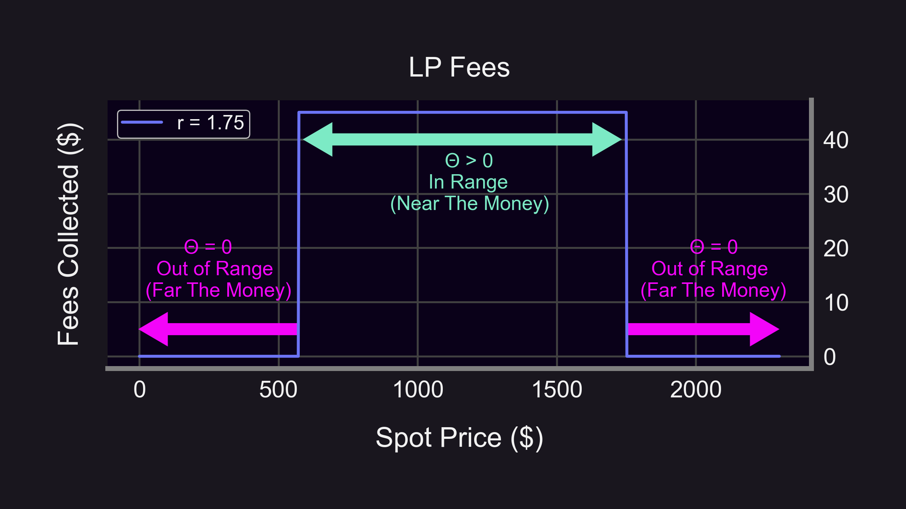
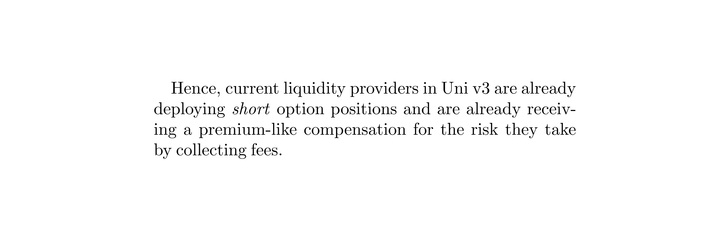
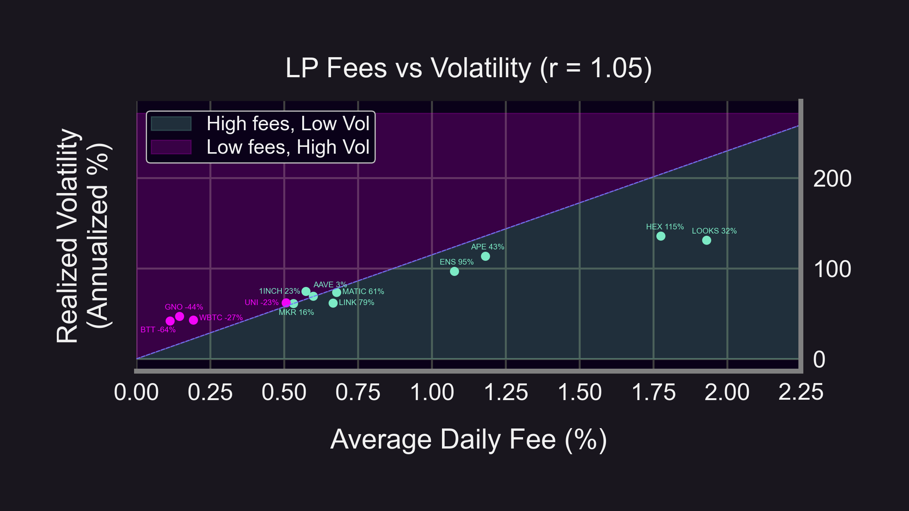
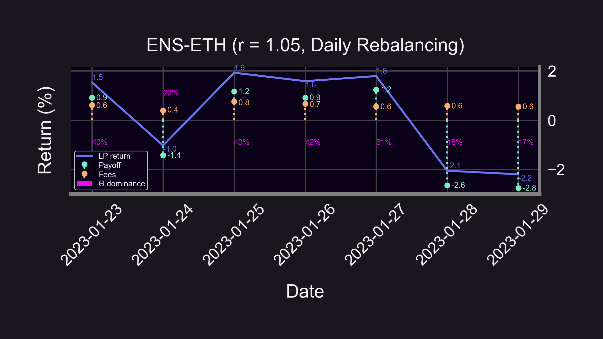
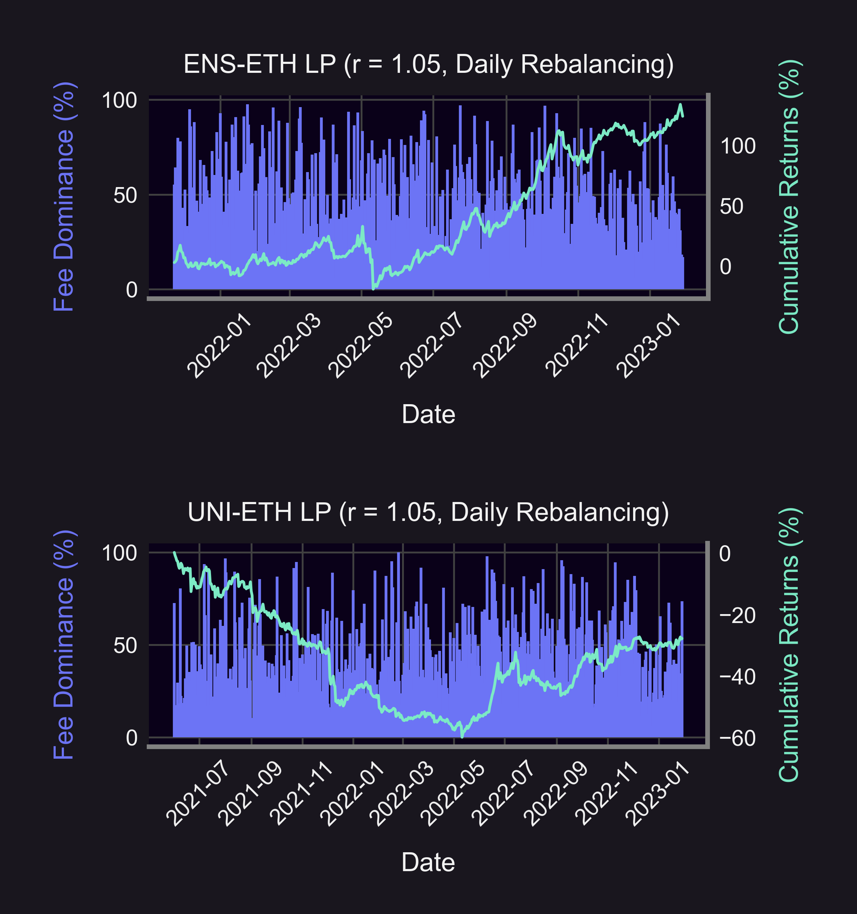
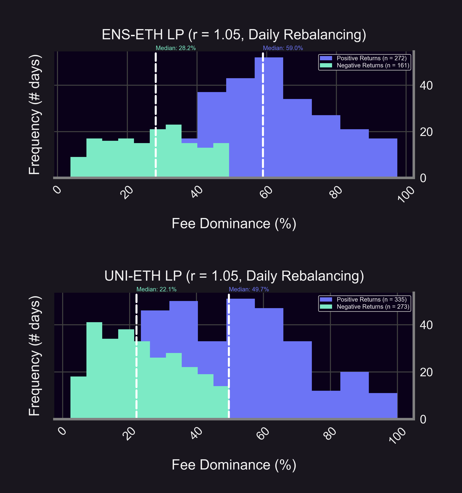
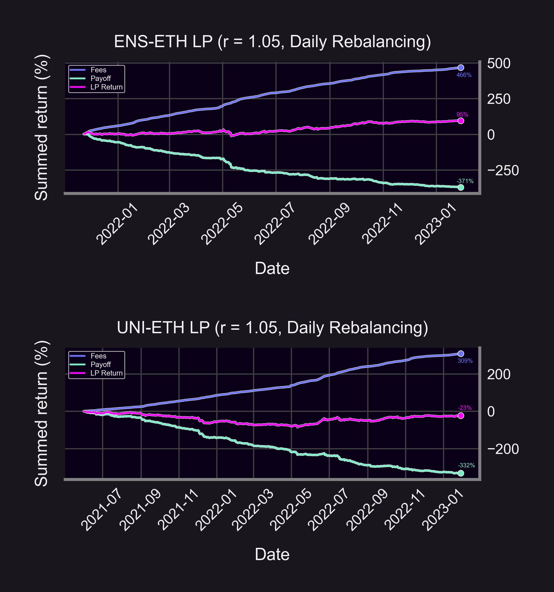

Why are some pools good 🐶 and other pools bad 😈?

The answer comes from breaking down LP profits into:
- Price changes 📈
- Fees collected 🎟️

By comparing LPs to options, we discover parallel insights — let's explore!

<!--truncate-->
### Price changes
- ⬆️ Price up: positive return
- ⬇️ Price down: negative return
- ⤵️ Payoff determined by delta (Δ) & gamma (Γ) of LP position

Why use options terminology (Δ & Γ) for LPs? Hint: that payoff looks awfully like a short put option!

### Fees collected
Fees collected are determined by the theta (Θ) of the LP position.
- 🕒 Θ: Rate of time decay (dV/dτ)
- 💰 dV = fees collected
- 🧊 dτ = 1 block
→ Θ = fees per block 🤯

- ✅ Near the money: Θ > 0
- ❌ Far the money: Θ = 0

### Implied Volatility vs. Realized Volatility
In TradFi, options selling is more profitable when Implied Volatility (IV) > Realized Volatility (RV). Can we compare IV-RV for LPs?

Yes! But let's use fees instead of IVs since:
- Easier calculation 🧮
- Fees collected ⇔ options premia 👇
- ⬆️ options premia ⇔ ⬆️ IV

Results match TradFi! 👇
- 🐶 Good pools (green dots): lie below the line, compensated by high fees given volatility ("IV > RV")
- 😈 Bad pools (pink dots): lie above the line, not compensated enough ("IV < RV")

(Dot values are summed returns from LPing)

### How do price changes and fees affect returns?
- ⬆️ Price → ⬆️ LP returns (since fees are always positive)
- ⬇️ Price → ⬆️ LP returns if Θ dominates
- ⬇️ Price → ⬇️ LP returns if Δ & Γ dominate

Let's define "dominance" so we can analyze pool returns! 👇

We define a metric to measure how much fees dominated LP returns:
 
$Θ\text{ dominance} = \frac{\text{fees}}{\text{fees } + \text{ |payoff|}}$

(fees & payoff expressed as percentages)

Meaning:
- 💪 100% Θ dominance → fees drove 100% of LP returns
- 🤕 0% Θ dominance → price movement drove 100% of LP returns

Previously, we found that LPing on ENS was highly profitable (+124%), but UNI was not (-28%). By graphing Θ dominance next to cumulative returns, we find:
- 😔 Bad days (negative returns) driven by price movement
- 🥳 Good days (positive returns) driven by fees

Breakdown of positive & negative returns confirms that good pool Θ dominance > bad pool Θ dominance:
- 😔Bad days: 28% (ENS) > 22% (UNI)
- 😊Good days: 59% (ENS) > 50% (UNI)

The good pool also had a higher proportion of good days:
- 🤩ENS: 63% (272/433)
- ☹️UNI: 55% (335/608)

The good pool's fees made up for its bad payoffs (ENS):
- Fees: 466%
- Payoff: -371%
- Return: 95%

The bad pool's fees weren't enough to compensate (UNI):
- Fees: 309%
- Payoff: -332%
- Return: -23%

(All values are summed)

### Summary
📣 Key Insights:
- LP = short option payoff
- Δ, Γ, and Θ affect LP returns
- LPs compensated when IV > RV
- Good days/pools driven more by fees than by price changes

Disclaimer:
- 📢 None of this should be taken as financial advice.
- ⚠️ Past performance is no guarantee of future results!