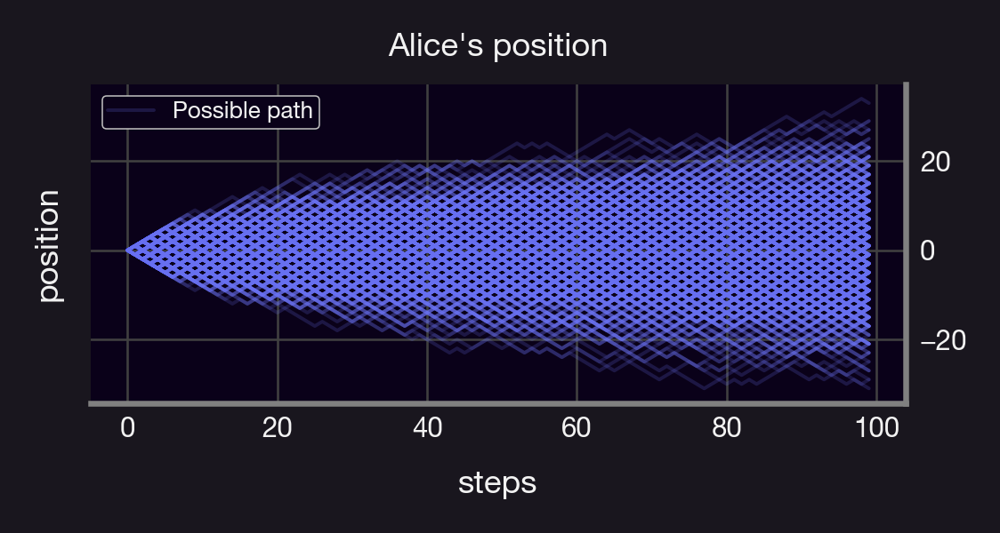
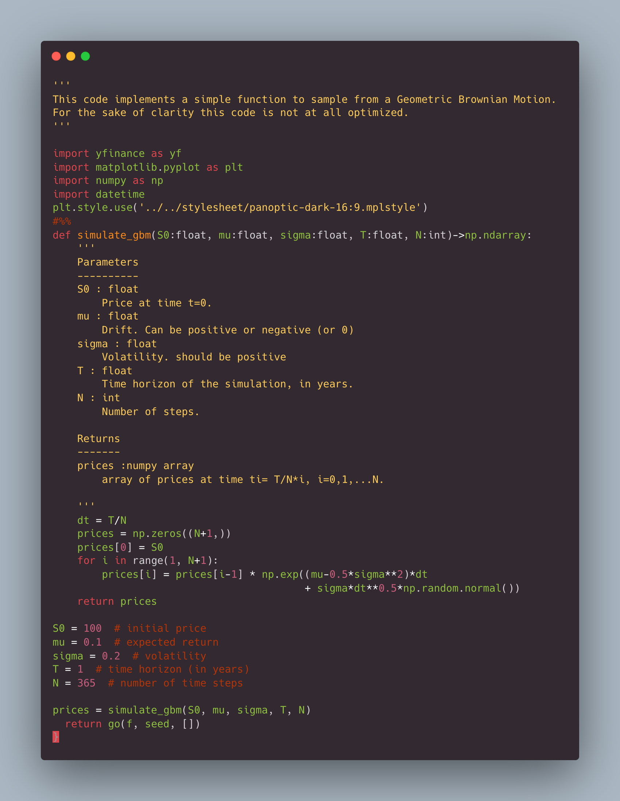
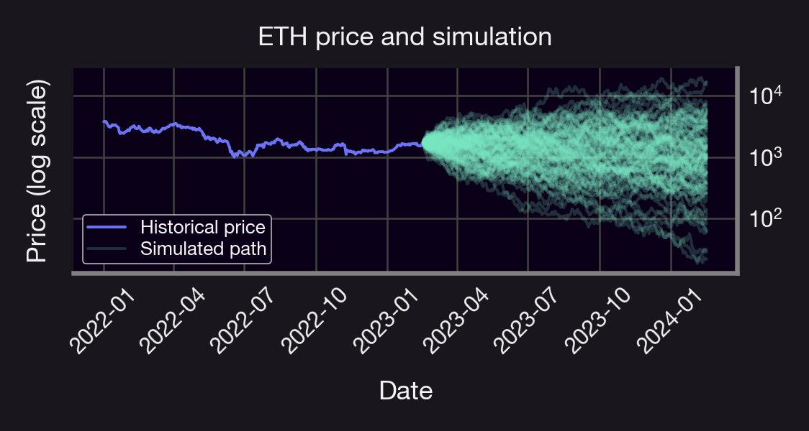

We all know backtesting, but how about forward testing? This is the first of a series of tutorials where we discuss methods for simulating cryptos prices. Let's explore!

<!--truncate-->

---

- 🎲 We will devote the first thread in this series to the Monte Carlo (MC) method.
- 📈 MC method is a simulation technique used to model the behavior of complex systems like crypto prices, markets, LP positions, etc.
- 👆🏻 Useful when a direct prediction is not possible.

It works by repeating three simple steps:
1.  Sample from a probability distribution that represents our understanding of the underlying system 🎲   
2.  Repeat this process many times 🔁
3.  Take the average of some quantity of interest over all these simulations 🤓
   
The above is meant to simulate events that are unpredictable & can only be simulated using random number generation. In the case of crypto, this could involve estimating values for asset volatility, drift, etc., and then using these values to simulate future price movements of an asset.

By repeating steps 1-3 multiple times, we can generate a large number of different scenarios for the future price of the asset. This allows us to understand the potential range of outcomes and estimate the likelihood of different price levels.

Let's consider a simple example: Suppose Alice is standing at a position x0, and that she takes one step to the right or to the left each w/ 50% chance.

Questions:
-   Where do we expect Alice to be after N steps?
-   How likely is it for her to get 20 steps away from x0?
    
We can answer this using MC!
-   Simulate Alice's random path for N steps, M times (M large)
-   Take the mean of her position after N steps, and the # of times she was 20 steps away from x0.

Taking M=1000, N=100 yields:
-   Expected position ≈ 0.0
-   Prob. 20 steps away = 6.8%
    

Monte Carlo simulations can also be used to generate Value-at-Risk (VaR) measures, which indicate the maximum potential loss that an investment in a crypto asset could experience over a given time horizon. Read more about VaR measures here 😉

<blockquote class="twitter-tweet">
1/13 How do you know if one LP position or portfolio is riskier than another?  Is LPing riskier than HODLing?  This is the first of a series of threads where we discuss different types of risk, how to interpret them, and how to hedge them.  Let&#39;s dive in!
&mdash; Panoptic (@Panoptic_xyz) <a href="https://twitter.com/Panoptic_xyz/status/1622762150711427072?ref_src=twsrc%5Etfw">February 7, 2023</a></blockquote> 

A standard model to simulate asset prices is the so-called Geometric Brownian Motion (GBM). It assumes that the rate of change of the price of an asset follows a random walk with constant volatility and a drift term representing the expected return. In math-y terms, let $S$ denote an asset with price process ${S}$. Furthermore, let μ denote the _drift_ parameter of the price process and $σ>0$ its _volatility,_ and let $W$ denote the standard Wienner process. We say that ${S}$ follows a Geometric Brownian motion (GBM) if ${S}$ satisfies the following stochastic differential equation:

$\frac{\mathrm{d}S_t}{S_t}=\mu\mathrm{d}t + \sigma \mathrm{d}W_t$

Given an initial price S0, it follows from Ito’s lemma that

$S_t=S_0\exp\left(\left(\mu-\frac{\sigma^2}{2}\right)t+\sigma W_t\right), \quad \forall t\geq 0$

An exemplary Python implementation to sample a price process S modeled as a GBM is shown below 💻
-   mu = drift
-   sigma = volatility
-   T = time horizon
-   N = number of steps
-   S0 = price at time 0
    
Let's use our code to simulate the daily ETH price for the next year!

Example: ETH price
-   🔮 We simulate 1000 prices, 1 year into the future
-   🤓 sigma = 0.845, mu = -0.47 from historical data
-   📉 95% VaR, yearly= -49%
-   📉 95% CVaR, yearly = -72%
-   🎲 Probability of price > $3,000 at any time = 12%
    

Comments on the above:
-   μ & σ influenced by the time period they're estimated (e.g., negative drift due to 📉 last April)
-   Useful to reassess the above with different parameter values!
-   VaR and CVaR are worst-case scenarios (95% confidence) and are useful metrics to mange risks/[hedge](https://panoptic.xyz/research/hedge-with-panoptic-options)
-   μ & σ can be made stochastic, too — more powerful model
-   MC can be used to price options & estimate Greeks
-   We used GBM model, which [might not be suitable](https://panoptic.xyz/research/uniswap-violates-geometric-brownian-motion) for pools or stablecoins
-   Can we use MC to simulate these? We'll discuss in future Research Bites!

---

Summary:
-   MC is a simulation-based approach to modeling complex systems like crypto prices.
-   Provides valuable insights into potential outcomes & risk levels.
-   While not perfect & can be influenced by the assumptions, it remains a very valuable tool!