DeFi Options Trading Is Powerful!

There can be unlimited upside…😈

But also unlimited downside 😣

Every trader should know how to create these 18 options strategies in Panoptic for any crypto asset, any strike, any size👇

<!--truncate-->

We'll cover:

1.  ⤵️
    
2.  📞
    
3.  🤸🏽‍♂️
    
4.  🙅‍♀️😵
    
5.  💎🦎
    
6.  🦖
    
7.  🥌🦋
    
8.  📞🧈
    
9.  🦸‍♂️🐂
    
10.  ⤵️🧈
    
11.  🦸‍♂️🐻
    
12.  🥌🦅
    
13.  📅🧈
    
14.  ↗️🧈
    
15.  ⚖️🧈
    
16.  🦇
    
17.  🦓
    
18.  🦓🦓🦓
    

----------
### 1. Put ⤵️
Think HEX is worthless?

"Put" your money where your mouth is. Buy a "put"⤵️ Panoption!

-   Substantial upside 😈
    
-   Limited downside 😋
    
-   Bearish ⬇️
    

Short LP position

### 2. Call 📞
Want to make a "call" that APE will go up?

Buy a "call"📞 Panoption!

-   Unlimited upside 😈
    
-   Limited downside 😋
    
-   Bullish ⬆️
    

Short LP position + long asset

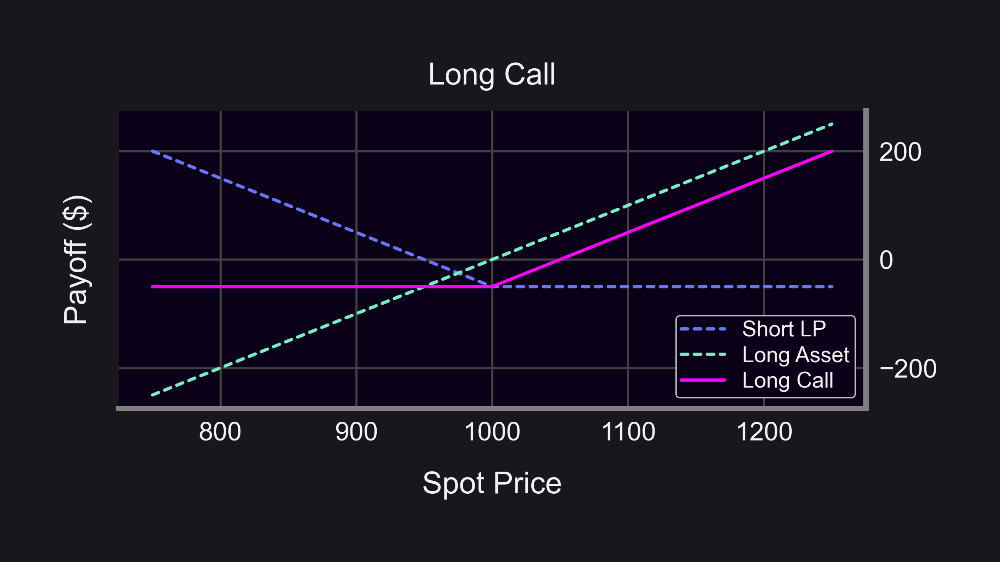

### 3. Straddle 🤸🏽‍♂️
"Straddling" the line b/c you can't tell if BLUR is going to go ⬆️ or ⬇️?

Buy a "straddle"🤸🏽‍♂️ on Panoptic!

-   Unlimited upside 😈
    
-   Limited downside 😋
    
-   Delta neutral 🫥
    

Call + Put (same strike)
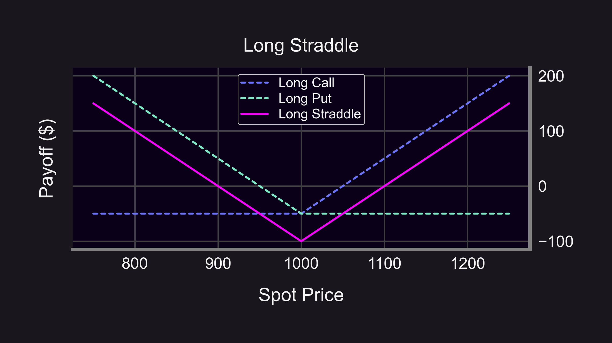

### 4. Strangle 🙅‍♀️😵
Feel like you're being strangled by excessive market volatility on SHIB?

Buy a "strangle"🙅‍♀️😵 on Panoptic!

-   Unlimited upside 😈
    
-   Limited downside 😋
    
-   Delta neutral 🫥

    

Call (higher strike) + Put (lower strike)

### 5. Jade Lizard 💎🦎
Feeling a "little" bullish on UNI?

How about a "jade lizard" 💎🦎

-   Limited upside 😋
    
-   Substantial downside 😣
    
-   Neutral-to-bullish ↗️
    

Short strangle + long OTM call
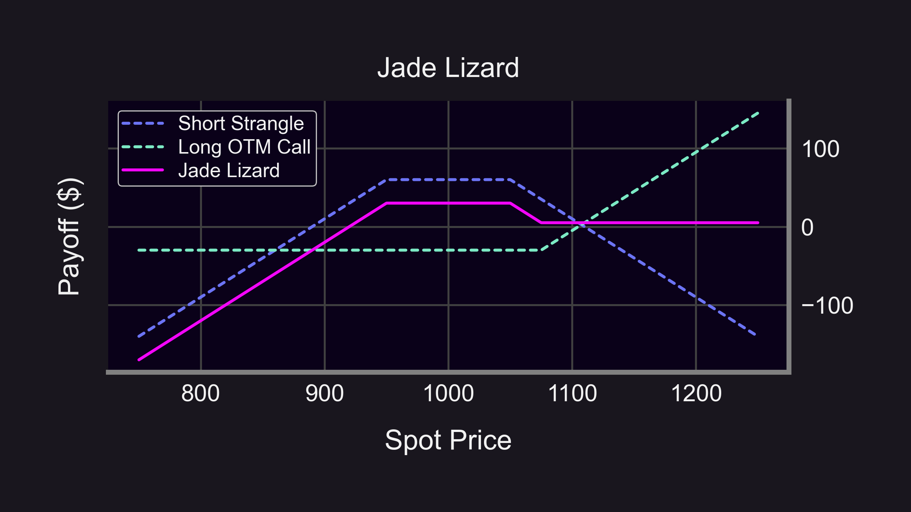

### 6. Big Lizard 🦖
A variation of 💎🦎 is the "big lizard" 🦖

Sell a straddle instead of a strangle on Panoptic! Useful when you believe the price will hover around the current price.

-   Limited upside 😋
    
-   Substantial downside 😣
    
-   Neutral-to-bullish ↗️
    

Short straddle + long OTM call
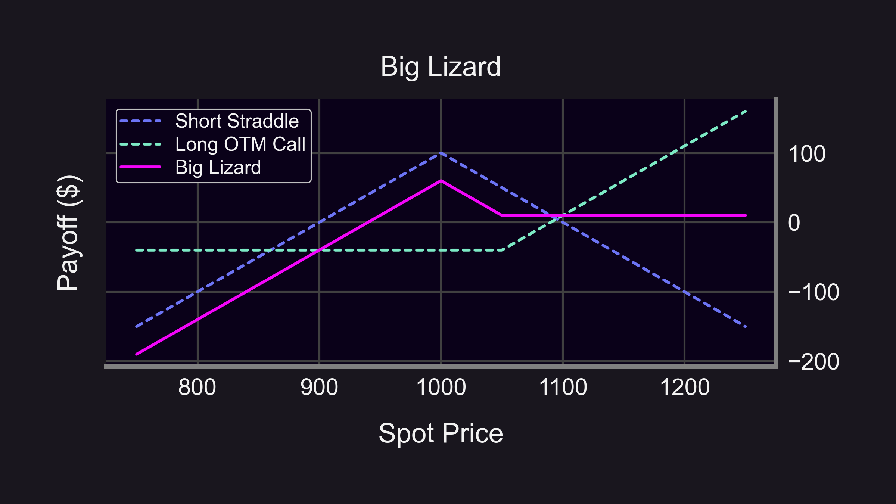

### 7. Iron Butterfly 🥌🦋
Think LINK will stay rangebound?

Float like an "iron butterfly"! 🥌🦋

Like a 🦖, except you're protected on both sides.

-   Limited upside 😋
    
-   Limited downside 😋
    
-   Delta neutral 🫥
    

Short straddle + long strangle
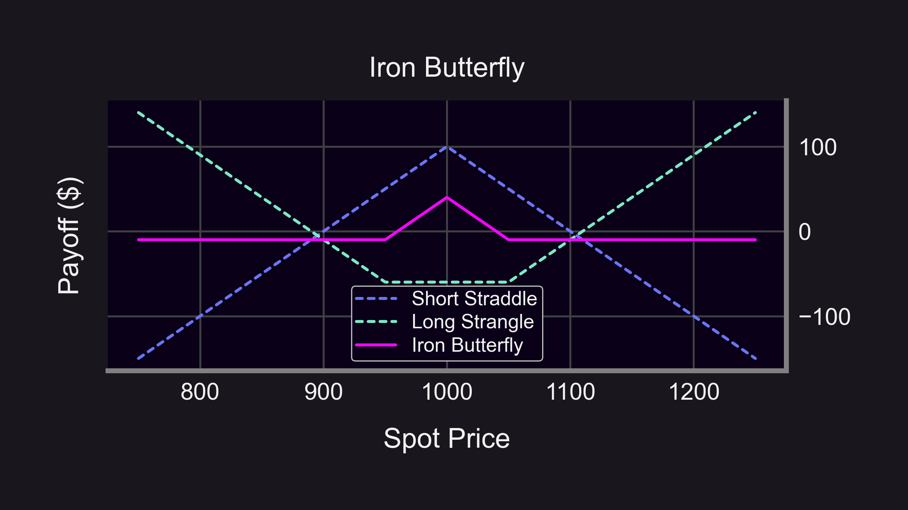

### 8. Call Spread 📞🧈
Bullish on ETH but don't expect a huge surge?

Buy a "call spread" on Panoptic! 📞🧈

-   Limited upside 😋
    
-   Limited downside 😋
    
-   Bullish ⬆️
    

Long call (lower strike) + short call (higher strike)
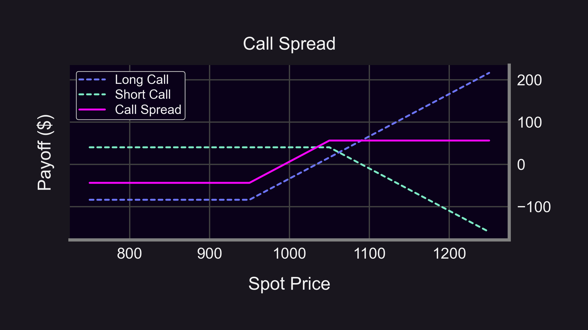

### 9. Super Bull 🦸‍♂️🐂
Are you hoping for a "Better Tomorrow"?

How about a "Super Bull"? 🦸‍♂️🐂

Like a 📞🧈, but for the more bullish among us.

-   Limited upside 😋
    
-   Substantial downside 😣
    
-   Super-bullish ⬆️⬆️
    

Long call spread + short OTM put
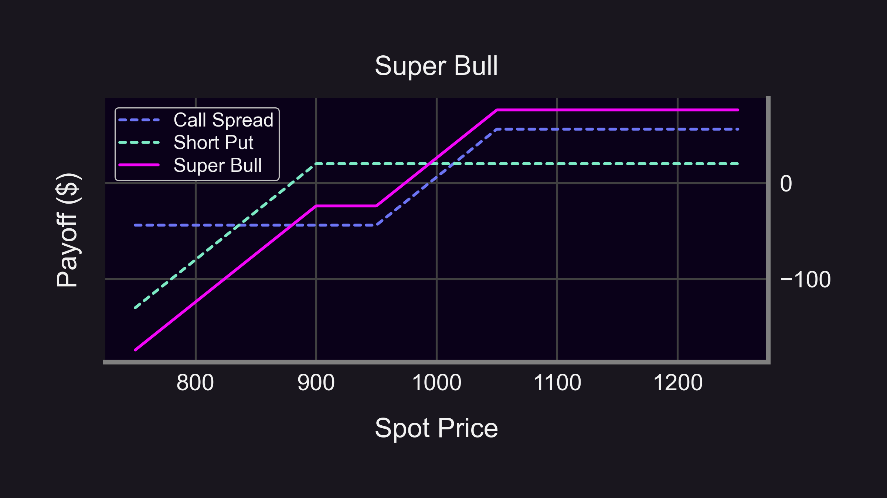

### 10. Put Spread ⤵️🧈
Anon "spreading" rumors that USDC is in trouble, but don't expect a huge drop?

Buy a put "spread" on Panoptic! ⤵️🧈

-   Limited upside 😋
    
-   Limited downside 😋
    
-   Bearish ⬇️
    

Long put (higher strike) + short put (lower strike)
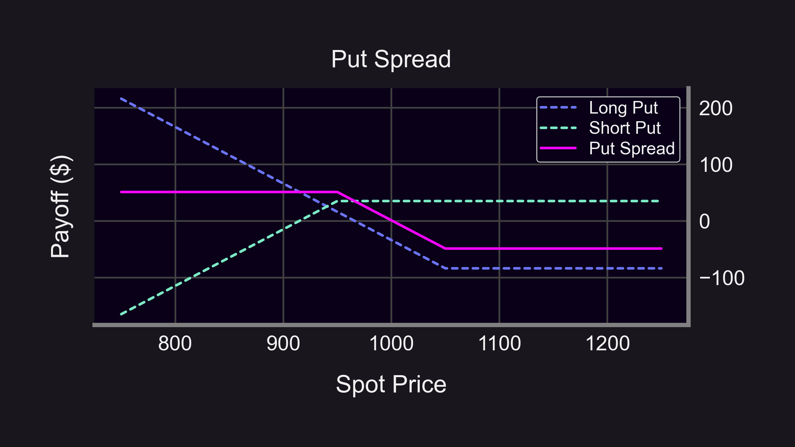

### 11. Super Bear 🦸‍♂️🐻
Look! Up in the sky! It's a bird! It's a plane!

It's "Super Bear"! 🦸‍♂️🐻

Like a ⤵️🧈, but for the more bearish among us.

-   Limited upside 😋
    
-   Unlimited downside 😳
    
-   Super-bearish ⬇️⬇️
    

Long put spread + short OTM call

### 12. Iron Condor 🥌🦅
Think an "upcoming announcement" is gonna be a nothingburger? 🚫🍔

Take flight with a short "iron condor"! 🥌🦅

-   Limited upside 😋
    
-   Limited downside 😋
    
-   Delta neutral 🫥
    

Short call spread + short put spread
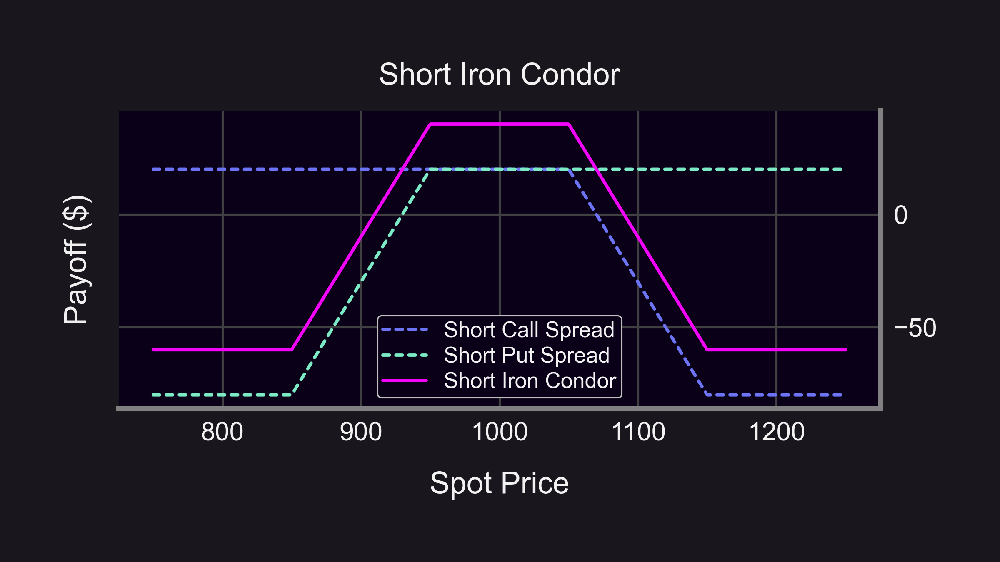

### 13. Call Calendar Spread 📞📅🧈
Long-term bullish on ETH but need more capital?

Buy a "call calendar spread" on Panoptic! 📞📅🧈

-   Limited upside 😋
    
-   Limited downside 😋
    
-   Delta neutral 🫥
    

Long long-term call + short short-term call (same strike)
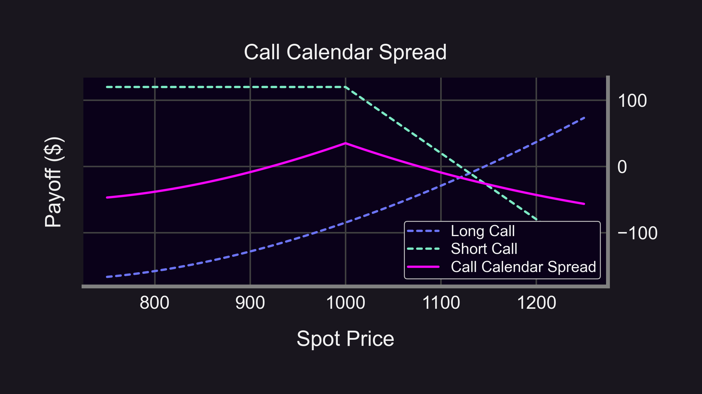

### How Panoptic's Perpetual Options Have Effective DTEs
Panoptic mimics payoffs from long-term expiries through wide-ranged LP positions.

For example:

-   Narrow range (r = 1.087) ↔️ 1 day expiry
    
-   Wide range (r = 1.6) ↔️ 1 month expiry
    

(Assuming 100% annual volatility)
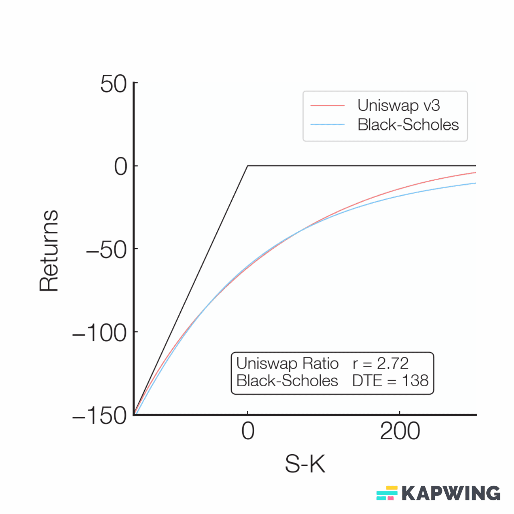

### 14. Diagonal Spread ↗️🧈
A variation of 📅🧈 is the "diagonal spread" ↗️🧈

Also called a "Poor Man's Covered call" — useful when you expect minor price movement.

-   Limited upside 😋
    
-   Limited downside 😋
    
-   Bullish ⬆️
    

Long long-term call + short short-term call (different strikes)
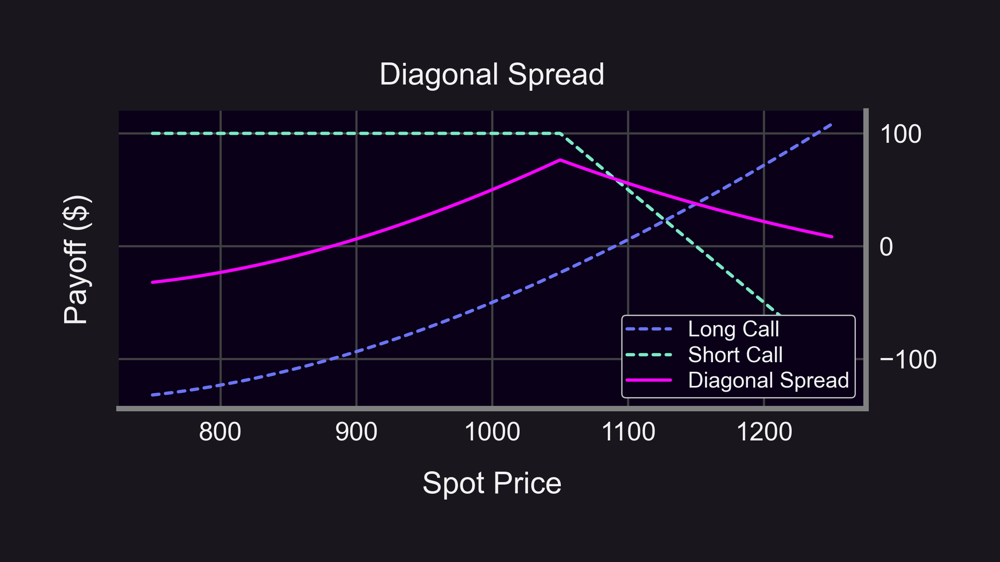

### 15. Call Ratio Spread 📞⚖️🧈
Neutral-to-bullish, with a price target for WBTC in mind?

Buy a "Call Ratio Spread" on Panoptic! 📞⚖️🧈

-   Limited upside 😋
    
-   Unlimited downside 😳
    
-   Neutral-to-bullish ↗️
    

1 long call (lower strike) + 2 short calls (higher strike)
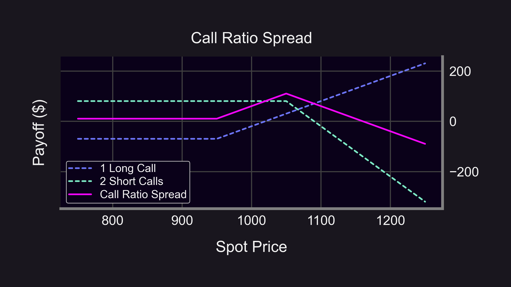

### 16. BATS 🦇
Expect some small price movement on LDO but not sure which direction?

Try "BATMAN" 🦇

-   Limited upside 😋
    
-   Unlimited downside 😳
    
-   Delta neutral 🫥
    

Call ratio spread + put ratio spread
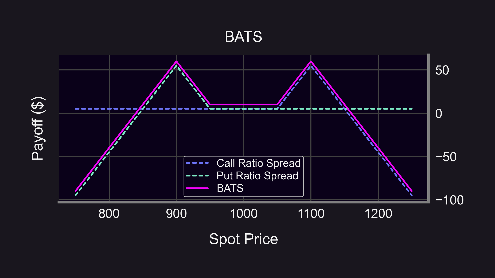

### 17. ZEBRA Spread 🦓
Want to go long?

A "ZEBRA spread" may be what you're looking for! 🦓

A synthetic replacement for longs: ~100 delta position with very low capital requirements.

-   Unlimited upside 😈
    
-   Limited downside 😋
    
-   Bullish ⬆️
    
-   Capital efficient 💸
    

2 ITM long calls + 1 ATM short call
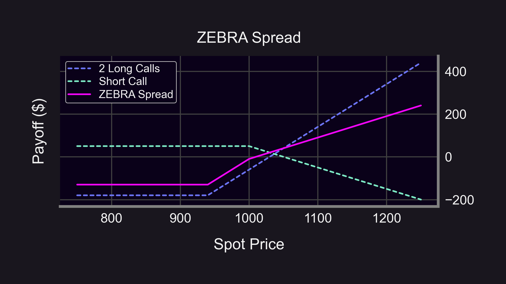

### 18. ZEEHBS
Bullish, but want to hedge downside tail risk?

Try "ZEEHBS"! 🦓🦓🦓

-   Unlimited upside 😈
    
-   Limited downside 😋
    
-   Delta neutral 🫥
    

Call ZEBRA spread + put ZEBRA spread, this one is special 🤪
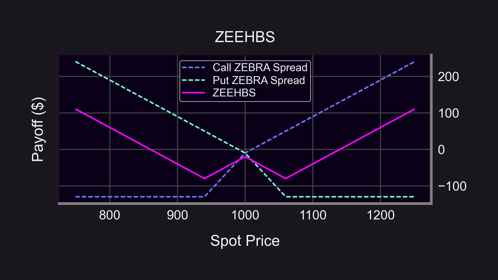

### Summary
Caveats:

-   Panoptions are perpetual options with streaming premia rather than upfront premia, so payoff curves may differ from above
    
-   Panoption premia depends on a number of factors including the underlying price path and LP width
    

More on this later 😉

----------

Summary:

1.  ⤵️=Put
    
2.  📞=Call
    
3.  🤸🏽‍♂️=Straddle
    
4.  🙅‍♀️😵=Strangle
    
5.  💎🦎=Jade lizard
    
6.  🦖=Big lizard
    
7.  🥌🦋=Iron butterfly
    
8.  📞🧈=Call spread
    
9.  🦸‍♂️🐂=Super bull
    
10.  ⤵️🧈=Put spread
    
11.  🦸‍♂️🐻=Super bear
    
12.  🥌🦅=Iron condor
    
13.  📅🧈=Calendar spread
    
14.  ↗️🧈=Diagonal spread
    
15.  ⚖️🧈=Ratio spread
    
16.  🦇=BATS
    
17.  🦓=ZEBRA
    
18.  🦓🦓🦓=ZEEHBS
    

Disclaimer: 📢 None of this should be taken as financial advice.