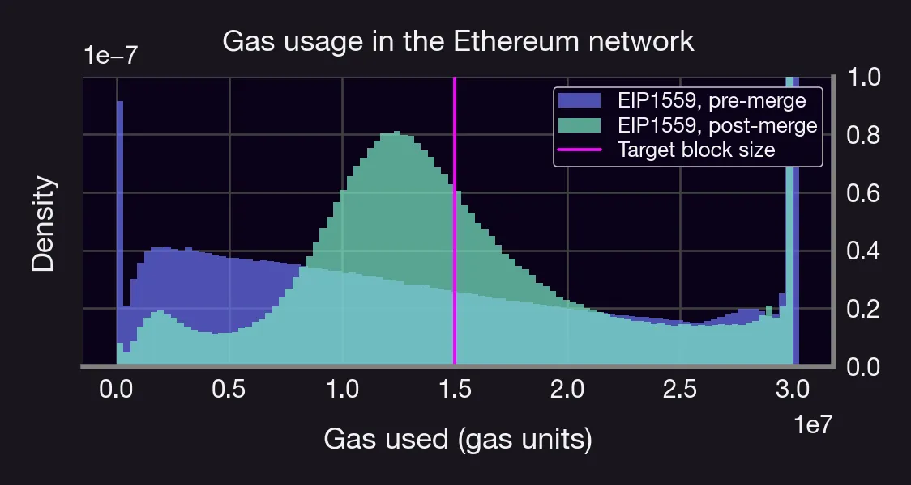
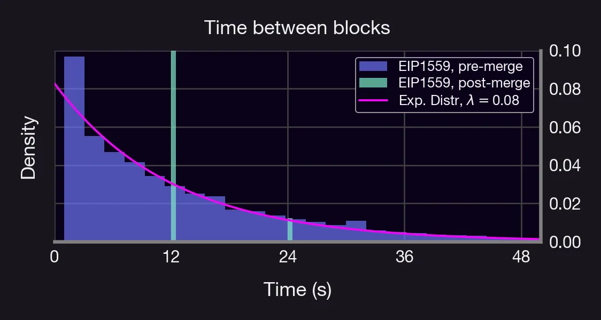
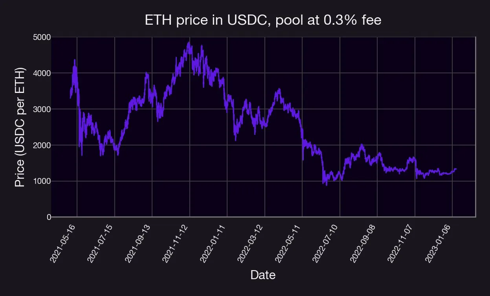
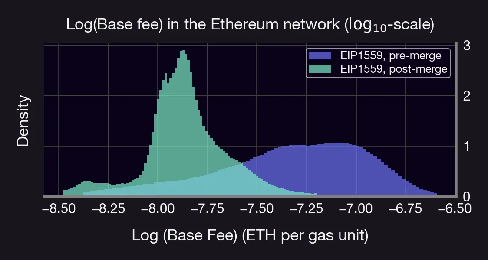

We will examine how The Merge impacted Ethereum's gas fee market.

How does gas work? How did gas price change after The Merge?⛽️

Let's find out!

<!--truncate-->

# What is gas?

Gas is a measure of the computational resources needed for on-chain txs. Just as you need to put gas in your car to drive, you also need "gas" to run on-chain txs. The amount of gas used depends on the tx, just as the amount of gas used in cars depends on how far you go.

This brings up an interesting question: How (& to whom) are these resources being paid?

Answering 👆 is akin to designing a so-called Transaction Fee Mechanism (TFM).

# TFMs
Some popular TFMs:

- First Price Auction (Ethereum before ~08/2021)
- EIP1559 (Ethereum, Filecoin, ...)
 
# Gas after EIP1559 in a nutshell:

- Base fee: minimal amt of token/gas unit to include tx in block.
- Gas used: gas used by a tx.
- Priority fee: tip to miner to include tx in block
- Gas limit: upper limit of gas used
- User pays base fee x gas limit at most.

For each tx included in the block:

- Base fee x gas used gets burnt 🔥
- Base fee x priority fee goes to miner of the block ⛏👷‍♀️
- Burning reduces circulating supply, thus increasing the value of the remaining tokens.

👆creates deflationary pressure & adds security

Ok, but how is base fee priced?

Base fee is adjusted at every epoch as a function of demand by up to ±12.5% per epoch (see attached).

- High demand, base fee ⬆️
- Low demand, base fee ⬇️

Mathematically, for a given epoch t, let B\* denote the *target block size* , which is currently set to half of the maximum block size, and let $G_t$ denote the gas used at an epoch t. Given this, the EIP1559 transaction fee mechanism updates the base fee $b_t$ on an epoch to epoch basis according to the following formula:

$b_{t+1} = max \{ b_{t-1}(1+\frac{1}{8}\frac{G_t-B^*}{B^*}),  b_{min} \}, \quad b_{min} > 0.$

BTW, there are several ways of extending upon the base fee mechanism 👇

Thus, if the gas consumption at epoch t is larger than the target gas consumption, the base fee increases at the next epoch. Conversely, if it’s smaller, it decreases in the next epoch. If the gas consumption is exactly the target consumption, then it stays the same.

For example, [here](https://ethresear.ch/t/multidimensional-eip-1559/11651) is a proposal for a multi-dimensional gas mechanism (like having different gas "lanes" for different types of txs).

What about The Merge? Did it change the underlying EIP1559 mechanism? No, but it did change a few things:

- Gas-usage patterns
- Made the network more efficient
- Made the block time more predictable.

Let's see 👇

## Let's analyze gas usage in the Ethereum network.

We look at ETH gas data from 08/2021 — present on a block-by-block basis.

Here's what we found:

- Distr. of gas usage  became more concentrated after merge
- There's a High probability of observing full blocks in both cases
- Smaller fees on avg
- Less burning post-merge
- More predictable block times
- Distr. of block time pre-merge resembles exp. distr. w/λ=0.08

