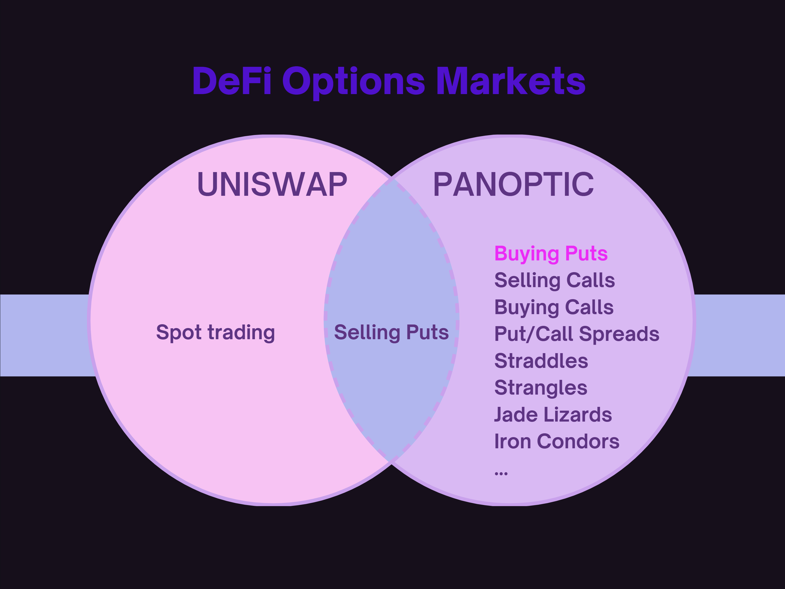
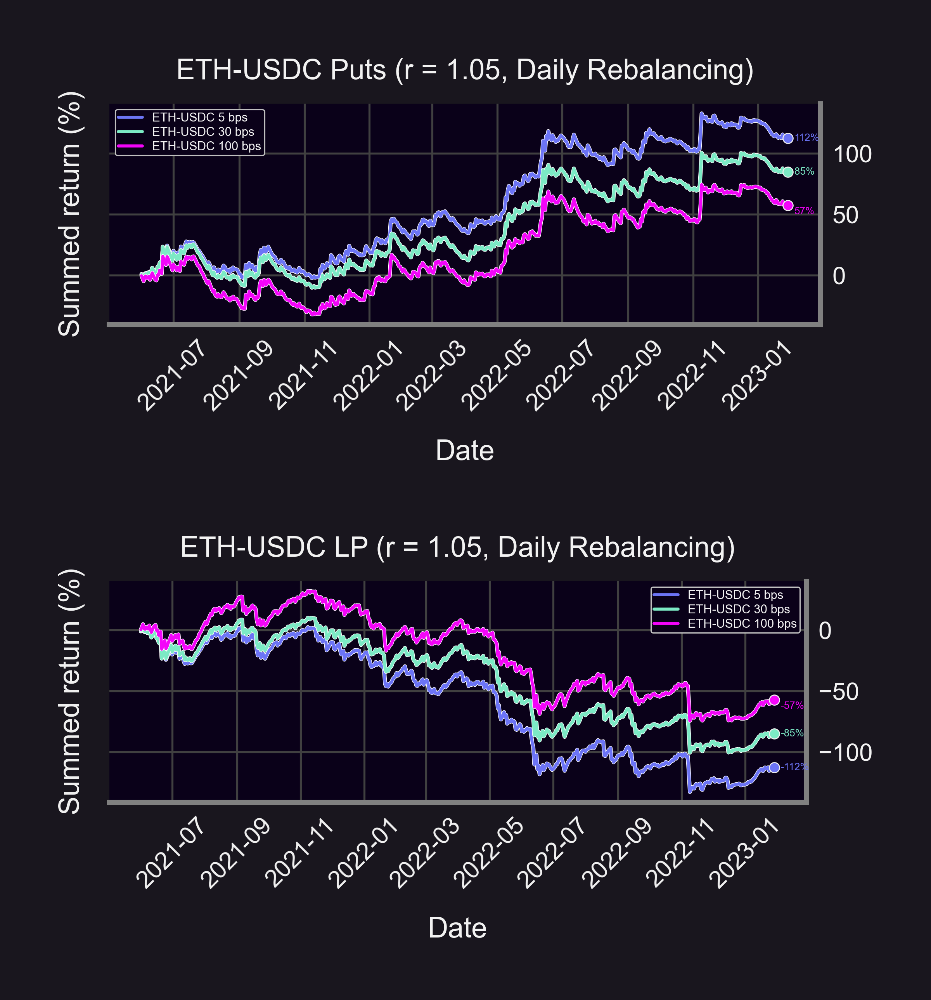
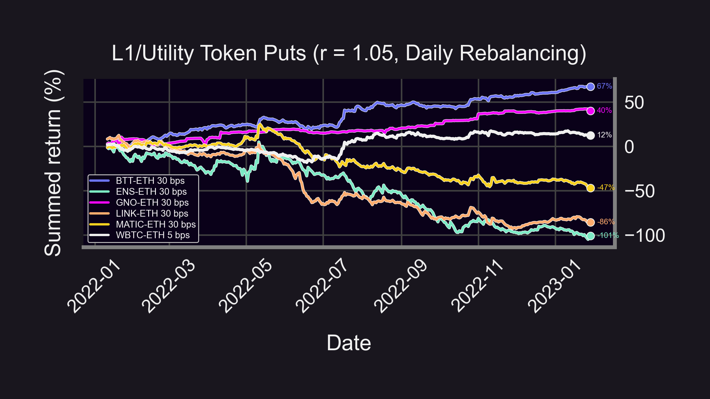
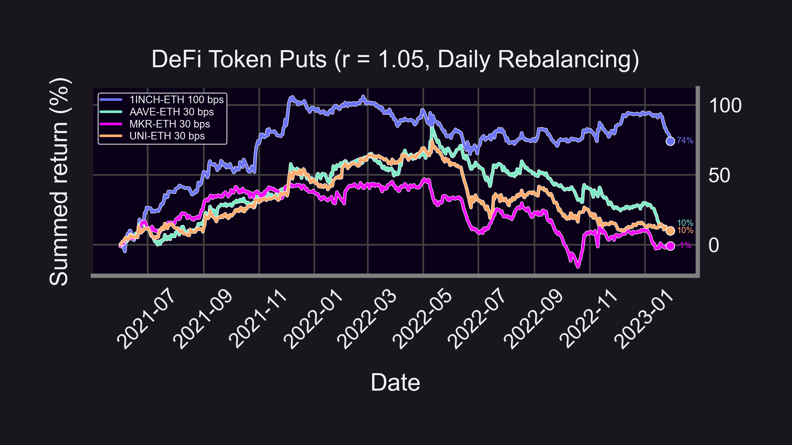
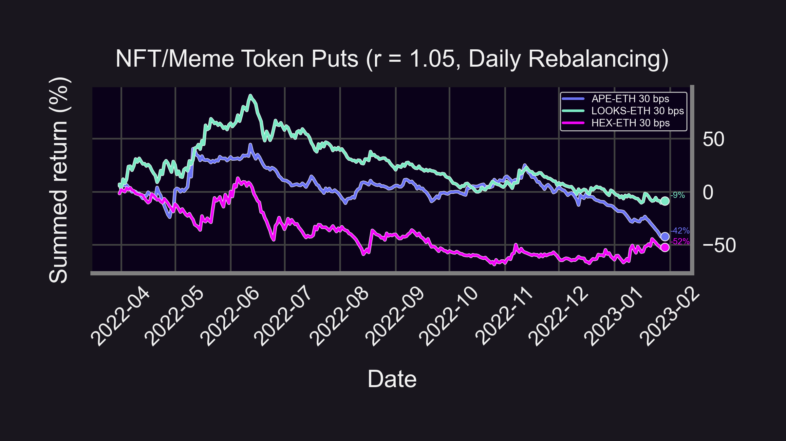
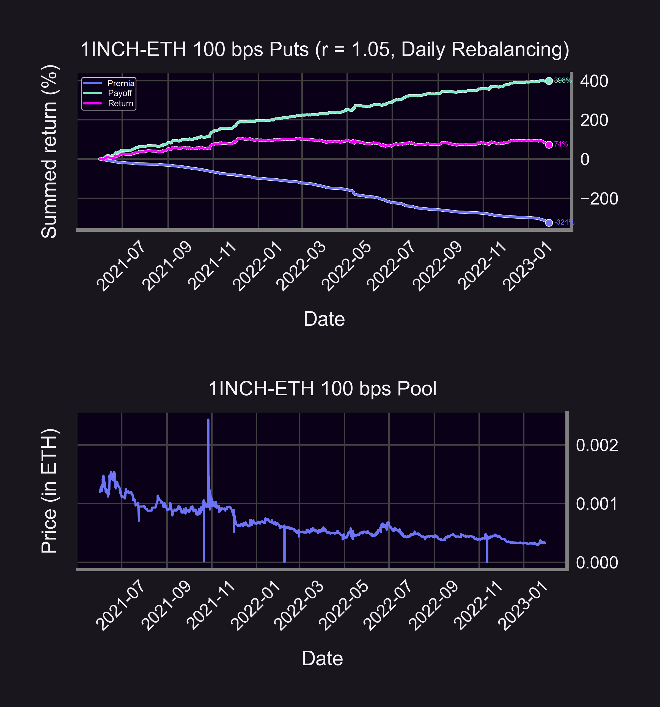
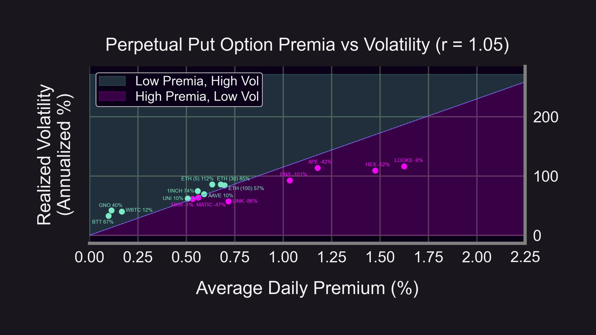

Imagine a market that only lets you sell assets, never buy...Could you be profitable?

That market isn't imaginary. That market is...Uniswap Liquidity Providing!

LPing = selling options, but what if users could SHORT LP tokens and effectively BUY options...?

<!--truncate-->

----------

### LP = Short Put
LP positions on Uni V3 mimic the payoff of selling put options. Uniswap users can only deposit liquidity and sell put options, which means they can only take a bullish position.
    
<blockquote class="twitter-tweet" data-conversation="none">
Let&#39;s try to clear some misconceptions about providing liquidity in Uniswap v3:  🟣Uni v3 LPs aren&#39;t making markets, they&#39;re selling cash-secured puts.
&mdash; Guillaume Lambert | lambert.eth | 🦇🔊 (@guil_lambert) <a href="https://twitter.com/guil_lambert/status/1619496117816918016?ref_src=twsrc%5Etfw">January 29, 2023</a></blockquote> 

-   Token goes up, LP value goes up (but capped) 🚀
    
-   Token goes down, LP value goes down 😭

While selling options can be profitable, our backtests show that it wasn't always the case 👇

<blockquote class="twitter-tweet" data-conversation="none">
3/11 Bad pools 😔 (but can you spot the good pool 🐶?)  • ETH-USDC (5bps): -18% • ETH-DAI (30bps): -14% • ETH-USDC (30bps): -12% • ETH-USDT (30bps): -11% • ETH-USDC (100bps): -9% • ETH-USDC (1bp): -6% • ETH-USDT (5bps): -3% • ETH-DAI (5bps): +7%  (Returns in stablecoin) <a href="https://t.co/l1RWO8cLx6">pic.twitter.com/l1RWO8cLx6</a>
&mdash; Panoptic (@Panoptic_xyz) <a href="https://twitter.com/Panoptic_xyz/status/1623366152381665280?ref_src=twsrc%5Etfw">February 8, 2023</a></blockquote> 

Is there a way to "short" an LP position and effectively *buy* a put option...?

We'll answer this... But first, let's simulate an options buying strategy!

----------
### Backtest Strategy
For this study:

-   🗓️ Jun 2021 - Jan 2023 (20 months) where applicable
    
-   ⚖️ Daily rebalancing
    
-   📏 Narrow (r = 1.05) range ↔️ 0DTE
    

Daily strategy:

1.  Buy ATM put option by shorting LP position
    
2.  Exercise/close put option at end of day
    
3.  Pay LP swap fees as premia
    
### ETH Puts
Returns on buying ETH put options:

-   🌕 ETH-USDC (5bps): 112%
    
-   🚀 ETH-USDC (30bps): 85%
    
-   🧑‍🚀 ETH-USDC (100bps): 57%

(Returns in USDC)
    

👉Put option returns are exactly opposite of LP returns👈

### L1/Utility Token Puts
Buying "L1/Utility token" put options:

-   🤩 BTT (+67%)
    
-   😍 GNO (+40%)
    
-   😊 $WBTC (+12%)
    
-   😦 MATIC (-47%)
    
-   😢 LINK (-86%)
    
-   😭 ENS (-101%)
    

(Returns in ETH, see legend 👇 for pool details)

### DeFi Token Puts
Buying "DeFi token" put options:

-   😎 1INCH (+74%)
    
-   🙂 AAVE (+10%)
    
-   🙂 UNI (+10%)
    
-   😕 MKR (-1%)

(Returns in ETH)

👉DeFi puts did pretty good!👈

### NFT/Meme Token Puts
Buying "NFT/Meme token" put options:

-   😶 LOOKS (-9%)
    
-   😬 APE (-42%)
    
-   😳 HEX (-52%)
    
(Returns in ETH)

👉Don't "put" ⤵️ down the meme tokens👈

### Summary
Key Insights:

-   🐻 Bearish price action = high payoff
    
-   💰 Payoff > premia → profit!
    

In TradFi, options buying is more profitable when Implied Volatility (IV) < Realized Volatility (RV). Do we see the same result here?

Instead of IV let's use the premia:

-   Easier to calculate 🧮
    
-   ⬆️ IV ⇔ ⬆️ Premia
    

Graph above:

-   🐶 Outperforming puts (green dots): lie above the line, low premia given volatility ("IV < RV")
    
-   😈 Underperforming puts (pink dots): lie below the line, too expensive ("IV > RV")
    

Is there a way to "short" an LP position and, hence, *buy* a put option?

Enter Panoptic! Panoptic allows you to buy *and* sell DeFi options for any crypto asset, any strike, any size.

<blockquote class="twitter-tweet" data-conversation="none">
1/25 DeFi Options Trading Is Powerful!  There can be unlimited upside…😈 But also unlimited downside 😣  Every trader should know how to create these 18 options strategies in <a href="https://twitter.com/Panoptic_xyz?ref_src=twsrc%5Etfw">@Panoptic_xyz</a> for any crypto asset, any strike, any size:  ❤️ &amp; rt 👇 <a href="https://t.co/BAlyxdn0lz">pic.twitter.com/BAlyxdn0lz</a>
&mdash; Panoptic (@Panoptic_xyz) <a href="https://twitter.com/Panoptic_xyz/status/1628530117118169088?ref_src=twsrc%5Etfw">February 22, 2023</a></blockquote> 

Caveats:

-   ⛽ Ignores gas/spread/swap fees/commission
    
-   💲 Assumes put option premia = LP collected fees
    
-   ❓ This is a "what if" scenario — you can't buy put options on Uniswap (yet)
    

Question:

-   ⚖️ Are LP returns in disequilibrium?
    

(Future #ResearchBites 😉)

----------

Disclaimer:

-   📢 None of this should be taken as financial advice.
    
-   ⚠️ Past performance is no guarantee of future results!