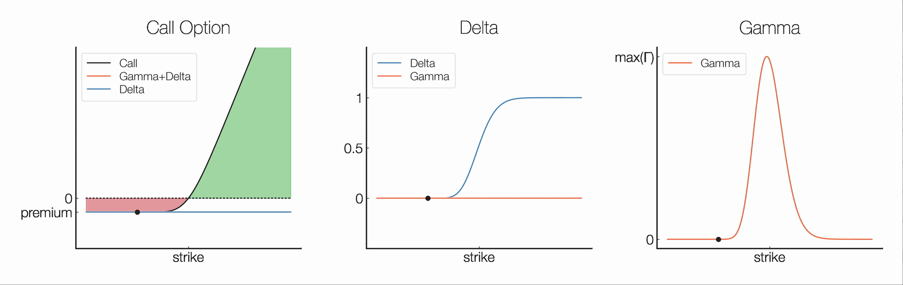
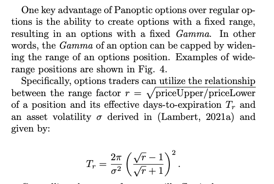

Want to understand the potential risk/reward of options trading? Look no further than the Greeks!

We'll break down Delta, Gamma, Theta, Vega, & Rho and explain how they can help you make more informed decisions when trading Panoptions.

<!--truncate-->

---

The Greeks are a set of risk measures used in options trading to help investors understand the potential risks and rewards associated with their positions. Continuing our [series](https://panoptic.xyz/research/greeks-series-beta)  on the Greeks, we'll discuss:
-   Delta (Δ)
-   Gamma (Γ)
-   Theta (Θ)
-   Vega (ν)

### Delta (Δ)
Delta (Δ) measures the rate of change of an option's price in relation to changes in the price of the underlying asset. Mathematically, Δ is the partial derivative of the option value (V) w.r.t. underlying price (S).

Ex: Δ=1 → V increases by $1 for every $1 increase in S

$\Delta =\frac{\partial V}{\partial S}$

Δ is useful for hedging. A Δ-neutral strategy is created with a position of Δ=0.

Delta-neutral example: Straddle — simultaneously buy a call option and a put option on the same underlying asset w/ same strike. This can be done with Panoptic as discussed [here](http://localhost:3000/research/essential-options-strategies-to-know#3-straddle-%EF%B8%8F).

### Gamma (Γ)
Gamma (Γ) measures the rate of change of an option's delta in relation to changes in the price of the underlying asset. Mathematically, Γ is the second partial derivative of the option value (V) w.r.t. the underlying asset price (S).

$\Gamma=\frac{\partial \Delta}{\partial S}=\frac{\partial^2 V}{\partial S^2}$

Important point on the above:
-   Unlike other options protocols, Panoptions can be deployed with a fixed range, resulting in options with fixed Gamma.

-   A capped Gamma completely eliminates pin risk! (i.e., risk of quickly switching to OTM close to expiration)

    
### Theta (Θ)
Theta (Θ) measures the rate of change of an option's price in relation to changes in time. It represents the time decay of an option and is particularly important for investors who use options as a short-term trading strategy (e.g. 0 DTE).

Mathematically, Θ is the partial derivative of the option value (V) w.r.t. time. Because of how Panoptions work, their value can be understood as the integral of Θ over the price path S.

$\Theta =\frac{\partial V}{\partial t}$

### Vega (ν)
Vega (ν) measures the rate of change of an option's price in relation to changes in volatility. This is of particularly importance in our setting since:
-   Crypto assets tend to be very volatile
-   Panoptions premia is related to volatility

$\nu =\frac{\partial V}{\partial \sigma}$
    
### Hedging The Greeks
How can we use this info to hedge our positions w.r.t. a given Greek X?

1.  Compute X for your position.
2.  Adjust your position by buying or selling options to offset the existing Greek.
3.  Monitor your position & make adjustments as needed to keep neutral.
    
Soon you will be able to do this on Panoptic.
