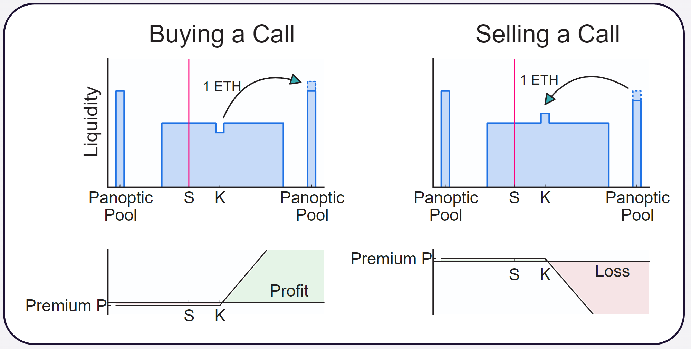
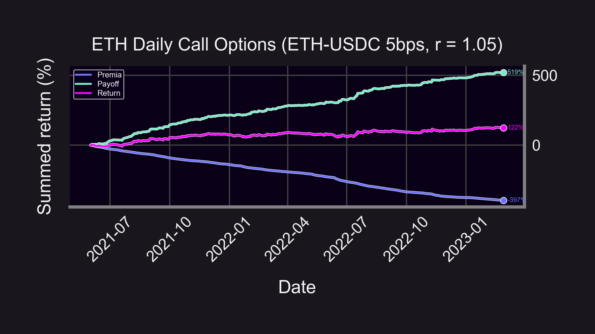
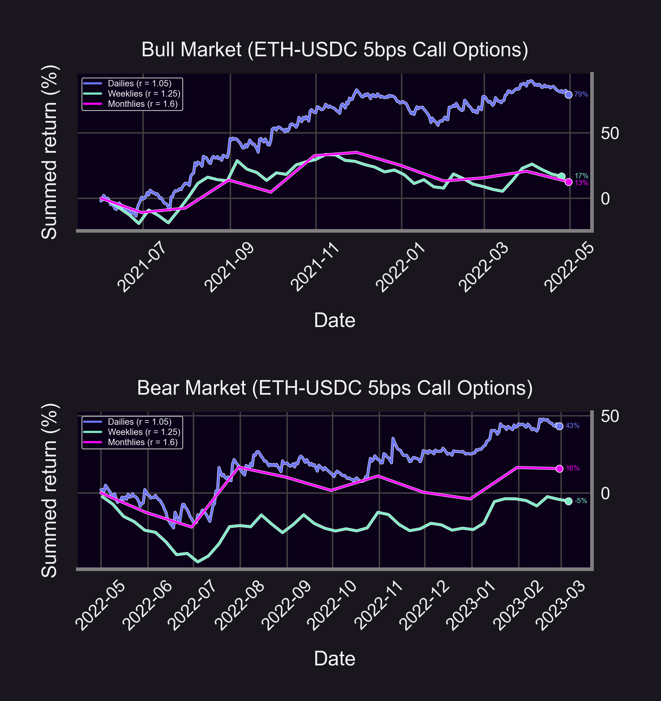
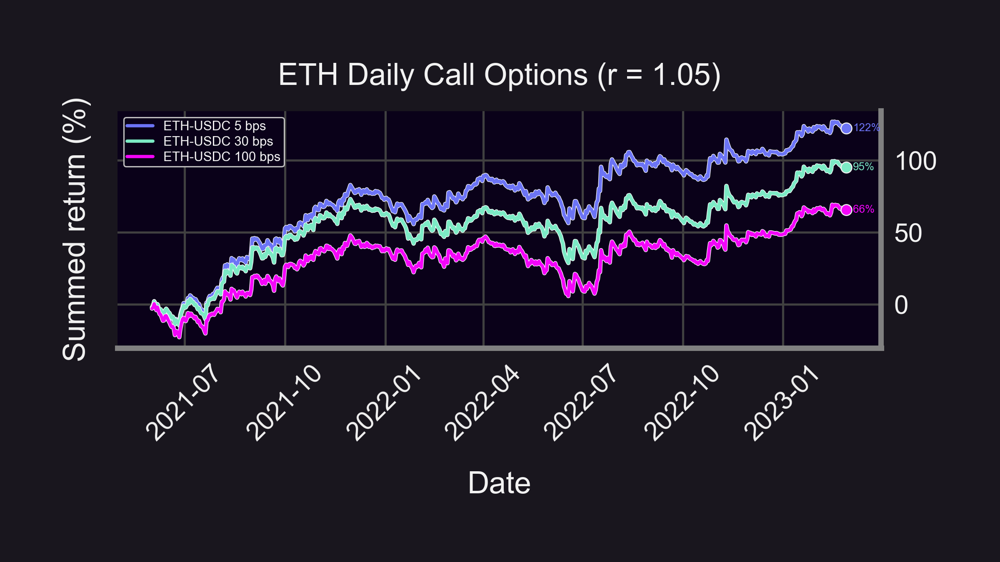
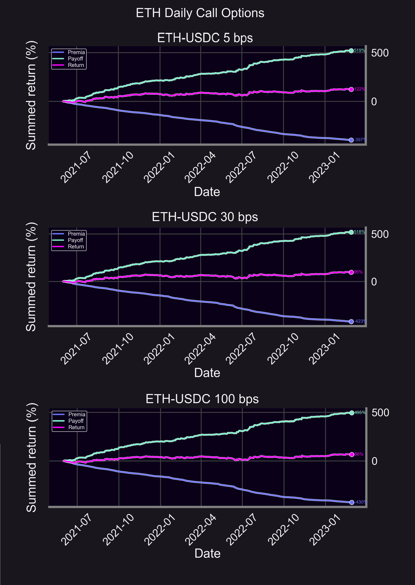

HODL vs. LP vs. Calls — which one's best?

-   ⬇️❗HODL downside is substantial (can go to 0)
    
-   🧢 LP upside is capped on Uni V3 — token goes up, you now hold the other token
    
-   🚫🧢 Call options have unlimited upside, capped downside — but pay premia
    

Incoming backtest 👇

<!--truncate-->

----------

<blockquote class="twitter-tweet" data-conversation="none">

&mdash; Panoptic (@Panoptic_xyz) <a href="https://twitter.com/Panoptic_xyz/status/1636122852054425600?ref_src=twsrc%5Etfw">March 15, 2023</a></blockquote> 

### Backtest Strategy

Let's backtest *hypothetical* DeFi call options (wen Panoptic? 😉)

🗓️ Jun '21 - Feb '23

⚖️ Periodic rebalancing (day, week, or month)

Strategy:

-   Buy at-the-money (ATM) call option
    
-   Exercise/close at end of period
    
-   Pay LP fees as premia
    

Note: Here’s [how Panoptic creates a call option](https://docs.panoptic.xyz/docs/panoptic-protocol/option-properties#creating-a-call-option)

### Return breakdown on ETH daily call options 📞

-   Payoff: 519%
    
-   Premia: 397%
    
-   Profit: 122%

(All values are USDC)
    

👉Payoff > Premia → Profit🔝🤑📈

That's pretty good! How does it compare to other rebalancing periods?👇

### Dailies vs Weeklies vs Monthlies

- 🌕 ETH Dailies: 122%

- 🧑‍🚀 ETH Weeklies: 11%

- 🚀 ETH Monthlies: 28%

👉Active management for the win!👈 (Keep in mind this doesn't account for gas fees⛽ — future #ResearchBites 😉)

Good returns, but can calls survive a bear market?

### Bull vs. Bear Market

-   🐂 Bull Market: June '21 - April '22
    
    -   👉 Compare w/ ETH HODL return: 0.8%
        
-   🐻 Bear Market: May '22 - Feb '22
    
    -   👉 Compare w/ ETH HODL return: -41%
        

Not only did call options survive a bear market, they blew HODL out of the water 💎🙌🙅🏻‍♂️🌊💨

What if you had chosen another fee-tier?

### Different Fee Tiers

-   🌕 ETH-USDC 5bps: 122%
    
-   🚀 ETH-USDC 30bps: 95%
    
-   🧑‍🚀 ETH-USDC 100bps: 66%
    

👉The 5 bps pool outperformed, here's why👇

### Here's how different fee-tier pools breakdown

-   🧾 The 5 bps pool had the least trading fees (premia)
    
-   🚀 The 5 bps pool had the most upward price action
    

👉 That's why the 5 bps pool was the most profitable!👈

### Summary
Key Insights:

-   💎🙌 Calls > HODL b/c capped downside
    
-   🌊 Calls > LP (we tested this last time👇)
    
-   🐂🐻 Bull markets are best for calls, bear markets were OK
    
-   🚀 Bullish price action = high payoff
    
-   💰 Payoff > premia → profit!
    
<blockquote class="twitter-tweet" data-conversation="none">
5/14 Returns on buying <a href="https://twitter.com/search?q=%24ETH&amp;src=ctag&amp;ref_src=twsrc%5Etfw">$ETH</a> put options:  🌕 ETH-USDC (5bps): 112% 🚀 ETH-USDC (30bps): 85% 🧑‍🚀 ETH-USDC (100bps): 57%  (Returns in USDC)  👉Put option returns are exactly opposite of LP returns👈 <a href="https://t.co/J4Ic4zaczM">pic.twitter.com/J4Ic4zaczM</a>
&mdash; Panoptic (@Panoptic_xyz) <a href="https://twitter.com/Panoptic_xyz/status/1633602281894715393?ref_src=twsrc%5Etfw">March 8, 2023</a></blockquote> 

Caveats:

-   ⛽ Ignores gas/spread/swap fees/commission
    
-   💲 Assumes put option premia = LP collected fees
    
-   ❓ This is hypothetical — you can't buy call options on Uniswap (Panoptic soon 🤫)
    

----------

Disclaimer:

-   📢 None of this should be taken as financial advice.
    
-   ⚠️ Past performance is no guarantee of future results!