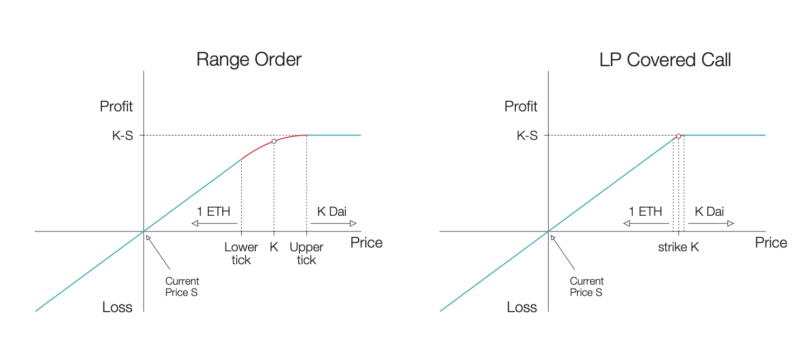
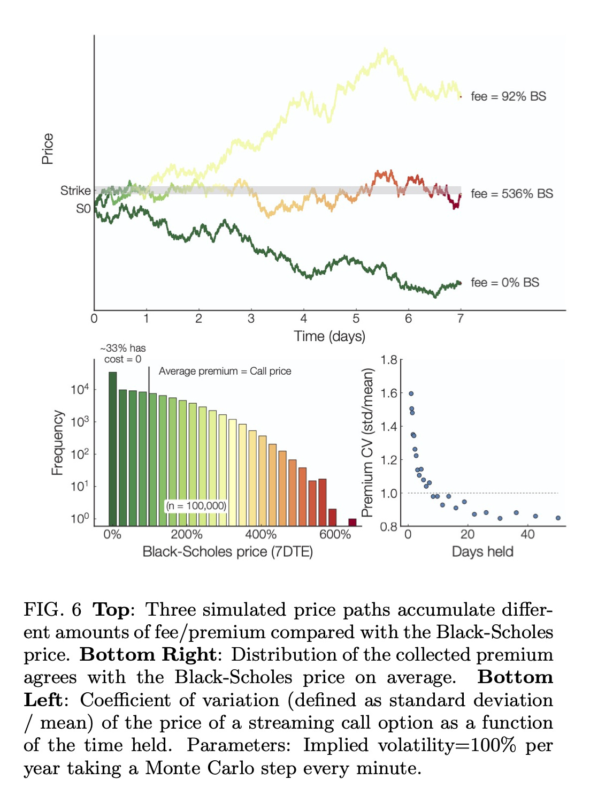

We heard some of you might have some Q's regarding Panoptions:
-   How are they priced?
-   Are they any different from Vanilla European Options?
-   Why can't we just use Black-Scholes (BSM)?

Read on to find out!

<!--truncate-->

---

### About Panoptic
First: Panoptic is a composable, perpetual ⌛️, oracle-free 🔮, instant-settlement options trading protocol built on top of Uni V3. We're doing for decentralized options what x · y = k automated market makers did for spot trading.

To do this, we make use of the observation that LPing in Uni V3 (i.e. LPing ranged positions) has a very similar payoff curve as selling covered calls. Buying/selling options is intimately related to adding/removing liquidity.

We mentioned that Panoptic is:
1.   Composable
2.   Perpetual ⌛️
3.   Oracle-free 🔮

These 3 characteristics make Panoptic different from other protocols! Let's describe them briefly:

### Composability
By "composable" we mean that users can create multi-legged options positions on a single mint! This allows for a wide variety of strategies that can be adjusted to each user's needs. Wanna know more about multi-legged positions? We got you *[covered](https://panoptic.xyz/research/essential-options-strategies-to-know)*.

### Perpetuity
Perpetual options have no expiration date & can be exercised at any time. This makes them more flexible than vanilla options. However, they can't be priced using Black-Scholes...but their pricing is based on a model that *does not require an oracle*.

### Oracle-Free
Why did we choose to not rely on a price oracle 🔮?

Cons of oracles:
-   Need to provide reliable data 100% of the time
-   Are complex to integrate on chain
-   Can be expensive to maintain

This is difficult in DeFi! So how do we calculate the price without oracles? Panoptic uses an oracle-free concept called streamia (streaming premia):
-   No upfront payment
-   Instead, buyers pay a small fee at every block to keep their position open, whenever it is near-the-money
-   This per-block fee is computed from every change in price of the asset
    
Intuitively,
-   If price changes a lot, volatility + fees are big
-   If it doesn't change much, volatility + fees are small

Mathematically, the total premium corresponds to integrating theta (θ) of the option over time (with θ the rate of change of the option premium, P, with respect to time), see formula below.

$\text{Premium } P=\int_{\mathcal{S}(t)}\theta(S_t,K,\sigma )\mathrm{d} t$

$\theta(S_t,t)=\frac{\partial V(S_t,t)}{\partial t}=\frac{S_t\sigma}{\sqrt{8\pi t}}\exp\left(-\frac{\left[\ln\left\{\frac{S_t}{K}\right\}+\frac{\sigma^2t}{2}\right]^2}{2\sigma^2t} \right)$

$\text{Here, } \sigma^2\in\mathbb{R}_{>0} \text{ is the volatility and } S_t \text{ is the asset price.}$

This corresponds to options that continuously expire at small time intervals (∆t). Does Panoptic integrate θ on-chain? No! 🙅‍♂️ In practice, this premia corresponds to the LP fees in the Uni V3 pool! Does this converge to BSM? Yes! 🤯 We can verify this w/ Monte Carlo:

Ok, so how do we implement this on chain? Using Uni V3-like structure!

-   We keep track of fees + liquidity associated to each pos.
-   As price moves, fees accumulate
-   A buyer that opens at `t1` & closes at `t2` pays fees proportional to Uni v3 fees (plus an additional liquidity-based spread) between `t1` & `t2`
- Indeed, UniV3 collects fees.
    $\mathsf{totalFees}=\mathsf{fg_{upper}-fg_{lower}-fg_{insideLast} \cdot liquidity }$ where `fgupper` and `fglower` are the `feegrouwthOutside0x128` of the upper and lower ticks in Uni v3, and `fginsdelast = feeGrowthInsde0lastX128`, and liquidity is the liquidity owned by the protocol.

In this setting, the option buyer would pay a premium as shown below to the seller: $\mathsf{premium}=\frac{\mathsf{totalFees\cdot positionSize}}{\mathsf{liquidity}}$   

---

😮‍💨 We tried hiding a lot of the "mathier" details, but we hope that wasn't too much to digest! If it was, or if you want to learn more about Panoptic, you can read our [whitepaper](https://paper.panoptic.xyz).