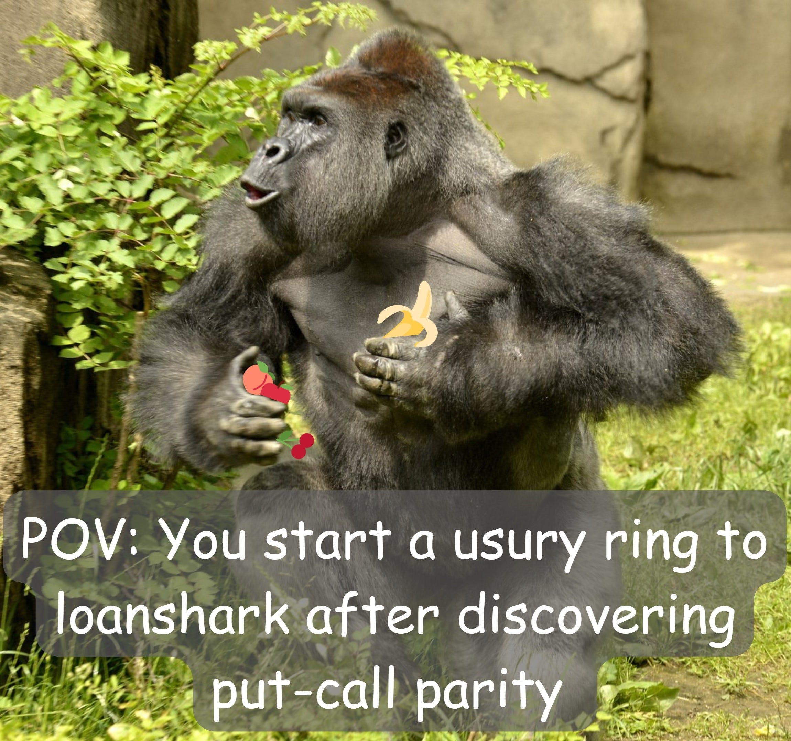
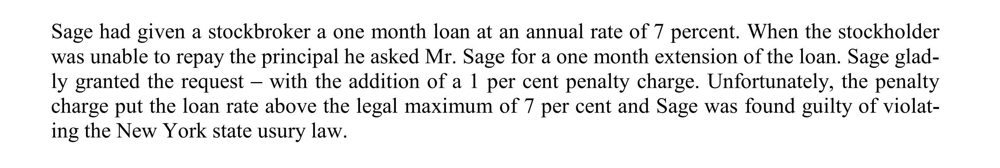
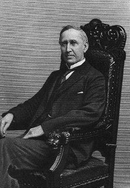
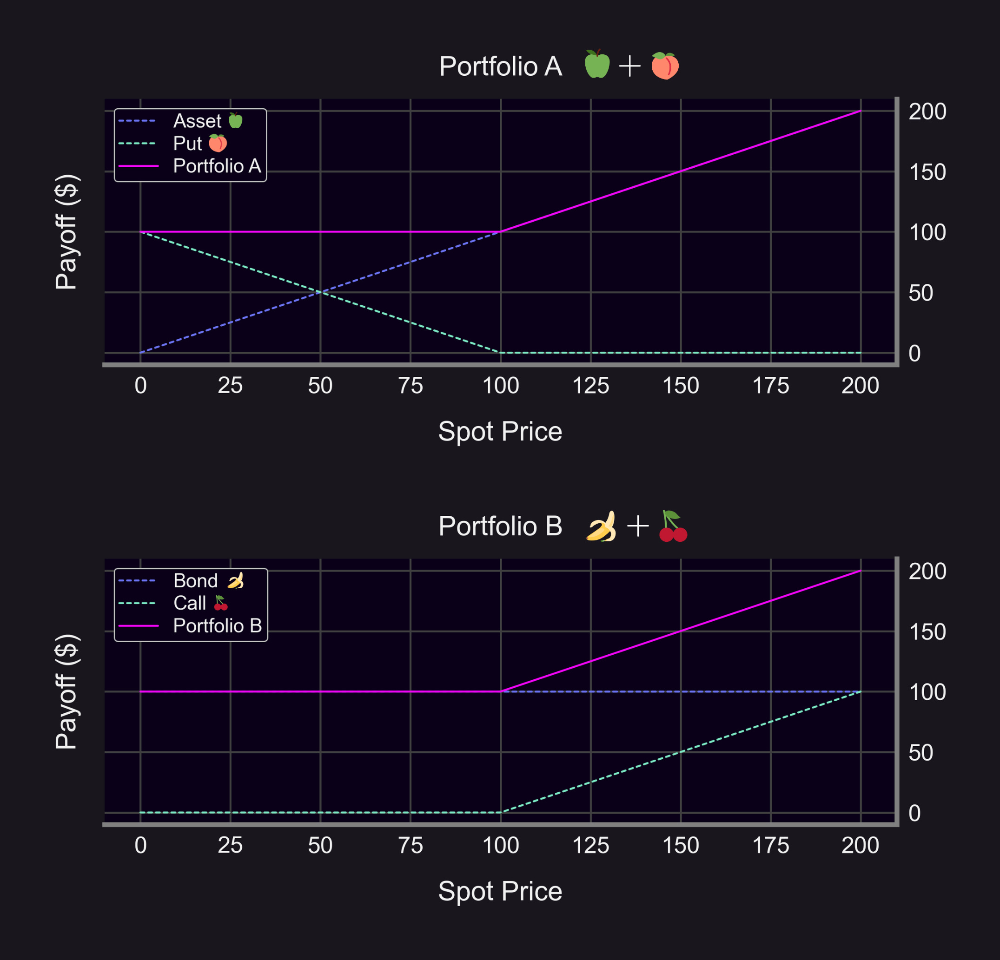
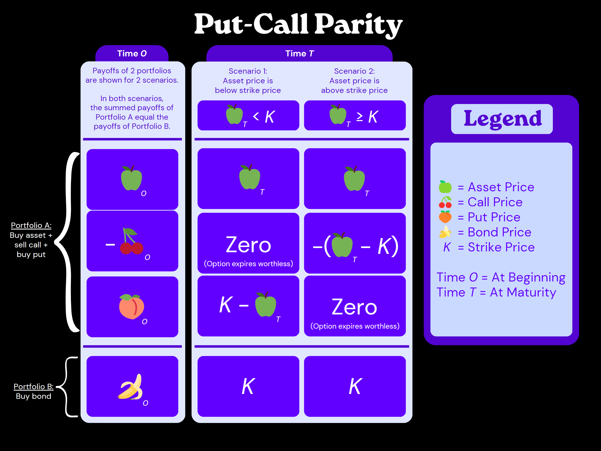
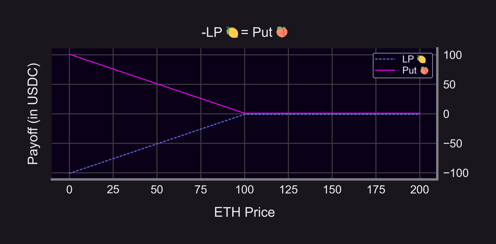
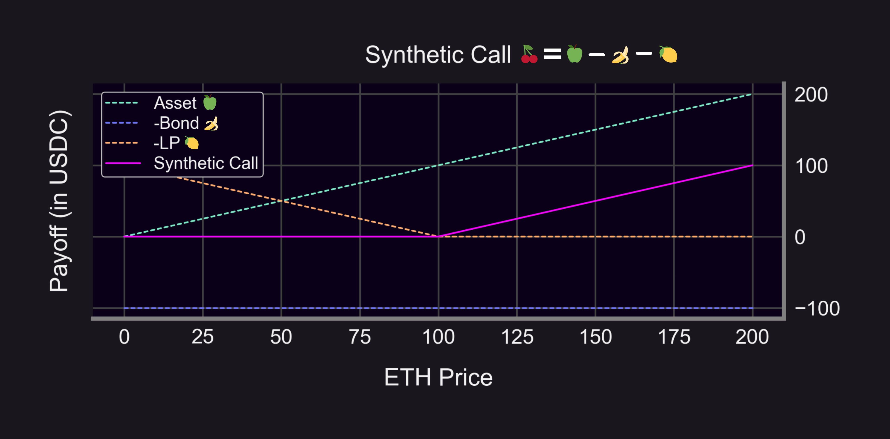

Did you know the "Father of Options" circumvented 19th century usury laws via financial engineering to make $?

Let's dive into the fascinating story of how Russell Sage leveraged put-call parity to become a millionaire, and how put-call-LP parity revolutionizes DeFi options🧵

<!--truncate-->

----------

In this thread we'll:

-   Show how Russell Sage made millions by subverting the law with options
    
-   Use monkeys & bananas to explain put-call parity
    
-   Explain why "put-call-LP" parity for DeFi options is as groundbreaking as put-call parity was for TradFi options
    

### What is Usury?

Usury, aka predatory lending, is charging an excessive rate of interest on a loan.

Historically, usury was defined as charging *any* interest on a loan and was condemned by major religions & prominent philosophers (Moses, Buddha, Muhammad, Aristotle...).

In 1867, Russell Sage was convicted of violating New York usury laws for charging an 8% annual interest rate on a late loan to a stockbroker. The penalty for Russell was $250 in fines and 5 days in prison (source [here](https://www.researchgate.net/publication/314457982_Derivatives_and_Usury_The_Role_of_Options_in_Transactions_Used_to_Act_in_Fraud_of_the_Law)).

But this didn't deter him. Russell used his know-how of options to create synthetic loans. He developed OTC options trading on such a grand scale that he was known as "The Father of Puts and Calls", inventor of straddles & strangles, and the "Money King".

### Put-Call Parity
But how exactly did the "Money King"💰👑 create loans through options trading? The answer lies in a fundamental concept found in every financial textbook called "put-call parity", which can be used to create synthetic loans.

Imagine a seesaw with 4 types of fruit: apples🍏, peaches🍑, cherries🍒, and bananas🍌.

In order to stay balanced, the seesaw must have a fixed ratio of apples🍏 + peaches🍑 on one side, and cherries🍒 + bananas🍌 on the other side.

Each fruit represents a financial instrument, and the fundamental relationship between the fruits is put-call parity.

-   🍏 = asset price
    
-   🍑 = put price
    
-   🍌 = bond price
    
-   🍒 = call price
    

Put-call parity: 🍏 + 🍑 = 🍌 + 🍒

-   "Mon[k]ey King"🐵👑 be like: "Me like loanshark — me want high interest rate!"
    
-   Buying 🍌(bonds) is a fancy way of saying: "Me lend you some money in exchange for interest."
    

→ So 🐵👑 can loanshark by buying 🍌(bonds — in this case, high yield ones)! 🤯

But 🐵👑 couldn't legally buy bananas🍌 (bonds — the high yield ones). 🚩🚩🚩🐵👑⛓️👮

Instead, he:

-   Bought apples🍏(asset)
    
-   Sold cherries🍒 (calls)
    
-   Bought peaches🍑 (puts)
    

→ Effectively purchasing bananas🍌 (bonds) to create loans at higher interest rates than was legal!

----------
### Put-Call-LP Parity
Just as "put-call parity" is fundamental to options, "put-call-LP parity" is fundamental to DeFi options.

Panoptic begins w/ the simple observation that providing concentrated liquidity in Uniswap V3 is analogous to selling options in TradFi.

LP = -Put 🤯

Let's call this observation "put-LP parity": LP = -Put (🍋 = -🍑)

Which means: -LP = Put (-🍋 = 🍑)

→ Panoptic lets you buy peaches 🍑 (puts) by selling lemons 🍋 (LPs) 🤯

How do you buy 🍒 (calls)? Answer: lab-grown synthetics!

-   Put-call parity: 🍒 = 🍏 - 🍌 + 🍑
    
-   Put-LP parity: 🍑 = -🍋
    
-   → Combined: 🍒 = 🍏 - 🍌 - 🍋
    

→ You can buy 🍒 (calls) by buying 🍏 (asset), selling 🍌(bonds), and selling 🍋 (LPs)🤯

Panoptic Labs™ synthesized a new type of 🍑 and 🍒: These 🍑 and 🍒 are shelf stable because they NEVER expire!

Panoptions are a novel type of options:

-   Perpetual♾️
    
-   Oracle-free🔮
    
-   Permissionless🤠
    
-   Made for DeFi🔑
    
<blockquote class="twitter-tweet" data-conversation="none">
2/14 OK, first things first:  Panoptic is a composable, perpetual ⌛️, oracle-free 🔮, instant-settlement options trading protocol📈 built on top of Uni V3  We&#39;re doing for decentralized options what x · y = k automated market makers did for spot trading 🎯🔥
&mdash; Panoptic (@Panoptic_xyz) <a href="https://twitter.com/Panoptic_xyz/status/1637861610114134016?ref_src=twsrc%5Etfw">March 20, 2023</a></blockquote> 

Summary:

-   Put-call parity describes the relationship b/t puts and calls
    
-   Russell Sage took advantage of this to make high interest loans
    
-   Put-call-LP parity describes the relationship b/t put, calls, & LP
    

Disclaimer:

-   📢 None of this should be taken as financial advice
