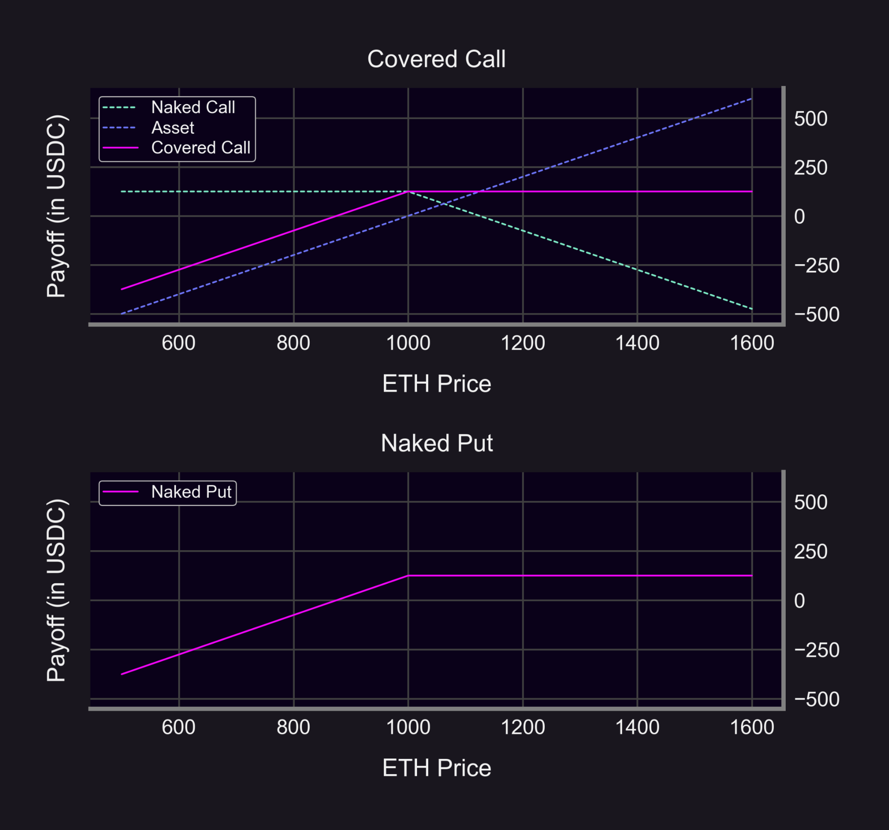
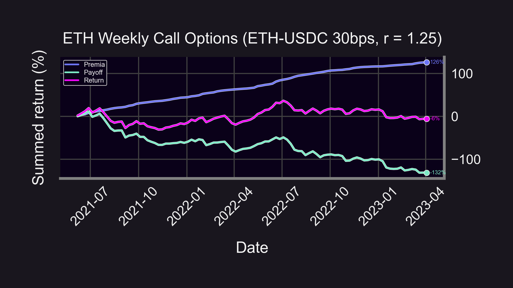
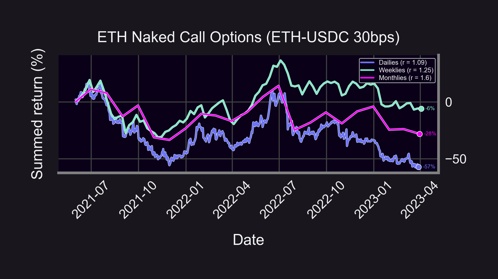
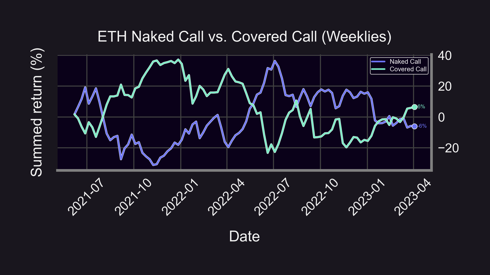
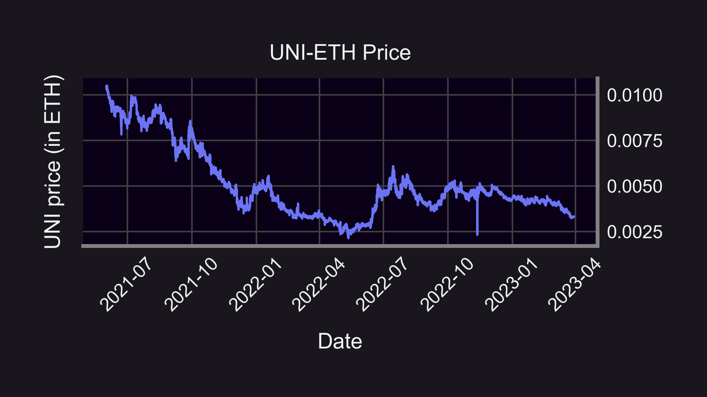
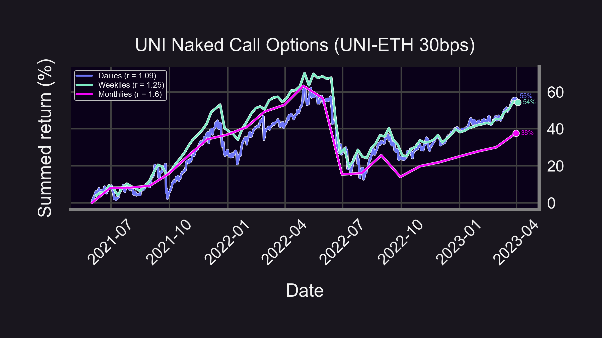

🔥 If you're looking for a way to earn extra income, selling call options can be a powerful strategy. But beware: selling naked calls can be risky. Here's what you need to know.

<!--truncate-->

----------
### Naked Calls
💰 Selling call options gives you the ability to earn premium income. But if you sell a naked (unhedged) call, you're taking on unlimited risk since you're obligated to sell the underlying asset at a preferential price if the buyer exercises the option.

### Covered Calls
🤔 So what's the alternative? You can sell covered calls, which involves selling call options on an asset you already own. In TradFi, this is considered "safer" since:

-   Downside is NOT unlimited (but still substantial)
    
-   Markets tend to go up (this is a bullish strategy)
    

The payoff of selling a covered call is the same as a naked put. (Bonus point: covered call = naked put = Uniswap LP 🤯)

### Backtest Strategy
🔍 To figure out which strategy is right for you, it's important to backtest and analyze past data. Let's analyze what periodically *selling* naked ATM ETH calls over the last 2 years might look like!

<blockquote class="twitter-tweet" data-conversation="none">
2/11 Let&#39;s backtest *hypothetical* DeFi call options (wen Panoptic? 😉)  🗓️ Jun &#39;21 - Feb &#39;23 ⚖️ Periodic rebalancing (day, week, or month)  Strategy: 1. Buy at-the-money (ATM) call option 2. Exercise/close at end of period 3. Pay LP fees as premia<a href="https://t.co/NthYyRBK7K">https://t.co/NthYyRBK7K</a> <a href="https://t.co/wSkTtHWBXJ">pic.twitter.com/wSkTtHWBXJ</a>
&mdash; Panoptic (@Panoptic_xyz) <a href="https://twitter.com/Panoptic_xyz/status/1636122863236452352?ref_src=twsrc%5Etfw">March 15, 2023</a></blockquote> 

Anyone will be able to sell options on Panoptic for any asset at any strike. Panoptic options even have an "effective Time To Expiration"👇 This means you can customize your Panoption to sell "dailies", "weeklies", and "monthlies". Let's backtest these 3 strategies!

<blockquote class="twitter-tweet" data-conversation="none">
7/12 So how do I buy a 0DTE on Panoptic? I thought Panoptions don&#39;t expire?  That&#39;s right! But on Panoptic, you can adjust the &quot;width&quot; (r) of your Panoption to correspond with Time To Expiration (TTE):  Wider range → longer TTE More volatility → shorter TTE  See math below 🤓👇 <a href="https://t.co/XAbxaMmnWa">pic.twitter.com/XAbxaMmnWa</a>
&mdash; Panoptic (@Panoptic_xyz) <a href="https://twitter.com/Panoptic_xyz/status/1641108066044346370?ref_src=twsrc%5Etfw">March 29, 2023</a></blockquote> 

### Backtest #1: Selling (naked) calls on ETH every week

-   Earned 126% in premia
    
-   Lost 132% from calls being exercised
    

→ Total PnL: -6%

(Compare to ETH HODL: -32%)

Unfortunately, our strategy wasn't profitable. What if we tried different rebalancing periods?

### Backtest #2: Selling (naked) calls on ETH every day/week/month

-   Weeklies: -6%
    
-   Monthlies: -28%
    
-   Dailies: -57%
    

Wow...dailies & monthlies did even worse. Let's try something typically seen as "less risky" — covered calls!

### Backtest #3: Naked calls vs. covered calls

-   Naked calls: -6%
    
-   Covered calls: +6%
    
(The fact that they are exactly opposite is a coincidence.)

Covered calls did better...but why?

Notice how naked calls (blue curve) performed great in May 2022 — during the Terra collapse and bear market!

Fact:

-   Bull market → naked calls 👎
    
-   Bear market → naked calls 🚀
    

Let's test this out on one of the biggest bear markets: the UNI-ETH price!

In the spot markets, UNI has massively underperformed ETH. That makes the UNI-ETH price a bear market. So what happens if you sell naked calls on UNI-ETH? Answer:

-   😎 Dailies: +55%
    
-   😄 Weeklies: +54%
    
-   🙂 Monthlies: +38%
    

### Summary

-   Naked calls have unlimited risk
    
-   Naked calls are bearish and do well in 🐻 markets
    
-   Covered calls are bullish and do well in 🐂 markets
    

Caveats:

-   ⛽ Ignores gas/swap fees/commission
    
-   💲 Assumes premia = LP fees
    
-   ❓ This is hypothetical — you can't sell calls on Uniswap (Panoptic soon 🤫)

Disclaimer:
    
-   📢 None of this should be taken as financial advice.
    
-   ⚠️ Past performance is no guarantee of future results!
