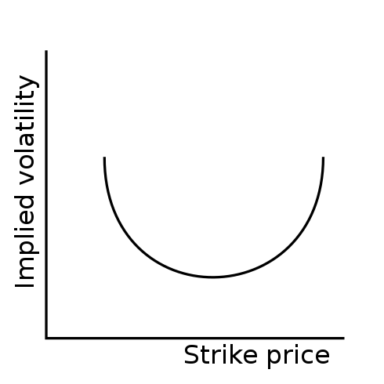
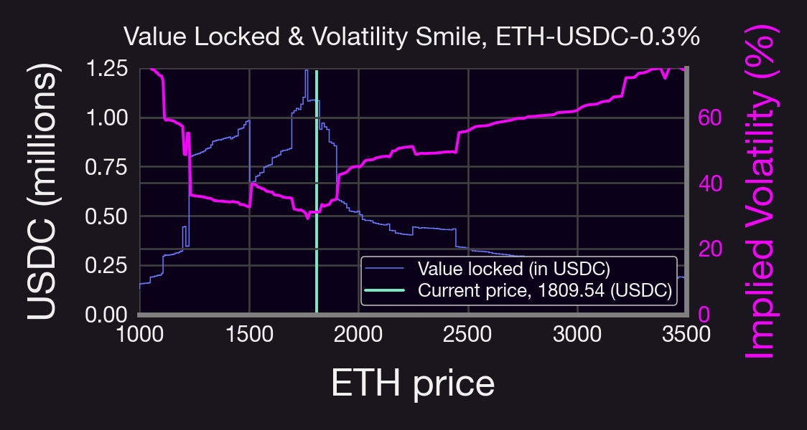

Implied volatility and volatility smile are two concepts that underlie how the market prices options and perceives risk. In this post, we'll explore what they are, how they work, and what their role is in Panoptions.

<!--truncate-->

----------

## Implied Volatility (IV) 🌩️

IV is a measure of the expected *future* volatility of an underlying asset. IV reflects market participants' expectations about how much the asset's price will move.

Realized volatility (RV), on the other hand, is a measure of the volatility in the *past*.

## Why does IV matter? 🔍

Higher IV means higher option prices, as the market expects more significant price swings, translating to a higher risk.

Traders use IV rank and IV percentile to gauge whether options are expensive with respect to their historical averages.

## How does this work in Panoptic? 🤔

We use a "streaming premia" model, in which buyers pay sellers a small fee whenever a Panoption is in range.

This fee is related to the amount of fees a UniV3 LP would make (plus a small spread).

From 👆 we see that option premia then depends on the fees collected in a pool, which in turn depend on: 
- 1️⃣ Fee tier in UniV3 pool.
- 2️⃣ Volume - trading activity within the pool.
- 3️⃣ Tick liquidity - the amount of funds in the pool. 🌊💰

A volatile market can be due to:
1. High trading volumes
2. Low liquidity

By comparing the cumulative premia of an at-the-money option to the actual fees collected by a UniV3 pool per unit of time, we can derive an IV for Panoptions that incorporate those quantities:

$\mathsf{IV}=2\cdot\mathsf{Fee Rate}\cdot\sqrt{\frac{\mathsf{Volume}}{\mathsf{Tick \ Liquidity}}}$

Notice that this is a nice, simple expression. Normally, IV for European call options require some root-finding algorithms to be computed. This would be expensive to compute on chain.

## What about Volatility Smile? 😊

When we plot IV against different strike prices, we often see a "smile" pattern AKA the Volatility Smile. 

This smile indicates that options with out-of-the-money (OTM) & in-the-money (ITM) strikes have higher IV than when at-the-money (ATM)

## Reasons for the Smile 📚

The Volatility Smile can be attributed to factors like
- Outlier risk
- Market psychology 
- Supply and demand 
- Trading activity 

It's more pronounced for shorter-dated options, which are more sensitive to sudden price movements.

Interestingly enough, volatility smiles, while intuitive (more fluctuation of prices deep ITM/OTM than ATM), are not explained by the Black-Scholes model!

This is because the BS model assumes a constant IV, which is what options market makers used before the 1987 crash. Nowadays, all TradFi market makers know to add a volatility smile.

Is there a volatility smile in Panoptions? Yes! It depends on the relation between traded volume and liquidity of the pool. Typically, there is more liquidity close to the current price, as shown below

## So how do Panoptic IVs compare to TradFi option IVs? 

Both help assess the market's expectation of future price changes. However, Panoptic's IV formula is tailored to the unique structure of liquidity pools, whereas TradFi option IVs are derived from option prices.

In the figure above, for example, IV is smaller for higher ETH prices than for small ETH prices, suggesting bullish market sentiment. And if IV < RV, then LPs would be disincentivized to provide liquidity in that specific pool.

Whether vanilla options or Panoptions, IV is a crucial metric, helping traders gauge risk and make more informed decisions. Though each case is calculated differently, the concept remains the same: understand market sentiment & price movement.