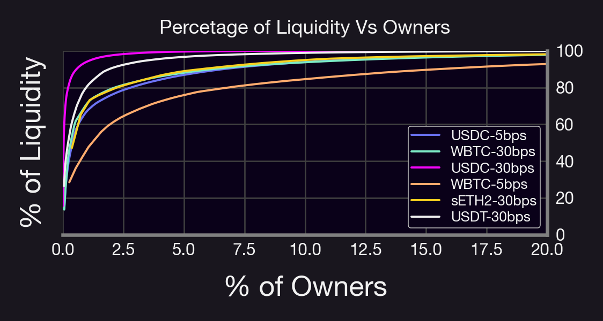
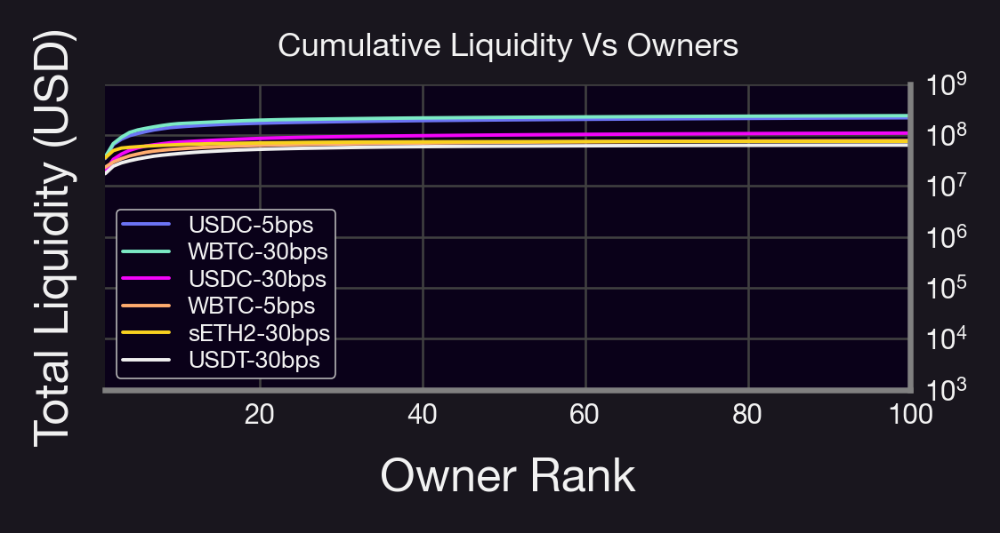
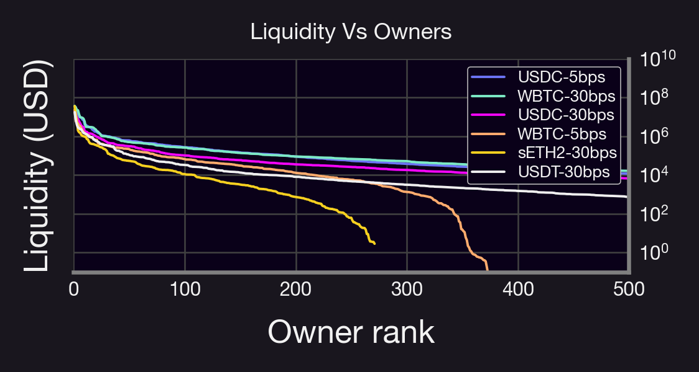
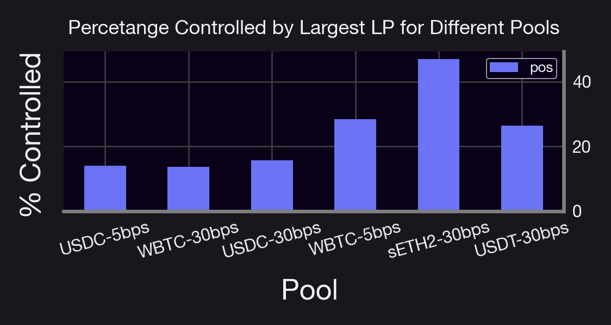
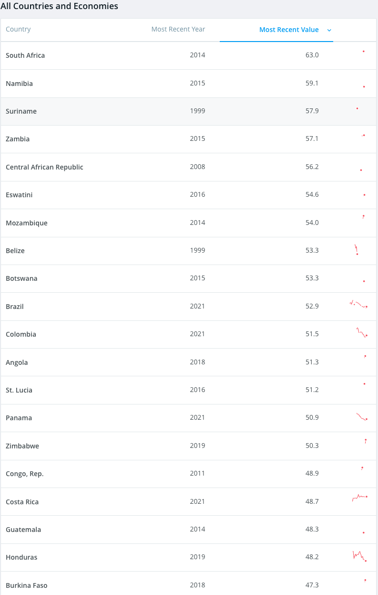
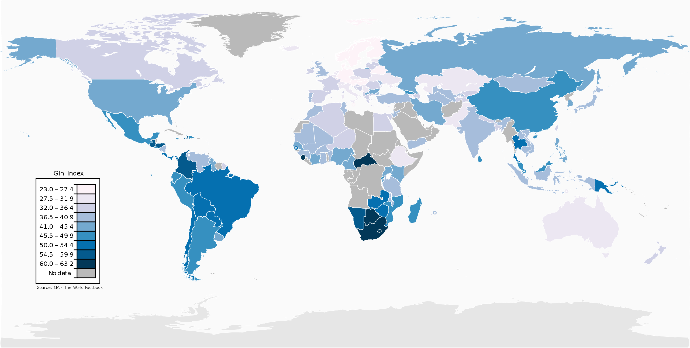

Uniswap V3 brought a significant innovation to the world of decentralized finance (DeFi) with its concentrated liquidity feature. This breakthrough allowed liquidity providers (LPs) to allocate their funds within custom price ranges, resulting in greater capital efficiency and higher potential returns.

But how concentrated is liquidity in UniV3, and what are the implications for the DeFi ecosystem? In this blog post, we'll dive deep into the world of concentrated liquidity positions and uncover the key factors that make Uni v3 stand out from other decentralized exchanges.
<!--truncate-->

---

# Understanding Concentrated Liquidity in Uniswap V3

### What is concentrated liquidity?

In Uniswap v3, LPs can allocate their funds within custom price ranges, known as "concentrated liquidity positions." This allows LPs to target specific price levels where they believe trading will occur, leading to more efficient use of their funds.

### How does it differ from Uniswap V2?

In Uniswap V2, LPs had to allocate their funds uniformly across the entire price range. This often resulted in low capital efficiency, as most of the liquidity was concentrated in areas where trading seldom occurred.

# Analyzing Concentrated Liquidity Positions

### Methodology

We use the Uni v3 subgraph to query the liquidity positions of some of the largest pools in Uni v3. We grouped positions by address and summed the total amount of funds deployed (in USD).

### Key Findings
- Less than 8% of LPs provide more than 80% of liquidity in all pools.
- Fewer than 20 addresses control most of the pools.
- In some pools, just 1% of LPs own over 80% of the liquidity.

### The Pareto Principle in Concentrated Liquidity

Our findings suggest a stronger version of the Pareto Principle in UniV3's concentrated liquidity. This principle states that 80% of the consequences are due to 20% of the causes. In our case, 80% of liquidity is due to just 1% of LPs.

# Implications of Concentrated Liquidity
- Deep liquidity pools enable efficient swaps, resulting in a better user experience.
- Higher potential returns for LPs due to greater capital efficiency.
- Potential risks and centralization, as a few top LPs could have significant influence over token prices.
- Possible short-lived price manipulation or increased volatility.

# Conclusion
The concentrated liquidity feature in Uniswap v3 revolutionized the DeFi space, and Panoptic aims to do the same for options trading. As the DeFi ecosystem evolves, innovative solutions like Panoptic will help users hedge their positions against potential risks arising from concentrated liquidity.

Uniswap V3's concentrated liquidity positions have reshaped the DeFi landscape, bringing greater capital efficiency and higher returns for LPs. While this feature has numerous benefits, it also comes with potential risks and centralization concerns.

Understanding these dynamics is crucial for navigating the ever-changing world of decentralized finance. With innovations like Panoptic on the horizon, the future of DeFi looks brighter than ever.