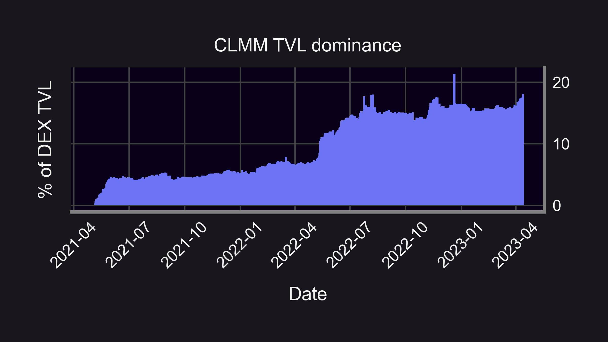
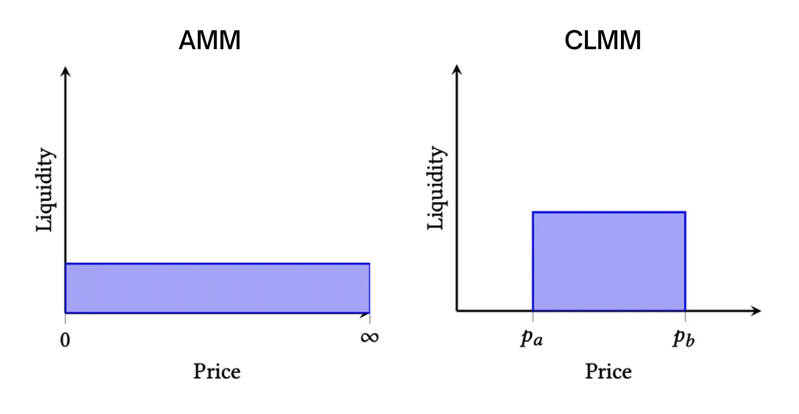
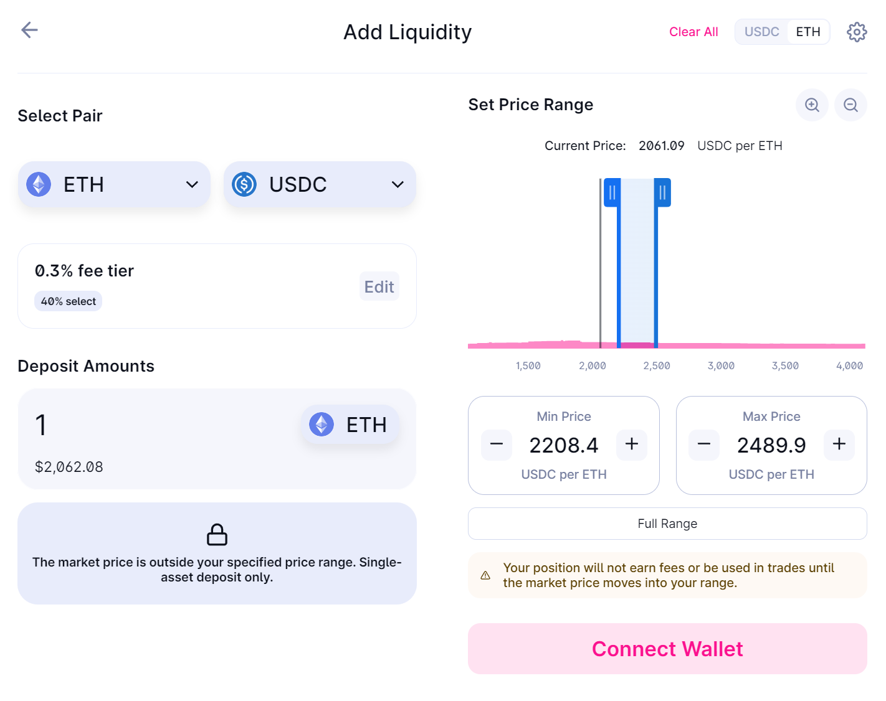
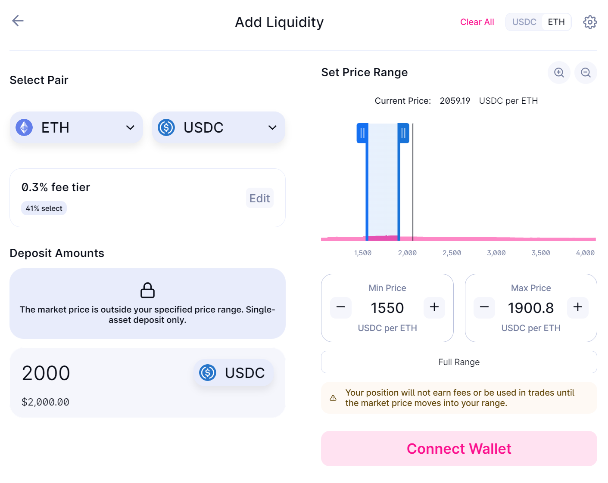
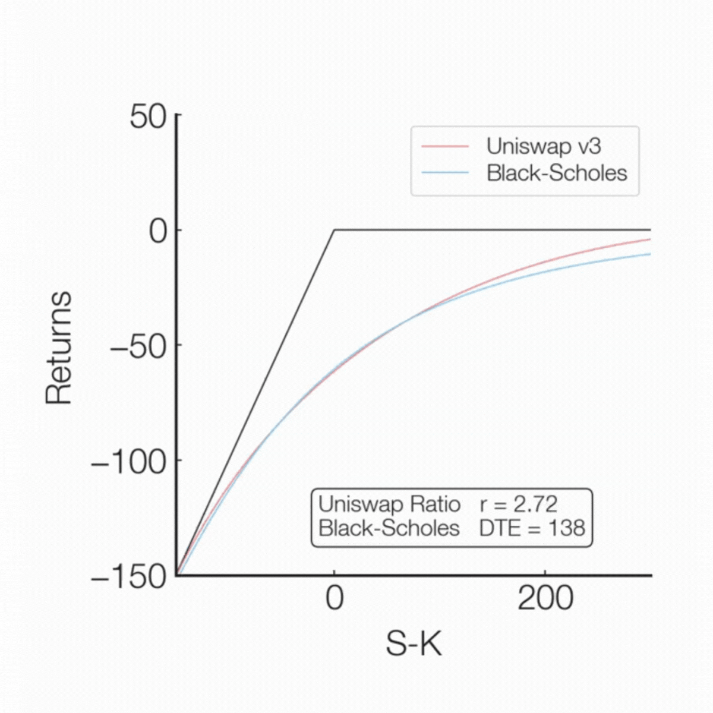
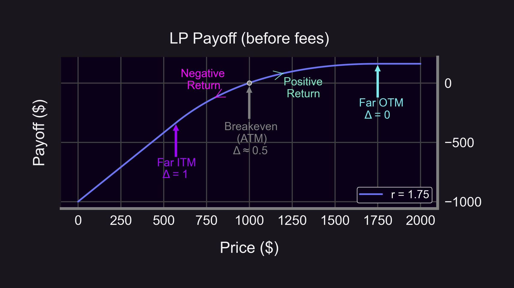

🌊 Uniswap v3's business license expired on April 1st, sparking a massive wave of interest in Concentrated Liquidity Market Makers (CLMM).

Here's 8 reasons why concentrated liquidity (and Panoptic!) is the FUTURE of DeFi 🛥️🚀!

<!--truncate-->

----------

### 🍴 Reason #1: New CLMMs everywhere

The OGs:

-   Uniswap v3
    
-   Kyber Elastic
    
-   Trader Joe v2
    

Uni v3 forks:

-   PancakeSwap v3
    
-   SushiSwap v3
    
-   Quickswap v3
    
-   Camelot v3
    
-   ApeSwap v3
    
-   MaiaDAOEco
    

Panoptic can integrate all CLMMs! (Panoptic v2...😉)

See the thread below to learn more about Uniswap’s business license and forks 👇

<blockquote class="twitter-tweet" data-conversation="none">
Did you know it’s illegal to fork <a href="https://twitter.com/Uniswap?ref_src=twsrc%5Etfw">@Uniswap</a>?   That’s right, you’re not allowed to copy and paste Uniswap v3 code  That’s been the case for the past 2 years  But tomorrow, on April 1st, Uniswap will lose that immunity   What does this mean, and how did we get here?👇 <a href="https://t.co/ldMrIeIrFn">pic.twitter.com/ldMrIeIrFn</a>
&mdash; Abdullah Umar ~ ubermar (@abdullahbumar) <a href="https://twitter.com/abdullahbumar/status/1641896618097090560?ref_src=twsrc%5Etfw">March 31, 2023</a></blockquote> 

### 📈 Reason #2: CLMM traction is unstoppable

The majority of DEX trading volume is on CLMMs. Out of the $87 bn traded on DEXs last month, $49 bn was on CLMMs (56%)!

CLMMs' capital efficiency provides better slippage, making it a popular choice for traders and aggregators.

The trend is CLMM's friend: Nearly a fifth of TVL on DEXes belongs to CLMMs (18%). That's up from ~7% a year prior! 🚀📊

Interesting how < 1/5 of TVL is supporting > 50% of DEX volume...that's capital efficiency! 🤯

### 🎯 Reason #3: CLMMs are capital efficient

CLMMs allow liquidity providers to concentrate their funds within specific price ranges. This maximizes potential returns, minimizes idle capital, and reduces slippage for traders!

### 🙆 Reason #4: CLMMs are flexible.

CLMMs let LPs set their preferred price range. They can choose between tight/narrow ranges that are above/below/straddle the current price.

In fact, LPs can still choose to provide full-range liquidity on a CLMM just as they do on regular AMMs!

See the thread below for more on choosing a price range 👇

<blockquote class="twitter-tweet" data-conversation="none">
1/13 Read our latest <a href="https://twitter.com/hashtag/ResearchBites?src=hash&amp;ref_src=twsrc%5Etfw">#ResearchBites</a> from <a href="https://twitter.com/brandonly1000?ref_src=twsrc%5Etfw">@brandonly1000</a> of the<a href="https://twitter.com/Panoptic_xyz?ref_src=twsrc%5Etfw">@Panoptic_xyz</a> research team!  ===== How do you LP on UniV3 with a ±% range?  E.g. if you wanted ±30% should you do:  1) Lower: P * 70%  Upper: P * 130%  or  2) Lower: P / 1.3  Upper: P * 1.3  Let&#39;s find out!👇 <a href="https://t.co/QChXAuIonz">pic.twitter.com/QChXAuIonz</a>
&mdash; Panoptic (@Panoptic_xyz) <a href="https://twitter.com/Panoptic_xyz/status/1615816389490802689?ref_src=twsrc%5Etfw">January 18, 2023</a></blockquote> 

### 🏪 Reason #5: CLMMs are convenient for Liquidity Providers (LPs)

CLMMs let LPs provide single-sided liquidity:

For example, in ETH-USDC, LPs can deposit ETH in any price range above the current price or deposit USDC in any price range below the current price.  

### 🔓 Reason #6: CLMMs enables option payoffs

Concentrated liquidity allows Panoptic to provide true options payoffs (i.e. put and call options).

If you set your LP range to be extremely narrow, the payoff looks exactly like a short put option! 🤯

See the thread below for more 👇

<blockquote class="twitter-tweet">
Uni V3 positions have the same payoff as short puts.   You can borrow a LP position for a fee and return it later. That&#39;s the same as purchasing a long put.   Uni v3 options also allow you to get rid of gamma risk completely. <a href="https://t.co/Rd5BcpLxtI">https://t.co/Rd5BcpLxtI</a>
&mdash; Guillaume Lambert | lambert.eth | 🦇🔊 (@guil_lambert) <a href="https://twitter.com/guil_lambert/status/1437751046483365891?ref_src=twsrc%5Etfw">September 14, 2021</a></blockquote> 

### 🫶 Reason #7: CLMMs offer customizable strike prices

Concentrated liquidity allows Panoptic to create in-the-money, out-the-money, and at-the-money puts and calls at any strike price!

The "middle" part of the LP range is the strike price.

(by "middle" we mean geometric average)

### 🧩 Reason #8: CLMMs use financial NFTs

CLMMs use NFTs to represent unique LP positions.

Panoptic uses ERC1155s to aggregate options positions enabling composability!

ERC1155s allows for multi-legged, capital-efficient, and gas-efficient options (future #ResearchBites 😉)

See the thread below for more info on why Uniswap represents LP tokens as NFTs 👇

<blockquote class="twitter-tweet" data-conversation="none">
2/12 First of all: why is Uni V3 a financial NFT platform?  Liquidity in Uni V3 is deployed under a price range, which means LP positions are non-fungible and can&#39;t be tracked using ERC20s  Instead, Uniswap issues an ERC721 to track the funds controlled by each LP position <a href="https://t.co/GQtAcqdAQn">pic.twitter.com/GQtAcqdAQn</a>
&mdash; Panoptic (@Panoptic_xyz) <a href="https://twitter.com/Panoptic_xyz/status/1624128603414994944?ref_src=twsrc%5Etfw">February 10, 2023</a></blockquote> 

----------

In summary, CLMMs are efficient, flexible, and are here to stay.

Panoptic is leading the DeFi options space by leveraging the power of CLMMs with innovative features like options payoffs, customizable strike prices, multi-legged minting, and capital efficiency! 🚀🌐📈