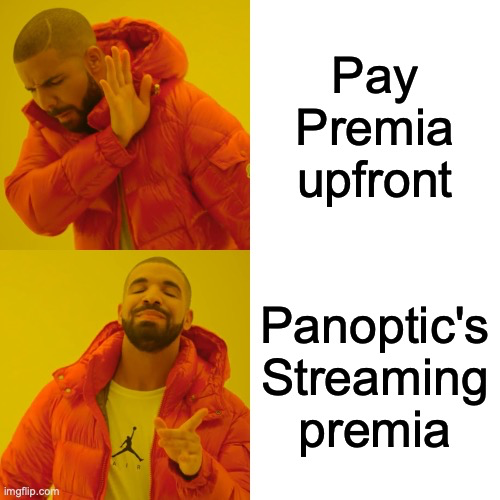

Panoptic is a groundbreaking innovation set to change the landscape of options trading. By introducing the *Streamia* (Streaming + Premia) Pricing Model, Panoptic aims to make options trading more accessible, capital efficient, and secure. In this blog post, we will explore the benefits of Panoptic's next-gen approach to options trading.

<!--truncate-->

---

# What is Streamia?

Streamia is a novel pricing model that eliminates the need for upfront premium payments. Instead, users pay small fees over time, as long as the option remains in range. The model functions like a series of tiny options expiring continuously, with the premia accumulating over time. These fees depend on factors such as position range, liquidity, and volume, and are designed to converge to the Black-Scholes-Merton (BSM) price of the option on average.

# Why Streamia?
Traditional pricing of perpetual options can be complex and reliant on oracles, making it challenging and costly to implement on-chain. Streamia, on the other hand, is DeFi native and can be easily executed on-chain. Here are five key advantages of streamia:

**Lower Barrier to Entry:** By eliminating upfront premia payments, Panoptic makes options trading more accessible. The "pay-as-you-go" system encourages greater participation and fosters a more vibrant ecosystem.

**Dynamic Risk Management:** As streamia accrues gradually, the need to top up collateral for long positions becomes more predictable. This means no wasted capital on options that are not in range, ensuring a more efficient use of resources.

**Capital Efficiency:** Panoptions are more capital efficient than traditional options, as users do not pay a premium upfront. Users can create short-lived, synthetic positions for a fraction of the price and deploy multi-legged positions in one go.

**Robustness & Gas Efficiency:** Streamia does not require an oracle, as the streaming premia is computed on-chain. This makes the pricing model robust against oracle manipulation, cryptographically secure, and gas efficient, since there are no oracle sync costs.

**Fair Pricing:** The on-chain computation of the option's pricing ensures transparency and verifiability. Sellers receive larger premia for positions that remain open, while buyers pay proportionally to their time to exercise, creating a win-win situation.

# Conclusion
Panoptic's streamia is set to revolutionize options trading by fostering a more accessible, flexible, efficient, robust, and open market. As the world of finance, DeFi, and options trading continues to evolve, Panoptic is leading the charge in driving innovation.

Stay tuned for more updates on how streamia is implemented on-chain, as well as future research bites for builders interested in this cutting-edge technology.