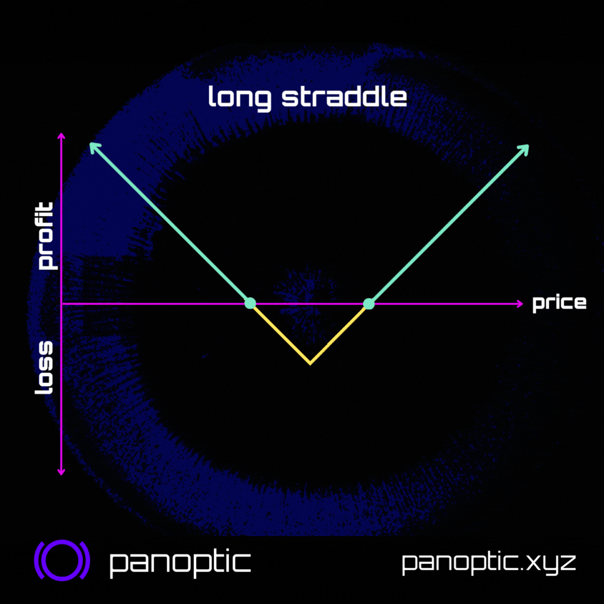
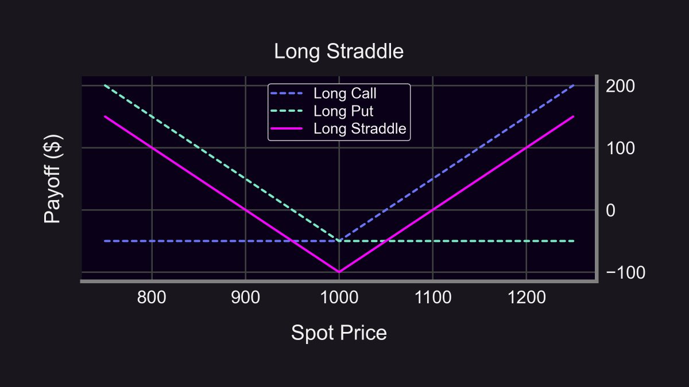

### Straddles 🤸🏽‍♂️

Options are crazy...did you know that you can make money when price goes up OR down? 🤑 Sounds too good to be true? It's not.

Here's a strategy EVERY trader should know to go "long vol" or "short vol". It's called a straddle.

<!--truncate-->

----------

### What is a Straddle?

Straddles let you profit when price moves in EITHER direction.

-   😈 As long as price moves, you profit (delta neutral).
    
-   👿 But if the price stays the same, you lose money.
    

Straddles consist of 2 legs: 1 call + 1 put. The call option lets you profit on the upside and the put option lets you profit on the downside. This results in you profiting if price moves, regardless of direction. However, there's a cost.

The cost of buying a straddle in TradFi is the upfront premia you pay for both legs (call + put). In Panoptic, the upfront cost is 0, and you instead pay a gradual premia that accumulates every block while you're "in range" (think Uni V3 LP).

<blockquote class="twitter-tweet" data-conversation="none">
1/13 🚀 Panoptic is a 0-to-1 innovation that will soon allow you to trade perpetual, oracle-free options  Panoptic is powered by a groundbreaking Streaming Premia Pricing Model (StrP)! 🌊  Let&#39;s dive into this thread to explore the incredible benefits of our next-gen approach <a href="https://t.co/ftpSzZA5wP">pic.twitter.com/ftpSzZA5wP</a>
&mdash; Panoptic (@Panoptic_xyz) <a href="https://twitter.com/Panoptic_xyz/status/1647993380851552257?ref_src=twsrc%5Etfw">April 17, 2023</a></blockquote> 

### Straddles are Volatility Bets

This strat sounds OP...why not always buy straddles? In efficient markets, the cost of a straddle accounts for the likelihood of the straddle being profitable. The higher the chance that asset price will move (volatility), the higher the price of the straddle ⚖️

The price of a straddle is directly related to volatility (σ):

$\text{Straddle Price} ≈ \frac{4}{5}Sσ\sqrt{T}$

Hence, trading straddles is a great way to trade volatility!

### Crypto example

-   ETH price: $2000
    
-   Original straddle cost: $150 ($75/leg)
    

Suddenly, the government states "An Important Regulation on Crypto" will be announced next week. You check the price.

→ New straddle cost: $300 🚀

The price of an ETH straddle doubled because the market believes that ETH will now be twice as volatile.

### Review

-   🔮 Implied Volatility (IV) = Market's belief
    
-   ⚡️ Realized Volatility (RV) = How volatile ETH ends up being
    

### Short Straddles

Did you know you can also sell straddles?

> Short straddle = sell 1 put + sell 1 call

This is risky since you lose money if price moves in either direction. However, you profit if the price stays the same! You are essentially betting that volatility is overstated (IV > RV) and the announcement is a nothing 🍔.

Short vol vs long vol:

-   Short Vol: You think volatility will be lower than the market believes (IV > RV). Sell a straddle.
    
-   Long Vol: You think volatility will be higher than the market believes (IV < RV). Buy a straddle.
    

### Summary

-   🤸🏽‍♂️ Straddles: delta neutral options strategy, profit off of volatility
    
-   🛒 Buy Straddle (long vol): long call + long put
    
-   🏷️ Sell Straddle (short vol): short call + short put
    

You can trade capital-efficient straddles on Panoptic. More #ResearchBites backtesting Uniswap data is coming soon!
