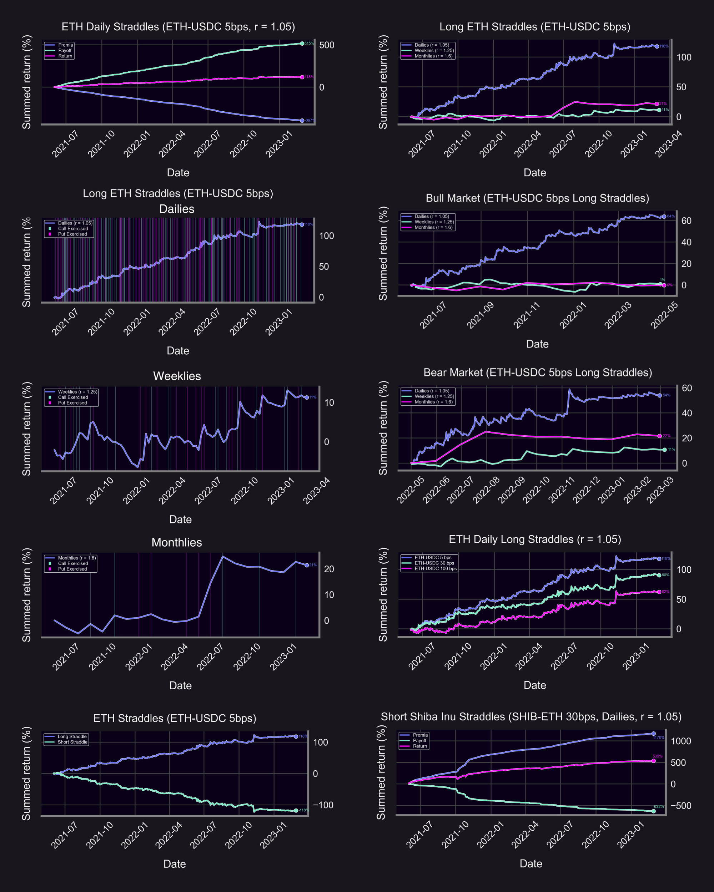
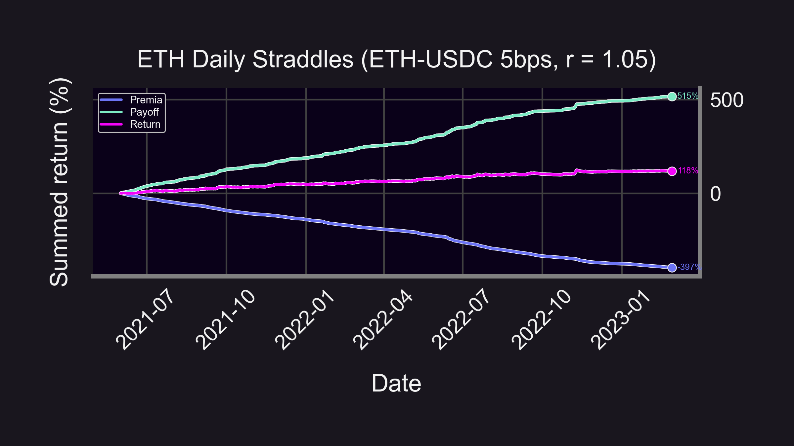
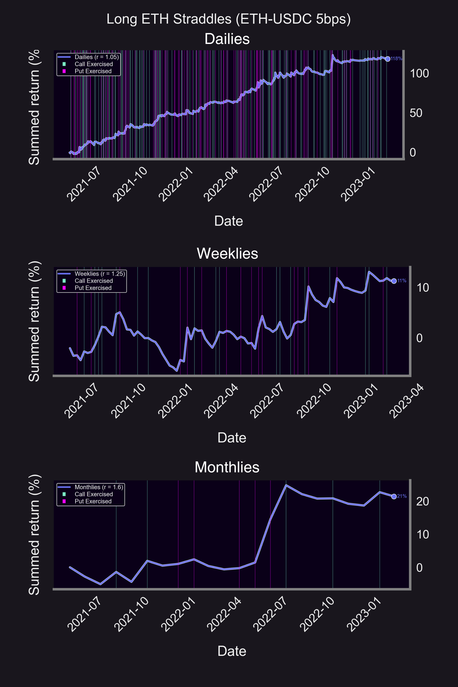
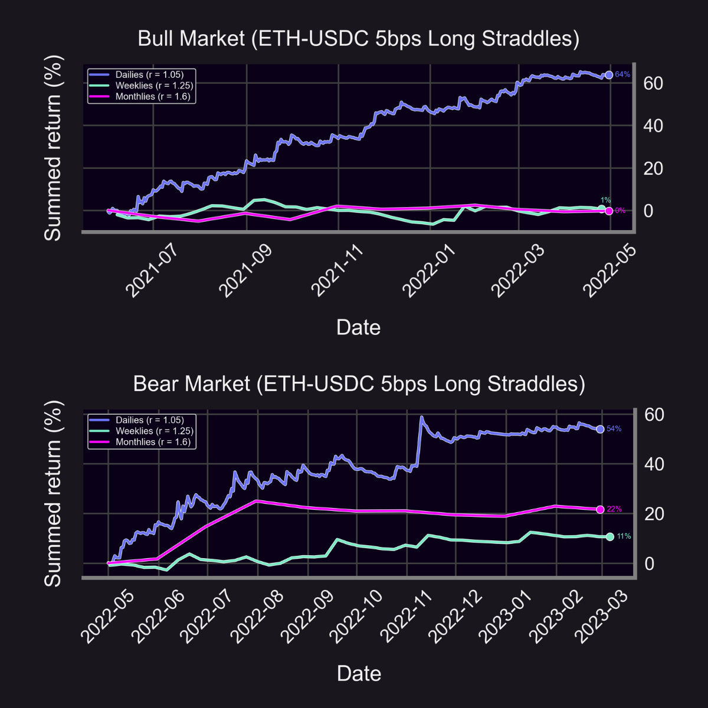
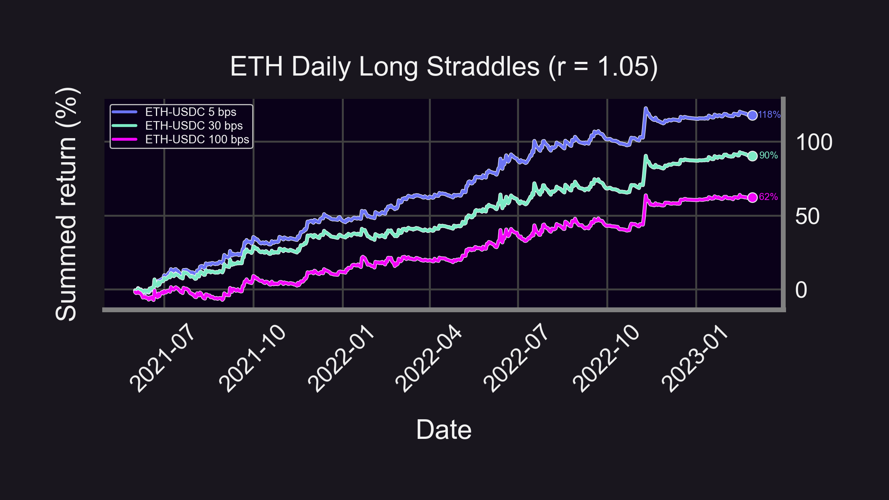
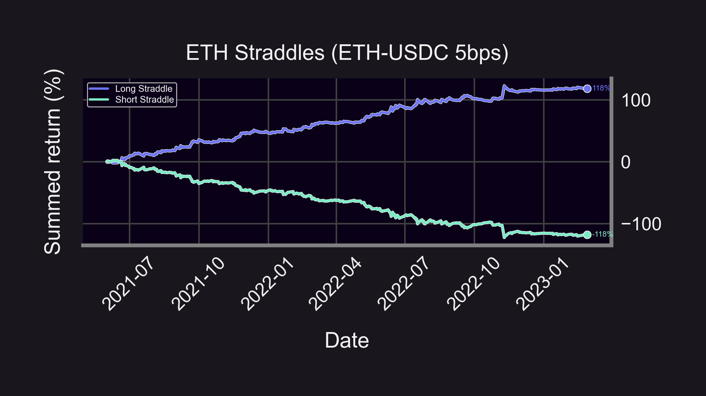
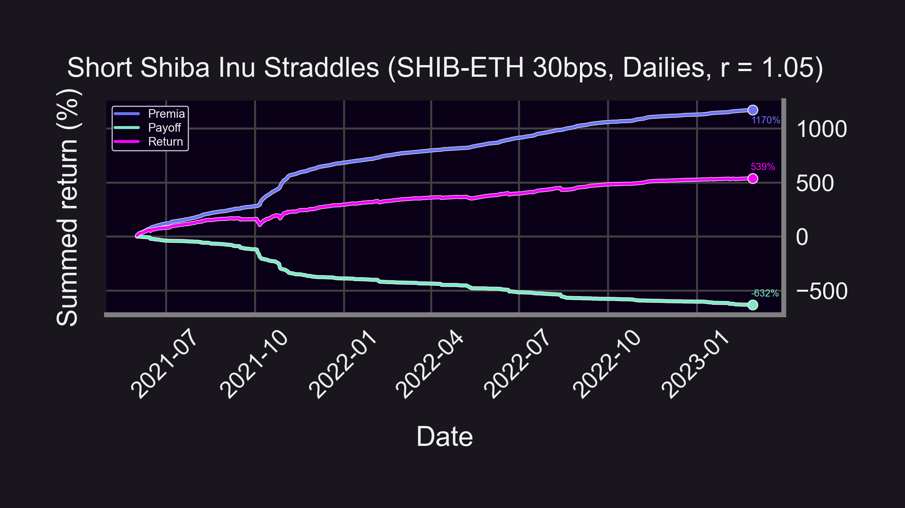
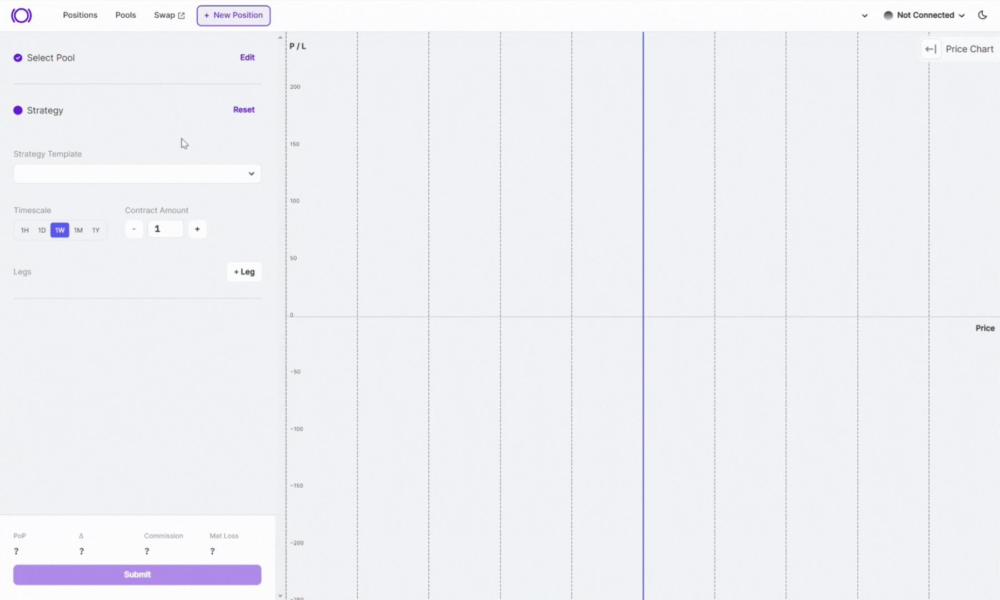

### Panoptic Straddles

Did you know you can trade straddles 🤸 on Panoptic...

-   Long vol? Buy a straddle!
    
-   Short vol? Sell a straddle!
    

Profit even if you don't know which direction price is going 😈

Here's 6 backtests on trading straddles the last TWO years!

<!--truncate-->

----------

### Straddle Basics

Need a refresher? Check out our latest #ResearchBites thread on straddles! 👇

<blockquote class="twitter-tweet" data-conversation="none">
1/12 Options are crazy...did you know that you can make money when price goes up OR down? 🤑  Sounds too good to be true? It&#39;s not.  🤸🏽‍♂️ Here&#39;s a strategy EVERY trader should know to go &quot;long vol&quot; or &quot;short vol&quot;. It&#39;s called a straddle:  ❤️ &amp; RT 👇<a href="https://twitter.com/hashtag/Options?src=hash&amp;ref_src=twsrc%5Etfw">#Options</a> <a href="https://twitter.com/hashtag/Trading?src=hash&amp;ref_src=twsrc%5Etfw">#Trading</a> <a href="https://twitter.com/hashtag/Straddle?src=hash&amp;ref_src=twsrc%5Etfw">#Straddle</a> <a href="https://t.co/qmZB3LgkKR">pic.twitter.com/qmZB3LgkKR</a>
&mdash; Panoptic (@Panoptic_xyz) <a href="https://twitter.com/Panoptic_xyz/status/1650967954698424322?ref_src=twsrc%5Etfw">April 25, 2023</a></blockquote> 

Buying a (long) straddle is a "long vol" bet. If price moves significantly in either direction (up or down), you profit.

In Panoptic, you pay nothing upfront to buy the straddle. Instead, you pay "as you go" while the perpetual options are in range (+1 for capital efficiency!).

A straddle is composed of a put & call (same strike). In Panoptic:

-   A put is [created](http://twitter.com/Panoptic_xyz/status/1628530131420712962?s=20) by borrowing a Uni V3 LP token
    
-   A call is [created](http://twitter.com/Panoptic_xyz/status/1639296896622813184?s=20) by buying a put and the underlying asset
    

### Hypothesis

We predict that buying at-the-money ETH straddles via Uniswap v3 would've performed well for 2 reasons:

1.  ETH's implied volatility seems understated
    
2.  Uniswap market frictions — can't borrow LP tokens (to create long option payoffs)
    

Let's see!

### Backtest #1

Buying an ETH straddle via Uniswap every day (all values in USDC):

-   Payoff: +515%
    
-   Premia (cost): -397%
    
-   Return: +118%

👉 Payoff > Premia → Profit🔝🤑📈

That's pretty good! Which leg had more impact?

For times when the long straddle was profitable, we label whether the call or put leg was exercised.

Dailies:

-   Call: 54%
    
-   Put: 46%
    
-   Total: 224
    

Weeklies:

-   Call: 53%
    
-   Put: 47%
    
-   Total: 34
    

Monthlies:

-   Call: 50%
    
-   Put: 50%
    
-   Total: 10
    

Calls slightly dominated!

### Backtest #2

Returns on buying every day vs. week vs. month:

-   🌕 Dailies: 118%
    
-   🧑‍🚀 Weeklies: 11%
    
-   🚀 Monthlies: 21%
    

👉Active management for the win!👈

(Keep in mind this doesn't account for gas fees⛽ — future #ResearchBites 😉)

Good returns, but can straddles survive a bear market?👇

### Backtest #3

Bull vs. bear markets:

-   🐂 Bull Market: June '21 - April '22
    
    -   👉 Compare w/ ETH HODL return: 0.8%
        
-   🐻 Bear Market: May '22 - Feb '22
    
    -   👉 Compare w/ ETH HODL return: -41%
        

Straddles are delta neutral. Profitability is based off of volatility, irrespective of 🐂 or 🐻!

## Backtest #4

Buying an ETH straddle via Uniswap on different pools:

-   🌕 5bps: 118%
    
-   🚀 30bps: 90%
    
-   🧑‍🚀 100bps: 62%
    

👉The 5 bps pool outperformed, it had the lowest premia!

## Backtest #5

What about selling straddles? It's just the opposite:

-   🙌 Buying: 118%
    
-   💔 Selling: -118%
    

## Backtest #6

When would selling straddles be profitable? When IV > RV.

Market's belief of SHIB volatility is likely overstated, leading to huge returns for straddle sellers:

(all values are in ETH)

-   Payoff: -632%
    
-   Premia (earned): +1170%
    
-   Return: +539%
    

----------

# Conclusion

Don't forget, selling straddles is capital efficient (Panoptic natively supports this through its novel multi-leg ERC1155 minting system)!

<blockquote class="twitter-tweet" data-conversation="none">
10/13 Straddles are made up of 2 legs: 1 call &amp; 1 put.  Only one leg can be “tested” at any given time, i.e. if the put is ITM then the call is OTM, and vice versa.  Hence, collateral req. for selling straddles is relaxed to just the req. of one leg (whichever is larger). 🤯 <a href="https://t.co/VLOeiKSftJ">https://t.co/VLOeiKSftJ</a>
&mdash; Panoptic (@Panoptic_xyz) <a href="https://twitter.com/Panoptic_xyz/status/1644369525062897665?ref_src=twsrc%5Etfw">April 7, 2023</a></blockquote> 

Want to buy a straddle on Panoptic? 🔍 Here's a sneak peek of our new UI 👀

Key insights:

-   🤸 Long straddles:
    
    -   Delta neutral, profit when price moves ⬆️ or ⬇️
        
    -   ETH dailies outperformed
        
    -   Profitable when IV < RV
        
-   ^ Short straddles:
    
    -   Delta neutral, profit when price stays constant ↔️
        
    -   SHIB-ETH dailies outperformed
        
    -   Profitable when IV > RV
        

Caveats:

-   ⛽ Ignores gas/spread/swap fees/commission
    
-   💲 Assumes option premia = LP collected fees
    
-   ❓ Hypothetical — you can't buy options on Uniswap (Panoptic soon 🤫)
    

Disclaimer:

-   📢 None of this is financial advice.
    
-   ⚠️ Past performance is no guarantee of future results