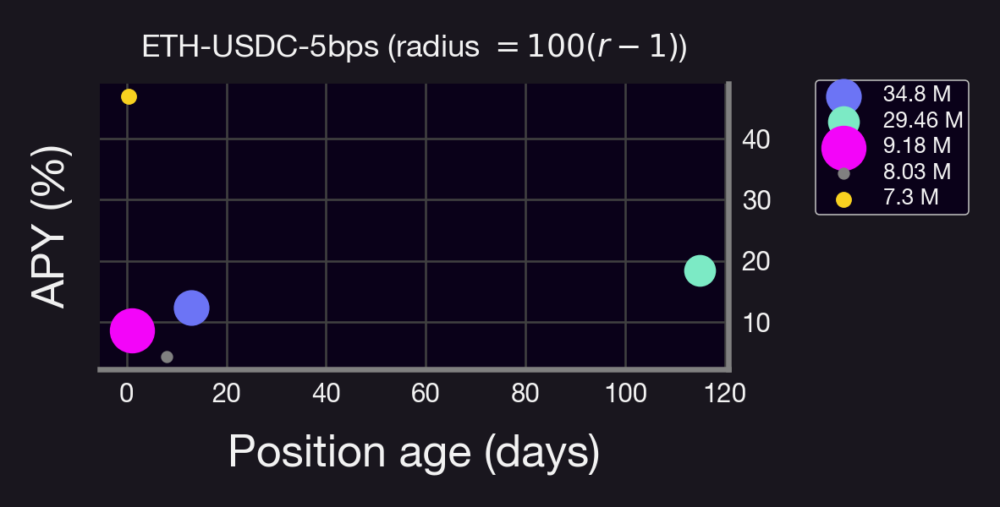
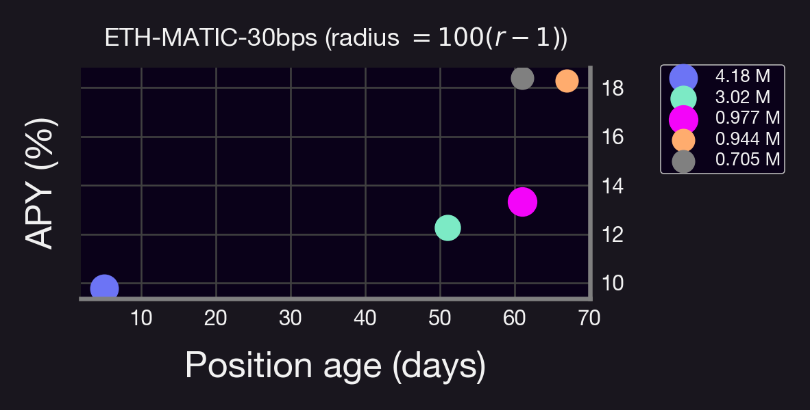
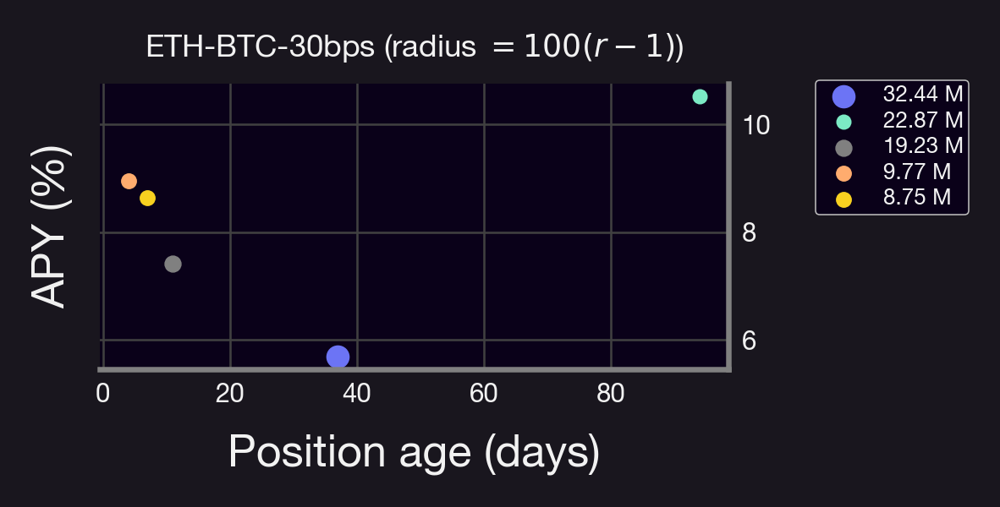
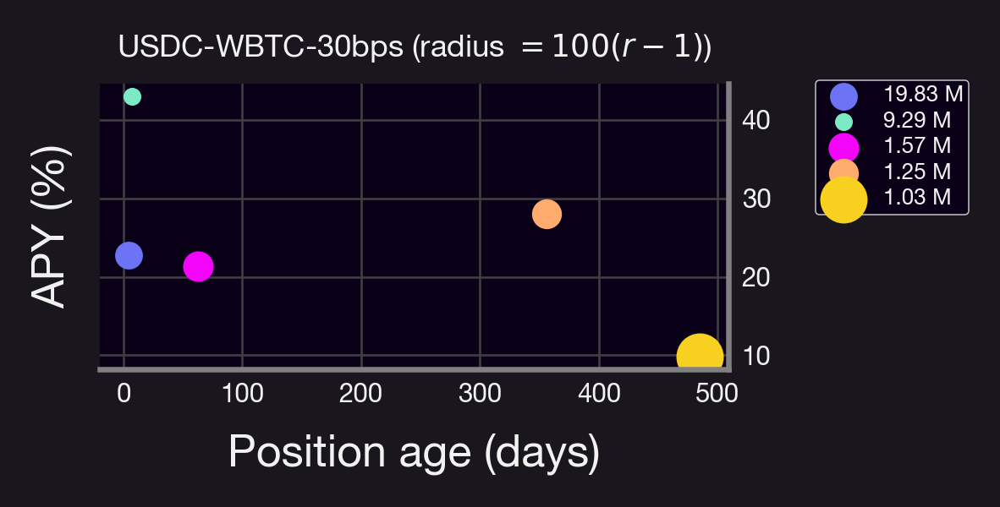
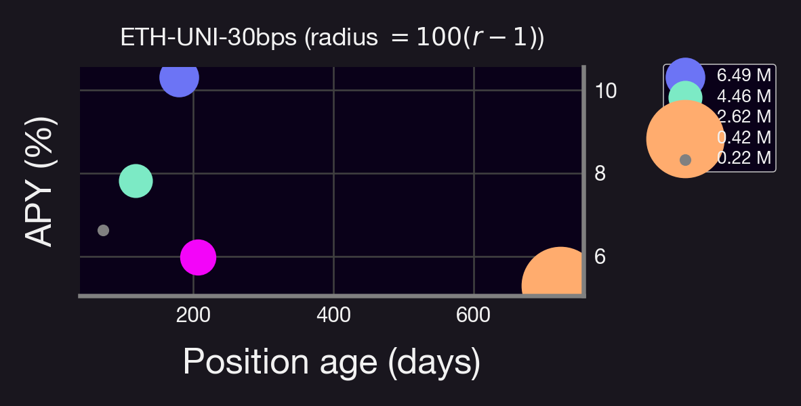
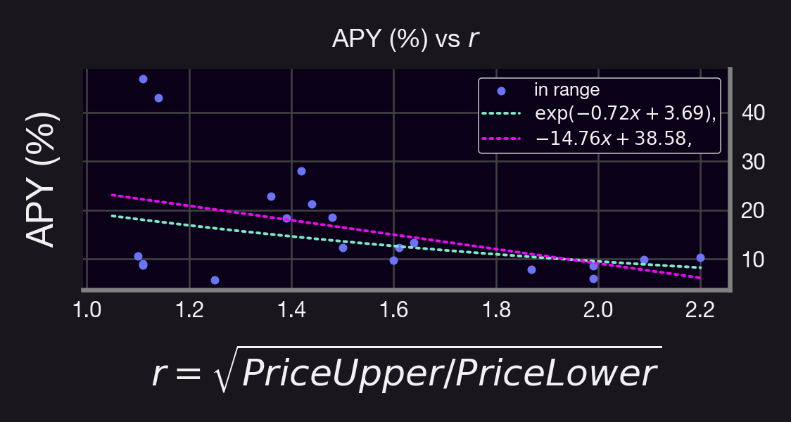

In the world of decentralized finance (DeFi), large bag-holders, known as "whales", can have a significant impact on liquidity and token prices.

In this blog post, we'll take a closer look at whale behavior in Uniswap v3, examining the top 5 positions in popular pools, and explore how this information can be valuable for other investors. We'll also discuss how Panoptic can provide better alternatives for whales and other crypto users.

<!--truncate-->

---

### Why Tracking Whale Behavior Matters

There are three main reasons for tracking whale behavior:
1. Whales can significantly impact liquidity and token prices. By understanding their moves, you can anticipate market trends and make informed decisions.
2. Whale behavior offers insight into market sentiment. By observing whether they are bullish or bearish on specific tokens, you can use this information to shape your own investment strategies.
3. Lastly, tracking whale behavior helps you gauge the overall health and stability of the DeFi market, keeping you informed and prepared for potential shifts.

You can use these insights, together with Panoptic to anticipate, hedge against, and profit from large whale moves.
- If you observe bullish sentiment, consider buying call options
- If you notice bearish sentiment, consider buying put options
- If you anticipate significant market fluctuations, consider using a straddle strategy

### Analyzing Whale LPs in Uniswap V3 Pools

To better understand whale behavior, we analyzed the top 5 positions (by size) in several popular Uniswap V3 pools, focusing on liquidity provider (LP) range, activity, and annual percentage rate (APR). Please note that these results are accurate at the time of writing and may vary in the future.

Here's a summary of our findings for each pool:

#### ETH-USDC-5bps
- 4 out of 5 positions are in range
- All positions are less than 4 months old, with 3 being less than 10 days old
- APR ranges from 2% to 51%
- Mixed sentiment towards ETH, with 2 positions being bullish, one bearish, and the rest neutral
- The third largest whale actively manages liquidity

#### ETH-MATIC-30bps
- 4 out of 5 positions are in range, with the top position not in range
- Positions have wide ranges
- The oldest position is under 4 months old
- APR ranges from 3% to 18%

#### ETH-BTC-30bps
- The top 2 LPs are contracts (Gnosis Safe Proxy)
- Positions are relatively new, with the oldest being 90 days old
- Long ranges, with the top 2 positions having wide ranges and others being bullish on BTC
- APR is 1% for the top 2 positions and 5% to 8% for others

#### WBTC-USDC-30bps
- Most positions are bullish on BTC
- Position age ranges from 4 to 480 days, with the top 2 positions being 4 and 60 days old
- APR ranges from 2% to 18%

#### ETH-UNI-30bps
- 4 out of 5 positions are in range
- Positions have wide ranges
- The youngest position is 2 months old (out of range), with others being older than 4 months
- The second-largest LP is also present in other pools
- APR ranges from 1% to 3%

### Conclusion
Based on our analysis, we can draw a few conclusions:
- There is no "one size fits all" approach for whales in Uniswap V3
- Some positions remain idle and do not collect fees
- Several whales could benefit from a more active approach to managing their liquidity
- The wider the position, the smaller the APY

### Would Whales be Better Off in Panoptic? 
The answer is yes. Panoptic offers the following advantages:
- Earn fees for passive liquidity provision (PLP) without impermanent loss (IL)
- Higher fees for active liquidity provision on Uniswap (selling options) from Panoptic's liquidity spread
- Market-neutral strategies when buying or selling