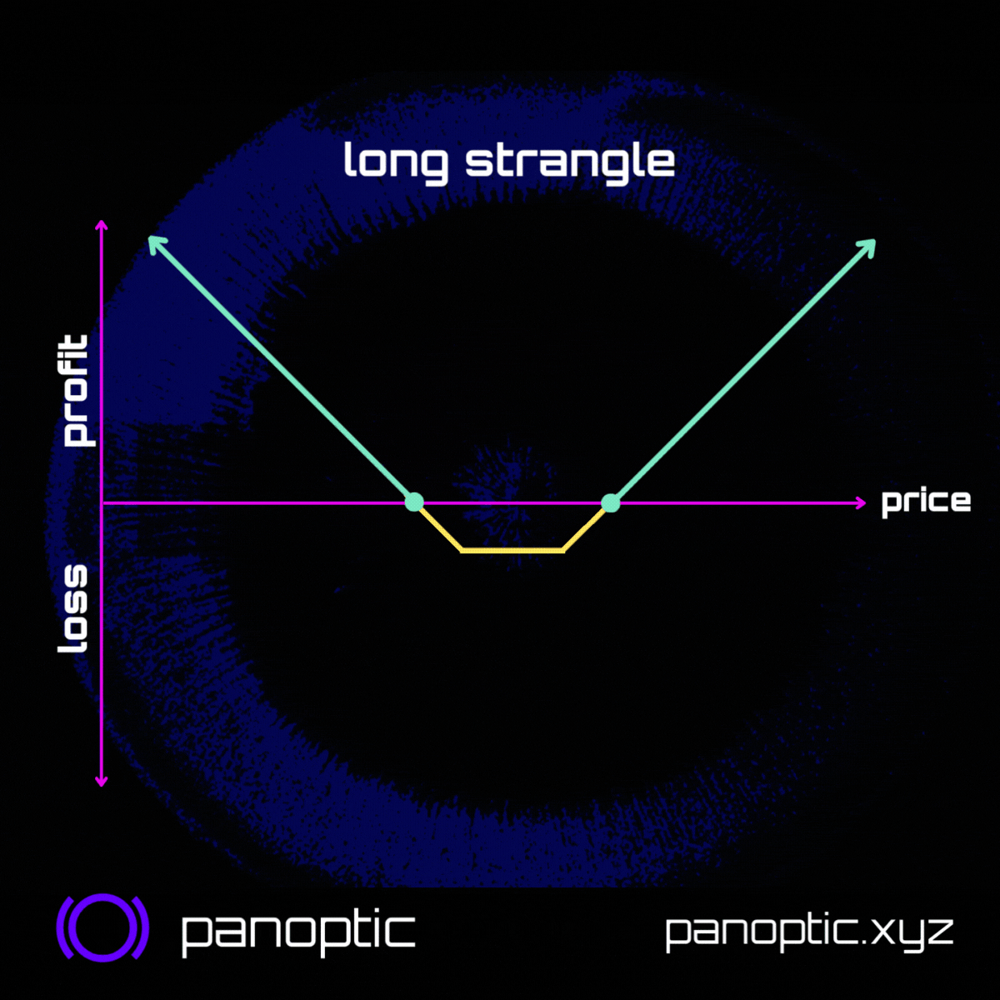
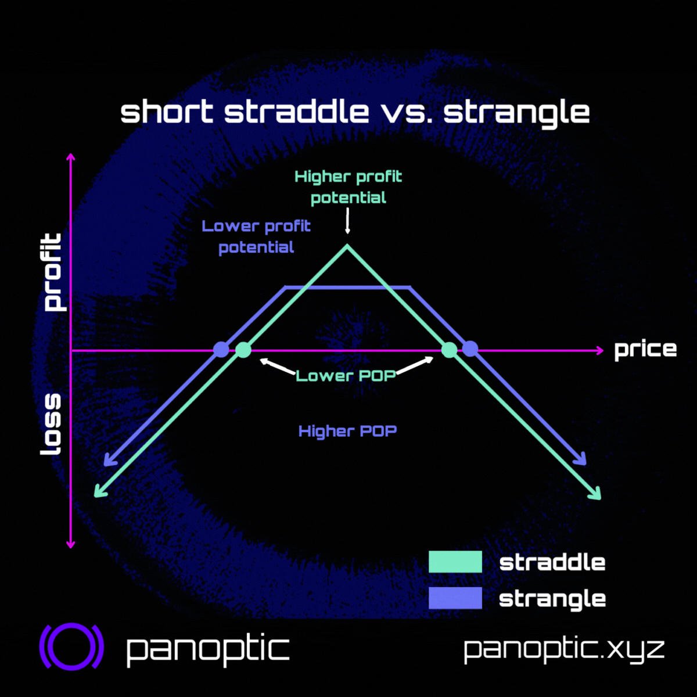

### Straddles vs. Strangles

Straddles🤸🏽‍♂️ & strangles 🙅‍♀️😵 are options strategies that let you bet on volatility. What's the difference? How to choose the right width? 💊 Keep reading to take the red pill and see delta, vol, & strangles in an entirely new way...

<!--truncate-->

----------

The names "straddle" & "strangle" conjure up images of fitness🤸🏽‍♂️ and murder🙅‍♀️😵. However, in the world of options, straddles & strangles can be both liberating and legal. We’ll explain:

-   What they are
    
-   When to use one over the other
    
-   How to choose the right strikes

### What are Straddles?    

🤸🏽‍♂️ Straddles are at-the-money (ATM) bets on volatility. Buying a straddle means you are betting on the price moving more than expected by the market, either UP or DOWN. Need a refresher? Check out our latest #ResearchBites thread on straddles!

<blockquote class="twitter-tweet" data-conversation="none">
1/12 Options are crazy...did you know that you can make money when price goes up OR down? 🤑  Sounds too good to be true? It&#39;s not.  🤸🏽‍♂️ Here&#39;s a strategy EVERY trader should know to go &quot;long vol&quot; or &quot;short vol&quot;. It&#39;s called a straddle:  ❤️ &amp; RT 👇<a href="https://twitter.com/hashtag/Options?src=hash&amp;ref_src=twsrc%5Etfw">#Options</a> <a href="https://twitter.com/hashtag/Trading?src=hash&amp;ref_src=twsrc%5Etfw">#Trading</a> <a href="https://twitter.com/hashtag/Straddle?src=hash&amp;ref_src=twsrc%5Etfw">#Straddle</a> <a href="https://t.co/qmZB3LgkKR">pic.twitter.com/qmZB3LgkKR</a>
&mdash; Panoptic (@Panoptic_xyz) <a href="https://twitter.com/Panoptic_xyz/status/1650967954698424322?ref_src=twsrc%5Etfw">April 25, 2023</a></blockquote> 

### What are Strangles?    

🙅‍♀️😵 Strangles are also volatility bets and benefit from price volatility (for buyers) or price stability (for sellers) just as straddles do. However, unlike straddles, strangles can be customized to your taste 😋

### Differences
Straddles and strangles differ in 6 major ways:
1. Strike prices
2. Premia
3. Ease of management
4. Delta
5. Probability of profit (POP)
6. Profit potential

#### Strikes

-   Straddle: same strikes
    
-   Strangle: different strikes

#### Premia
Another difference is the premia:

-   Straddle: expensive💰
    
-   Strangle: cheap🫰
    
That's b/c the straddle's legs are ATM, meaning they're *less* likely to expire worthless. The strangle's legs are out-of-the-money (OTM), meaning they're *more* likely to expire worthless.

#### Management
Because strangles are wider they're easier to manage.

Seller's POV:
-   Straddle: higher vega, lower probability of profit (POP), risk of becoming inverted 😳👇, need to monitor/manage frequently
    
-   Strangle: lower vega, higher POP, more forgiving, less frequent management

<blockquote class="twitter-tweet" data-conversation="none">
6/ Go inverted:  If one side of the straddle is challenged, the opposing short option could be rolled toward the underlying to receive additional credit.  Additional credit widens the break-even point on the challenged side of the position.  How payoff changes: An example <a href="https://t.co/zHGKcG9oBt">pic.twitter.com/zHGKcG9oBt</a>
&mdash; Aditya Todmal (@AdityaTodmal) <a href="https://twitter.com/AdityaTodmal/status/1588750503759880193?ref_src=twsrc%5Etfw">November 5, 2022</a></blockquote> 

### Delta as the Probability of being ITM

#### What is Delta?
Buyer's POV:

The underlying price only has to move a little for the straddle to become in-the-money (ITM). Whereas the price has to move A LOT before the strangle becomes ITM. You can actually quantify the likelihood of each strategy becoming ITM with delta!

Delta measures how much $ the option value changes in response to a $1 change in the underlying asset price.

#### Example
Delta = 0.5 example: A $1 increase in ETH results in a $0.50 increase in an ETH option's value. But delta can also be interpreted as probability! 💊

<blockquote class="twitter-tweet" data-conversation="none">
What is the delta of an option?  A majority answered A: the sensitivity of the option&#39;s value to changes in stock price.  This answer is correct --this is actually the definition of delta -- but B and C are also true!   Here&#39;s why B) and C) are also true  1/17 🧵 <a href="https://t.co/ZCvQQUJCus">pic.twitter.com/ZCvQQUJCus</a>
&mdash; Guillaume Lambert | lambert.eth | 🦇🔊 (@guil_lambert) <a href="https://twitter.com/guil_lambert/status/1572699328073826305?ref_src=twsrc%5Etfw">September 21, 2022</a></blockquote> 

#### Delta as a Probability
Delta ALSO proxies the expected probability that an option will end ITM at expiration. 💊🤯

-   Delta = 0.5: Option has ~50% chance of ending ITM.
    
-   Delta = 0.7: Option has ~70% chance of ending ITM.
    
-   Delta = 0.2: Option has ~20% chance of ending ITM.
    
#### Deltas of Straddles and Strangles
Let's review straddles vs. strangles now that we know the secret behind delta:

-   Straddle: legs are ATM ➡️ delta = 0.5
    
-   Strangle: legs are OTM, less likely to be exercised, delta is smaller ➡️ delta < 0.5
    
(Combined legs are still delta neutral ➡️ put + call delta = 0)

Straddles have a 100% chance of ending ITM.

-   Put leg: delta = -0.5 ➡️ 50% chance
    
-   Call leg: delta = 0.5 ➡️ 50% chance 50% + 50% = 100% chance that a leg ends ITM
    

Strangles have a <100% chance of ending ITM. Ex:

-   Put leg: delta = -0.2 ➡️ 20% chance
    
-   Call leg: delta = 0.2 ➡️ 20% chance 20% + 20% = 40% chance that a leg ends ITM
    
#### Probability of Profit and Profit Potential
Seller's POV:

We also have to factor in the upfront premia earned from selling straddles/strangles. There might be a 60% chance of the strangle expiring worthless (40% chance of becoming ITM). But the probability of profit (POP) is >60% due to premia earned by the seller.

In fact, strangles have higher POP than straddles. But there's a tradeoff:

-   Straddle: Lower POP, higher profit potential
    
-   Strangle: Higher POP, lower profit potential ➡️ Less risk, less expected return!
    

### Summary
Straddles:

-   Same (ATM) strikes
    
-   Expensive
    
-   More monitoring
    
-   Low probability of profit (POP)
    
-   High profit potential
    

Strangles:

-   Different (OTM) strikes
    
-   Cheap
    
-   Less monitoring
    
-   High probability of profit (POP)
    
-   Low profit potential
    

----------

📢 None of this is financial advice.

Warning: for sellers, both straddles and strangles have potentially unlimited loss (and are equally susceptible to black swan events)