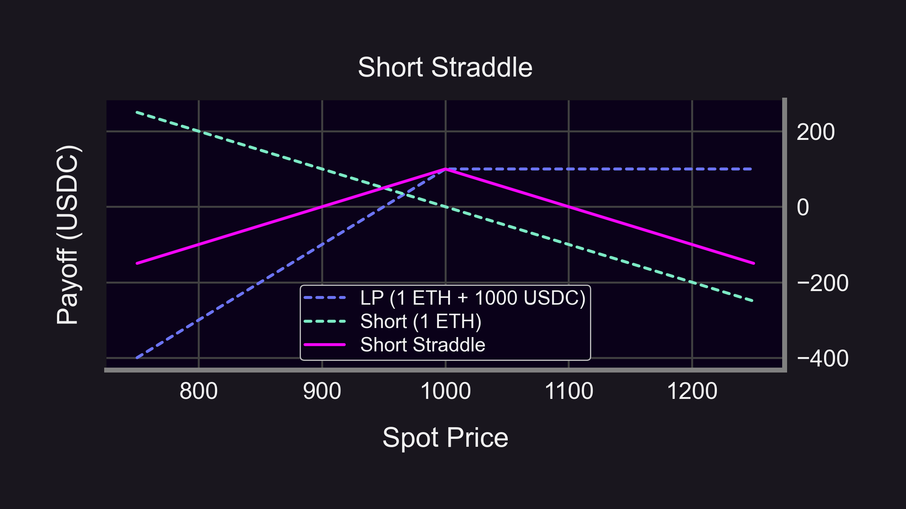
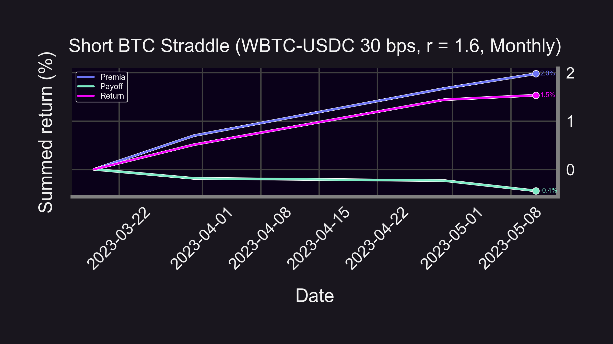
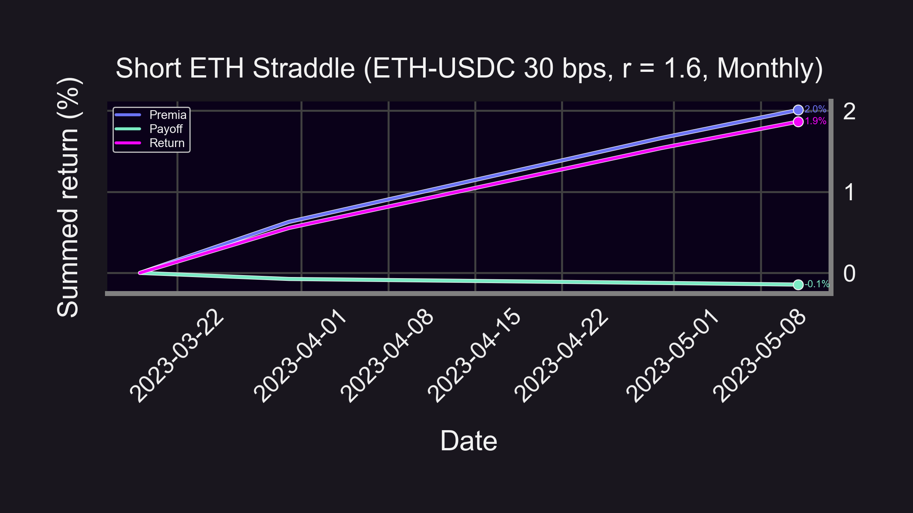
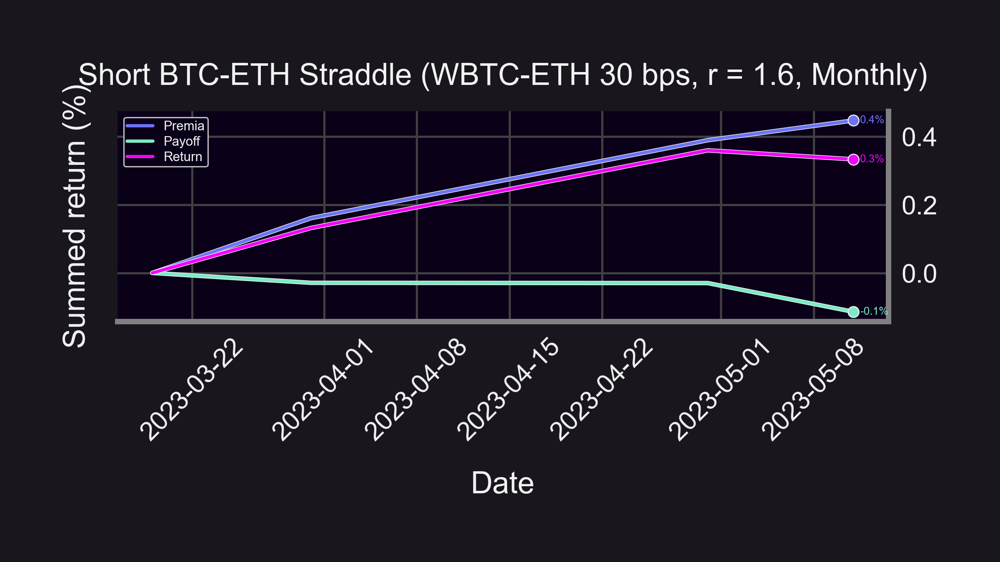

Market updates:
- Deribit Insights found that markets expect smooth sailing with low vol for BTC and ETH
- Panoptic lets you make volatility bets DIRECTLY on BTC-ETH relative prices
- Options sellers profit in April-May.

<blockquote class="twitter-tweet">
Is low Volatility the new normal in Crypto?  Read everything about it (+ some nice opportunities) in this great analysis by Imran Lakha from <a href="https://twitter.com/options_insight?ref_src=twsrc%5Etfw">@options_insight</a> <a href="https://twitter.com/hashtag/volatility?src=hash&amp;ref_src=twsrc%5Etfw">#volatility</a> <a href="https://twitter.com/hashtag/cryptooptions?src=hash&amp;ref_src=twsrc%5Etfw">#cryptooptions</a> <a href="https://twitter.com/hashtag/Bitcoin?src=hash&amp;ref_src=twsrc%5Etfw">#Bitcoin</a> <a href="https://twitter.com/hashtag/Ethereum?src=hash&amp;ref_src=twsrc%5Etfw">#Ethereum</a> <a href="https://twitter.com/hashtag/ETH?src=hash&amp;ref_src=twsrc%5Etfw">#ETH</a> <a href="https://twitter.com/hashtag/DeribitExchange?src=hash&amp;ref_src=twsrc%5Etfw">#DeribitExchange</a><a href="https://t.co/CmHwkCIbAD">https://t.co/CmHwkCIbAD</a>
&mdash; Deribit Insights (@DeribitInsights) <a href="https://twitter.com/DeribitInsights/status/1656455484239499264?ref_src=twsrc%5Etfw">May 11, 2023</a></blockquote> 

Let's review.

<!--truncate-->

---
### Introduction
Deribit Insights found that the market is pricing in low vol based on declining implied vol on crypto options. They also analyze the ETH/BTC vol spread and [volatility skews](https://panoptic.xyz/research/uniswap-v3-implied-volatility-smile). Straddles are great ways to bet on volatility, so we analyze their performance below.

We'll cover:
- How you can sell straddles NOW on Uniswap
- Backtest BTC straddles
- Backtest ETH straddles
- Backtest BTC-ETH straddles

For a refresher on straddles and volatility bets see [here](https://panoptic.xyz/research/defi-option-strangle-straddle).

### Straddles
You can sell (perpetual) straddles via Uniswap v3 & Aave right now. For example, if ETH price = $1,000:
- LP centered around $1,000. Use 1 ETH + 1,000 USDC.
- Short 1 ETH (e.g. borrow on Aave & immediately sell)
- Your payoff curve will look like the pink curve

Tips:
- Your "perpetual premia" is the fees you collect from LPing
- The more fees you collect, the wider your straddle breakeven points become
- Use a narrow range (e.g. r = 1.1) for short-term positions
- Use a wide range (e.g. r = 1.6) for longer-term positions
For more info on how LP range and time horizons correlate, see [here](https://panoptic.xyz/research/zero-dte-defi-options).

### BTC straddle backtest (3/19 - 5/10)
Annualized return: +10.32%

When realized volatility (RV) is lower than expected, option sellers profit. The [drop in RV](http://messari.io/asset/bitcoin/chart/daily-vol) for BTC in April resulted in positive profits for short straddles.

### ETH straddle backtest
Annualized return: +13.8%

RV for [ETH also saw a drop](http://messari.io/asset/ethereum/chart/daily-vol) in April, resulting in short straddles on ETH being profitable.

### BTC-ETH straddle backtest
Annualized return: +2.1% (in ETH)

Panoptic revolutionizes options trading by introducing user-defined numeraires. For the first time, you can trade options directly on BTC-ETH prices (as opposed to BTC-USD + ETH-USD).

---

### Caveats
- Ignores gas/swap fees ⛽
- Disclaimer: None of this is financial advice 📢
- Past performance is no guarantee of future results ⚠️
- Short straddles have unlimited loss potential! 📉

Curious about other strategies? Run your own backtests by following our fully open-source [Jupyter notebook code](https://github.com/panoptic-labs/research/blob/main/_research-bites/20230512/Short_Straddles.ipynb).